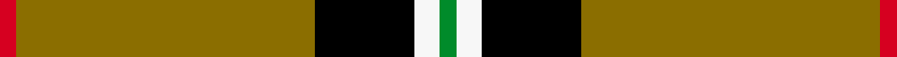

This page is one **sett** — a single exact thread-count. It belongs to the [tartan](/setts/r2y36k12w3g2/)
(the same proportion at any scale), whose colour order is pattern [GWKGR](/stripes/gwkgr/).

Sourced from register-of-tartans.  It is a [5 stripe tartan](/stripes/stripes5/).

Original link https://www.tartanregister.gov.uk/tartanDetails.aspx?ref=5361

2 attestations — the source records this cloth was collapsed from (oldest owns this page)

<ul>
<li>01/01/2007 — Port Moresby City Pipes & Drums (register-of-tartans, <a href="https://www.tartanregister.gov.uk/tartanDetails.aspx?ref=5361">record</a>)  <em>Designed by John Hocknull J.P. of Yeronga, Sydney, Australia for the newly formed Port Moresby Pipes & Drums. Port Moresby is the capital of Papua New Guinea and the colours are based on the PNG national flag. The sett is the same as the Papua New Guinea (Mo. 7235) with some colours transposed. Woven by D.C. Dalgliesh of Selkirk. Listing application submitted 2nd July 2007 by John Hocknull.</em></li>
<li>pre 2007 — Port Moresby City (P&D) (tartans-authority, <a href="http://www.tartansauthority.com/tartan-ferret/display/7236/">record</a>)  <em>Designed by John Hocknull J.P. of Yeronga, Sydney, Australia for the newly formed Port Moresby Pipes & Drums. Port Moresby is the capital of Papua New Guinea and the colours are based on the PNG national flag. The sett is the same as the Papua New Guinea (Mo. 7235) with some colours transposed. Woven by D.C. Dalgliesh of Selkirk. Listing application submitted 2nd July 2007 by John Hocknull.</em></li>
</ul>

## Register references

External register numbers recorded for this tartan.

- Scottish Register of Tartans: [5361](https://www.tartanregister.gov.uk/tartanDetails.aspx?ref=5361)
- Scottish Tartans Authority (ITI): 7236

## Thread count
R/4 Y72 K24 W6 G/4

One full sett is **212 threads**.

## Palette
<table><thead><tr><th>Colour</th><th>Shade</th><th>OKLCh</th></tr></thead><tbody><tr><td>G</td><td><code style="background-color:#008B2A;">#008B2A</code> <small style="color:#888">#008B2A</small></td><td><small style="color:#888">oklch(55.4% 0.170 145.9)</small></td></tr><tr><td>K</td><td><code style="background-color:#000000;">#000000</code> <small style="color:#888">#000000</small></td><td><small style="color:#888">oklch(0.0% 0.000 0.0)</small></td></tr><tr><td>LN</td><td><code style="background-color:#F7F7F7;">#F7F7F7</code> <small style="color:#888">#F7F7F7</small></td><td><small style="color:#888">oklch(97.6% 0.000 89.9)</small></td></tr><tr><td>R</td><td><code style="background-color:#D60020;">#D60020</code> <small style="color:#888">#D60020</small></td><td><small style="color:#888">oklch(55.2% 0.224 25.5)</small></td></tr><tr><td>Y</td><td><code style="background-color:#8B6E00;">#8B6E00</code> <small style="color:#888">#8B6E00</small></td><td><small style="color:#888">oklch(55.1% 0.113 90.4)</small></td></tr></tbody></table>

# Sample pattern

## Nearest variants

The nearest existing variants by ΔTartan distance, with this cloth at the top so the swatches line up against it.

ΔTartan

Threads

Variant

Sett

—

212

<a href="/variants/s5/r2y36k12w3g2~x2/">Port Moresby City Pipes &amp; Drums</a>

<a href="/ttd/edit/#slug=r2y33k5w3g2~x2&amp;base=r2y36k12w3g2~x2" title="compare in the TTD">0.67</a>

172

<a href="/variants/s5/r2y33k5w3g2~x2/">Port Moresby City Pipes and Drums</a>

<a href="/ttd/edit/#slug=r1y13k8g1~x6&amp;base=r2y36k12w3g2~x2" title="compare in the TTD">0.92</a>

264

<a href="/variants/s4/r1y13k8g1~x6/">Billy Apple® Yellow</a>

<a href="/ttd/edit/#slug=r1ly13k8g1~x6&amp;base=r2y36k12w3g2~x2" title="compare in the TTD">0.92</a>

264

<a href="/variants/s4/r1ly13k8g1~x6/">Billy Apple - Yellow</a>

<a href="/ttd/edit/#slug=w8r6ly2dg34db3~x2&amp;base=r2y36k12w3g2~x2" title="compare in the TTD">1.90</a>

190

<a href="/variants/s5/w8r6ly2dg34db3~x2/">Milling-Kristensen (Personal)</a>

<a href="/ttd/edit/#slug=ri12g4k8dr3ly62r8~x2~ri2109032-r1807033&amp;base=r2y36k12w3g2~x2" title="compare in the TTD">1.92</a>

348

<a href="/variants/s6/ri12g4k8dr3ly62r8~x2~ri2109032-r1807033/">Shawn Jones Afghan Memorial, The</a>

<a href="/ttd/edit/#slug=y25k9y12w2db2~x2&amp;base=r2y36k12w3g2~x2" title="compare in the TTD">2.11</a>

146

<a href="/variants/s5/y25k9y12w2db2~x2/">Gairloch</a>

<a href="/ttd/edit/#slug=k5w4r15g70k4w5~x2&amp;base=r2y36k12w3g2~x2" title="compare in the TTD">2.28</a>

392

<a href="/variants/s6/k5w4r15g70k4w5~x2/">Tahrir (Liberation)</a>

<a href="/ttd/edit/#slug=dr80lb40k5dy6&amp;base=r2y36k12w3g2~x2" title="compare in the TTD">2.30</a>

176

<a href="/variants/s4/dr80lb40k5dy6/">Broberg (Scania) (Personal)</a>

<a href="/ttd/edit/#slug=y70k30w3g30k3y10&amp;base=r2y36k12w3g2~x2" title="compare in the TTD">2.49</a>

212

<a href="/variants/s6/y70k30w3g30k3y10/">Jacobite #2</a>

<a href="/ttd/edit/#slug=ly10k2g5k2dg46y2k2~x2~g1903133&amp;base=r2y36k12w3g2~x2" title="compare in the TTD">2.50</a>

252

<a href="/variants/s7/ly10k2g5k2dg46y2k2~x2~g1903133/">Green Rover, The</a>

## Neighbour map

Every grey dot is one of 13620 variants placed by the first two principal components of the ΔTartan feature space (42% of its variance). Red is this tartan; blue dots are its nearest — click one to open its page.

<svg viewBox="0 0 640 380" role="img" style="max-width:100%;height:auto;border:1px solid #e0e0e0;border-radius:4px;display:block" xmlns="http://www.w3.org/2000/svg"><image href="/nn/cloud.v1.png" width="640" height="380"/><a href="/variants/s5/r2y33k5w3g2~x2/"><circle cx="408.1" cy="132.5" r="4" fill="#3465a4"><title>Port Moresby City Pipes and Drums</title></circle></a><a href="/variants/s4/r1y13k8g1~x6/"><circle cx="288.3" cy="189.2" r="4" fill="#3465a4"><title>Billy Apple® Yellow</title></circle></a><a href="/variants/s4/r1ly13k8g1~x6/"><circle cx="266.5" cy="184.8" r="4" fill="#3465a4"><title>Billy Apple - Yellow</title></circle></a><a href="/variants/s5/w8r6ly2dg34db3~x2/"><circle cx="340.3" cy="159.8" r="4" fill="#3465a4"><title>Milling-Kristensen (Personal)</title></circle></a><a href="/variants/s6/ri12g4k8dr3ly62r8~x2~ri2109032-r1807033/"><circle cx="307.7" cy="102.9" r="4" fill="#3465a4"><title>Shawn Jones Afghan Memorial, The</title></circle></a><a href="/variants/s5/y25k9y12w2db2~x2/"><circle cx="388.4" cy="185.4" r="4" fill="#3465a4"><title>Gairloch</title></circle></a><a href="/variants/s6/k5w4r15g70k4w5~x2/"><circle cx="371.0" cy="138.3" r="4" fill="#3465a4"><title>Tahrir (Liberation)</title></circle></a><a href="/variants/s4/dr80lb40k5dy6/"><circle cx="334.7" cy="175.9" r="4" fill="#3465a4"><title>Broberg (Scania) (Personal)</title></circle></a><a href="/variants/s6/y70k30w3g30k3y10/"><circle cx="286.2" cy="153.8" r="4" fill="#3465a4"><title>Jacobite #2</title></circle></a><a href="/variants/s7/ly10k2g5k2dg46y2k2~x2~g1903133/"><circle cx="371.2" cy="104.9" r="4" fill="#3465a4"><title>Green Rover, The</title></circle></a><circle cx="334.4" cy="133.0" r="5" fill="#c00000"/><text x="320" y="376" text-anchor="middle" font-size="11" fill="#999">ground</text><text x="11" y="190" text-anchor="middle" font-size="11" fill="#999" transform="rotate(-90 11 190)">complexity</text></svg>

ID: /variants/s5/r2y36k12w3g2~x2/
