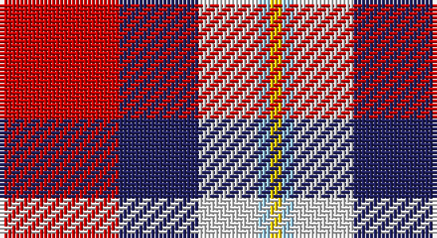

This page is one **sett** — a single exact thread-count. It belongs to the [tartan](/setts/r30db20w15lb3ly3/)
(the same proportion at any scale), whose colour order is pattern [RBWWY](/stripes/rbwwy/).

Sourced from tartans-authority.  It is a [5 stripe tartan](/stripes/stripes5/).

Original link http://www.tartansauthority.com/tartan-ferret/display/10604/

## Register references

External register numbers recorded for this tartan.

- Scottish Register of Tartans: [10604](https://www.tartanregister.gov.uk/tartanDetails?ref=10604)
- Scottish Tartans Authority (ITI): 10604

## Thread count
R/30 DB20 LN15 LB3 Y/3

One full sett is **109 threads**.

## Palette

Palette: <strong>Tartan Register</strong>
<table><thead><tr><th>Colour</th><th>Threads</th><th>Shade</th><th>Base</th><th>OKLCh</th></tr></thead><tbody><tr><td>R/</td><td style="text-align:right;font-variant-numeric:tabular-nums">30</td><td><code style="background-color:#C80000;">#C80000</code> <small style="color:#888">#C80000</small></td><td>R <code style="background-color:#CC0000;">#CC0000</code></td><td><small style="color:#888">oklch(52.3% 0.215 29.2)</small></td></tr><tr><td>DB</td><td style="text-align:right;font-variant-numeric:tabular-nums">20</td><td><code style="background-color:#202060;">#202060</code> <small style="color:#888">#202060</small></td><td>B <code style="background-color:#2A418A;">#2A418A</code></td><td><small style="color:#888">oklch(28.9% 0.111 276.9)</small></td></tr><tr><td>LN</td><td style="text-align:right;font-variant-numeric:tabular-nums">15</td><td><code style="background-color:#E0E0E0;">#E0E0E0</code> <small style="color:#888">#E0E0E0</small></td><td>W <code style="background-color:#F7F7F7;">#F7F7F7</code></td><td><small style="color:#888">oklch(90.7% 0.000 89.9)</small></td></tr><tr><td>LB</td><td style="text-align:right;font-variant-numeric:tabular-nums">3</td><td><code style="background-color:#98C8E8;">#98C8E8</code> <small style="color:#888">#98C8E8</small></td><td>W <code style="background-color:#F7F7F7;">#F7F7F7</code></td><td><small style="color:#888">oklch(81.0% 0.068 237.9)</small></td></tr><tr><td>Y/</td><td style="text-align:right;font-variant-numeric:tabular-nums">3</td><td><code style="background-color:#FCCC00;">#FCCC00</code> <small style="color:#888">#FCCC00</small></td><td>Y <code style="background-color:#F2BF00;">#F2BF00</code></td><td><small style="color:#888">oklch(86.2% 0.176 91.5)</small></td></tr></tbody></table>

# Sample pattern

## Nearest tartans

The nearest existing variants by ΔTartan distance, with this tartan at the top so the swatches line up against it.

ΔTartan

Tartan

Sett

—

<a href="/ttd/edit/#slug=r30db20w15lb3ly3">Siddle, New (Corporate)</a> <a class="nn-out" href="/variants/s5/r30db20w15lb3ly3/" title="open its dictionary page">↗</a>

0.62

<a href="/ttd/edit/#slug=dp8ly6k2o1w1~x8&amp;base=r30db20w15lb3ly3">Ballater Victoria Week</a> <a class="nn-out" href="/variants/s5/dp8ly6k2o1w1~x8/" title="open its dictionary page">↗</a>

0.83

<a href="/ttd/edit/#slug=w3r24db12dg8ly3~x2&amp;base=r30db20w15lb3ly3">McGill University</a> <a class="nn-out" href="/variants/s5/w3r24db12dg8ly3~x2/" title="open its dictionary page">↗</a>

0.96

<a href="/ttd/edit/#slug=r32db6k6g6w18k3&amp;base=r30db20w15lb3ly3">Rose, White dress</a> <a class="nn-out" href="/variants/s6/r32db6k6g6w18k3/" title="open its dictionary page">↗</a>

1.07

<a href="/ttd/edit/#slug=r39t22k11ly22g5~x2&amp;base=r30db20w15lb3ly3">Abbink, Ingmar (Personal)</a> <a class="nn-out" href="/variants/s5/r39t22k11ly22g5~x2/" title="open its dictionary page">↗</a>

1.13

<a href="/ttd/edit/#slug=dp8ly6k2y1w1~x8&amp;base=r30db20w15lb3ly3">Ballater Victoria Week</a> <a class="nn-out" href="/variants/s5/dp8ly6k2y1w1~x8/" title="open its dictionary page">↗</a>

1.14

<a href="/ttd/edit/#slug=w3b12k12r20g2~x2&amp;base=r30db20w15lb3ly3">Baillie of Polkemmet Red</a> <a class="nn-out" href="/variants/s5/w3b12k12r20g2~x2/" title="open its dictionary page">↗</a>

1.15

<a href="/ttd/edit/#slug=k3r28k10w28t3~x2&amp;base=r30db20w15lb3ly3">Wallace Dress, Red (Dance)</a> <a class="nn-out" href="/variants/s5/k3r28k10w28t3~x2/" title="open its dictionary page">↗</a>

1.19

<a href="/ttd/edit/#slug=w3r24db12dg8lo3~x2&amp;base=r30db20w15lb3ly3">McGill University (Corporate)</a> <a class="nn-out" href="/variants/s5/w3r24db12dg8lo3~x2/" title="open its dictionary page">↗</a>

1.26

<a href="/ttd/edit/#slug=k4db2lr13m13lb2~x4&amp;base=r30db20w15lb3ly3">Think Pink (ICF)</a> <a class="nn-out" href="/variants/s5/k4db2lr13m13lb2~x4/" title="open its dictionary page">↗</a>

1.28

<a href="/ttd/edit/#slug=lb2r12db2lb6k6lb1&amp;base=r30db20w15lb3ly3">MacTavish</a> <a class="nn-out" href="/variants/s6/lb2r12db2lb6k6lb1/" title="open its dictionary page">↗</a>

## Neighbour map

Every grey dot is one of 14360 variants placed by the first two principal components of the ΔTartan feature space (44% of its variance). Red is this tartan; blue dots are its nearest — click one to open its page.

<svg viewBox="0 0 640 380" role="img" style="max-width:100%;height:auto;border:1px solid #e0e0e0;border-radius:4px;display:block" xmlns="http://www.w3.org/2000/svg"><image href="/nn/cloud.v1.png" width="640" height="380"/><a href="/variants/s5/dp8ly6k2o1w1~x8/"><circle cx="177.0" cy="181.7" r="4" fill="#3465a4"><title>Ballater Victoria Week</title></circle></a><a href="/variants/s5/w3r24db12dg8ly3~x2/"><circle cx="196.1" cy="182.7" r="4" fill="#3465a4"><title>McGill University</title></circle></a><a href="/variants/s6/r32db6k6g6w18k3/"><circle cx="179.3" cy="155.8" r="4" fill="#3465a4"><title>Rose, White dress</title></circle></a><a href="/variants/s5/r39t22k11ly22g5~x2/"><circle cx="129.9" cy="204.6" r="4" fill="#3465a4"><title>Abbink, Ingmar (Personal)</title></circle></a><a href="/variants/s5/dp8ly6k2y1w1~x8/"><circle cx="172.0" cy="184.9" r="4" fill="#3465a4"><title>Ballater Victoria Week</title></circle></a><a href="/variants/s5/w3b12k12r20g2~x2/"><circle cx="169.9" cy="199.4" r="4" fill="#3465a4"><title>Baillie of Polkemmet Red</title></circle></a><a href="/variants/s5/k3r28k10w28t3~x2/"><circle cx="182.5" cy="187.0" r="4" fill="#3465a4"><title>Wallace Dress, Red (Dance)</title></circle></a><a href="/variants/s5/w3r24db12dg8lo3~x2/"><circle cx="209.2" cy="196.0" r="4" fill="#3465a4"><title>McGill University (Corporate)</title></circle></a><a href="/variants/s5/k4db2lr13m13lb2~x4/"><circle cx="166.5" cy="203.1" r="4" fill="#3465a4"><title>Think Pink (ICF)</title></circle></a><a href="/variants/s6/lb2r12db2lb6k6lb1/"><circle cx="185.0" cy="174.4" r="4" fill="#3465a4"><title>MacTavish</title></circle></a><circle cx="170.7" cy="179.4" r="5" fill="#c00000"/></svg>

ID: /variants/s5/r30db20w15lb3ly3/
