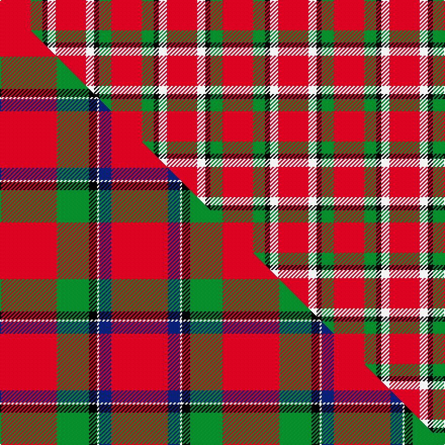

This is one **variant** — a specific cloth: this exact thread count and colourway, with its own
provenance below. It is one weaving of the [sett](/setts/r30g12k5w8r30/) (the scale-free proportion — the
same cloth at any scale or shade), whose colour order is pattern [RGKWR](/stripes/rgkwr/).

Part of the [Sinclair](/tartans/s/si/sinclair-2/) tartan — the named design grouping this sett with its other cloths.

Sourced from weddslist.  It is a [5 stripe tartan](/stripes/stripes5/).

Original link [http://www.weddslist.com/cgi-bin/tartans/pg.pl?source=rb](http://www.weddslist.com/cgi-bin/tartans/pg.pl?source=rb)

Dataset <small>— provenance for this record, inherited from the source manifest</small>

<dl class="dataset-prov">
<dt>source</dt><dd><a href="/sources/weddslist/">Weddslist</a></dd>
<dt>data captured from</dt><dd><a href="https://github.com/thetartan/tartan-database/blob/master/data/weddslist/data.csv">https://github.com/thetartan/tartan-database/blob/master/data/weddslist/data.csv</a></dd>
<dt>data date</dt><dd>2016-11-17 <small>(dataset default)</small></dd>
<dt>licence</dt><dd><a href="https://creativecommons.org/licenses/by-nc-nd/4.0/">CC BY-NC-ND 4.0</a></dd>
</dl>

Capture chain <small>— the hands this data passed through, oldest first; each capture carries its own licence</small>

<ol class="capture-chain">
<li><a href="https://www.weddslist.com/tartans/">Weddslist</a> <small>the living privately compiled reference</small></li>
<li><a href="https://github.com/thetartan/tartan-database">thetartan/tartan-database</a> <small>2016-2017</small> · <a href="https://creativecommons.org/licenses/by-nc-nd/4.0/">CC BY-NC-ND 4.0</a> <small>Levko Kravets's frozen compilation — the capture we vendored, and where its CC licence text came from</small></li>
<li>this dictionary <small>captured 2026-06-10 · commit 5bf86c7566</small> <small>each re-capture is a git commit to data/sources</small></li>
</ol>

## Thread count
R/30 G12 K5 W8 R/30

One full sett is **110 threads**.

## Palette
<table><thead><tr><th>Colour</th><th>Shade</th><th>OKLCh</th></tr></thead><tbody><tr><td>G</td><td><code style="background-color:#008B2A;">#008B2A</code> <small style="color:#888">#008B2A</small></td><td><small style="color:#888">oklch(55.4% 0.170 145.9)</small></td></tr><tr><td>K</td><td><code style="background-color:#000000;">#000000</code> <small style="color:#888">#000000</small></td><td><small style="color:#888">oklch(0.0% 0.000 0.0)</small></td></tr><tr><td>W</td><td><code style="background-color:#F7F7F7;">#F7F7F7</code> <small style="color:#888">#F7F7F7</small></td><td><small style="color:#888">oklch(97.6% 0.000 89.9)</small></td></tr><tr><td>R</td><td><code style="background-color:#D60020;">#D60020</code> <small style="color:#888">#D60020</small></td><td><small style="color:#888">oklch(55.2% 0.224 25.5)</small></td></tr></tbody></table>

# Sample pattern

## Compared to the master

This cloth is one sett of its design; the master sett (the exemplar the design is anchored on) is below for comparison.

Its **ΔTartan distance** from the master is **0.98** — the same measure the nearest-tartans table ranks by (0 is identical; a re-scale of the same cloth is near 0, a recolour or a different proportion further).

<figure class="master-compare" style="margin:0">

this sett
master sett ★

<figcaption style="color:#888;font-size:smaller">One weave of this sett against the <a href="/setts/r28g16k4w1db6r28/">master sett ★</a>, split on the diagonal: a shared proportion runs seamlessly across it with only the shades shifting; a different proportion breaks on it.</figcaption>
</figure>

## Nearest tartan variants

The nearest existing variants by ΔTartan distance, with this cloth at the top so the swatches line up against it.

ΔTartan

Threads

Variant

Sett

—

110

<a href="/variants/s5/r30g12k5w8r30/">Sinclair</a>

<a href="/ttd/edit/#slug=r28g16k4w7r28&amp;base=r30g12k5w8r30" title="compare in the TTD">0.32</a>

110

<a href="/variants/s5/r28g16k4w7r28/">Sinclair Dress</a>

<a href="/ttd/edit/#slug=r30g12k5w2lb6r30~x2&amp;base=r30g12k5w8r30" title="compare in the TTD">0.84</a>

220

<a href="/variants/s6/r30g12k5w2lb6r30~x2/">Sinclair</a>

<a href="/ttd/edit/#slug=r30g12k5w2lb6r30&amp;base=r30g12k5w8r30" title="compare in the TTD">0.84</a>

110

<a href="/variants/s6/r30g12k5w2lb6r30/">Sinclair Clan Tartan</a>

<a href="/ttd/edit/#slug=r5g5w1lb2r5~x2&amp;base=r30g12k5w8r30" title="compare in the TTD">0.84</a>

52

<a href="/variants/s5/r5g5w1lb2r5~x2/">Menzies</a>

<a href="/ttd/edit/#slug=r22g17w2lb6r13~x2&amp;base=r30g12k5w8r30" title="compare in the TTD">0.97</a>

170

<a href="/variants/s5/r22g17w2lb6r13~x2/">Menzies</a>

<a href="/ttd/edit/#slug=r28g16k4w1lb6r28&amp;base=r30g12k5w8r30" title="compare in the TTD">0.98</a>

110

<a href="/variants/s6/r28g16k4w1lb6r28/">Sinclair Dress</a>

<a href="/ttd/edit/#slug=r28g16k4w1lb6r28~x2&amp;base=r30g12k5w8r30" title="compare in the TTD">0.98</a>

220

<a href="/variants/s6/r28g16k4w1lb6r28~x2/">Sinclair</a>

<a href="/ttd/edit/#slug=r28g16k4w1db6r28~x2&amp;base=r30g12k5w8r30" title="compare in the TTD">0.98</a>

220

<a href="/variants/s6/r28g16k4w1db6r28~x2/">Sinclair (Logan)</a>

<a href="/ttd/edit/#slug=r22g17w2lg6r19~x2&amp;base=r30g12k5w8r30" title="compare in the TTD">0.98</a>

182

<a href="/variants/s5/r22g17w2lg6r19~x2/">Menzies #2</a>

<a href="/ttd/edit/#slug=r6dg13k5r20w3~x2&amp;base=r30g12k5w8r30" title="compare in the TTD">1.23</a>

170

<a href="/variants/s5/r6dg13k5r20w3~x2/">Ryutokukan Junior High School</a>

## Neighbour map

Every grey dot is one of 13621 variants placed by the first two principal components of the ΔTartan feature space (42% of its variance). Red is this tartan; blue dots are its nearest — click one to open its page. The map is a flat projection of a many-dimensional space — [how to read it](/posts/neighbourhood-maps/).

<svg viewBox="0 0 640 380" role="img" style="max-width:100%;height:auto;border:1px solid #e0e0e0;border-radius:4px;display:block" xmlns="http://www.w3.org/2000/svg"><image href="/nn/cloud.v1.png" width="640" height="380"/><a href="/variants/s5/r28g16k4w7r28/"><circle cx="324.8" cy="225.7" r="4" fill="#3465a4"><title>Sinclair Dress</title></circle></a><a href="/variants/s6/r30g12k5w2lb6r30~x2/"><circle cx="370.2" cy="156.5" r="4" fill="#3465a4"><title>Sinclair</title></circle></a><a href="/variants/s6/r30g12k5w2lb6r30/"><circle cx="370.2" cy="156.5" r="4" fill="#3465a4"><title>Sinclair Clan Tartan</title></circle></a><a href="/variants/s5/r5g5w1lb2r5~x2/"><circle cx="266.8" cy="278.2" r="4" fill="#3465a4"><title>Menzies</title></circle></a><a href="/variants/s5/r22g17w2lb6r13~x2/"><circle cx="327.6" cy="235.4" r="4" fill="#3465a4"><title>Menzies</title></circle></a><a href="/variants/s6/r28g16k4w1lb6r28/"><circle cx="372.5" cy="138.9" r="4" fill="#3465a4"><title>Sinclair Dress</title></circle></a><a href="/variants/s6/r28g16k4w1lb6r28~x2/"><circle cx="372.5" cy="138.9" r="4" fill="#3465a4"><title>Sinclair</title></circle></a><a href="/variants/s6/r28g16k4w1db6r28~x2/"><circle cx="369.7" cy="137.8" r="4" fill="#3465a4"><title>Sinclair (Logan)</title></circle></a><a href="/variants/s5/r22g17w2lg6r19~x2/"><circle cx="347.5" cy="235.7" r="4" fill="#3465a4"><title>Menzies #2</title></circle></a><a href="/variants/s5/r6dg13k5r20w3~x2/"><circle cx="239.2" cy="219.0" r="4" fill="#3465a4"><title>Ryutokukan Junior High School</title></circle></a><circle cx="339.7" cy="225.1" r="5" fill="#c00000"/><text x="320" y="376" text-anchor="middle" font-size="11" fill="#999">ground</text><text x="11" y="190" text-anchor="middle" font-size="11" fill="#999" transform="rotate(-90 11 190)">complexity</text></svg>

ID: /variants/s5/r30g12k5w8r30/
