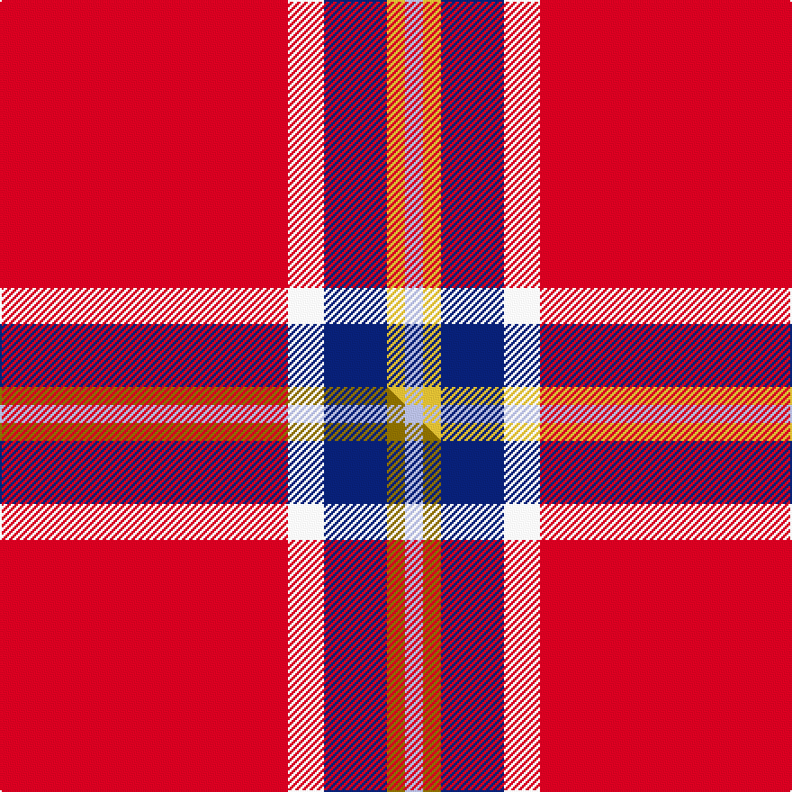

This page is one **sett** — a single exact thread-count. It belongs to the [tartan](/setts/r32w4db7ly2lb2/)
(the same proportion at any scale), whose colour order is pattern [RWBYW](/stripes/rwbyw/).

Part of the [Sildesalaten](/tartans/sildesalaten/) tartan — the named design grouping this sett with its other cloths.

Sourced from tartans-authority.  It is a [5 stripe tartan](/stripes/stripes5/).

Original link https://www.tartanregister.gov.uk/tartanDetails.aspx?ref=10780

Dataset <small>— provenance for this record, inherited from the source manifest</small>

<dl class="dataset-prov">
<dt>source</dt><dd><a href="/sources/tartans-authority/">Scottish Tartans Authority</a></dd>
<dt>data captured from</dt><dd><a href="https://github.com/thetartan/tartan-database/blob/master/data/tartans-authority/data.csv">https://github.com/thetartan/tartan-database/blob/master/data/tartans-authority/data.csv</a></dd>
<dt>data date</dt><dd>22/02/2013 <small>(this record)</small></dd>
<dt>licence</dt><dd><a href="https://creativecommons.org/licenses/by-nc-nd/4.0/">CC BY-NC-ND 4.0</a></dd>
</dl>

Capture chain <small>— the hands this data passed through, oldest first; each capture carries its own licence</small>

<ol class="capture-chain">
<li><a href="https://www.tartansauthority.com/">Scottish Tartans Authority</a> <small>the heritage body's archive — its tartan-ferret record browser is retired (links repaired to the SRT, above)</small></li>
<li><a href="https://github.com/thetartan/tartan-database">thetartan/tartan-database</a> <small>2016-2017</small> · <a href="https://creativecommons.org/licenses/by-nc-nd/4.0/">CC BY-NC-ND 4.0</a> <small>Levko Kravets's frozen compilation — the capture we vendored, and where its CC licence text came from</small></li>
<li>this dictionary <small>captured 2026-06-10 · commit 5bf86c7566</small> <small>each re-capture is a git commit to data/sources</small></li>
</ol>

## Register references

External register numbers recorded for this tartan.

- Scottish Register of Tartans: [10780](https://www.tartanregister.gov.uk/tartanDetails?ref=10780)
- Scottish Tartans Authority (ITI): 10780

## Thread count
R/160 W20 DB35 LY10 LB/10

One full sett is **300 threads**.

## Palette
<table><thead><tr><th>Colour</th><th>Shade</th><th>OKLCh</th></tr></thead><tbody><tr><td>LB</td><td><code style="background-color:#B5BBDE;">#B5BBDE</code> <small style="color:#888">#B5BBDE</small></td><td><small style="color:#888">oklch(79.9% 0.050 277.6)</small></td></tr><tr><td>DB</td><td><code style="background-color:#082077;">#082077</code> <small style="color:#888">#082077</small></td><td><small style="color:#888">oklch(30.0% 0.149 265.1)</small></td></tr><tr><td>W</td><td><code style="background-color:#F7F7F7;">#F7F7F7</code> <small style="color:#888">#F7F7F7</small></td><td><small style="color:#888">oklch(97.6% 0.000 89.9)</small></td></tr><tr><td>R</td><td><code style="background-color:#D60020;">#D60020</code> <small style="color:#888">#D60020</small></td><td><small style="color:#888">oklch(55.2% 0.224 25.5)</small></td></tr><tr><td>LY</td><td><code style="background-color:#DCBC32;">#DCBC32</code> <small style="color:#888">#DCBC32</small></td><td><small style="color:#888">oklch(80.0% 0.150 95.2)</small></td></tr></tbody></table>

# Sample pattern

## Compared to the master

This cloth is one sett of its design; the master sett (the exemplar the design is anchored on) is below for comparison.

Its **ΔTartan distance** from the master is **0.03** — the same measure the nearest-tartans table ranks by (0 is identical; a re-scale of the same cloth is near 0, a recolour or a different proportion further).

<figure class="master-compare" style="margin:0">

this sett
master sett ★

<figcaption style="color:#888;font-size:smaller">One weave of this sett against the <a href="/setts/r32w4db7y2lb2/">master sett ★</a>, split on the diagonal: a shared proportion runs seamlessly across it with only the shades shifting; a different proportion breaks on it.</figcaption>
</figure>

## Nearest tartan variants

The nearest existing variants by ΔTartan distance, with this cloth at the top so the swatches line up against it.

ΔTartan

Threads

Variant

Sett

—

300

<a href="/variants/s5/r32w4db7ly2lb2~x5/">Sildesalaten</a>

<a href="/ttd/edit/#slug=r32w4db7y2lb2~x5&amp;base=r32w4db7ly2lb2~x5" title="compare in the TTD">0.03</a>

300

<a href="/variants/s5/r32w4db7y2lb2~x5/">Sildesalaten</a>

<a href="/ttd/edit/#slug=r60w28y2lb3~x2&amp;base=r32w4db7ly2lb2~x5" title="compare in the TTD">1.33</a>

246

<a href="/variants/s4/r60w28y2lb3~x2/">Willis, H Graham</a>

<a href="/ttd/edit/#slug=r60w28ly2lb3~x2&amp;base=r32w4db7ly2lb2~x5" title="compare in the TTD">1.33</a>

246

<a href="/variants/s4/r60w28ly2lb3~x2/">Willis, H Graham</a>

<a href="/ttd/edit/#slug=r80lb40k5lo6&amp;base=r32w4db7ly2lb2~x5" title="compare in the TTD">1.34</a>

176

<a href="/variants/s4/r80lb40k5lo6/">Broberg (Scania) (Personal)</a>

<a href="/ttd/edit/#slug=ly5w15r40y4g2lb2~x2&amp;base=r32w4db7ly2lb2~x5" title="compare in the TTD">1.54</a>

258

<a href="/variants/s6/ly5w15r40y4g2lb2~x2/">Tomomi</a>

<a href="/ttd/edit/#slug=w15r20y2g1lg1~x4&amp;base=r32w4db7ly2lb2~x5" title="compare in the TTD">1.57</a>

248

<a href="/variants/s5/w15r20y2g1lg1~x4/">Tomomi</a>

<a href="/ttd/edit/#slug=r12w1r2lb1n3~x4&amp;base=r32w4db7ly2lb2~x5" title="compare in the TTD">1.82</a>

92

<a href="/variants/s5/r12w1r2lb1n3~x4/">Glenshee</a>

<a href="/ttd/edit/#slug=r52y2db16y2db3w5~x2&amp;base=r32w4db7ly2lb2~x5" title="compare in the TTD">1.85</a>

206

<a href="/variants/s6/r52y2db16y2db3w5~x2/">Brock University Alumni Association</a>

<a href="/ttd/edit/#slug=r32dg8lb4y1~x2&amp;base=r32w4db7ly2lb2~x5" title="compare in the TTD">1.96</a>

114

<a href="/variants/s4/r32dg8lb4y1~x2/">MacLaine of Lochbuie (Coburn)</a>

<a href="/ttd/edit/#slug=r32g8lb4y1~x2&amp;base=r32w4db7ly2lb2~x5" title="compare in the TTD">1.96</a>

114

<a href="/variants/s4/r32g8lb4y1~x2/">MacLaine of Lochbuie</a>

## Neighbour map

Every grey dot is one of 13620 variants placed by the first two principal components of the ΔTartan feature space (42% of its variance). Red is this tartan; blue dots are its nearest — click one to open its page.

<svg viewBox="0 0 640 380" role="img" style="max-width:100%;height:auto;border:1px solid #e0e0e0;border-radius:4px;display:block" xmlns="http://www.w3.org/2000/svg"><image href="/nn/cloud.v1.png" width="640" height="380"/><a href="/variants/s5/r32w4db7y2lb2~x5/"><circle cx="414.4" cy="152.6" r="4" fill="#3465a4"><title>Sildesalaten</title></circle></a><a href="/variants/s4/r60w28y2lb3~x2/"><circle cx="430.5" cy="165.0" r="4" fill="#3465a4"><title>Willis, H Graham</title></circle></a><a href="/variants/s4/r60w28ly2lb3~x2/"><circle cx="431.5" cy="165.7" r="4" fill="#3465a4"><title>Willis, H Graham</title></circle></a><a href="/variants/s4/r80lb40k5lo6/"><circle cx="372.8" cy="183.0" r="4" fill="#3465a4"><title>Broberg (Scania) (Personal)</title></circle></a><a href="/variants/s6/ly5w15r40y4g2lb2~x2/"><circle cx="328.9" cy="124.3" r="4" fill="#3465a4"><title>Tomomi</title></circle></a><a href="/variants/s5/w15r20y2g1lg1~x4/"><circle cx="306.3" cy="154.4" r="4" fill="#3465a4"><title>Tomomi</title></circle></a><a href="/variants/s5/r12w1r2lb1n3~x4/"><circle cx="511.8" cy="196.9" r="4" fill="#3465a4"><title>Glenshee</title></circle></a><a href="/variants/s6/r52y2db16y2db3w5~x2/"><circle cx="422.1" cy="128.2" r="4" fill="#3465a4"><title>Brock University Alumni Association</title></circle></a><a href="/variants/s4/r32dg8lb4y1~x2/"><circle cx="495.4" cy="159.6" r="4" fill="#3465a4"><title>MacLaine of Lochbuie (Coburn)</title></circle></a><a href="/variants/s4/r32g8lb4y1~x2/"><circle cx="511.8" cy="167.1" r="4" fill="#3465a4"><title>MacLaine of Lochbuie</title></circle></a><circle cx="410.6" cy="151.8" r="5" fill="#c00000"/><text x="320" y="376" text-anchor="middle" font-size="11" fill="#999">ground</text><text x="11" y="190" text-anchor="middle" font-size="11" fill="#999" transform="rotate(-90 11 190)">complexity</text></svg>

ID: /variants/s5/r32w4db7ly2lb2~x5/
