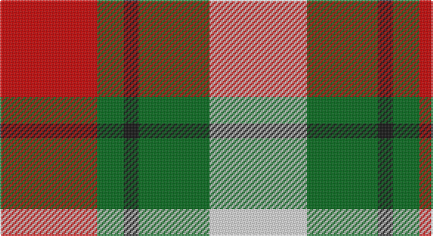

This page is one **sett** — a single exact thread-count. It belongs to the [tartan](/setts/r33g9k5g24w33/)
(the same proportion at any scale), whose colour order is pattern [RGKGW](/stripes/rgkgw/).

Part of the [Inverness Basque](/tartans/inverness-basque/) tartan — the named design grouping this sett with its other cloths.

Sourced from tartans-authority.  It is a [5 stripe tartan](/stripes/stripes5/).

Original link http://www.tartansauthority.com/tartan-ferret/display/10067/

## Register references

External register numbers recorded for this tartan.

- Scottish Register of Tartans: [10067](https://www.tartanregister.gov.uk/tartanDetails?ref=10067)
- Scottish Tartans Authority (ITI): 10067

## Thread count
R/66 G18 K10 G48 LN/66

One full sett is **284 threads**.

## Palette

Palette: <strong>Tartan Register</strong>
<table><thead><tr><th>Colour</th><th>Threads</th><th>Shade</th><th>Base</th><th>OKLCh</th></tr></thead><tbody><tr><td>R/</td><td style="text-align:right;font-variant-numeric:tabular-nums">66</td><td><code style="background-color:#C80000;">#C80000</code> <small style="color:#888">#C80000</small></td><td>R <code style="background-color:#CC0000;">#CC0000</code></td><td><small style="color:#888">oklch(52.3% 0.215 29.2)</small></td></tr><tr><td>G</td><td style="text-align:right;font-variant-numeric:tabular-nums">18</td><td><code style="background-color:#006818;">#006818</code> <small style="color:#888">#006818</small></td><td>G <code style="background-color:#006100;">#006100</code></td><td><small style="color:#888">oklch(45.0% 0.142 145.0)</small></td></tr><tr><td>K</td><td style="text-align:right;font-variant-numeric:tabular-nums">10</td><td><code style="background-color:#101010;">#101010</code> <small style="color:#888">#101010</small></td><td>K <code style="background-color:#000000;">#000000</code></td><td><small style="color:#888">oklch(17.3% 0.000 89.9)</small></td></tr><tr><td>G</td><td style="text-align:right;font-variant-numeric:tabular-nums">48</td><td><code style="background-color:#006818;">#006818</code> <small style="color:#888">#006818</small></td><td>G <code style="background-color:#006100;">#006100</code></td><td><small style="color:#888">oklch(45.0% 0.142 145.0)</small></td></tr><tr><td>LN/</td><td style="text-align:right;font-variant-numeric:tabular-nums">66</td><td><code style="background-color:#E0E0E0;">#E0E0E0</code> <small style="color:#888">#E0E0E0</small></td><td>W <code style="background-color:#F7F7F7;">#F7F7F7</code></td><td><small style="color:#888">oklch(90.7% 0.000 89.9)</small></td></tr></tbody></table>

# Sample pattern

## Compared to the master

This cloth is one sett of its design; the master sett (the exemplar the design is anchored on) is below for comparison.

<figure style="margin:0"><figcaption style="color:#888;font-size:smaller">this sett</figcaption></figure>
<figure style="margin:0"><figcaption style="color:#888;font-size:smaller"><a href="/setts/r22dg6k3dg16w22/">master sett →</a></figcaption></figure>

## Nearest tartans

The nearest existing variants by ΔTartan distance, with this tartan at the top so the swatches line up against it.

ΔTartan

Tartan

Sett

—

<a href="/ttd/edit/#slug=r33g9k5g24w33~x2">Inverness Basque (District)</a> <a class="nn-out" href="/variants/s5/r33g9k5g24w33~x2/" title="open its dictionary page">↗</a>

0.56

<a href="/ttd/edit/#slug=r22dg6k3dg16w22&amp;base=r33g9k5g24w33~x2">Inverness Basque</a> <a class="nn-out" href="/variants/s5/r22dg6k3dg16w22/" title="open its dictionary page">↗</a>

1.06

<a href="/ttd/edit/#slug=dg7dr7w7r1~x6&amp;base=r33g9k5g24w33~x2">MacKinnon Dress Hunting (Fashion)</a> <a class="nn-out" href="/variants/s4/dg7dr7w7r1~x6/" title="open its dictionary page">↗</a>

1.18

<a href="/ttd/edit/#slug=r6k14r6dg14w27k4&amp;base=r33g9k5g24w33~x2">Fraser Dress</a> <a class="nn-out" href="/variants/s6/r6k14r6dg14w27k4/" title="open its dictionary page">↗</a>

1.33

<a href="/ttd/edit/#slug=r3w8db4dg14r4db2~x4&amp;base=r33g9k5g24w33~x2">MacKintosh Dress (Scott Adie)</a> <a class="nn-out" href="/variants/s6/r3w8db4dg14r4db2~x4/" title="open its dictionary page">↗</a>

1.33

<a href="/ttd/edit/#slug=g9dr7w7r1~x4&amp;base=r33g9k5g24w33~x2">MacKinnon Dress Trade Tartan</a> <a class="nn-out" href="/variants/s4/g9dr7w7r1~x4/" title="open its dictionary page">↗</a>

1.36

<a href="/ttd/edit/#slug=r4db18r4g19w25r10w4~x2&amp;base=r33g9k5g24w33~x2">Fraser Red Dress Clan Tartan</a> <a class="nn-out" href="/variants/s7/r4db18r4g19w25r10w4~x2/" title="open its dictionary page">↗</a>

1.36

<a href="/ttd/edit/#slug=r6k14r6g14w27k4&amp;base=r33g9k5g24w33~x2">Fraser, dress</a> <a class="nn-out" href="/variants/s6/r6k14r6g14w27k4/" title="open its dictionary page">↗</a>

1.39

<a href="/ttd/edit/#slug=g9o7w7r1~x4&amp;base=r33g9k5g24w33~x2">MacKinnon, dress</a> <a class="nn-out" href="/variants/s4/g9o7w7r1~x4/" title="open its dictionary page">↗</a>

1.41

<a href="/ttd/edit/#slug=ly32k21r16lr6dt4~x2&amp;base=r33g9k5g24w33~x2">Scottish American Athletic Assoc</a> <a class="nn-out" href="/variants/s5/ly32k21r16lr6dt4~x2/" title="open its dictionary page">↗</a>

1.41

<a href="/ttd/edit/#slug=r3w8db4g14r4db2~x2&amp;base=r33g9k5g24w33~x2">MacIntosh, dress</a> <a class="nn-out" href="/variants/s6/r3w8db4g14r4db2~x2/" title="open its dictionary page">↗</a>

## Neighbour map

Every grey dot is one of 14360 variants placed by the first two principal components of the ΔTartan feature space (44% of its variance). Red is this tartan; blue dots are its nearest — click one to open its page.

<svg viewBox="0 0 640 380" role="img" style="max-width:100%;height:auto;border:1px solid #e0e0e0;border-radius:4px;display:block" xmlns="http://www.w3.org/2000/svg"><image href="/nn/cloud.v1.png" width="640" height="380"/><a href="/variants/s5/r22dg6k3dg16w22/"><circle cx="114.0" cy="217.7" r="4" fill="#3465a4"><title>Inverness Basque</title></circle></a><a href="/variants/s4/dg7dr7w7r1~x6/"><circle cx="107.0" cy="253.9" r="4" fill="#3465a4"><title>MacKinnon Dress Hunting (Fashion)</title></circle></a><a href="/variants/s6/r6k14r6dg14w27k4/"><circle cx="119.7" cy="209.0" r="4" fill="#3465a4"><title>Fraser Dress</title></circle></a><a href="/variants/s6/r3w8db4dg14r4db2~x4/"><circle cx="150.0" cy="215.1" r="4" fill="#3465a4"><title>MacKintosh Dress (Scott Adie)</title></circle></a><a href="/variants/s4/g9dr7w7r1~x4/"><circle cx="139.8" cy="244.6" r="4" fill="#3465a4"><title>MacKinnon Dress Trade Tartan</title></circle></a><a href="/variants/s7/r4db18r4g19w25r10w4~x2/"><circle cx="107.0" cy="207.4" r="4" fill="#3465a4"><title>Fraser Red Dress Clan Tartan</title></circle></a><a href="/variants/s6/r6k14r6g14w27k4/"><circle cx="112.5" cy="208.7" r="4" fill="#3465a4"><title>Fraser, dress</title></circle></a><a href="/variants/s4/g9o7w7r1~x4/"><circle cx="148.9" cy="247.9" r="4" fill="#3465a4"><title>MacKinnon, dress</title></circle></a><a href="/variants/s5/ly32k21r16lr6dt4~x2/"><circle cx="129.9" cy="197.9" r="4" fill="#3465a4"><title>Scottish American Athletic Assoc</title></circle></a><a href="/variants/s6/r3w8db4g14r4db2~x2/"><circle cx="150.5" cy="217.2" r="4" fill="#3465a4"><title>MacIntosh, dress</title></circle></a><circle cx="117.2" cy="230.9" r="5" fill="#c00000"/></svg>

ID: /variants/s5/r33g9k5g24w33~x2/
