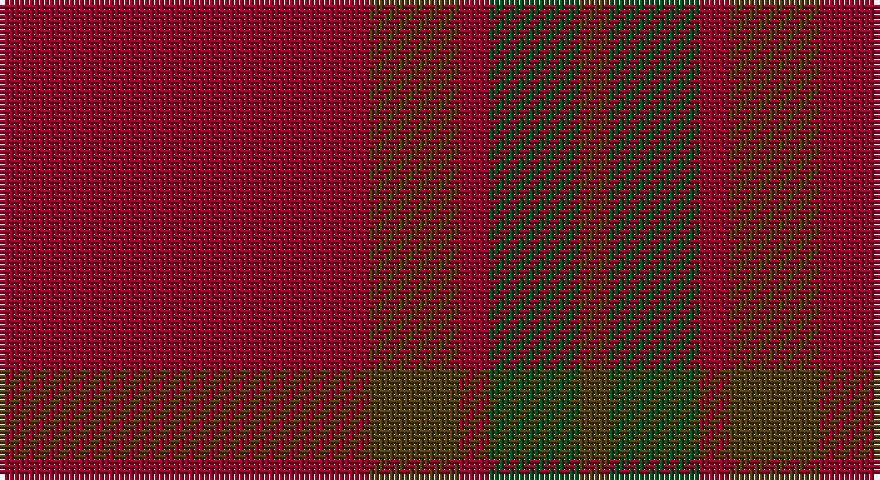

This page is one **sett** — a single exact thread-count. It belongs to the [tartan](/setts/r37dy9r3dg9dy3/)
(the same proportion at any scale), whose colour order is pattern [GGRGR](/stripes/ggrgr/).

Sourced from register-of-tartans.  It is a [5 stripe tartan](/stripes/stripes5/).

Original link https://www.tartanregister.gov.uk/tartanDetails.aspx?ref=1438

## Register references

External register numbers recorded for this tartan.

- Scottish Register of Tartans: [1438](https://www.tartanregister.gov.uk/tartanDetails.aspx?ref=1438)
- Scottish Tartans World Register: 1662

## Thread count
DR/74 T18 DR6 G18 T/6

One full sett is **164 threads**.

## Palette

Palette: <strong>Tartan Register</strong>
<table><thead><tr><th>Colour</th><th>Threads</th><th>Shade</th><th>Base</th><th>OKLCh</th></tr></thead><tbody><tr><td>DR/</td><td style="text-align:right;font-variant-numeric:tabular-nums">74</td><td><code style="background-color:#960028;">#960028</code> <small style="color:#888">#960028</small></td><td>R <code style="background-color:#CC0000;">#CC0000</code></td><td><small style="color:#888">oklch(42.7% 0.171 18.3)</small></td></tr><tr><td>T</td><td style="text-align:right;font-variant-numeric:tabular-nums">18</td><td><code style="background-color:#503C14;">#503C14</code> <small style="color:#888">#503C14</small></td><td>G <code style="background-color:#006100;">#006100</code></td><td><small style="color:#888">oklch(37.0% 0.062 81.8)</small></td></tr><tr><td>DR</td><td style="text-align:right;font-variant-numeric:tabular-nums">6</td><td><code style="background-color:#960028;">#960028</code> <small style="color:#888">#960028</small></td><td>R <code style="background-color:#CC0000;">#CC0000</code></td><td><small style="color:#888">oklch(42.7% 0.171 18.3)</small></td></tr><tr><td>G</td><td style="text-align:right;font-variant-numeric:tabular-nums">18</td><td><code style="background-color:#005020;">#005020</code> <small style="color:#888">#005020</small></td><td>G <code style="background-color:#006100;">#006100</code></td><td><small style="color:#888">oklch(37.7% 0.105 149.6)</small></td></tr><tr><td>T/</td><td style="text-align:right;font-variant-numeric:tabular-nums">6</td><td><code style="background-color:#503C14;">#503C14</code> <small style="color:#888">#503C14</small></td><td>G <code style="background-color:#006100;">#006100</code></td><td><small style="color:#888">oklch(37.0% 0.062 81.8)</small></td></tr></tbody></table>

# Sample pattern

## Nearest tartans

The nearest existing variants by ΔTartan distance, with this tartan at the top so the swatches line up against it.

ΔTartan

Tartan

Sett

—

<a href="/ttd/edit/#slug=r37dy9r3dg9dy3~x2">Glenshee #2</a> <a class="nn-out" href="/variants/s5/r37dy9r3dg9dy3~x2/" title="open its dictionary page">↗</a>

0.68

<a href="/ttd/edit/#slug=r37do9r3g9do3~x2&amp;base=r37dy9r3dg9dy3~x2">Glen Shee #1 (Fashion)</a> <a class="nn-out" href="/variants/s5/r37do9r3g9do3~x2/" title="open its dictionary page">↗</a>

1.26

<a href="/ttd/edit/#slug=m37dy9m3g9dy3~x2&amp;base=r37dy9r3dg9dy3~x2">Glen Shee Trade Tartan</a> <a class="nn-out" href="/variants/s5/m37dy9m3g9dy3~x2/" title="open its dictionary page">↗</a>

1.37

<a href="/ttd/edit/#slug=r37o9r3g9o3~x2&amp;base=r37dy9r3dg9dy3~x2">Glen Shee</a> <a class="nn-out" href="/variants/s5/r37o9r3g9o3~x2/" title="open its dictionary page">↗</a>

1.88

<a href="/ttd/edit/#slug=dr6lr2dr30dg12dr3dg12dr3~x2&amp;base=r37dy9r3dg9dy3~x2">Crawford</a> <a class="nn-out" href="/variants/s7/dr6lr2dr30dg12dr3dg12dr3~x2/" title="open its dictionary page">↗</a>

1.88

<a href="/ttd/edit/#slug=dr6lr2dr30dg12dr3dg12dr3&amp;base=r37dy9r3dg9dy3~x2">Crawford</a> <a class="nn-out" href="/variants/s7/dr6lr2dr30dg12dr3dg12dr3/" title="open its dictionary page">↗</a>

1.95

<a href="/ttd/edit/#slug=r58n12r5y28r7lo5~x2&amp;base=r37dy9r3dg9dy3~x2">Cairn O'Mount (Personal)</a> <a class="nn-out" href="/variants/s6/r58n12r5y28r7lo5~x2/" title="open its dictionary page">↗</a>

2.08

<a href="/ttd/edit/#slug=r3o28do5o5do33o5do5o28lo3~x2&amp;base=r37dy9r3dg9dy3~x2">MacIver of Strathendry Htg (Personal</a> <a class="nn-out" href="/variants/s9/r3o28do5o5do33o5do5o28lo3~x2/" title="open its dictionary page">↗</a>

2.15

<a href="/ttd/edit/#slug=dr24dg1b1dg2r24~x2&amp;base=r37dy9r3dg9dy3~x2">MacNab WI 1</a> <a class="nn-out" href="/variants/s5/dr24dg1b1dg2r24~x2/" title="open its dictionary page">↗</a>

2.21

<a href="/ttd/edit/#slug=m18dg1k5dg1k1dg1m9~x2&amp;base=r37dy9r3dg9dy3~x2">Inverness Augustus</a> <a class="nn-out" href="/variants/s7/m18dg1k5dg1k1dg1m9~x2/" title="open its dictionary page">↗</a>

2.25

<a href="/ttd/edit/#slug=dr12dg4dr8dt3dg3dt3dg8dt12dr38lo2~x2&amp;base=r37dy9r3dg9dy3~x2">Wanstall</a> <a class="nn-out" href="/variants/s10/dr12dg4dr8dt3dg3dt3dg8dt12dr38lo2~x2/" title="open its dictionary page">↗</a>

## Neighbour map

Every grey dot is one of 14360 variants placed by the first two principal components of the ΔTartan feature space (44% of its variance). Red is this tartan; blue dots are its nearest — click one to open its page.

<svg viewBox="0 0 640 380" role="img" style="max-width:100%;height:auto;border:1px solid #e0e0e0;border-radius:4px;display:block" xmlns="http://www.w3.org/2000/svg"><image href="/nn/cloud.v1.png" width="640" height="380"/><a href="/variants/s5/r37do9r3g9do3~x2/"><circle cx="514.3" cy="257.5" r="4" fill="#3465a4"><title>Glen Shee #1 (Fashion)</title></circle></a><a href="/variants/s5/m37dy9m3g9dy3~x2/"><circle cx="494.1" cy="241.8" r="4" fill="#3465a4"><title>Glen Shee Trade Tartan</title></circle></a><a href="/variants/s5/r37o9r3g9o3~x2/"><circle cx="487.3" cy="240.2" r="4" fill="#3465a4"><title>Glen Shee</title></circle></a><a href="/variants/s7/dr6lr2dr30dg12dr3dg12dr3~x2/"><circle cx="492.2" cy="253.5" r="4" fill="#3465a4"><title>Crawford</title></circle></a><a href="/variants/s7/dr6lr2dr30dg12dr3dg12dr3/"><circle cx="492.2" cy="253.5" r="4" fill="#3465a4"><title>Crawford</title></circle></a><a href="/variants/s6/r58n12r5y28r7lo5~x2/"><circle cx="426.8" cy="215.9" r="4" fill="#3465a4"><title>Cairn O'Mount (Personal)</title></circle></a><a href="/variants/s9/r3o28do5o5do33o5do5o28lo3~x2/"><circle cx="419.9" cy="217.7" r="4" fill="#3465a4"><title>MacIver of Strathendry Htg (Personal</title></circle></a><a href="/variants/s5/dr24dg1b1dg2r24~x2/"><circle cx="447.5" cy="214.8" r="4" fill="#3465a4"><title>MacNab WI 1</title></circle></a><a href="/variants/s7/m18dg1k5dg1k1dg1m9~x2/"><circle cx="587.3" cy="221.7" r="4" fill="#3465a4"><title>Inverness Augustus</title></circle></a><a href="/variants/s10/dr12dg4dr8dt3dg3dt3dg8dt12dr38lo2~x2/"><circle cx="485.9" cy="207.1" r="4" fill="#3465a4"><title>Wanstall</title></circle></a><circle cx="525.2" cy="261.8" r="5" fill="#c00000"/></svg>

ID: /variants/s5/r37dy9r3dg9dy3~x2/
