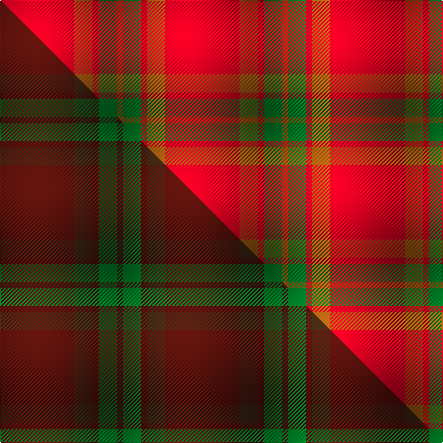

This is one **variant** — a specific cloth: this exact thread count and colourway, with its own
provenance below. It is one weaving of the [sett](/setts/r37o9r3g9o3/) (the scale-free proportion — the
same cloth at any scale or shade), whose colour order is pattern [RGRRR](/stripes/rgrrr/).

Part of the [Glen Shee](/tartans/glen-shee/) tartan — the named design grouping this sett with its other cloths.

Sourced from weddslist.  It is a [5 stripe tartan](/stripes/stripes5/).

Original link [http://www.weddslist.com/cgi-bin/tartans/pg.pl?source=sts](http://www.weddslist.com/cgi-bin/tartans/pg.pl?source=sts)

Dataset <small>— provenance for this record, inherited from the source manifest</small>

<dl class="dataset-prov">
<dt>source</dt><dd><a href="/sources/weddslist/">Weddslist</a></dd>
<dt>data captured from</dt><dd><a href="https://github.com/thetartan/tartan-database/blob/master/data/weddslist/data.csv">https://github.com/thetartan/tartan-database/blob/master/data/weddslist/data.csv</a></dd>
<dt>data date</dt><dd>2016-11-17 <small>(dataset default)</small></dd>
<dt>licence</dt><dd><a href="https://creativecommons.org/licenses/by-nc-nd/4.0/">CC BY-NC-ND 4.0</a></dd>
</dl>

Capture chain <small>— the hands this data passed through, oldest first; each capture carries its own licence</small>

<ol class="capture-chain">
<li><a href="https://www.weddslist.com/tartans/">Weddslist</a> <small>the living privately compiled reference</small></li>
<li><a href="https://github.com/thetartan/tartan-database">thetartan/tartan-database</a> <small>2016-2017</small> · <a href="https://creativecommons.org/licenses/by-nc-nd/4.0/">CC BY-NC-ND 4.0</a> <small>Levko Kravets's frozen compilation — the capture we vendored, and where its CC licence text came from</small></li>
<li>this dictionary <small>captured 2026-06-10 · commit 5bf86c7566</small> <small>each re-capture is a git commit to data/sources</small></li>
</ol>

## Thread count
R/74 O18 R6 G18 O/6

One full sett is **164 threads**.

## Palette
<table><thead><tr><th>Colour</th><th>Shade</th><th>OKLCh</th></tr></thead><tbody><tr><td>R</td><td><code style="background-color:#D60020;">#D60020</code> <small style="color:#888">#D60020</small></td><td><small style="color:#888">oklch(55.2% 0.224 25.5)</small></td></tr><tr><td>G</td><td><code style="background-color:#008B2A;">#008B2A</code> <small style="color:#888">#008B2A</small></td><td><small style="color:#888">oklch(55.4% 0.170 145.9)</small></td></tr><tr><td>O</td><td><code style="background-color:#A65C11;">#A65C11</code> <small style="color:#888">#A65C11</small></td><td><small style="color:#888">oklch(55.0% 0.125 58.3)</small></td></tr></tbody></table>

# Sample pattern

## Compared to the master

This cloth is one sett of its design; the master sett (the exemplar the design is anchored on) is below for comparison.

Its **ΔTartan distance** from the master is **0.23** — the same measure the nearest-tartans table ranks by (0 is identical; a re-scale of the same cloth is near 0, a recolour or a different proportion further).

<figure class="master-compare" style="margin:0">

this sett
master sett ★

<figcaption style="color:#888;font-size:smaller">One weave of this sett against the <a href="/setts/dr37do9dr3g9do3/">master sett ★</a>, split on the diagonal: a shared proportion runs seamlessly across it with only the shades shifting; a different proportion breaks on it.</figcaption>
</figure>

## Nearest tartan variants

The nearest existing variants by ΔTartan distance, with this cloth at the top so the swatches line up against it.

ΔTartan

Threads

Variant

Sett

—

164

<a href="/variants/s5/r37o9r3g9o3~x2/">Glen Shee</a>

<a href="/ttd/edit/#slug=dr37do9dr3g9do3~x2&amp;base=r37o9r3g9o3~x2" title="compare in the TTD">0.23</a>

164

<a href="/variants/s5/dr37do9dr3g9do3~x2/">Glen Shee #1 (Fashion)</a>

<a href="/ttd/edit/#slug=o23dr4o23dr32lo4~x2&amp;base=r37o9r3g9o3~x2" title="compare in the TTD">1.29</a>

290

<a href="/variants/s5/o23dr4o23dr32lo4~x2/">Hamilton, Red (Fashion?)</a>

<a href="/ttd/edit/#slug=r29g2r2g2r6y21~x4&amp;base=r37o9r3g9o3~x2" title="compare in the TTD">2.17</a>

296

<a href="/variants/s6/r29g2r2g2r6y21~x4/">Maguire, Black</a>

<a href="/ttd/edit/#slug=dr5o35dr46ly5~x2&amp;base=r37o9r3g9o3~x2" title="compare in the TTD">2.50</a>

344

<a href="/variants/s4/dr5o35dr46ly5~x2/">Bryce</a>

<a href="/ttd/edit/#slug=r37dy9r3g9dy3~x2&amp;base=r37o9r3g9o3~x2" title="compare in the TTD">2.69</a>

164

<a href="/variants/s5/r37dy9r3g9dy3~x2/">Glen Shee Trade Tartan</a>

<a href="/ttd/edit/#slug=db2r22dy11ly2dy11db2~x2~dy1603076-ly3307090&amp;base=r37o9r3g9o3~x2" title="compare in the TTD">3.37</a>

192

<a href="/variants/s6/db2r22dy11ly2dy11db2~x2~dy1603076-ly3307090/">Cetoloni Family Tartan</a>

<a href="/ttd/edit/#slug=r12w1r2o1n3~x4~o2500000-n1900000&amp;base=r37o9r3g9o3~x2" title="compare in the TTD">3.54</a>

92

<a href="/variants/s5/r12w1r2o1n3~x4~o2500000-n1900000/">Glen Shee Plaid (Fashion)</a>

<a href="/ttd/edit/#slug=r12w1r2lb1n3~x4&amp;base=r37o9r3g9o3~x2" title="compare in the TTD">3.82</a>

92

<a href="/variants/s5/r12w1r2lb1n3~x4/">Glenshee Trade Tartan</a>

<a href="/ttd/edit/#slug=r9y2r45y20ly3~x2~r1706009&amp;base=r37o9r3g9o3~x2" title="compare in the TTD">3.85</a>

292

<a href="/variants/s5/r9y2r45y20ly3~x2~r1706009/">Hunt (Personal)</a>

## Neighbour map

Every grey dot is one of 13621 variants placed by the first two principal components of the ΔTartan feature space (42% of its variance). Red is this tartan; blue dots are its nearest — click one to open its page.

<svg viewBox="0 0 640 380" role="img" style="max-width:100%;height:auto;border:1px solid #e0e0e0;border-radius:4px;display:block" xmlns="http://www.w3.org/2000/svg"><image href="/nn/cloud.v1.png" width="640" height="380"/><a href="/variants/s5/dr37do9dr3g9do3~x2/"><circle cx="562.6" cy="266.2" r="4" fill="#3465a4"><title>Glen Shee #1 (Fashion)</title></circle></a><a href="/variants/s5/o23dr4o23dr32lo4~x2/"><circle cx="395.5" cy="277.5" r="4" fill="#3465a4"><title>Hamilton, Red (Fashion?)</title></circle></a><a href="/variants/s6/r29g2r2g2r6y21~x4/"><circle cx="512.9" cy="229.0" r="4" fill="#3465a4"><title>Maguire, Black</title></circle></a><a href="/variants/s4/dr5o35dr46ly5~x2/"><circle cx="410.6" cy="262.1" r="4" fill="#3465a4"><title>Bryce</title></circle></a><a href="/variants/s5/r37dy9r3g9dy3~x2/"><circle cx="447.2" cy="208.4" r="4" fill="#3465a4"><title>Glen Shee Trade Tartan</title></circle></a><a href="/variants/s6/db2r22dy11ly2dy11db2~x2~dy1603076-ly3307090/"><circle cx="331.1" cy="218.0" r="4" fill="#3465a4"><title>Cetoloni Family Tartan</title></circle></a><a href="/variants/s5/r12w1r2o1n3~x4~o2500000-n1900000/"><circle cx="516.4" cy="196.2" r="4" fill="#3465a4"><title>Glen Shee Plaid (Fashion)</title></circle></a><a href="/variants/s5/r12w1r2lb1n3~x4/"><circle cx="512.0" cy="197.3" r="4" fill="#3465a4"><title>Glenshee Trade Tartan</title></circle></a><a href="/variants/s5/r9y2r45y20ly3~x2~r1706009/"><circle cx="574.5" cy="212.1" r="4" fill="#3465a4"><title>Hunt (Personal)</title></circle></a><circle cx="521.8" cy="233.3" r="5" fill="#c00000"/><text x="320" y="376" text-anchor="middle" font-size="11" fill="#999">ground</text><text x="11" y="190" text-anchor="middle" font-size="11" fill="#999" transform="rotate(-90 11 190)">complexity</text></svg>

ID: /variants/s5/r37o9r3g9o3~x2/
