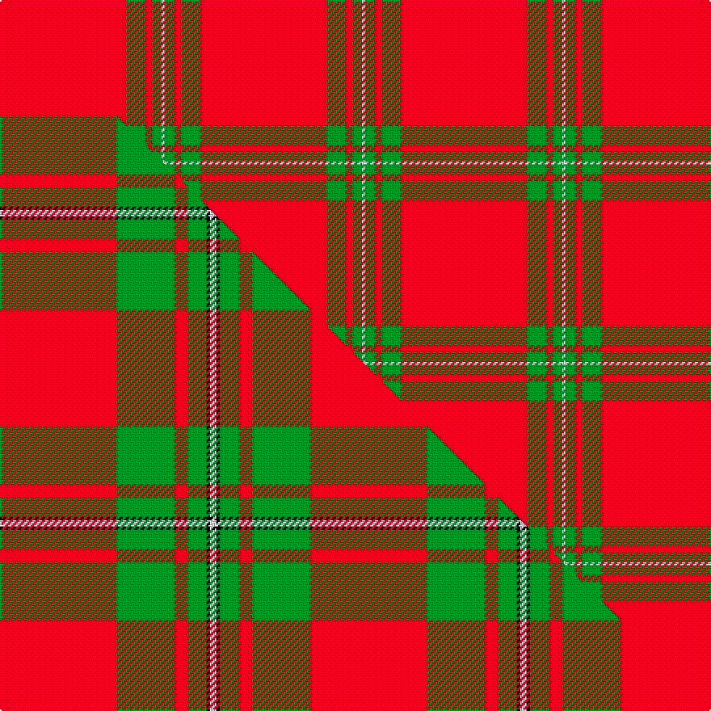

This is one **variant** — a specific cloth: this exact thread count and colourway, with its own
provenance below. It is one weaving of the [sett](/setts/r39g6r2g3w1/) (the scale-free proportion — the
same cloth at any scale or shade), whose colour order is pattern [RGRGW](/stripes/rgrgw/).

Part of the [MacGregor](/tartans/m/ma/macgregor-2/) tartan — the named design grouping this sett with its other cloths.

Sourced from register-of-tartans.  It is a [5 stripe tartan](/stripes/stripes5/).

Original link [https://www.tartanregister.gov.uk/tartanDetails.aspx?ref=2450](https://www.tartanregister.gov.uk/tartanDetails.aspx?ref=2450)

2 attestations — the source records this cloth was collapsed from (oldest owns this page)

<ul>
<li>undated — MacGregor #2 (register-of-tartans, <a href="https://www.tartanregister.gov.uk/tartanDetails.aspx?ref=2450">record</a>)  <em>Two times count given on squared paper drawing. Sketches of the Clans of Scotland 1884. Scottish Tartans Society archive.</em></li>
<li>undated — MacGregor (weddslist, <a href="http://www.weddslist.com/cgi-bin/tartans/pg.pl?source=sts">record</a>) </li>
</ul>

Dataset <small>— provenance for this record, inherited from the source manifest</small>

<dl class="dataset-prov">
<dt>source</dt><dd><a href="/sources/register-of-tartans/">Scottish Register of Tartans</a></dd>
<dt>data captured from</dt><dd><a href="https://github.com/thetartan/tartan-database/blob/master/data/register-of-tartans/data.csv">https://github.com/thetartan/tartan-database/blob/master/data/register-of-tartans/data.csv</a></dd>
<dt>data date</dt><dd>2017-01-06 <small>(dataset default)</small></dd>
<dt>licence</dt><dd><a href="https://www.tartanregister.gov.uk/copyright">Crown copyright</a></dd>
</dl>

Capture chain <small>— the hands this data passed through, oldest first; each capture carries its own licence</small>

<ol class="capture-chain">
<li><a href="https://www.tartanregister.gov.uk/">Scottish Register of Tartans</a> · <a href="https://www.tartanregister.gov.uk/copyright">Crown copyright</a> <small>the living register — still published by National Records of Scotland</small></li>
<li><a href="https://github.com/thetartan/tartan-database">thetartan/tartan-database</a> <small>2016-2017</small> · <a href="https://creativecommons.org/licenses/by-nc-nd/4.0/">CC BY-NC-ND 4.0</a> <small>Levko Kravets's frozen compilation — the capture we vendored, and where its CC licence text came from</small></li>
<li>this dictionary <small>captured 2026-06-10 · commit 5bf86c7566</small> <small>each re-capture is a git commit to data/sources</small></li>
</ol>

## Register references

External register numbers recorded for this tartan.

- Scottish Register of Tartans: [2450](https://www.tartanregister.gov.uk/tartanDetails.aspx?ref=2450)
- Scottish Tartans World Register: 1525

## Thread count
R/78 G12 R4 G6 W/2

One full sett is **124 threads**.

## Palette
<table><thead><tr><th>Colour</th><th>Shade</th><th>OKLCh</th></tr></thead><tbody><tr><td>G</td><td><code style="background-color:#008B2A;">#008B2A</code> <small style="color:#888">#008B2A</small></td><td><small style="color:#888">oklch(55.4% 0.170 145.9)</small></td></tr><tr><td>W</td><td><code style="background-color:#F7F7F7;">#F7F7F7</code> <small style="color:#888">#F7F7F7</small></td><td><small style="color:#888">oklch(97.6% 0.000 89.9)</small></td></tr><tr><td>R</td><td><code style="background-color:#D60020;">#D60020</code> <small style="color:#888">#D60020</small></td><td><small style="color:#888">oklch(55.2% 0.224 25.5)</small></td></tr></tbody></table>

# Sample pattern

## Compared to the master

This cloth is one sett of its design; the master sett (the exemplar the design is anchored on) is below for comparison.

Its **ΔTartan distance** from the master is **1.05** — the same measure the nearest-tartans table ranks by (0 is identical; a re-scale of the same cloth is near 0, a recolour or a different proportion further).

<figure class="master-compare" style="margin:0">

this sett
master sett ★

<figcaption style="color:#888;font-size:smaller">One weave of this sett against the <a href="/setts/r36g18r4g6k1w2/">master sett ★</a>, split on the diagonal: a shared proportion runs seamlessly across it with only the shades shifting; a different proportion breaks on it.</figcaption>
</figure>

## Nearest tartan variants

The nearest existing variants by ΔTartan distance, with this cloth at the top so the swatches line up against it.

ΔTartan

Threads

Variant

Sett

—

124

<a href="/variants/s5/r39g6r2g3w1~x2/">MacGregor #2</a>

<a href="/ttd/edit/#slug=r57dg21r8dg8k1w3~x2&amp;base=r39g6r2g3w1~x2" title="compare in the TTD">1.13</a>

272

<a href="/variants/s6/r57dg21r8dg8k1w3~x2/">MacGregor - 1800 (Clan)</a>

<a href="/ttd/edit/#slug=r38g2r5g16&amp;base=r39g6r2g3w1~x2" title="compare in the TTD">1.14</a>

68

<a href="/variants/s4/r38g2r5g16/">MacDonald Lord of the Isles</a>

<a href="/ttd/edit/#slug=r38g2r5g16~x2&amp;base=r39g6r2g3w1~x2" title="compare in the TTD">1.14</a>

136

<a href="/variants/s4/r38g2r5g16~x2/">MacDonald Lord of the Isles</a>

<a href="/ttd/edit/#slug=r36g2r5g16~x2&amp;base=r39g6r2g3w1~x2" title="compare in the TTD">1.17</a>

132

<a href="/variants/s4/r36g2r5g16~x2/">MacDonald of Sleat Clan Tartan</a>

<a href="/ttd/edit/#slug=r36dg2r5dg16~x2&amp;base=r39g6r2g3w1~x2" title="compare in the TTD">1.17</a>

132

<a href="/variants/s4/r36dg2r5dg16~x2/">MacDonald of Sleat - 1810 (Clan)</a>

<a href="/ttd/edit/#slug=r27w3r6w2dg3~x4&amp;base=r39g6r2g3w1~x2" title="compare in the TTD">1.80</a>

208

<a href="/variants/s5/r27w3r6w2dg3~x4/">Martin, Robert N (Personal)</a>

<a href="/ttd/edit/#slug=r27w3r6w2dg3~x4~r1506028&amp;base=r39g6r2g3w1~x2" title="compare in the TTD">1.80</a>

208

<a href="/variants/s5/r27w3r6w2dg3~x4~r1506028/">Martin Family, Robert N Personal Tartan</a>

<a href="/ttd/edit/#slug=r65g16r4dp4r4w5~x2&amp;base=r39g6r2g3w1~x2" title="compare in the TTD">1.81</a>

252

<a href="/variants/s6/r65g16r4dp4r4w5~x2/">Howard, Vincent (Personal)</a>

<a href="/ttd/edit/#slug=r72k8r4g16r7n2~x2&amp;base=r39g6r2g3w1~x2" title="compare in the TTD">1.90</a>

288

<a href="/variants/s6/r72k8r4g16r7n2~x2/">MacAndrew Dress (Name)</a>

<a href="/ttd/edit/#slug=r35w3r8y2g11~x2&amp;base=r39g6r2g3w1~x2" title="compare in the TTD">1.97</a>

144

<a href="/variants/s5/r35w3r8y2g11~x2/">Highlands at Wyomissing, The</a>

## Neighbour map

Every grey dot is one of 13656 variants placed by the first two principal components of the ΔTartan feature space (42% of its variance). Red is this tartan; blue dots are its nearest — click one to open its page. The map is a flat projection of a many-dimensional space — [how to read it](/posts/neighbourhood-maps/).

<svg viewBox="0 0 640 380" role="img" style="max-width:100%;height:auto;border:1px solid #e0e0e0;border-radius:4px;display:block" xmlns="http://www.w3.org/2000/svg"><image href="/nn/cloud.v1.png" width="640" height="380"/><a href="/variants/s6/r57dg21r8dg8k1w3~x2/"><circle cx="441.0" cy="102.3" r="4" fill="#3465a4"><title>MacGregor - 1800 (Clan)</title></circle></a><a href="/variants/s4/r38g2r5g16/"><circle cx="526.8" cy="223.4" r="4" fill="#3465a4"><title>MacDonald Lord of the Isles</title></circle></a><a href="/variants/s4/r38g2r5g16~x2/"><circle cx="526.8" cy="223.4" r="4" fill="#3465a4"><title>MacDonald Lord of the Isles</title></circle></a><a href="/variants/s4/r36g2r5g16~x2/"><circle cx="516.3" cy="227.3" r="4" fill="#3465a4"><title>MacDonald of Sleat Clan Tartan</title></circle></a><a href="/variants/s4/r36dg2r5dg16~x2/"><circle cx="503.6" cy="219.6" r="4" fill="#3465a4"><title>MacDonald of Sleat - 1810 (Clan)</title></circle></a><a href="/variants/s5/r27w3r6w2dg3~x4/"><circle cx="540.8" cy="180.9" r="4" fill="#3465a4"><title>Martin, Robert N (Personal)</title></circle></a><a href="/variants/s5/r27w3r6w2dg3~x4~r1506028/"><circle cx="521.3" cy="180.3" r="4" fill="#3465a4"><title>Martin Family, Robert N Personal Tartan</title></circle></a><a href="/variants/s6/r65g16r4dp4r4w5~x2/"><circle cx="499.6" cy="149.9" r="4" fill="#3465a4"><title>Howard, Vincent (Personal)</title></circle></a><a href="/variants/s6/r72k8r4g16r7n2~x2/"><circle cx="494.5" cy="99.1" r="4" fill="#3465a4"><title>MacAndrew Dress (Name)</title></circle></a><a href="/variants/s5/r35w3r8y2g11~x2/"><circle cx="486.2" cy="179.0" r="4" fill="#3465a4"><title>Highlands at Wyomissing, The</title></circle></a><circle cx="625.3" cy="140.9" r="5" fill="#c00000"/><text x="320" y="376" text-anchor="middle" font-size="11" fill="#999">ground</text><text x="11" y="190" text-anchor="middle" font-size="11" fill="#999" transform="rotate(-90 11 190)">complexity</text></svg>

ID: /variants/s5/r39g6r2g3w1~x2/
