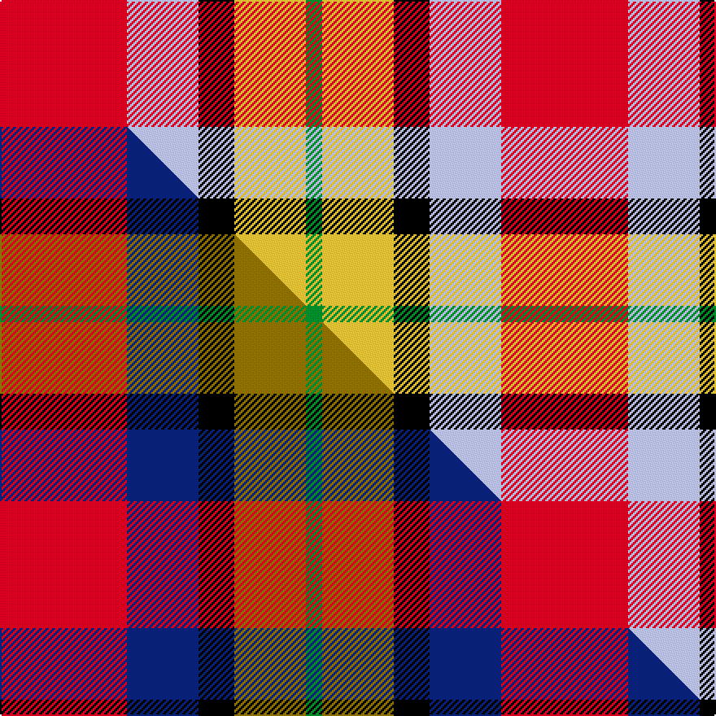

This is one **variant** — a specific cloth: this exact thread count and colourway, with its own
provenance below. It is one weaving of the [sett](/setts/r39lb22k11ly22g5/) (the scale-free proportion — the
same cloth at any scale or shade), whose colour order is pattern [GYKWR](/stripes/gykwr/).

Part of the [Abbink, Ingmar](/tartans/abbink-ingmar/) tartan — the named design grouping this sett with its other cloths.

Sourced from tartans-authority.  It is a [5 stripe tartan](/stripes/stripes5/).

Original link [https://www.tartanregister.gov.uk/tartanDetails.aspx?ref=11071](https://www.tartanregister.gov.uk/tartanDetails.aspx?ref=11071)

Dataset <small>— provenance for this record, inherited from the source manifest</small>

<dl class="dataset-prov">
<dt>source</dt><dd><a href="/sources/tartans-authority/">Scottish Tartans Authority</a></dd>
<dt>data captured from</dt><dd><a href="https://github.com/thetartan/tartan-database/blob/master/data/tartans-authority/data.csv">https://github.com/thetartan/tartan-database/blob/master/data/tartans-authority/data.csv</a></dd>
<dt>data date</dt><dd>2014 <small>(this record)</small></dd>
<dt>licence</dt><dd><a href="https://creativecommons.org/licenses/by-nc-nd/4.0/">CC BY-NC-ND 4.0</a></dd>
</dl>

Capture chain <small>— the hands this data passed through, oldest first; each capture carries its own licence</small>

<ol class="capture-chain">
<li><a href="https://www.tartansauthority.com/">Scottish Tartans Authority</a> <small>the heritage body's archive — its tartan-ferret record browser is retired (links repaired to the SRT, above)</small></li>
<li><a href="https://github.com/thetartan/tartan-database">thetartan/tartan-database</a> <small>2016-2017</small> · <a href="https://creativecommons.org/licenses/by-nc-nd/4.0/">CC BY-NC-ND 4.0</a> <small>Levko Kravets's frozen compilation — the capture we vendored, and where its CC licence text came from</small></li>
<li>this dictionary <small>captured 2026-06-10 · commit 5bf86c7566</small> <small>each re-capture is a git commit to data/sources</small></li>
</ol>

## Register references

External register numbers recorded for this tartan.

- Scottish Register of Tartans: [11071](https://www.tartanregister.gov.uk/tartanDetails?ref=11071)
- Scottish Tartans Authority (ITI): 11071

## Thread count
R/78 LB44 K22 LY44 G/10

One full sett is **308 threads**.

## Palette
<table><thead><tr><th>Colour</th><th>Shade</th><th>OKLCh</th></tr></thead><tbody><tr><td>LB</td><td><code style="background-color:#B5BBDE;">#B5BBDE</code> <small style="color:#888">#B5BBDE</small></td><td><small style="color:#888">oklch(79.9% 0.050 277.6)</small></td></tr><tr><td>R</td><td><code style="background-color:#D60020;">#D60020</code> <small style="color:#888">#D60020</small></td><td><small style="color:#888">oklch(55.2% 0.224 25.5)</small></td></tr><tr><td>G</td><td><code style="background-color:#008B2A;">#008B2A</code> <small style="color:#888">#008B2A</small></td><td><small style="color:#888">oklch(55.4% 0.170 145.9)</small></td></tr><tr><td>K</td><td><code style="background-color:#000000;">#000000</code> <small style="color:#888">#000000</small></td><td><small style="color:#888">oklch(0.0% 0.000 0.0)</small></td></tr><tr><td>LY</td><td><code style="background-color:#DCBC32;">#DCBC32</code> <small style="color:#888">#DCBC32</small></td><td><small style="color:#888">oklch(80.0% 0.150 95.2)</small></td></tr></tbody></table>

# Sample pattern

## Compared to the master

This cloth is one sett of its design; the master sett (the exemplar the design is anchored on) is below for comparison.

Its **ΔTartan distance** from the master is **0.20** — the same measure the nearest-tartans table ranks by (0 is identical; a re-scale of the same cloth is near 0, a recolour or a different proportion further).

<figure class="master-compare" style="margin:0">

this sett
master sett ★

<figcaption style="color:#888;font-size:smaller">One weave of this sett against the <a href="/setts/r39db22k11y22g5/">master sett ★</a>, split on the diagonal: a shared proportion runs seamlessly across it with only the shades shifting; a different proportion breaks on it.</figcaption>
</figure>

## Nearest tartan variants

The nearest existing variants by ΔTartan distance, with this cloth at the top so the swatches line up against it.

ΔTartan

Threads

Variant

Sett

—

308

<a href="/variants/s5/r39lb22k11ly22g5~x2/">Abbink, Ingmar (Personal)</a>

<a href="/ttd/edit/#slug=r39db22k11y22g5~x2&amp;base=r39lb22k11ly22g5~x2" title="compare in the TTD">0.20</a>

308

<a href="/variants/s5/r39db22k11y22g5~x2/">Abbink, Ingmar (Personal)</a>

<a href="/ttd/edit/#slug=r30db20w15lb3ly3&amp;base=r39lb22k11ly22g5~x2" title="compare in the TTD">1.13</a>

109

<a href="/variants/s5/r30db20w15lb3ly3/">Siddle, New (Corporate)</a>

<a href="/ttd/edit/#slug=y5k2g4lb18r25w5~x2&amp;base=r39lb22k11ly22g5~x2" title="compare in the TTD">1.18</a>

216

<a href="/variants/s6/y5k2g4lb18r25w5~x2/">Christie (London)</a>

<a href="/ttd/edit/#slug=dg4lb4k2r15ly4~x4&amp;base=r39lb22k11ly22g5~x2" title="compare in the TTD">1.44</a>

200

<a href="/variants/s5/dg4lb4k2r15ly4~x4/">Benedict (Personal)</a>

<a href="/ttd/edit/#slug=r19lb5t2w12t2y4g8~x2&amp;base=r39lb22k11ly22g5~x2" title="compare in the TTD">1.51</a>

154

<a href="/variants/s7/r19lb5t2w12t2y4g8~x2/">Northern Ontario (District)</a>

<a href="/ttd/edit/#slug=r19lb5t2w12t2y4g8~x2~g2203152&amp;base=r39lb22k11ly22g5~x2" title="compare in the TTD">1.51</a>

154

<a href="/variants/s7/r19lb5t2w12t2y4g8~x2~g2203152/">Ontario, Northern</a>

<a href="/ttd/edit/#slug=w3r24db12dg8ly3~x2&amp;base=r39lb22k11ly22g5~x2" title="compare in the TTD">1.66</a>

188

<a href="/variants/s5/w3r24db12dg8ly3~x2/">McGill University (Corporate)</a>

<a href="/ttd/edit/#slug=dy3dg8db12r24w3~x2&amp;base=r39lb22k11ly22g5~x2" title="compare in the TTD">1.66</a>

188

<a href="/variants/s5/dy3dg8db12r24w3~x2/">McGill University</a>

<a href="/ttd/edit/#slug=k9g2db16r22dg10w6~x2~g2408144-db1406275-dg1806142&amp;base=r39lb22k11ly22g5~x2" title="compare in the TTD">1.90</a>

230

<a href="/variants/s6/k9g2db16r22dg10w6~x2~g2408144-db1406275-dg1806142/">Nicolson of Taransay (Personal)</a>

<a href="/ttd/edit/#slug=g4r3lb1k1lb3~x4&amp;base=r39lb22k11ly22g5~x2" title="compare in the TTD">1.97</a>

68

<a href="/variants/s5/g4r3lb1k1lb3~x4/">Wilson's No.214</a>

## Neighbour map

Every grey dot is one of 13621 variants placed by the first two principal components of the ΔTartan feature space (42% of its variance). Red is this tartan; blue dots are its nearest — click one to open its page.

<svg viewBox="0 0 640 380" role="img" style="max-width:100%;height:auto;border:1px solid #e0e0e0;border-radius:4px;display:block" xmlns="http://www.w3.org/2000/svg"><image href="/nn/cloud.v1.png" width="640" height="380"/><a href="/variants/s5/r39db22k11y22g5~x2/"><circle cx="141.9" cy="220.6" r="4" fill="#3465a4"><title>Abbink, Ingmar (Personal)</title></circle></a><a href="/variants/s5/r30db20w15lb3ly3/"><circle cx="188.1" cy="206.4" r="4" fill="#3465a4"><title>Siddle, New (Corporate)</title></circle></a><a href="/variants/s6/y5k2g4lb18r25w5~x2/"><circle cx="181.5" cy="158.4" r="4" fill="#3465a4"><title>Christie (London)</title></circle></a><a href="/variants/s5/dg4lb4k2r15ly4~x4/"><circle cx="206.8" cy="191.2" r="4" fill="#3465a4"><title>Benedict (Personal)</title></circle></a><a href="/variants/s7/r19lb5t2w12t2y4g8~x2/"><circle cx="141.2" cy="188.1" r="4" fill="#3465a4"><title>Northern Ontario (District)</title></circle></a><a href="/variants/s7/r19lb5t2w12t2y4g8~x2~g2203152/"><circle cx="147.5" cy="189.2" r="4" fill="#3465a4"><title>Ontario, Northern</title></circle></a><a href="/variants/s5/w3r24db12dg8ly3~x2/"><circle cx="220.9" cy="211.1" r="4" fill="#3465a4"><title>McGill University (Corporate)</title></circle></a><a href="/variants/s5/dy3dg8db12r24w3~x2/"><circle cx="227.8" cy="212.9" r="4" fill="#3465a4"><title>McGill University</title></circle></a><a href="/variants/s6/k9g2db16r22dg10w6~x2~g2408144-db1406275-dg1806142/"><circle cx="80.3" cy="182.2" r="4" fill="#3465a4"><title>Nicolson of Taransay (Personal)</title></circle></a><a href="/variants/s5/g4r3lb1k1lb3~x4/"><circle cx="104.7" cy="250.4" r="4" fill="#3465a4"><title>Wilson's No.214</title></circle></a><circle cx="132.0" cy="221.1" r="5" fill="#c00000"/><text x="320" y="376" text-anchor="middle" font-size="11" fill="#999">ground</text><text x="11" y="190" text-anchor="middle" font-size="11" fill="#999" transform="rotate(-90 11 190)">complexity</text></svg>

ID: /variants/s5/r39lb22k11ly22g5~x2/
