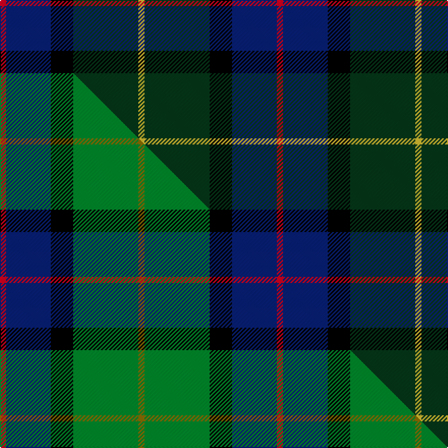

This is one **variant** — a specific cloth: this exact thread count and colourway, with its own
provenance below. It is one weaving of the [sett](/setts/r3db22k11dg32ly3/) (the scale-free proportion — the
same cloth at any scale or shade), whose colour order is pattern [RBKGY](/stripes/rbkgy/).

Part of the [Cultoquhey Hotel](/tartans/cultoquhey-hotel/) tartan — the named design grouping this sett with its other cloths.

Sourced from house-of-tartan.  It is a [5 stripe tartan](/stripes/stripes5/).

Original link [http://www.house-of-tartan.scotland.net/house/TartanViewjs.asp?colr=Def&tnam=3393](http://www.house-of-tartan.scotland.net/house/TartanViewjs.asp?colr=Def&tnam=3393)

## Provenance

Earliest known date: circa1990 Designed by Peter MacDonald as a Cook tartan for the former owners (David & Anna) of the Cultoquhey Hotel near Crieff. When they left, if became the house tartan of the hotel

Dataset <small>— provenance for this record, inherited from the source manifest</small>

<dl class="dataset-prov">
<dt>source</dt><dd><a href="/sources/house-of-tartan/">House of Tartan</a></dd>
<dt>data captured from</dt><dd><a href="https://github.com/thetartan/tartan-database/blob/master/data/house-of-tartan/data.csv">https://github.com/thetartan/tartan-database/blob/master/data/house-of-tartan/data.csv</a></dd>
<dt>data date</dt><dd>circa1990 <small>(this record)</small></dd>
<dt>licence</dt><dd><a href="https://creativecommons.org/licenses/by-nc-nd/4.0/">CC BY-NC-ND 4.0</a></dd>
</dl>

Capture chain <small>— the hands this data passed through, oldest first; each capture carries its own licence</small>

<ol class="capture-chain">
<li><a href="http://www.house-of-tartan.scotland.net/">House of Tartan</a> <small>the weaver/retailer's database — the site is now offline; the URL is kept as the ultimate source's identity</small></li>
<li><a href="https://github.com/thetartan/tartan-database">thetartan/tartan-database</a> <small>2016-2017</small> · <a href="https://creativecommons.org/licenses/by-nc-nd/4.0/">CC BY-NC-ND 4.0</a> <small>Levko Kravets's frozen compilation — the capture we vendored, and where its CC licence text came from</small></li>
<li>this dictionary <small>captured 2026-06-10 · commit 5bf86c7566</small> <small>each re-capture is a git commit to data/sources</small></li>
</ol>

## Thread count
R/6 DB44 K22 DG64 LY/6

One full sett is **272 threads**.

## Palette
<table><thead><tr><th>Colour</th><th>Shade</th><th>OKLCh</th></tr></thead><tbody><tr><td>DB</td><td><code style="background-color:#082077;">#082077</code> <small style="color:#888">#082077</small></td><td><small style="color:#888">oklch(30.0% 0.149 265.1)</small></td></tr><tr><td>DG</td><td><code style="background-color:#053819;">#053819</code> <small style="color:#888">#053819</small></td><td><small style="color:#888">oklch(30.0% 0.075 151.3)</small></td></tr><tr><td>K</td><td><code style="background-color:#000000;">#000000</code> <small style="color:#888">#000000</small></td><td><small style="color:#888">oklch(0.0% 0.000 0.0)</small></td></tr><tr><td>R</td><td><code style="background-color:#D60020;">#D60020</code> <small style="color:#888">#D60020</small></td><td><small style="color:#888">oklch(55.2% 0.224 25.5)</small></td></tr><tr><td>LY</td><td><code style="background-color:#DCBC32;">#DCBC32</code> <small style="color:#888">#DCBC32</small></td><td><small style="color:#888">oklch(80.0% 0.150 95.2)</small></td></tr></tbody></table>

# Sample pattern

## Compared to the master

This cloth is one sett of its design; the master sett (the exemplar the design is anchored on) is below for comparison.

Its **ΔTartan distance** from the master is **0.18** — the same measure the nearest-tartans table ranks by (0 is identical; a re-scale of the same cloth is near 0, a recolour or a different proportion further).

<figure class="master-compare" style="margin:0">

this sett
master sett ★

<figcaption style="color:#888;font-size:smaller">One weave of this sett against the <a href="/setts/r3db22k11g32y3/">master sett ★</a>, split on the diagonal: a shared proportion runs seamlessly across it with only the shades shifting; a different proportion breaks on it.</figcaption>
</figure>

## Nearest tartan variants

The nearest existing variants by ΔTartan distance, with this cloth at the top so the swatches line up against it.

ΔTartan

Threads

Variant

Sett

—

272

<a href="/variants/s5/r3db22k11dg32ly3~x2/">Cultoquhey Hotel Corporate Tartan</a>

<a href="/ttd/edit/#slug=r3db22k11g32y3~x2&amp;base=r3db22k11dg32ly3~x2" title="compare in the TTD">0.18</a>

272

<a href="/variants/s5/r3db22k11g32y3~x2/">Cultoquhey Hotel</a>

<a href="/ttd/edit/#slug=dy2g12k10r1db16r2~x2&amp;base=r3db22k11dg32ly3~x2" title="compare in the TTD">1.09</a>

164

<a href="/variants/s6/dy2g12k10r1db16r2~x2/">MacWilliam Clan Tartan</a>

<a href="/ttd/edit/#slug=db28r4k14r4dg33y4~x2&amp;base=r3db22k11dg32ly3~x2" title="compare in the TTD">1.18</a>

284

<a href="/variants/s6/db28r4k14r4dg33y4~x2/">Royal College of Physicians of Edinburgh</a>

<a href="/ttd/edit/#slug=r2db16r1k10g12o2~x2&amp;base=r3db22k11dg32ly3~x2" title="compare in the TTD">1.38</a>

164

<a href="/variants/s6/r2db16r1k10g12o2~x2/">MacWilliam</a>

<a href="/ttd/edit/#slug=db24k4r3g24k4o3~x2&amp;base=r3db22k11dg32ly3~x2" title="compare in the TTD">1.40</a>

194

<a href="/variants/s6/db24k4r3g24k4o3~x2/">(1) Skene</a>

<a href="/ttd/edit/#slug=k7dr3g30db28lb3~x2&amp;base=r3db22k11dg32ly3~x2" title="compare in the TTD">1.58</a>

264

<a href="/variants/s5/k7dr3g30db28lb3~x2/">Highlander Highland Laddie</a>

<a href="/ttd/edit/#slug=k7lt3dg18db18w2~x2&amp;base=r3db22k11dg32ly3~x2" title="compare in the TTD">1.59</a>

174

<a href="/variants/s5/k7lt3dg18db18w2~x2/">Bhatti</a>

<a href="/ttd/edit/#slug=r2k6y1dg12y1db6lb2~x4&amp;base=r3db22k11dg32ly3~x2" title="compare in the TTD">1.61</a>

224

<a href="/variants/s7/r2k6y1dg12y1db6lb2~x4/">James (Personal)</a>

<a href="/ttd/edit/#slug=r2k6y1dg12y1db6lr2~x4~db1305279-lr3200000&amp;base=r3db22k11dg32ly3~x2" title="compare in the TTD">1.61</a>

224

<a href="/variants/s7/r2k6y1dg12y1db6lr2~x4~db1305279-lr3200000/">James (Personal)</a>

<a href="/ttd/edit/#slug=dg10w2k10dy10db35r6~x2&amp;base=r3db22k11dg32ly3~x2" title="compare in the TTD">1.61</a>

260

<a href="/variants/s6/dg10w2k10dy10db35r6~x2/">Hatfield &amp; Mize (Personal)</a>

## Neighbour map

Every grey dot is one of 13621 variants placed by the first two principal components of the ΔTartan feature space (42% of its variance). Red is this tartan; blue dots are its nearest — click one to open its page.

<svg viewBox="0 0 640 380" role="img" style="max-width:100%;height:auto;border:1px solid #e0e0e0;border-radius:4px;display:block" xmlns="http://www.w3.org/2000/svg"><image href="/nn/cloud.v1.png" width="640" height="380"/><a href="/variants/s5/r3db22k11g32y3~x2/"><circle cx="188.9" cy="196.0" r="4" fill="#3465a4"><title>Cultoquhey Hotel</title></circle></a><a href="/variants/s6/dy2g12k10r1db16r2~x2/"><circle cx="156.4" cy="169.4" r="4" fill="#3465a4"><title>MacWilliam Clan Tartan</title></circle></a><a href="/variants/s6/db28r4k14r4dg33y4~x2/"><circle cx="183.4" cy="203.7" r="4" fill="#3465a4"><title>Royal College of Physicians of Edinburgh</title></circle></a><a href="/variants/s6/r2db16r1k10g12o2~x2/"><circle cx="153.5" cy="168.3" r="4" fill="#3465a4"><title>MacWilliam</title></circle></a><a href="/variants/s6/db24k4r3g24k4o3~x2/"><circle cx="165.4" cy="187.0" r="4" fill="#3465a4"><title>(1) Skene</title></circle></a><a href="/variants/s5/k7dr3g30db28lb3~x2/"><circle cx="198.8" cy="198.1" r="4" fill="#3465a4"><title>Highlander Highland Laddie</title></circle></a><a href="/variants/s5/k7lt3dg18db18w2~x2/"><circle cx="173.0" cy="217.8" r="4" fill="#3465a4"><title>Bhatti</title></circle></a><a href="/variants/s7/r2k6y1dg12y1db6lb2~x4/"><circle cx="145.6" cy="157.8" r="4" fill="#3465a4"><title>James (Personal)</title></circle></a><a href="/variants/s7/r2k6y1dg12y1db6lr2~x4~db1305279-lr3200000/"><circle cx="148.1" cy="157.9" r="4" fill="#3465a4"><title>James (Personal)</title></circle></a><a href="/variants/s6/dg10w2k10dy10db35r6~x2/"><circle cx="220.8" cy="154.3" r="4" fill="#3465a4"><title>Hatfield &amp; Mize (Personal)</title></circle></a><circle cx="229.3" cy="205.3" r="5" fill="#c00000"/><text x="320" y="376" text-anchor="middle" font-size="11" fill="#999">ground</text><text x="11" y="190" text-anchor="middle" font-size="11" fill="#999" transform="rotate(-90 11 190)">complexity</text></svg>

ID: /variants/s5/r3db22k11dg32ly3~x2/
