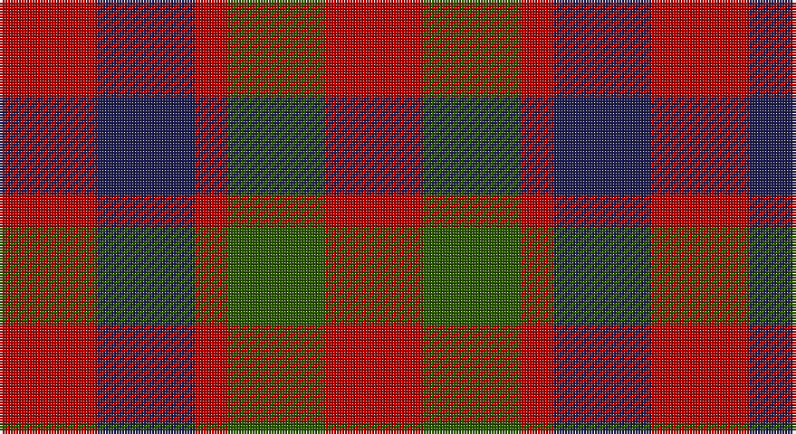

This page is one **sett** — a single exact thread-count. It belongs to the [tartan](/setts/r3dg3r1db3r3/)
(the same proportion at any scale), whose colour order is pattern [RBRGR](/stripes/rbrgr/).

Part of the [Gow](/tartans/gow/) tartan — the named design grouping this sett with its other cloths.

Sourced from tartans-authority.  It is a [5 stripe tartan](/stripes/stripes5/).

Original link http://www.tartansauthority.com/tartan-ferret/display/1390/

## Register references

External register numbers recorded for this tartan.

- Scottish Tartans Authority (ITI): 1390

## Thread count
R/36 DB36 R12 G36 R/36

One full sett is **240 threads**.

## Palette

Palette: <strong>Tartan Register</strong> <small style="color:#888">(2 of 3 colours)</small>
<table><thead><tr><th>Colour</th><th>Threads</th><th>Shade</th><th>Base</th><th>OKLCh</th></tr></thead><tbody><tr><td>R/</td><td style="text-align:right;font-variant-numeric:tabular-nums">36</td><td><code style="background-color:#B40000;">#B40000</code> <small style="color:#888">#B40000</small></td><td>R <code style="background-color:#CC0000;">#CC0000</code></td><td><small style="color:#888">oklch(48.3% 0.198 29.2)</small></td></tr><tr><td>DB</td><td style="text-align:right;font-variant-numeric:tabular-nums">36</td><td><code style="background-color:#1C1C50;">#1C1C50</code> <small style="color:#888">#1C1C50</small></td><td>B <code style="background-color:#2A418A;">#2A418A</code></td><td><small style="color:#888">oklch(26.2% 0.093 277.9)</small></td></tr><tr><td>R</td><td style="text-align:right;font-variant-numeric:tabular-nums">12</td><td><code style="background-color:#B40000;">#B40000</code> <small style="color:#888">#B40000</small></td><td>R <code style="background-color:#CC0000;">#CC0000</code></td><td><small style="color:#888">oklch(48.3% 0.198 29.2)</small></td></tr><tr><td>G</td><td style="text-align:right;font-variant-numeric:tabular-nums">36</td><td><code style="background-color:#285800;">#285800</code> <small style="color:#888">#285800</small></td><td>G <code style="background-color:#006100;">#006100</code></td><td><small style="color:#888">oklch(41.0% 0.122 135.8)</small></td></tr><tr><td>R/</td><td style="text-align:right;font-variant-numeric:tabular-nums">36</td><td><code style="background-color:#B40000;">#B40000</code> <small style="color:#888">#B40000</small></td><td>R <code style="background-color:#CC0000;">#CC0000</code></td><td><small style="color:#888">oklch(48.3% 0.198 29.2)</small></td></tr></tbody></table>

# Sample pattern

## Compared to the master

This cloth is one sett of its design; the master sett (the exemplar the design is anchored on) is below for comparison.

<figure style="margin:0"><figcaption style="color:#888;font-size:smaller">this sett</figcaption></figure>
<figure style="margin:0"><figcaption style="color:#888;font-size:smaller"><a href="/setts/r5dp5r1g5r5/">master sett →</a></figcaption></figure>

## Nearest tartans

The nearest existing variants by ΔTartan distance, with this tartan at the top so the swatches line up against it.

ΔTartan

Tartan

Sett

—

<a href="/ttd/edit/#slug=r3dg3r1db3r3~x12">Gow (Portrait)</a> <a class="nn-out" href="/variants/s5/r3dg3r1db3r3~x12/" title="open its dictionary page">↗</a>

0.63

<a href="/ttd/edit/#slug=r4dg4r1db4r4~x4&amp;base=r3dg3r1db3r3~x12">Gow</a> <a class="nn-out" href="/variants/s5/r4dg4r1db4r4~x4/" title="open its dictionary page">↗</a>

0.81

<a href="/ttd/edit/#slug=r4db4r1g4r4~x6&amp;base=r3dg3r1db3r3~x12">MacGowan</a> <a class="nn-out" href="/variants/s5/r4db4r1g4r4~x6/" title="open its dictionary page">↗</a>

0.93

<a href="/ttd/edit/#slug=r4dg4r1db4r4&amp;base=r3dg3r1db3r3~x12">Gow</a> <a class="nn-out" href="/variants/s5/r4dg4r1db4r4/" title="open its dictionary page">↗</a>

1.26

<a href="/ttd/edit/#slug=r4dg4r1db4r4~x2&amp;base=r3dg3r1db3r3~x12">Gow</a> <a class="nn-out" href="/variants/s5/r4dg4r1db4r4~x2/" title="open its dictionary page">↗</a>

1.60

<a href="/ttd/edit/#slug=r5dg5lr1b2r5~x2&amp;base=r3dg3r1db3r3~x12">Menzies</a> <a class="nn-out" href="/variants/s5/r5dg5lr1b2r5~x2/" title="open its dictionary page">↗</a>

1.74

<a href="/ttd/edit/#slug=dg14db8dg14r14k3r14~x2&amp;base=r3dg3r1db3r3~x12">Tulsa, City of</a> <a class="nn-out" href="/variants/s6/dg14db8dg14r14k3r14~x2/" title="open its dictionary page">↗</a>

1.79

<a href="/ttd/edit/#slug=r10db6k8dg10r6dg3r6~x2&amp;base=r3dg3r1db3r3~x12">MacDuff #3</a> <a class="nn-out" href="/variants/s7/r10db6k8dg10r6dg3r6~x2/" title="open its dictionary page">↗</a>

1.89

<a href="/ttd/edit/#slug=r3k6dy4k6y3~x2&amp;base=r3dg3r1db3r3~x12">Daks (Black)</a> <a class="nn-out" href="/variants/s5/r3k6dy4k6y3~x2/" title="open its dictionary page">↗</a>

1.97

<a href="/variants/s8/r4dg4r1db4r4~x12/">Gow</a>

1.99

<a href="/ttd/edit/#slug=g2r4g2t1~x4&amp;base=r3dg3r1db3r3~x12">Wilson's No.188</a> <a class="nn-out" href="/variants/s4/g2r4g2t1~x4/" title="open its dictionary page">↗</a>

## Neighbour map

Every grey dot is one of 14360 variants placed by the first two principal components of the ΔTartan feature space (44% of its variance). Red is this tartan; blue dots are its nearest — click one to open its page.

<svg viewBox="0 0 640 380" role="img" style="max-width:100%;height:auto;border:1px solid #e0e0e0;border-radius:4px;display:block" xmlns="http://www.w3.org/2000/svg"><image href="/nn/cloud.v1.png" width="640" height="380"/><a href="/variants/s5/r4dg4r1db4r4~x4/"><circle cx="244.9" cy="321.8" r="4" fill="#3465a4"><title>Gow</title></circle></a><a href="/variants/s5/r4db4r1g4r4~x6/"><circle cx="238.5" cy="317.3" r="4" fill="#3465a4"><title>MacGowan</title></circle></a><a href="/variants/s5/r4dg4r1db4r4/"><circle cx="238.7" cy="323.9" r="4" fill="#3465a4"><title>Gow</title></circle></a><a href="/variants/s5/r4dg4r1db4r4~x2/"><circle cx="220.1" cy="311.1" r="4" fill="#3465a4"><title>Gow</title></circle></a><a href="/variants/s5/r5dg5lr1b2r5~x2/"><circle cx="274.8" cy="285.0" r="4" fill="#3465a4"><title>Menzies</title></circle></a><a href="/variants/s6/dg14db8dg14r14k3r14~x2/"><circle cx="182.0" cy="291.5" r="4" fill="#3465a4"><title>Tulsa, City of</title></circle></a><a href="/variants/s7/r10db6k8dg10r6dg3r6~x2/"><circle cx="135.7" cy="290.9" r="4" fill="#3465a4"><title>MacDuff #3</title></circle></a><a href="/variants/s5/r3k6dy4k6y3~x2/"><circle cx="184.7" cy="350.0" r="4" fill="#3465a4"><title>Daks (Black)</title></circle></a><a href="/variants/s8/r4dg4r1db4r4~x12/"><circle cx="170.5" cy="296.8" r="4" fill="#3465a4"><title>Gow</title></circle></a><a href="/variants/s4/g2r4g2t1~x4/"><circle cx="239.7" cy="315.1" r="4" fill="#3465a4"><title>Wilson's No.188</title></circle></a><circle cx="240.4" cy="344.0" r="5" fill="#c00000"/></svg>

ID: /variants/s5/r3dg3r1db3r3~x12/
