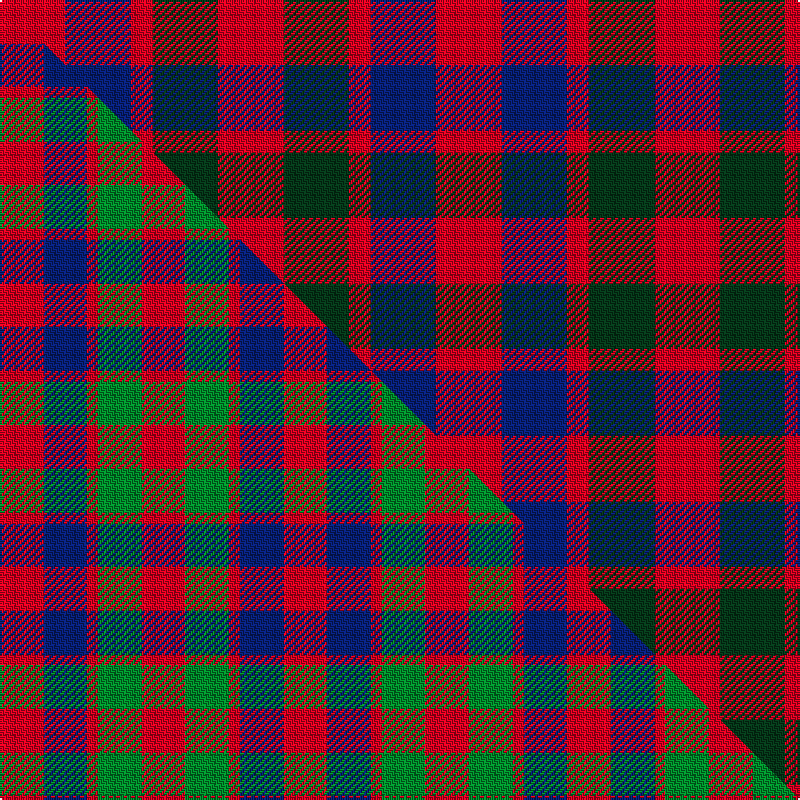

This page is one **sett** — a single exact thread-count. It belongs to the [tartan](/setts/r3dg3r1db3r3/)
(the same proportion at any scale), whose colour order is pattern [RBRGR](/stripes/rbrgr/).

Part of the [Gow](/tartans/gow/) tartan — the named design grouping this sett with its other cloths.

Sourced from tartans-authority.  It is a [5 stripe tartan](/stripes/stripes5/).

Original link http://www.tartansauthority.com/tartan-ferret/display/1390/

## Register references

External register numbers recorded for this tartan.

- Scottish Tartans Authority (ITI): 1390

## Thread count
R/36 DB36 R12 DG36 R/36

One full sett is **240 threads**.

## Palette
<table><thead><tr><th>Colour</th><th>Shade</th><th>OKLCh</th></tr></thead><tbody><tr><td>DB</td><td><code style="background-color:#082077;">#082077</code> <small style="color:#888">#082077</small></td><td><small style="color:#888">oklch(30.0% 0.149 265.1)</small></td></tr><tr><td>DG</td><td><code style="background-color:#053819;">#053819</code> <small style="color:#888">#053819</small></td><td><small style="color:#888">oklch(30.0% 0.075 151.3)</small></td></tr><tr><td>R</td><td><code style="background-color:#D60020;">#D60020</code> <small style="color:#888">#D60020</small></td><td><small style="color:#888">oklch(55.2% 0.224 25.5)</small></td></tr></tbody></table>

# Sample pattern

## Compared to the master

This cloth is one sett of its design; the master sett (the exemplar the design is anchored on) is below for comparison.

Its **ΔTartan distance** from the master is **0.85** — the same measure the nearest-tartans table ranks by (0 is identical; a re-scale of the same cloth is near 0, a recolour or a different proportion further).

<figure class="master-compare" style="margin:0">

this sett
master sett ★

<figcaption style="color:#888;font-size:smaller">One weave of this sett against the <a href="/setts/r4db4r1g4r4/">master sett ★</a>, split on the diagonal: a shared proportion runs seamlessly across it with only the shades shifting; a different proportion breaks on it.</figcaption>
</figure>

## Nearest variants

The nearest existing variants by ΔTartan distance, with this cloth at the top so the swatches line up against it.

ΔTartan

Threads

Variant

Sett

—

240

<a href="/variants/s5/r3dg3r1db3r3~x12/">Gow (Portrait)</a>

<a href="/ttd/edit/#slug=r4dg4r1db4r4~x4&amp;base=r3dg3r1db3r3~x12" title="compare in the TTD">0.31</a>

104

<a href="/variants/s5/r4dg4r1db4r4~x4/">Gow</a>

<a href="/ttd/edit/#slug=r4db4r1g4r4~x6&amp;base=r3dg3r1db3r3~x12" title="compare in the TTD">0.31</a>

156

<a href="/variants/s5/r4db4r1g4r4~x6/">MacGowan</a>

<a href="/ttd/edit/#slug=r4db4r1g4r4~x2&amp;base=r3dg3r1db3r3~x12" title="compare in the TTD">0.31</a>

52

<a href="/variants/s5/r4db4r1g4r4~x2/">Gow</a>

<a href="/ttd/edit/#slug=r4db4r1g4r4&amp;base=r3dg3r1db3r3~x12" title="compare in the TTD">0.31</a>

26

<a href="/variants/s5/r4db4r1g4r4/">Gow</a>

<a href="/ttd/edit/#slug=r5g5w1lb2r5~x2&amp;base=r3dg3r1db3r3~x12" title="compare in the TTD">1.80</a>

52

<a href="/variants/s5/r5g5w1lb2r5~x2/">Menzies</a>

<a href="/ttd/edit/#slug=r5dg3r18db18dg3~x4&amp;base=r3dg3r1db3r3~x12" title="compare in the TTD">1.84</a>

344

<a href="/variants/s5/r5dg3r18db18dg3~x4/">Wotherspoon</a>

<a href="/ttd/edit/#slug=r3k10r10g10r3~x4&amp;base=r3dg3r1db3r3~x12" title="compare in the TTD">1.92</a>

264

<a href="/variants/s5/r3k10r10g10r3~x4/">Unidentified (Gow-like)</a>

<a href="/ttd/edit/#slug=r3lb4db11r11db11o3r3~x2&amp;base=r3dg3r1db3r3~x12" title="compare in the TTD">2.53</a>

172

<a href="/variants/s7/r3lb4db11r11db11o3r3~x2/">Stewart, Fragment</a>

<a href="/ttd/edit/#slug=r2g2lb1~x4&amp;base=r3dg3r1db3r3~x12" title="compare in the TTD">2.58</a>

28

<a href="/variants/s3/r2g2lb1~x4/">Wilson's, No 207</a>

<a href="/ttd/edit/#slug=r10db6k8g10r6g3r6~x2&amp;base=r3dg3r1db3r3~x12" title="compare in the TTD">2.66</a>

164

<a href="/variants/s7/r10db6k8g10r6g3r6~x2/">MacDuff #3</a>

## Neighbour map

Every grey dot is one of 13620 variants placed by the first two principal components of the ΔTartan feature space (42% of its variance). Red is this tartan; blue dots are its nearest — click one to open its page.

<svg viewBox="0 0 640 380" role="img" style="max-width:100%;height:auto;border:1px solid #e0e0e0;border-radius:4px;display:block" xmlns="http://www.w3.org/2000/svg"><image href="/nn/cloud.v1.png" width="640" height="380"/><a href="/variants/s5/r4dg4r1db4r4~x4/"><circle cx="250.1" cy="315.4" r="4" fill="#3465a4"><title>Gow</title></circle></a><a href="/variants/s5/r4db4r1g4r4~x6/"><circle cx="241.6" cy="315.2" r="4" fill="#3465a4"><title>MacGowan</title></circle></a><a href="/variants/s5/r4db4r1g4r4~x2/"><circle cx="241.6" cy="315.2" r="4" fill="#3465a4"><title>Gow</title></circle></a><a href="/variants/s5/r4db4r1g4r4/"><circle cx="241.6" cy="315.2" r="4" fill="#3465a4"><title>Gow</title></circle></a><a href="/variants/s5/r5g5w1lb2r5~x2/"><circle cx="266.5" cy="277.4" r="4" fill="#3465a4"><title>Menzies</title></circle></a><a href="/variants/s5/r5dg3r18db18dg3~x4/"><circle cx="292.5" cy="253.9" r="4" fill="#3465a4"><title>Wotherspoon</title></circle></a><a href="/variants/s5/r3k10r10g10r3~x4/"><circle cx="152.5" cy="281.2" r="4" fill="#3465a4"><title>Unidentified (Gow-like)</title></circle></a><a href="/variants/s7/r3lb4db11r11db11o3r3~x2/"><circle cx="211.9" cy="258.8" r="4" fill="#3465a4"><title>Stewart, Fragment</title></circle></a><a href="/variants/s3/r2g2lb1~x4/"><circle cx="189.6" cy="366.0" r="4" fill="#3465a4"><title>Wilson's, No 207</title></circle></a><a href="/variants/s7/r10db6k8g10r6g3r6~x2/"><circle cx="111.4" cy="281.1" r="4" fill="#3465a4"><title>MacDuff #3</title></circle></a><circle cx="240.3" cy="333.0" r="5" fill="#c00000"/><text x="320" y="376" text-anchor="middle" font-size="11" fill="#999">ground</text><text x="11" y="190" text-anchor="middle" font-size="11" fill="#999" transform="rotate(-90 11 190)">complexity</text></svg>

ID: /variants/s5/r3dg3r1db3r3~x12/
