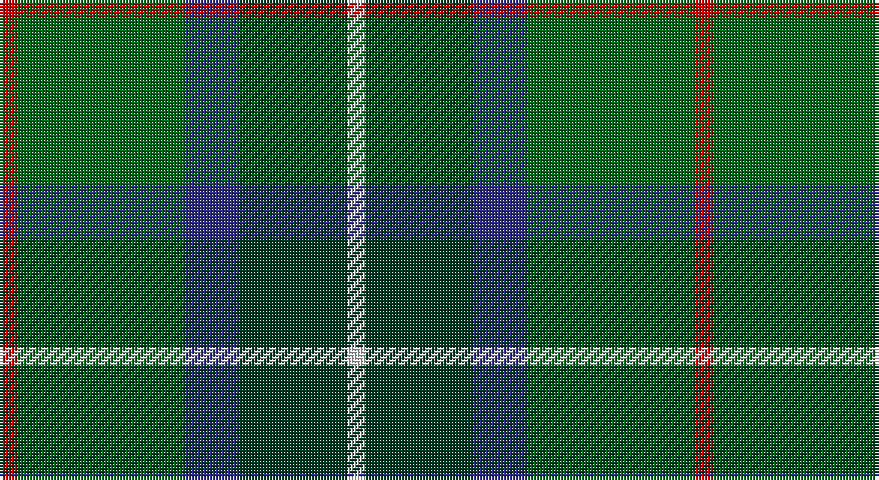

This page is one **sett** — a single exact thread-count. It belongs to the [tartan](/setts/r3g28db9dg18w3/)
(the same proportion at any scale), whose colour order is pattern [RGBGW](/stripes/rgbgw/).

Part of the [Simple Technology](/tartans/simple-technology/) tartan — the named design grouping this sett with its other cloths.

Sourced from tartans-authority.  It is a [5 stripe tartan](/stripes/stripes5/).

Original link http://www.tartansauthority.com/tartan-ferret/display/2320/

2 attestations — the source records this cloth was collapsed from (oldest owns this page)

<ul>
<li>1996 — Simple Technology (Corporate) (tartans-authority, <a href="http://www.tartansauthority.com/tartan-ferret/display/2320/">record</a>)</li>
<li>undated — Simple Technology (weddslist, <a href="http://www.weddslist.com/cgi-bin/tartans/pg.pl?source=sts">record</a>)</li>
</ul>

## Register references

External register numbers recorded for this tartan.

- Scottish Tartans Authority (ITI): 2320

## Thread count
R/6 G56 DB18 DG36 LN/6

One full sett is **232 threads**.

## Palette

Palette: <strong>Tartan Register</strong>
<table><thead><tr><th>Colour</th><th>Threads</th><th>Shade</th><th>Base</th><th>OKLCh</th></tr></thead><tbody><tr><td>R/</td><td style="text-align:right;font-variant-numeric:tabular-nums">6</td><td><code style="background-color:#C80000;">#C80000</code> <small style="color:#888">#C80000</small></td><td>R <code style="background-color:#CC0000;">#CC0000</code></td><td><small style="color:#888">oklch(52.3% 0.215 29.2)</small></td></tr><tr><td>G</td><td style="text-align:right;font-variant-numeric:tabular-nums">56</td><td><code style="background-color:#006818;">#006818</code> <small style="color:#888">#006818</small></td><td>G <code style="background-color:#006100;">#006100</code></td><td><small style="color:#888">oklch(45.0% 0.142 145.0)</small></td></tr><tr><td>DB</td><td style="text-align:right;font-variant-numeric:tabular-nums">18</td><td><code style="background-color:#2C2C80;">#2C2C80</code> <small style="color:#888">#2C2C80</small></td><td>B <code style="background-color:#2A418A;">#2A418A</code></td><td><small style="color:#888">oklch(35.0% 0.138 276.6)</small></td></tr><tr><td>DG</td><td style="text-align:right;font-variant-numeric:tabular-nums">36</td><td><code style="background-color:#003820;">#003820</code> <small style="color:#888">#003820</small></td><td>G <code style="background-color:#006100;">#006100</code></td><td><small style="color:#888">oklch(30.0% 0.070 158.3)</small></td></tr><tr><td>LN/</td><td style="text-align:right;font-variant-numeric:tabular-nums">6</td><td><code style="background-color:#E0E0E0;">#E0E0E0</code> <small style="color:#888">#E0E0E0</small></td><td>W <code style="background-color:#F7F7F7;">#F7F7F7</code></td><td><small style="color:#888">oklch(90.7% 0.000 89.9)</small></td></tr></tbody></table>

# Sample pattern

## Compared to the master

This cloth is one sett of its design; the master sett (the exemplar the design is anchored on) is below for comparison.

<figure style="margin:0"><figcaption style="color:#888;font-size:smaller">this sett</figcaption></figure>
<figure style="margin:0"><figcaption style="color:#888;font-size:smaller"><a href="/setts/g28db9dg18w3dg18db9g28r3/">master sett →</a></figcaption></figure>

## Nearest tartans

The nearest existing variants by ΔTartan distance, with this tartan at the top so the swatches line up against it.

ΔTartan

Tartan

Sett

—

<a href="/ttd/edit/#slug=r3g28db9dg18w3~x2">Simple Technology (Corporate)</a> <a class="nn-out" href="/variants/s5/r3g28db9dg18w3~x2/" title="open its dictionary page">↗</a>

0.94

<a href="/ttd/edit/#slug=r3db22k11g32ly3~x2&amp;base=r3g28db9dg18w3~x2">Cultoquhey Hotel</a> <a class="nn-out" href="/variants/s5/r3db22k11g32ly3~x2/" title="open its dictionary page">↗</a>

0.95

<a href="/ttd/edit/#slug=g6ly3g26dg10dt30lb3~x2&amp;base=r3g28db9dg18w3~x2">Wcwm 1716</a> <a class="nn-out" href="/variants/s6/g6ly3g26dg10dt30lb3~x2/" title="open its dictionary page">↗</a>

0.96

<a href="/ttd/edit/#slug=g10db42r5dg42g42ly5g10&amp;base=r3g28db9dg18w3~x2">New Mexico</a> <a class="nn-out" href="/variants/s7/g10db42r5dg42g42ly5g10/" title="open its dictionary page">↗</a>

0.97

<a href="/ttd/edit/#slug=gi9g1p2g1db4r1~x12&amp;base=r3g28db9dg18w3~x2">Gorman, George (Personal)</a> <a class="nn-out" href="/variants/s6/gi9g1p2g1db4r1~x12/" title="open its dictionary page">↗</a>

1.03

<a href="/ttd/edit/#slug=g3r3g31dg18g4k22ly3&amp;base=r3g28db9dg18w3~x2">MacSween Hunting (Lochs, Isle of Lew</a> <a class="nn-out" href="/variants/s7/g3r3g31dg18g4k22ly3/" title="open its dictionary page">↗</a>

1.05

<a href="/ttd/edit/#slug=k9lr6n22g28ly2~x2&amp;base=r3g28db9dg18w3~x2">Wellington (Lochcarron)</a> <a class="nn-out" href="/variants/s5/k9lr6n22g28ly2~x2/" title="open its dictionary page">↗</a>

1.10

<a href="/ttd/edit/#slug=ly4dg30g15db5b10ly4~x2&amp;base=r3g28db9dg18w3~x2">MPS Emerald Society</a> <a class="nn-out" href="/variants/s6/ly4dg30g15db5b10ly4~x2/" title="open its dictionary page">↗</a>

1.11

<a href="/ttd/edit/#slug=gi2g8dp4lb2gi13b2~x4&amp;base=r3g28db9dg18w3~x2">Ellan Vannin</a> <a class="nn-out" href="/variants/s6/gi2g8dp4lb2gi13b2~x4/" title="open its dictionary page">↗</a>

1.13

<a href="/ttd/edit/#slug=g31dg7lo3dg14g8db18dp5~x2&amp;base=r3g28db9dg18w3~x2">Reidy Wedding</a> <a class="nn-out" href="/variants/s7/g31dg7lo3dg14g8db18dp5~x2/" title="open its dictionary page">↗</a>

1.17

<a href="/ttd/edit/#slug=b30ly3dy11ly3g33r6~x2&amp;base=r3g28db9dg18w3~x2">Balfour Hunting</a> <a class="nn-out" href="/variants/s6/b30ly3dy11ly3g33r6~x2/" title="open its dictionary page">↗</a>

## Neighbour map

Every grey dot is one of 14360 variants placed by the first two principal components of the ΔTartan feature space (44% of its variance). Red is this tartan; blue dots are its nearest — click one to open its page.

<svg viewBox="0 0 640 380" role="img" style="max-width:100%;height:auto;border:1px solid #e0e0e0;border-radius:4px;display:block" xmlns="http://www.w3.org/2000/svg"><image href="/nn/cloud.v1.png" width="640" height="380"/><a href="/variants/s5/r3db22k11g32ly3~x2/"><circle cx="226.3" cy="218.7" r="4" fill="#3465a4"><title>Cultoquhey Hotel</title></circle></a><a href="/variants/s6/g6ly3g26dg10dt30lb3~x2/"><circle cx="216.2" cy="212.7" r="4" fill="#3465a4"><title>Wcwm 1716</title></circle></a><a href="/variants/s7/g10db42r5dg42g42ly5g10/"><circle cx="187.8" cy="219.0" r="4" fill="#3465a4"><title>New Mexico</title></circle></a><a href="/variants/s6/gi9g1p2g1db4r1~x12/"><circle cx="246.8" cy="203.5" r="4" fill="#3465a4"><title>Gorman, George (Personal)</title></circle></a><a href="/variants/s7/g3r3g31dg18g4k22ly3/"><circle cx="240.0" cy="208.5" r="4" fill="#3465a4"><title>MacSween Hunting (Lochs, Isle of Lew</title></circle></a><a href="/variants/s5/k9lr6n22g28ly2~x2/"><circle cx="230.4" cy="221.8" r="4" fill="#3465a4"><title>Wellington (Lochcarron)</title></circle></a><a href="/variants/s6/ly4dg30g15db5b10ly4~x2/"><circle cx="178.3" cy="214.8" r="4" fill="#3465a4"><title>MPS Emerald Society</title></circle></a><a href="/variants/s6/gi2g8dp4lb2gi13b2~x4/"><circle cx="234.0" cy="240.0" r="4" fill="#3465a4"><title>Ellan Vannin</title></circle></a><a href="/variants/s7/g31dg7lo3dg14g8db18dp5~x2/"><circle cx="245.7" cy="231.8" r="4" fill="#3465a4"><title>Reidy Wedding</title></circle></a><a href="/variants/s6/b30ly3dy11ly3g33r6~x2/"><circle cx="216.7" cy="209.7" r="4" fill="#3465a4"><title>Balfour Hunting</title></circle></a><circle cx="234.7" cy="232.4" r="5" fill="#c00000"/></svg>

ID: /variants/s5/r3g28db9dg18w3~x2/
