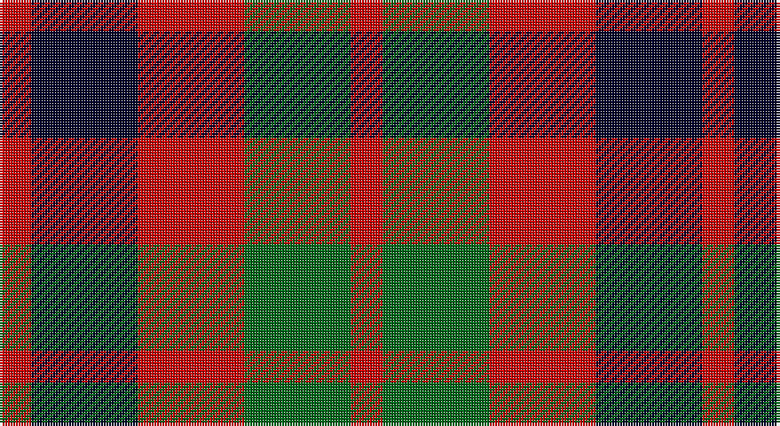

This page is one **sett** — a single exact thread-count. It belongs to the [tartan](/setts/r3k10r10g10r3/)
(the same proportion at any scale), whose colour order is pattern [RGRKR](/stripes/rgrkr/).

Part of the [Unidentified](/tartans/unidentified/) tartan — the named design grouping this sett with its other cloths.

Sourced from tartans-authority.  It is a [5 stripe tartan](/stripes/stripes5/).

Original link http://www.tartansauthority.com/tartan-ferret/display/7873/

## Also known as

This cloth is also recorded under:

- Unidentified #10
- Unidentified #12
- Unidentified #14
- Unidentified #15
- Unidentified #16
- Unidentified #18
- Unidentified #2
- Unidentified #21
- Unidentified #22
- Unidentified #24
- Unidentified #25
- Unidentified #28
- Unidentified #29
- Unidentified #30
- Unidentified #31
- Unidentified #32
- Unidentified #36
- Unidentified #37
- Unidentified #38
- Unidentified #40
- Unidentified #43
- Unidentified #44
- Unidentified #45
- Unidentified #46
- Unidentified #47
- Unidentified #48
- Unidentified #49
- Unidentified #5
- Unidentified #50
- Unidentified #51
- Unidentified #52
- Unidentified #53
- Unidentified #54
- Unidentified #55
- Unidentified #56
- Unidentified #57
- Unidentified #58
- Unidentified #59
- Unidentified #60
- Unidentified #61
- Unidentified #62
- Unidentified #63
- Unidentified #64
- Unidentified #65
- Unidentified #66
- Unidentified #7
- Unidentified #8
- Unidentified #9
- Unidentified 16
- Unidentified Artifact
- Unidentified Plaid
- Unidentified Plaid #11
- Unidentified Plaid #13
- Unidentified Plaid #2
- Unidentified Plaid #3
- Unidentified Plaid #7
- Unidentified Plaid #8
- Unidentified Plaid #9
- Unidentified Portrait

## Register references

External register numbers recorded for this tartan.

- Scottish Register of Tartans: [7873](https://www.tartanregister.gov.uk/tartanDetails?ref=7873)
- Scottish Tartans Authority (ITI): 7873

## Thread count
R/12 DB40 R40 G40 R/12

One full sett is **264 threads**.

## Palette

Palette: <strong>Tartan Register</strong> <small style="color:#888">(2 of 3 colours)</small>
<table><thead><tr><th>Colour</th><th>Threads</th><th>Shade</th><th>Base</th><th>OKLCh</th></tr></thead><tbody><tr><td>R/</td><td style="text-align:right;font-variant-numeric:tabular-nums">12</td><td><code style="background-color:#C80000;">#C80000</code> <small style="color:#888">#C80000</small></td><td>R <code style="background-color:#CC0000;">#CC0000</code></td><td><small style="color:#888">oklch(52.3% 0.215 29.2)</small></td></tr><tr><td>DB</td><td style="text-align:right;font-variant-numeric:tabular-nums">40</td><td><code style="background-color:#00002C;">#00002C</code> <small style="color:#888">#00002C</small></td><td>K <code style="background-color:#000000;">#000000</code></td><td><small style="color:#888">oklch(13.2% 0.092 264.1)</small></td></tr><tr><td>R</td><td style="text-align:right;font-variant-numeric:tabular-nums">40</td><td><code style="background-color:#C80000;">#C80000</code> <small style="color:#888">#C80000</small></td><td>R <code style="background-color:#CC0000;">#CC0000</code></td><td><small style="color:#888">oklch(52.3% 0.215 29.2)</small></td></tr><tr><td>G</td><td style="text-align:right;font-variant-numeric:tabular-nums">40</td><td><code style="background-color:#006818;">#006818</code> <small style="color:#888">#006818</small></td><td>G <code style="background-color:#006100;">#006100</code></td><td><small style="color:#888">oklch(45.0% 0.142 145.0)</small></td></tr><tr><td>R/</td><td style="text-align:right;font-variant-numeric:tabular-nums">12</td><td><code style="background-color:#C80000;">#C80000</code> <small style="color:#888">#C80000</small></td><td>R <code style="background-color:#CC0000;">#CC0000</code></td><td><small style="color:#888">oklch(52.3% 0.215 29.2)</small></td></tr></tbody></table>

# Sample pattern

## Compared to the master

This cloth is one sett of its design; the master sett (the exemplar the design is anchored on) is below for comparison.

<figure style="margin:0"><figcaption style="color:#888;font-size:smaller">this sett</figcaption></figure>
<figure style="margin:0"><figcaption style="color:#888;font-size:smaller"><a href="/setts/dp4r3dp26r26dg26r4/">master sett →</a></figcaption></figure>

## Nearest tartans

The nearest existing variants by ΔTartan distance, with this tartan at the top so the swatches line up against it.

ΔTartan

Tartan

Sett

—

<a href="/ttd/edit/#slug=r3k10r10g10r3~x4">Unidentified (Gow-like)</a> <a class="nn-out" href="/variants/s5/r3k10r10g10r3~x4/" title="open its dictionary page">↗</a>

1.23

<a href="/ttd/edit/#slug=r4dg4r1db4r4~x2&amp;base=r3k10r10g10r3~x4">Gow</a> <a class="nn-out" href="/variants/s5/r4dg4r1db4r4~x2/" title="open its dictionary page">↗</a>

1.28

<a href="/ttd/edit/#slug=dt6k6dt6r14ly3~x2&amp;base=r3k10r10g10r3~x4">Chivas Regal</a> <a class="nn-out" href="/variants/s5/dt6k6dt6r14ly3~x2/" title="open its dictionary page">↗</a>

1.33

<a href="/ttd/edit/#slug=dt2k2dt2r5ly1~x12&amp;base=r3k10r10g10r3~x4">Chivas Regal (Corporate)</a> <a class="nn-out" href="/variants/s5/dt2k2dt2r5ly1~x12/" title="open its dictionary page">↗</a>

1.46

<a href="/ttd/edit/#slug=db5r17dg16k10db10r17db5~x2&amp;base=r3k10r10g10r3~x4">MacNaughton (Logan)</a> <a class="nn-out" href="/variants/s7/db5r17dg16k10db10r17db5~x2/" title="open its dictionary page">↗</a>

1.47

<a href="/ttd/edit/#slug=r4dg4r1db4r4&amp;base=r3k10r10g10r3~x4">Gow</a> <a class="nn-out" href="/variants/s5/r4dg4r1db4r4/" title="open its dictionary page">↗</a>

1.48

<a href="/ttd/edit/#slug=r10db6k8g10r6g3r6~x2&amp;base=r3k10r10g10r3~x4">MacDuff</a> <a class="nn-out" href="/variants/s7/r10db6k8g10r6g3r6~x2/" title="open its dictionary page">↗</a>

1.50

<a href="/ttd/edit/#slug=g3dp3w1dp3g3r1~x4&amp;base=r3k10r10g10r3~x4">Wilson's No.113</a> <a class="nn-out" href="/variants/s6/g3dp3w1dp3g3r1~x4/" title="open its dictionary page">↗</a>

1.53

<a href="/ttd/edit/#slug=p3k3p3g6r2~x2&amp;base=r3k10r10g10r3~x4">Austin / Wilson's No 137</a> <a class="nn-out" href="/variants/s5/p3k3p3g6r2~x2/" title="open its dictionary page">↗</a>

1.54

<a href="/ttd/edit/#slug=dg14db8dg14r14k3r14~x2&amp;base=r3k10r10g10r3~x4">Tulsa, City of</a> <a class="nn-out" href="/variants/s6/dg14db8dg14r14k3r14~x2/" title="open its dictionary page">↗</a>

1.58

<a href="/ttd/edit/#slug=r10db6k8dg10r6dg3r6~x2&amp;base=r3k10r10g10r3~x4">MacDuff #3</a> <a class="nn-out" href="/variants/s7/r10db6k8dg10r6dg3r6~x2/" title="open its dictionary page">↗</a>

## Neighbour map

Every grey dot is one of 14360 variants placed by the first two principal components of the ΔTartan feature space (44% of its variance). Red is this tartan; blue dots are its nearest — click one to open its page.

<svg viewBox="0 0 640 380" role="img" style="max-width:100%;height:auto;border:1px solid #e0e0e0;border-radius:4px;display:block" xmlns="http://www.w3.org/2000/svg"><image href="/nn/cloud.v1.png" width="640" height="380"/><a href="/variants/s5/r4dg4r1db4r4~x2/"><circle cx="220.1" cy="311.1" r="4" fill="#3465a4"><title>Gow</title></circle></a><a href="/variants/s5/dt6k6dt6r14ly3~x2/"><circle cx="160.5" cy="269.8" r="4" fill="#3465a4"><title>Chivas Regal</title></circle></a><a href="/variants/s5/dt2k2dt2r5ly1~x12/"><circle cx="175.6" cy="262.7" r="4" fill="#3465a4"><title>Chivas Regal (Corporate)</title></circle></a><a href="/variants/s7/db5r17dg16k10db10r17db5~x2/"><circle cx="130.9" cy="274.8" r="4" fill="#3465a4"><title>MacNaughton (Logan)</title></circle></a><a href="/variants/s5/r4dg4r1db4r4/"><circle cx="238.7" cy="323.9" r="4" fill="#3465a4"><title>Gow</title></circle></a><a href="/variants/s7/r10db6k8g10r6g3r6~x2/"><circle cx="115.2" cy="284.7" r="4" fill="#3465a4"><title>MacDuff</title></circle></a><a href="/variants/s6/g3dp3w1dp3g3r1~x4/"><circle cx="148.6" cy="298.4" r="4" fill="#3465a4"><title>Wilson's No.113</title></circle></a><a href="/variants/s5/p3k3p3g6r2~x2/"><circle cx="85.0" cy="295.3" r="4" fill="#3465a4"><title>Austin / Wilson's No 137</title></circle></a><a href="/variants/s6/dg14db8dg14r14k3r14~x2/"><circle cx="182.0" cy="291.5" r="4" fill="#3465a4"><title>Tulsa, City of</title></circle></a><a href="/variants/s7/r10db6k8dg10r6dg3r6~x2/"><circle cx="135.7" cy="290.9" r="4" fill="#3465a4"><title>MacDuff #3</title></circle></a><circle cx="178.3" cy="298.6" r="5" fill="#c00000"/></svg>

ID: /variants/s5/r3k10r10g10r3~x4/
