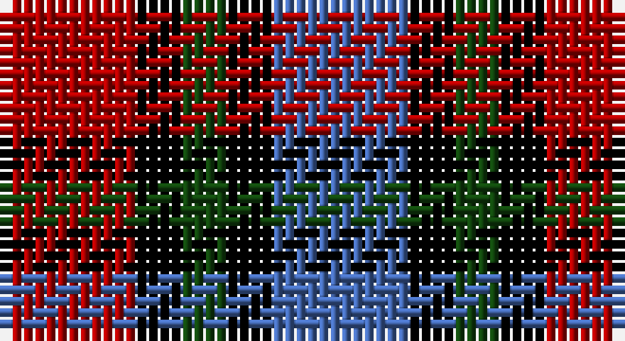

This page is one **sett** — a single exact thread-count. It belongs to the [tartan](/setts/r3k1dg1k1b3/)
(the same proportion at any scale), whose colour order is pattern [BKGKR](/stripes/bkgkr/).

Part of the [Clark,](/tartans/clark/) tartan — the named design grouping this sett with its other cloths.

Sourced from weddslist.  It is a [5 stripe tartan](/stripes/stripes5/).

Original link http://www.weddslist.com/cgi-bin/tartans/pg.pl?source=x

## Also known as

This cloth is also recorded under:

- Clark
- Clark, Red

## Thread count
DR/12 K4 DG4 K4 B/12

One full sett is **48 threads**.

## Palette

Palette: <strong>Ingles Buchan</strong> <small style="color:#888">(1 of 4 colours)</small>
<table><thead><tr><th>Colour</th><th>Threads</th><th>Shade</th><th>Base</th><th>OKLCh</th></tr></thead><tbody><tr><td>DR/</td><td style="text-align:right;font-variant-numeric:tabular-nums">12</td><td><code style="background-color:#AA0000;">#AA0000</code> <small style="color:#888">#AA0000</small></td><td>R <code style="background-color:#CC0000;">#CC0000</code></td><td><small style="color:#888">oklch(46.3% 0.190 29.2)</small></td></tr><tr><td>K</td><td style="text-align:right;font-variant-numeric:tabular-nums">4</td><td><code style="background-color:#000000;">#000000</code> <small style="color:#888">#000000</small></td><td>K <code style="background-color:#000000;">#000000</code></td><td><small style="color:#888">oklch(0.0% 0.000 0.0)</small></td></tr><tr><td>DG</td><td style="text-align:right;font-variant-numeric:tabular-nums">4</td><td><code style="background-color:#11450D;">#11450D</code> <small style="color:#888">#11450D</small></td><td>G <code style="background-color:#006100;">#006100</code></td><td><small style="color:#888">oklch(34.4% 0.101 142.1)</small></td></tr><tr><td>K</td><td style="text-align:right;font-variant-numeric:tabular-nums">4</td><td><code style="background-color:#000000;">#000000</code> <small style="color:#888">#000000</small></td><td>K <code style="background-color:#000000;">#000000</code></td><td><small style="color:#888">oklch(0.0% 0.000 0.0)</small></td></tr><tr><td>B/</td><td style="text-align:right;font-variant-numeric:tabular-nums">12</td><td><code style="background-color:#4367AE;">#4367AE</code> <small style="color:#888">#4367AE</small></td><td>B <code style="background-color:#2A418A;">#2A418A</code></td><td><small style="color:#888">oklch(52.2% 0.120 262.7)</small></td></tr></tbody></table>

# Sample pattern

## Compared to the master

This cloth is one sett of its design; the master sett (the exemplar the design is anchored on) is below for comparison.

<figure style="margin:0"><figcaption style="color:#888;font-size:smaller">this sett</figcaption></figure>
<figure style="margin:0"><figcaption style="color:#888;font-size:smaller"><a href="/setts/db13k4y4k4r13/">master sett →</a></figcaption></figure>

## Nearest tartans

The nearest existing variants by ΔTartan distance, with this tartan at the top so the swatches line up against it.

ΔTartan

Tartan

Sett

—

<a href="/ttd/edit/#slug=r3k1dg1k1b3~x4">Clark</a> <a class="nn-out" href="/variants/s5/r3k1dg1k1b3~x4/" title="open its dictionary page">↗</a>

0.00

<a href="/ttd/edit/#slug=r3k1dg1k1b3~x8&amp;base=r3k1dg1k1b3~x4">Clark</a> <a class="nn-out" href="/variants/s5/r3k1dg1k1b3~x8/" title="open its dictionary page">↗</a>

0.93

<a href="/ttd/edit/#slug=p3k3p3g6r2~x2&amp;base=r3k1dg1k1b3~x4">Austin / Wilson's No 137</a> <a class="nn-out" href="/variants/s5/p3k3p3g6r2~x2/" title="open its dictionary page">↗</a>

1.18

<a href="/ttd/edit/#slug=dp3k3dp3dg6ly2~x2&amp;base=r3k1dg1k1b3~x4">Austin (Wilson's No 173)</a> <a class="nn-out" href="/variants/s5/dp3k3dp3dg6ly2~x2/" title="open its dictionary page">↗</a>

1.20

<a href="/variants/s8/db13k4y4k4r13~x4/">Clark, Red</a>

1.27

<a href="/ttd/edit/#slug=dt6k6dt6r14ly3~x2&amp;base=r3k1dg1k1b3~x4">Chivas Regal</a> <a class="nn-out" href="/variants/s5/dt6k6dt6r14ly3~x2/" title="open its dictionary page">↗</a>

1.29

<a href="/ttd/edit/#slug=dp5k5g5w1~x4&amp;base=r3k1dg1k1b3~x4">Wilson's No.220</a> <a class="nn-out" href="/variants/s4/dp5k5g5w1~x4/" title="open its dictionary page">↗</a>

1.37

<a href="/ttd/edit/#slug=p6k5g5r1~x2&amp;base=r3k1dg1k1b3~x4">Unnamed, No 60</a> <a class="nn-out" href="/variants/s4/p6k5g5r1~x2/" title="open its dictionary page">↗</a>

1.38

<a href="/ttd/edit/#slug=w2p10k10g9k3w2~x2&amp;base=r3k1dg1k1b3~x4">MacNeil 2</a> <a class="nn-out" href="/variants/s6/w2p10k10g9k3w2~x2/" title="open its dictionary page">↗</a>

1.38

<a href="/ttd/edit/#slug=p3k3p3g6ly2~x2&amp;base=r3k1dg1k1b3~x4">Austin / Wilson's No 173</a> <a class="nn-out" href="/variants/s5/p3k3p3g6ly2~x2/" title="open its dictionary page">↗</a>

1.38

<a href="/ttd/edit/#slug=r2k4r2k4db1lb1db4r1~x4&amp;base=r3k1dg1k1b3~x4">MacKean Red (Personal)</a> <a class="nn-out" href="/variants/s8/r2k4r2k4db1lb1db4r1~x4/" title="open its dictionary page">↗</a>

## Neighbour map

Every grey dot is one of 14360 variants placed by the first two principal components of the ΔTartan feature space (44% of its variance). Red is this tartan; blue dots are its nearest — click one to open its page.

<svg viewBox="0 0 640 380" role="img" style="max-width:100%;height:auto;border:1px solid #e0e0e0;border-radius:4px;display:block" xmlns="http://www.w3.org/2000/svg"><image href="/nn/cloud.v1.png" width="640" height="380"/><a href="/variants/s5/r3k1dg1k1b3~x8/"><circle cx="100.4" cy="279.2" r="4" fill="#3465a4"><title>Clark</title></circle></a><a href="/variants/s5/p3k3p3g6r2~x2/"><circle cx="85.0" cy="295.3" r="4" fill="#3465a4"><title>Austin / Wilson's No 137</title></circle></a><a href="/variants/s5/dp3k3dp3dg6ly2~x2/"><circle cx="93.5" cy="305.8" r="4" fill="#3465a4"><title>Austin (Wilson's No 173)</title></circle></a><a href="/variants/s8/db13k4y4k4r13~x4/"><circle cx="104.8" cy="253.2" r="4" fill="#3465a4"><title>Clark, Red</title></circle></a><a href="/variants/s5/dt6k6dt6r14ly3~x2/"><circle cx="160.5" cy="269.8" r="4" fill="#3465a4"><title>Chivas Regal</title></circle></a><a href="/variants/s4/dp5k5g5w1~x4/"><circle cx="112.4" cy="293.0" r="4" fill="#3465a4"><title>Wilson's No.220</title></circle></a><a href="/variants/s4/p6k5g5r1~x2/"><circle cx="121.5" cy="275.2" r="4" fill="#3465a4"><title>Unnamed, No 60</title></circle></a><a href="/variants/s6/w2p10k10g9k3w2~x2/"><circle cx="106.7" cy="239.6" r="4" fill="#3465a4"><title>MacNeil 2</title></circle></a><a href="/variants/s5/p3k3p3g6ly2~x2/"><circle cx="71.1" cy="290.4" r="4" fill="#3465a4"><title>Austin / Wilson's No 173</title></circle></a><a href="/variants/s8/r2k4r2k4db1lb1db4r1~x4/"><circle cx="156.4" cy="254.9" r="4" fill="#3465a4"><title>MacKean Red (Personal)</title></circle></a><circle cx="100.4" cy="279.2" r="5" fill="#c00000"/></svg>

ID: /variants/s5/r3k1dg1k1b3~x4/
