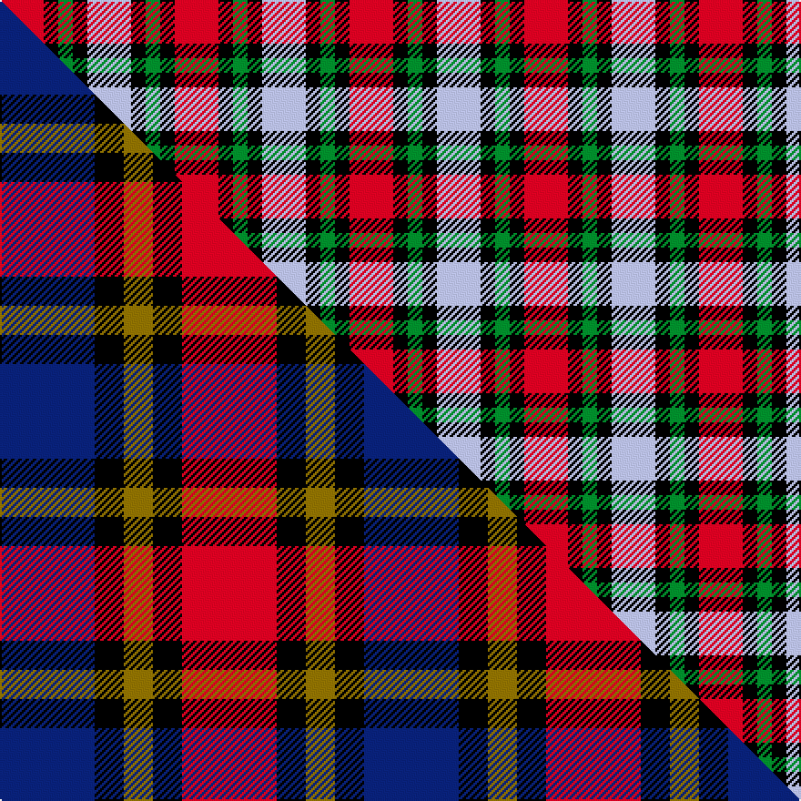

This page is one **sett** — a single exact thread-count. It belongs to the [tartan](/setts/r3k1g1k1lb3/)
(the same proportion at any scale), whose colour order is pattern [RKGKW](/stripes/rkgkw/).

Part of the [Clark](/tartans/clark/) tartan — the named design grouping this sett with its other cloths.

Sourced from weddslist.  It is a [5 stripe tartan](/stripes/stripes5/).

Original link http://www.weddslist.com/cgi-bin/tartans/pg.pl?source=tinsel

## Thread count
R/24 K8 G8 K8 LB/24

One full sett is **96 threads**.

## Palette
<table><thead><tr><th>Colour</th><th>Shade</th><th>OKLCh</th></tr></thead><tbody><tr><td>LB</td><td><code style="background-color:#B5BBDE;">#B5BBDE</code> <small style="color:#888">#B5BBDE</small></td><td><small style="color:#888">oklch(79.9% 0.050 277.6)</small></td></tr><tr><td>G</td><td><code style="background-color:#008B2A;">#008B2A</code> <small style="color:#888">#008B2A</small></td><td><small style="color:#888">oklch(55.4% 0.170 145.9)</small></td></tr><tr><td>R</td><td><code style="background-color:#D60020;">#D60020</code> <small style="color:#888">#D60020</small></td><td><small style="color:#888">oklch(55.2% 0.224 25.5)</small></td></tr><tr><td>K</td><td><code style="background-color:#000000;">#000000</code> <small style="color:#888">#000000</small></td><td><small style="color:#888">oklch(0.0% 0.000 0.0)</small></td></tr></tbody></table>

# Sample pattern

## Compared to the master

This cloth is one sett of its design; the master sett (the exemplar the design is anchored on) is below for comparison.

Its **ΔTartan distance** from the master is **0.52** — the same measure the nearest-tartans table ranks by (0 is identical; a re-scale of the same cloth is near 0, a recolour or a different proportion further).

<figure class="master-compare" style="margin:0">

this sett
master sett ★

<figcaption style="color:#888;font-size:smaller">One weave of this sett against the <a href="/setts/db13k4y4k4r13/">master sett ★</a>, split on the diagonal: a shared proportion runs seamlessly across it with only the shades shifting; a different proportion breaks on it.</figcaption>
</figure>

## Nearest tartan variants

The nearest existing variants by ΔTartan distance, with this cloth at the top so the swatches line up against it.

ΔTartan

Threads

Variant

Sett

—

96

<a href="/variants/s5/r3k1g1k1lb3~x8/">Clark</a>

<a href="/ttd/edit/#slug=r3k1g1k1lb3~x4&amp;base=r3k1g1k1lb3~x8" title="compare in the TTD">0.00</a>

48

<a href="/variants/s5/r3k1g1k1lb3~x4/">Clark</a>

<a href="/ttd/edit/#slug=db13k4y4k4r13~x4&amp;base=r3k1g1k1lb3~x8" title="compare in the TTD">0.52</a>

200

<a href="/variants/s5/db13k4y4k4r13~x4/">Clark, Red</a>

<a href="/ttd/edit/#slug=r3k1g1k1w3~x4&amp;base=r3k1g1k1lb3~x8" title="compare in the TTD">1.40</a>

48

<a href="/variants/s5/r3k1g1k1w3~x4/">Clark</a>

<a href="/ttd/edit/#slug=r9g9k10lb2~x2~r2109032&amp;base=r3k1g1k1lb3~x8" title="compare in the TTD">1.88</a>

98

<a href="/variants/s4/r9g9k10lb2~x2~r2109032/">Wilson's No.196</a>

<a href="/ttd/edit/#slug=r6g5k5lb1~x2&amp;base=r3k1g1k1lb3~x8" title="compare in the TTD">1.97</a>

54

<a href="/variants/s4/r6g5k5lb1~x2/">Unidentified No 28</a>

<a href="/ttd/edit/#slug=r25k13w8db5~x2&amp;base=r3k1g1k1lb3~x8" title="compare in the TTD">2.08</a>

144

<a href="/variants/s4/r25k13w8db5~x2/">Hamby Sport (Personal)</a>

<a href="/ttd/edit/#slug=k1db8r6g8k1~x4&amp;base=r3k1g1k1lb3~x8" title="compare in the TTD">2.13</a>

184

<a href="/variants/s5/k1db8r6g8k1~x4/">Edinburgh Military Tattoo 50th Military Tartan</a>

<a href="/ttd/edit/#slug=db13k13db13r29y4~x2&amp;base=r3k1g1k1lb3~x8" title="compare in the TTD">2.17</a>

254

<a href="/variants/s5/db13k13db13r29y4~x2/">Highland Pub Company</a>

<a href="/ttd/edit/#slug=g24k4g24k24lb7r24lb7~x2&amp;base=r3k1g1k1lb3~x8" title="compare in the TTD">2.24</a>

394

<a href="/variants/s7/g24k4g24k24lb7r24lb7~x2/">Unidentified Pinafore</a>

<a href="/ttd/edit/#slug=db2y1r4db4w2~x10&amp;base=r3k1g1k1lb3~x8" title="compare in the TTD">2.25</a>

220

<a href="/variants/s5/db2y1r4db4w2~x10/">Doohan (New South Wales), Andrew</a>

## Neighbour map

Every grey dot is one of 13620 variants placed by the first two principal components of the ΔTartan feature space (42% of its variance). Red is this tartan; blue dots are its nearest — click one to open its page.

<svg viewBox="0 0 640 380" role="img" style="max-width:100%;height:auto;border:1px solid #e0e0e0;border-radius:4px;display:block" xmlns="http://www.w3.org/2000/svg"><image href="/nn/cloud.v1.png" width="640" height="380"/><a href="/variants/s5/r3k1g1k1lb3~x4/"><circle cx="79.0" cy="266.1" r="4" fill="#3465a4"><title>Clark</title></circle></a><a href="/variants/s5/db13k4y4k4r13~x4/"><circle cx="78.4" cy="237.6" r="4" fill="#3465a4"><title>Clark, Red</title></circle></a><a href="/variants/s5/r3k1g1k1w3~x4/"><circle cx="69.5" cy="263.9" r="4" fill="#3465a4"><title>Clark</title></circle></a><a href="/variants/s4/r9g9k10lb2~x2~r2109032/"><circle cx="92.8" cy="275.5" r="4" fill="#3465a4"><title>Wilson's No.196</title></circle></a><a href="/variants/s4/r6g5k5lb1~x2/"><circle cx="110.5" cy="263.7" r="4" fill="#3465a4"><title>Unidentified No 28</title></circle></a><a href="/variants/s4/r25k13w8db5~x2/"><circle cx="169.2" cy="239.2" r="4" fill="#3465a4"><title>Hamby Sport (Personal)</title></circle></a><a href="/variants/s5/k1db8r6g8k1~x4/"><circle cx="138.2" cy="225.8" r="4" fill="#3465a4"><title>Edinburgh Military Tattoo 50th Military Tartan</title></circle></a><a href="/variants/s5/db13k13db13r29y4~x2/"><circle cx="171.2" cy="236.3" r="4" fill="#3465a4"><title>Highland Pub Company</title></circle></a><a href="/variants/s7/g24k4g24k24lb7r24lb7~x2/"><circle cx="121.8" cy="232.2" r="4" fill="#3465a4"><title>Unidentified Pinafore</title></circle></a><a href="/variants/s5/db2y1r4db4w2~x10/"><circle cx="170.4" cy="281.9" r="4" fill="#3465a4"><title>Doohan (New South Wales), Andrew</title></circle></a><circle cx="79.0" cy="266.1" r="5" fill="#c00000"/><text x="320" y="376" text-anchor="middle" font-size="11" fill="#999">ground</text><text x="11" y="190" text-anchor="middle" font-size="11" fill="#999" transform="rotate(-90 11 190)">complexity</text></svg>

ID: /variants/s5/r3k1g1k1lb3~x8/
