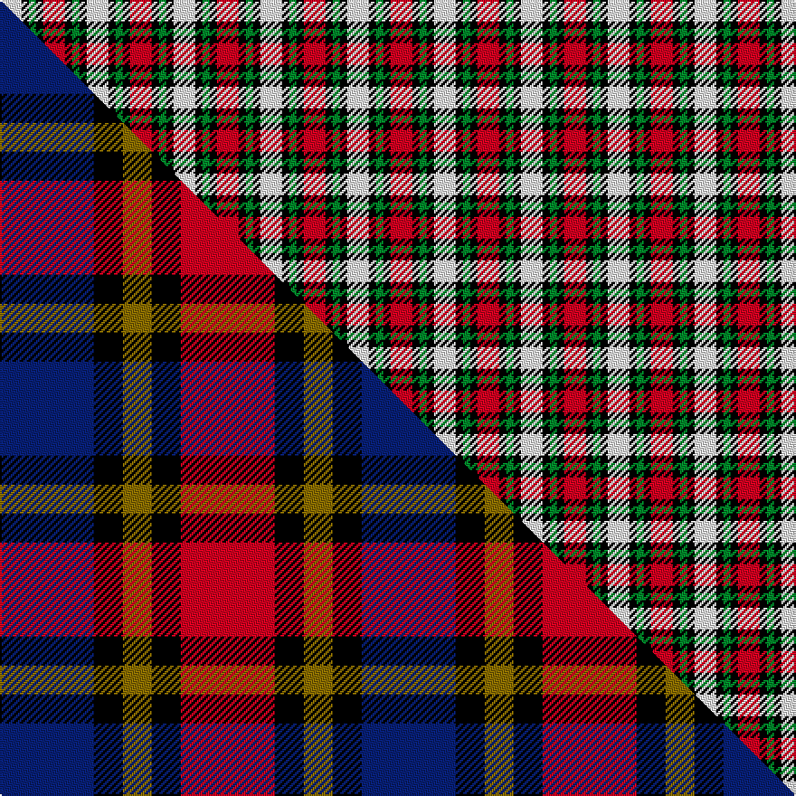

This is one **variant** — a specific cloth: this exact thread count and colourway, with its own
provenance below. It is one weaving of the [sett](/tartans/c/cl/clark-3/) (the scale-free proportion — the
same cloth at any scale or shade), whose colour order is pattern [RKGKW](/stripes/rkgkw/).

Part of the [Clark](/tartans/c/cl/clark-3/) tartan — the named design grouping this sett with its other cloths.

Sourced from weddslist.  It is a [5 stripe tartan](/stripes/stripes5/).

Original link [http://www.weddslist.com/cgi-bin/tartans/pg.pl?source=rb](http://www.weddslist.com/cgi-bin/tartans/pg.pl?source=rb)

Dataset <small>— provenance for this record, inherited from the source manifest</small>

<dl class="dataset-prov">
<dt>source</dt><dd><a href="/sources/weddslist/">Weddslist</a></dd>
<dt>data captured from</dt><dd><a href="https://github.com/thetartan/tartan-database/blob/master/data/weddslist/data.csv">https://github.com/thetartan/tartan-database/blob/master/data/weddslist/data.csv</a></dd>
<dt>data date</dt><dd>2016-11-17 <small>(dataset default)</small></dd>
<dt>licence</dt><dd><a href="https://creativecommons.org/licenses/by-nc-nd/4.0/">CC BY-NC-ND 4.0</a></dd>
</dl>

Capture chain <small>— the hands this data passed through, oldest first; each capture carries its own licence</small>

<ol class="capture-chain">
<li><a href="https://www.weddslist.com/tartans/">Weddslist</a> <small>the living privately compiled reference</small></li>
<li><a href="https://github.com/thetartan/tartan-database">thetartan/tartan-database</a> <small>2016-2017</small> · <a href="https://creativecommons.org/licenses/by-nc-nd/4.0/">CC BY-NC-ND 4.0</a> <small>Levko Kravets's frozen compilation — the capture we vendored, and where its CC licence text came from</small></li>
<li>this dictionary <small>captured 2026-06-10 · commit 5bf86c7566</small> <small>each re-capture is a git commit to data/sources</small></li>
</ol>

## Thread count
W/12 K4 G4 K4 R/12

One full sett is **48 threads**.

## Palette
<table><thead><tr><th>Colour</th><th>Shade</th><th>OKLCh</th></tr></thead><tbody><tr><td>G</td><td><code style="background-color:#008B2A;">#008B2A</code> <small style="color:#888">#008B2A</small></td><td><small style="color:#888">oklch(55.4% 0.170 145.9)</small></td></tr><tr><td>K</td><td><code style="background-color:#000000;">#000000</code> <small style="color:#888">#000000</small></td><td><small style="color:#888">oklch(0.0% 0.000 0.0)</small></td></tr><tr><td>W</td><td><code style="background-color:#F7F7F7;">#F7F7F7</code> <small style="color:#888">#F7F7F7</small></td><td><small style="color:#888">oklch(97.6% 0.000 89.9)</small></td></tr><tr><td>R</td><td><code style="background-color:#D60020;">#D60020</code> <small style="color:#888">#D60020</small></td><td><small style="color:#888">oklch(55.2% 0.224 25.5)</small></td></tr></tbody></table>

# Sample pattern

## Compared to the master

This cloth is one sett of its design; the master sett (the exemplar the design is anchored on) is below for comparison.

Its **ΔTartan distance** from the master is **1.77** — the same measure the nearest-tartans table ranks by (0 is identical; a re-scale of the same cloth is near 0, a recolour or a different proportion further).

<figure class="master-compare" style="margin:0">

this sett
master sett ★

<figcaption style="color:#888;font-size:smaller">One weave of this sett against the <a href="/setts/db13k4y4k4r13/">master sett ★</a>, split on the diagonal: a shared proportion runs seamlessly across it with only the shades shifting; a different proportion breaks on it.</figcaption>
</figure>

## Nearest tartan variants

The nearest existing variants by ΔTartan distance, with this cloth at the top so the swatches line up against it.

ΔTartan

Threads

Variant

Sett

—

48

<a href="/variants/s5/r3k1g1k1w3~x4/">Clark</a>

<a href="/ttd/edit/#slug=r3k1g1k1lb3~x8&amp;base=r3k1g1k1w3~x4" title="compare in the TTD">1.40</a>

96

<a href="/variants/s5/r3k1g1k1lb3~x8/">Clark</a>

<a href="/ttd/edit/#slug=r3k1g1k1lb3~x4&amp;base=r3k1g1k1w3~x4" title="compare in the TTD">1.40</a>

48

<a href="/variants/s5/r3k1g1k1lb3~x4/">Clark</a>

<a href="/ttd/edit/#slug=r21k21w10k10w21~x2&amp;base=r3k1g1k1w3~x4" title="compare in the TTD">1.57</a>

248

<a href="/variants/s5/r21k21w10k10w21~x2/">Havel</a>

<a href="/ttd/edit/#slug=r3g1k3w1~x20&amp;base=r3k1g1k1w3~x4" title="compare in the TTD">1.75</a>

240

<a href="/variants/s4/r3g1k3w1~x20/">SAL Glindrande Stiernan</a>

<a href="/ttd/edit/#slug=w9r23g23w9~x2&amp;base=r3k1g1k1w3~x4" title="compare in the TTD">1.82</a>

220

<a href="/variants/s4/w9r23g23w9~x2/">Quaboos Pipers Plaid Regimental Tartan</a>

<a href="/ttd/edit/#slug=r15n9w4k12r15k5~x2&amp;base=r3k1g1k1w3~x4" title="compare in the TTD">1.93</a>

200

<a href="/variants/s6/r15n9w4k12r15k5~x2/">Eastern Kentucky University</a>

<a href="/ttd/edit/#slug=n25k4w8r16~x4&amp;base=r3k1g1k1w3~x4" title="compare in the TTD">1.94</a>

260

<a href="/variants/s4/n25k4w8r16~x4/">Buckeye</a>

<a href="/ttd/edit/#slug=dr1n6k1w3k3dr1~x8&amp;base=r3k1g1k1w3~x4" title="compare in the TTD">2.02</a>

224

<a href="/variants/s6/dr1n6k1w3k3dr1~x8/">Thompson Grey Dress</a>

<a href="/ttd/edit/#slug=k7r5w3db2~x4&amp;base=r3k1g1k1w3~x4" title="compare in the TTD">2.11</a>

100

<a href="/variants/s4/k7r5w3db2~x4/">Thomas Newcomen's Combustion Engine</a>

<a href="/ttd/edit/#slug=k23t6k6r5w35r10~x2&amp;base=r3k1g1k1w3~x4" title="compare in the TTD">2.12</a>

274

<a href="/variants/s6/k23t6k6r5w35r10~x2/">Merrilees Dress (Dance)</a>

## Neighbour map

Every grey dot is one of 13656 variants placed by the first two principal components of the ΔTartan feature space (42% of its variance). Red is this tartan; blue dots are its nearest — click one to open its page. The map is a flat projection of a many-dimensional space — [how to read it](/posts/neighbourhood-maps/).

<svg viewBox="0 0 640 380" role="img" style="max-width:100%;height:auto;border:1px solid #e0e0e0;border-radius:4px;display:block" xmlns="http://www.w3.org/2000/svg"><image href="/nn/cloud.v1.png" width="640" height="380"/><a href="/variants/s5/r3k1g1k1lb3~x8/"><circle cx="79.0" cy="265.4" r="4" fill="#3465a4"><title>Clark</title></circle></a><a href="/variants/s5/r3k1g1k1lb3~x4/"><circle cx="79.0" cy="265.4" r="4" fill="#3465a4"><title>Clark</title></circle></a><a href="/variants/s5/r21k21w10k10w21~x2/"><circle cx="78.6" cy="318.0" r="4" fill="#3465a4"><title>Havel</title></circle></a><a href="/variants/s4/r3g1k3w1~x20/"><circle cx="97.3" cy="275.6" r="4" fill="#3465a4"><title>SAL Glindrande Stiernan</title></circle></a><a href="/variants/s4/w9r23g23w9~x2/"><circle cx="155.8" cy="334.4" r="4" fill="#3465a4"><title>Quaboos Pipers Plaid Regimental Tartan</title></circle></a><a href="/variants/s6/r15n9w4k12r15k5~x2/"><circle cx="150.5" cy="253.4" r="4" fill="#3465a4"><title>Eastern Kentucky University</title></circle></a><a href="/variants/s4/n25k4w8r16~x4/"><circle cx="203.0" cy="247.3" r="4" fill="#3465a4"><title>Buckeye</title></circle></a><a href="/variants/s6/dr1n6k1w3k3dr1~x8/"><circle cx="131.8" cy="218.4" r="4" fill="#3465a4"><title>Thompson Grey Dress</title></circle></a><a href="/variants/s4/k7r5w3db2~x4/"><circle cx="100.2" cy="273.8" r="4" fill="#3465a4"><title>Thomas Newcomen's Combustion Engine</title></circle></a><a href="/variants/s6/k23t6k6r5w35r10~x2/"><circle cx="141.7" cy="198.4" r="4" fill="#3465a4"><title>Merrilees Dress (Dance)</title></circle></a><circle cx="69.6" cy="263.1" r="5" fill="#c00000"/><text x="320" y="376" text-anchor="middle" font-size="11" fill="#999">ground</text><text x="11" y="190" text-anchor="middle" font-size="11" fill="#999" transform="rotate(-90 11 190)">complexity</text></svg>

ID: /variants/s5/r3k1g1k1w3~x4/
