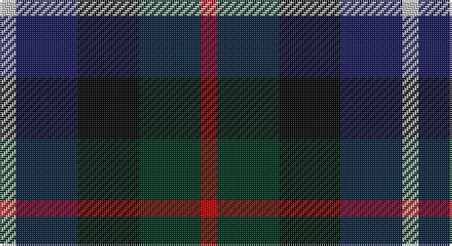

This page is one **sett** — a single exact thread-count. It belongs to the [tartan](/setts/r4dg15k15db15lb4/)
(the same proportion at any scale), whose colour order is pattern [RGKBW](/stripes/rgkbw/).

Part of the [Dalmeny](/tartans/dalmeny/) tartan — the named design grouping this sett with its other cloths.

Sourced from register-of-tartans.  It is a [5 stripe tartan](/stripes/stripes5/).

Original link https://www.tartanregister.gov.uk/tartanDetails.aspx?ref=879

## Also known as

This cloth is also recorded under:

- Dalmeny #1
- Dalmeny #2

2 attestations — the source records this cloth was collapsed from (oldest owns this page)

<ul>
<li>01/01/1840 — Dalmeny #1 (register-of-tartans, <a href="https://www.tartanregister.gov.uk/tartanDetails.aspx?ref=879">record</a>)</li>
<li>1840 — Dalmeny - 1840 (Name) (tartans-authority, <a href="http://www.tartansauthority.com/tartan-ferret/display/1480/">record</a>)</li>
</ul>

## Register references

External register numbers recorded for this tartan.

- Scottish Register of Tartans: [879](https://www.tartanregister.gov.uk/tartanDetails.aspx?ref=879)
- Scottish Tartans Authority (ITI): 1480
- Scottish Tartans World Register: 1480

## Thread count
N/8 DB30 K30 DG30 R/8

One full sett is **196 threads**.

## Palette

Palette: <strong>Tartan Register</strong>
<table><thead><tr><th>Colour</th><th>Threads</th><th>Shade</th><th>Base</th><th>OKLCh</th></tr></thead><tbody><tr><td>N/</td><td style="text-align:right;font-variant-numeric:tabular-nums">8</td><td><code style="background-color:#C0C0C0;">#C0C0C0</code> <small style="color:#888">#C0C0C0</small></td><td>W <code style="background-color:#F7F7F7;">#F7F7F7</code></td><td><small style="color:#888">oklch(80.8% 0.000 89.9)</small></td></tr><tr><td>DB</td><td style="text-align:right;font-variant-numeric:tabular-nums">30</td><td><code style="background-color:#202060;">#202060</code> <small style="color:#888">#202060</small></td><td>B <code style="background-color:#2A418A;">#2A418A</code></td><td><small style="color:#888">oklch(28.9% 0.111 276.9)</small></td></tr><tr><td>K</td><td style="text-align:right;font-variant-numeric:tabular-nums">30</td><td><code style="background-color:#101010;">#101010</code> <small style="color:#888">#101010</small></td><td>K <code style="background-color:#000000;">#000000</code></td><td><small style="color:#888">oklch(17.3% 0.000 89.9)</small></td></tr><tr><td>DG</td><td style="text-align:right;font-variant-numeric:tabular-nums">30</td><td><code style="background-color:#003820;">#003820</code> <small style="color:#888">#003820</small></td><td>G <code style="background-color:#006100;">#006100</code></td><td><small style="color:#888">oklch(30.0% 0.070 158.3)</small></td></tr><tr><td>R/</td><td style="text-align:right;font-variant-numeric:tabular-nums">8</td><td><code style="background-color:#C80000;">#C80000</code> <small style="color:#888">#C80000</small></td><td>R <code style="background-color:#CC0000;">#CC0000</code></td><td><small style="color:#888">oklch(52.3% 0.215 29.2)</small></td></tr></tbody></table>

# Sample pattern

## Compared to the master

This cloth is one sett of its design; the master sett (the exemplar the design is anchored on) is below for comparison.

<figure style="margin:0"><figcaption style="color:#888;font-size:smaller">this sett</figcaption></figure>
<figure style="margin:0"><figcaption style="color:#888;font-size:smaller"><a href="/setts/db11w2db11k4g8r1/">master sett →</a></figcaption></figure>

## Nearest tartans

The nearest existing variants by ΔTartan distance, with this tartan at the top so the swatches line up against it.

ΔTartan

Tartan

Sett

—

<a href="/ttd/edit/#slug=r4dg15k15db15lb4~x2">Dalmeny #1</a> <a class="nn-out" href="/variants/s5/r4dg15k15db15lb4~x2/" title="open its dictionary page">↗</a>

0.65

<a href="/ttd/edit/#slug=r4db14k15dg14ly4~x2&amp;base=r4dg15k15db15lb4~x2">Scots Heritage</a> <a class="nn-out" href="/variants/s5/r4db14k15dg14ly4~x2/" title="open its dictionary page">↗</a>

1.21

<a href="/ttd/edit/#slug=r2k1db6k2g6m2~x4&amp;base=r4dg15k15db15lb4~x2">MacEachain (Clan)</a> <a class="nn-out" href="/variants/s6/r2k1db6k2g6m2~x4/" title="open its dictionary page">↗</a>

1.25

<a href="/ttd/edit/#slug=k4g16k14lo3n16r4~x2&amp;base=r4dg15k15db15lb4~x2">Birse</a> <a class="nn-out" href="/variants/s6/k4g16k14lo3n16r4~x2/" title="open its dictionary page">↗</a>

1.31

<a href="/ttd/edit/#slug=dp27db4k27g27lo4~x2&amp;base=r4dg15k15db15lb4~x2">Selkirk (Personal)</a> <a class="nn-out" href="/variants/s5/dp27db4k27g27lo4~x2/" title="open its dictionary page">↗</a>

1.31

<a href="/variants/s6/o7ki20o4k18y20dp5~x2/">Williamson (Personal)</a>

1.31

<a href="/ttd/edit/#slug=k3g8k8r2db8w2~x2&amp;base=r4dg15k15db15lb4~x2">Mitchell Family Tartan</a> <a class="nn-out" href="/variants/s6/k3g8k8r2db8w2~x2/" title="open its dictionary page">↗</a>

1.32

<a href="/ttd/edit/#slug=k1g3k3db3r1~x4&amp;base=r4dg15k15db15lb4~x2">Durham District Tartan</a> <a class="nn-out" href="/variants/s5/k1g3k3db3r1~x4/" title="open its dictionary page">↗</a>

1.33

<a href="/ttd/edit/#slug=dp11y2k10g10lo2~x2&amp;base=r4dg15k15db15lb4~x2">Selkirk (Name)</a> <a class="nn-out" href="/variants/s5/dp11y2k10g10lo2~x2/" title="open its dictionary page">↗</a>

1.35

<a href="/ttd/edit/#slug=k6t2db12g8r5k2g3~x4&amp;base=r4dg15k15db15lb4~x2">Cooke (Personal)</a> <a class="nn-out" href="/variants/s7/k6t2db12g8r5k2g3~x4/" title="open its dictionary page">↗</a>

1.37

<a href="/ttd/edit/#slug=r5db8k5db24k24yi24y5~x2&amp;base=r4dg15k15db15lb4~x2">Heritage (Corporate)</a> <a class="nn-out" href="/variants/s7/r5db8k5db24k24yi24y5~x2/" title="open its dictionary page">↗</a>

## Neighbour map

Every grey dot is one of 14360 variants placed by the first two principal components of the ΔTartan feature space (44% of its variance). Red is this tartan; blue dots are its nearest — click one to open its page.

<svg viewBox="0 0 640 380" role="img" style="max-width:100%;height:auto;border:1px solid #e0e0e0;border-radius:4px;display:block" xmlns="http://www.w3.org/2000/svg"><image href="/nn/cloud.v1.png" width="640" height="380"/><a href="/variants/s5/r4db14k15dg14ly4~x2/"><circle cx="93.7" cy="291.7" r="4" fill="#3465a4"><title>Scots Heritage</title></circle></a><a href="/variants/s6/r2k1db6k2g6m2~x4/"><circle cx="118.6" cy="242.0" r="4" fill="#3465a4"><title>MacEachain (Clan)</title></circle></a><a href="/variants/s6/k4g16k14lo3n16r4~x2/"><circle cx="127.3" cy="255.8" r="4" fill="#3465a4"><title>Birse</title></circle></a><a href="/variants/s5/dp27db4k27g27lo4~x2/"><circle cx="136.0" cy="244.5" r="4" fill="#3465a4"><title>Selkirk (Personal)</title></circle></a><a href="/variants/s6/o7ki20o4k18y20dp5~x2/"><circle cx="76.8" cy="252.6" r="4" fill="#3465a4"><title>Williamson (Personal)</title></circle></a><a href="/variants/s6/k3g8k8r2db8w2~x2/"><circle cx="94.7" cy="257.5" r="4" fill="#3465a4"><title>Mitchell Family Tartan</title></circle></a><a href="/variants/s5/k1g3k3db3r1~x4/"><circle cx="130.3" cy="319.2" r="4" fill="#3465a4"><title>Durham District Tartan</title></circle></a><a href="/variants/s5/dp11y2k10g10lo2~x2/"><circle cx="111.6" cy="248.1" r="4" fill="#3465a4"><title>Selkirk (Name)</title></circle></a><a href="/variants/s7/k6t2db12g8r5k2g3~x4/"><circle cx="114.2" cy="236.5" r="4" fill="#3465a4"><title>Cooke (Personal)</title></circle></a><a href="/variants/s7/r5db8k5db24k24yi24y5~x2/"><circle cx="154.6" cy="256.1" r="4" fill="#3465a4"><title>Heritage (Corporate)</title></circle></a><circle cx="90.0" cy="287.7" r="5" fill="#c00000"/></svg>

ID: /variants/s5/r4dg15k15db15lb4~x2/
