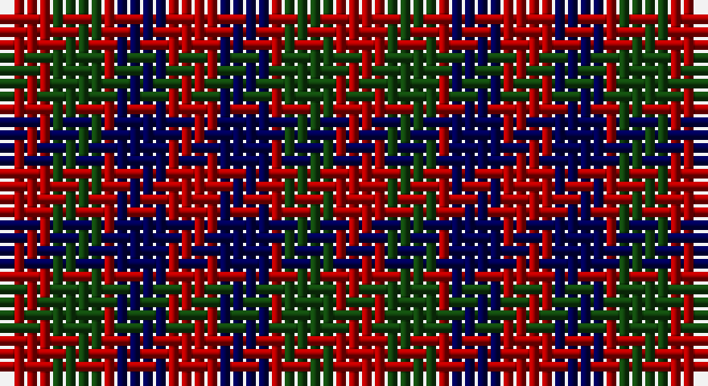

This page is one **sett** — a single exact thread-count. It belongs to the [tartan](/setts/r4dg4r1db4r4/)
(the same proportion at any scale), whose colour order is pattern [RBRGR](/stripes/rbrgr/).

Sourced from weddslist.  It is a [5 stripe tartan](/stripes/stripes5/).

Original link http://www.weddslist.com/cgi-bin/tartans/pg.pl?source=x

## Also known as

This cloth is also recorded under:

- Gow

## Thread count
DR/4 DG4 DR1 DB4 DR/4

One full sett is **26 threads**.

## Palette

Palette: <strong>custom</strong>
<table><thead><tr><th>Colour</th><th>Threads</th><th>Shade</th><th>Base</th><th>OKLCh</th></tr></thead><tbody><tr><td>DR/</td><td style="text-align:right;font-variant-numeric:tabular-nums">4</td><td><code style="background-color:#AA0000;">#AA0000</code> <small style="color:#888">#AA0000</small></td><td>R <code style="background-color:#CC0000;">#CC0000</code></td><td><small style="color:#888">oklch(46.3% 0.190 29.2)</small></td></tr><tr><td>DG</td><td style="text-align:right;font-variant-numeric:tabular-nums">4</td><td><code style="background-color:#11450D;">#11450D</code> <small style="color:#888">#11450D</small></td><td>G <code style="background-color:#006100;">#006100</code></td><td><small style="color:#888">oklch(34.4% 0.101 142.1)</small></td></tr><tr><td>DR</td><td style="text-align:right;font-variant-numeric:tabular-nums">1</td><td><code style="background-color:#AA0000;">#AA0000</code> <small style="color:#888">#AA0000</small></td><td>R <code style="background-color:#CC0000;">#CC0000</code></td><td><small style="color:#888">oklch(46.3% 0.190 29.2)</small></td></tr><tr><td>DB</td><td style="text-align:right;font-variant-numeric:tabular-nums">4</td><td><code style="background-color:#000052;">#000052</code> <small style="color:#888">#000052</small></td><td>B <code style="background-color:#2A418A;">#2A418A</code></td><td><small style="color:#888">oklch(19.8% 0.137 264.1)</small></td></tr><tr><td>DR/</td><td style="text-align:right;font-variant-numeric:tabular-nums">4</td><td><code style="background-color:#AA0000;">#AA0000</code> <small style="color:#888">#AA0000</small></td><td>R <code style="background-color:#CC0000;">#CC0000</code></td><td><small style="color:#888">oklch(46.3% 0.190 29.2)</small></td></tr></tbody></table>

# Sample pattern

## Nearest tartans

The nearest existing variants by ΔTartan distance, with this tartan at the top so the swatches line up against it.

ΔTartan

Tartan

Sett

—

<a href="/ttd/edit/#slug=r4dg4r1db4r4">Gow</a> <a class="nn-out" href="/variants/s5/r4dg4r1db4r4/" title="open its dictionary page">↗</a>

0.60

<a href="/ttd/edit/#slug=r4dg4r1db4r4~x4&amp;base=r4dg4r1db4r4">Gow</a> <a class="nn-out" href="/variants/s5/r4dg4r1db4r4~x4/" title="open its dictionary page">↗</a>

0.74

<a href="/ttd/edit/#slug=r4dg4r1db4r4~x2&amp;base=r4dg4r1db4r4">Gow</a> <a class="nn-out" href="/variants/s5/r4dg4r1db4r4~x2/" title="open its dictionary page">↗</a>

0.84

<a href="/ttd/edit/#slug=r4db4r1g4r4~x6&amp;base=r4dg4r1db4r4">MacGowan</a> <a class="nn-out" href="/variants/s5/r4db4r1g4r4~x6/" title="open its dictionary page">↗</a>

0.93

<a href="/ttd/edit/#slug=r3dg3r1db3r3~x12&amp;base=r4dg4r1db4r4">Gow (Portrait)</a> <a class="nn-out" href="/variants/s5/r3dg3r1db3r3~x12/" title="open its dictionary page">↗</a>

1.37

<a href="/ttd/edit/#slug=dg14db8dg14r14k3r14~x2&amp;base=r4dg4r1db4r4">Tulsa, City of</a> <a class="nn-out" href="/variants/s6/dg14db8dg14r14k3r14~x2/" title="open its dictionary page">↗</a>

1.47

<a href="/ttd/edit/#slug=r3k10r10g10r3~x4&amp;base=r4dg4r1db4r4">Unidentified (Gow-like)</a> <a class="nn-out" href="/variants/s5/r3k10r10g10r3~x4/" title="open its dictionary page">↗</a>

1.57

<a href="/ttd/edit/#slug=r5dg5lr1b2r5~x2&amp;base=r4dg4r1db4r4">Menzies</a> <a class="nn-out" href="/variants/s5/r5dg5lr1b2r5~x2/" title="open its dictionary page">↗</a>

1.65

<a href="/ttd/edit/#slug=r10db6k8dg10r6dg3r6~x2&amp;base=r4dg4r1db4r4">MacDuff #3</a> <a class="nn-out" href="/variants/s7/r10db6k8dg10r6dg3r6~x2/" title="open its dictionary page">↗</a>

1.73

<a href="/variants/s8/r4dg4r1db4r4~x12/">Gow</a>

1.75

<a href="/ttd/edit/#slug=r3k6dy4k6y3~x2&amp;base=r4dg4r1db4r4">Daks (Black)</a> <a class="nn-out" href="/variants/s5/r3k6dy4k6y3~x2/" title="open its dictionary page">↗</a>

## Neighbour map

Every grey dot is one of 14360 variants placed by the first two principal components of the ΔTartan feature space (44% of its variance). Red is this tartan; blue dots are its nearest — click one to open its page.

<svg viewBox="0 0 640 380" role="img" style="max-width:100%;height:auto;border:1px solid #e0e0e0;border-radius:4px;display:block" xmlns="http://www.w3.org/2000/svg"><image href="/nn/cloud.v1.png" width="640" height="380"/><a href="/variants/s5/r4dg4r1db4r4~x4/"><circle cx="244.9" cy="321.8" r="4" fill="#3465a4"><title>Gow</title></circle></a><a href="/variants/s5/r4dg4r1db4r4~x2/"><circle cx="220.1" cy="311.1" r="4" fill="#3465a4"><title>Gow</title></circle></a><a href="/variants/s5/r4db4r1g4r4~x6/"><circle cx="238.5" cy="317.3" r="4" fill="#3465a4"><title>MacGowan</title></circle></a><a href="/variants/s5/r3dg3r1db3r3~x12/"><circle cx="240.4" cy="344.0" r="4" fill="#3465a4"><title>Gow (Portrait)</title></circle></a><a href="/variants/s6/dg14db8dg14r14k3r14~x2/"><circle cx="182.0" cy="291.5" r="4" fill="#3465a4"><title>Tulsa, City of</title></circle></a><a href="/variants/s5/r3k10r10g10r3~x4/"><circle cx="178.3" cy="298.6" r="4" fill="#3465a4"><title>Unidentified (Gow-like)</title></circle></a><a href="/variants/s5/r5dg5lr1b2r5~x2/"><circle cx="274.8" cy="285.0" r="4" fill="#3465a4"><title>Menzies</title></circle></a><a href="/variants/s7/r10db6k8dg10r6dg3r6~x2/"><circle cx="135.7" cy="290.9" r="4" fill="#3465a4"><title>MacDuff #3</title></circle></a><a href="/variants/s8/r4dg4r1db4r4~x12/"><circle cx="170.5" cy="296.8" r="4" fill="#3465a4"><title>Gow</title></circle></a><a href="/variants/s5/r3k6dy4k6y3~x2/"><circle cx="184.7" cy="350.0" r="4" fill="#3465a4"><title>Daks (Black)</title></circle></a><circle cx="238.7" cy="323.9" r="5" fill="#c00000"/></svg>

ID: /variants/s5/r4dg4r1db4r4/
