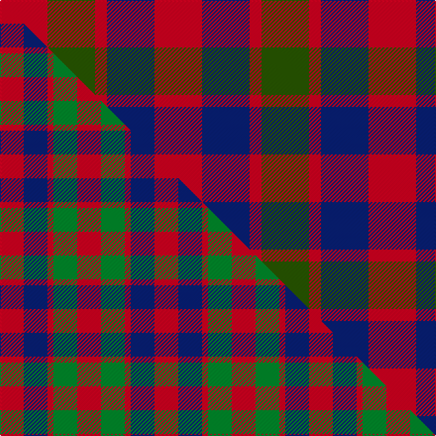

This is one **variant** — a specific cloth: this exact thread count and colourway, with its own
provenance below. It is one weaving of the [sett](/tartans/g/go/gow/) (the scale-free proportion — the
same cloth at any scale or shade), whose colour order is pattern [RBRGR](/stripes/rbrgr/).

Part of the [Gow](/tartans/g/go/gow/) tartan — the named design grouping this sett with its other cloths.

Sourced from register-of-tartans.  It is a [5 stripe tartan](/stripes/stripes5/).

Original link [https://www.tartanregister.gov.uk/tartanDetails.aspx?ref=1472](https://www.tartanregister.gov.uk/tartanDetails.aspx?ref=1472)

Dataset <small>— provenance for this record, inherited from the source manifest</small>

<dl class="dataset-prov">
<dt>source</dt><dd><a href="/sources/register-of-tartans/">Scottish Register of Tartans</a></dd>
<dt>data captured from</dt><dd><a href="https://github.com/thetartan/tartan-database/blob/master/data/register-of-tartans/data.csv">https://github.com/thetartan/tartan-database/blob/master/data/register-of-tartans/data.csv</a></dd>
<dt>data date</dt><dd>2003 <small>(this record)</small></dd>
<dt>licence</dt><dd><a href="https://www.tartanregister.gov.uk/copyright">Crown copyright</a></dd>
</dl>

Capture chain <small>— the hands this data passed through, oldest first; each capture carries its own licence</small>

<ol class="capture-chain">
<li><a href="https://www.tartanregister.gov.uk/">Scottish Register of Tartans</a> · <a href="https://www.tartanregister.gov.uk/copyright">Crown copyright</a> <small>the living register — still published by National Records of Scotland</small></li>
<li><a href="https://github.com/thetartan/tartan-database">thetartan/tartan-database</a> <small>2016-2017</small> · <a href="https://creativecommons.org/licenses/by-nc-nd/4.0/">CC BY-NC-ND 4.0</a> <small>Levko Kravets's frozen compilation — the capture we vendored, and where its CC licence text came from</small></li>
<li>this dictionary <small>captured 2026-06-10 · commit 5bf86c7566</small> <small>each re-capture is a git commit to data/sources</small></li>
</ol>

## Register references

External register numbers recorded for this tartan.

- Scottish Register of Tartans: [1472](https://www.tartanregister.gov.uk/tartanDetails.aspx?ref=1472)
- Scottish Tartans Authority (ITI): 5916

## Thread count
R/48 DG48 R12 DB48 R/48

One full sett is **312 threads**.

The source recorded this cloth as R/48 DG48 R12 DB48 R48 DB48 R12 DG/48 — 528 threads; it folds to the canonical 312-thread sett above.

## Palette
<table><thead><tr><th>Colour</th><th>Shade</th><th>OKLCh</th></tr></thead><tbody><tr><td>DB</td><td><code style="background-color:#082077;">#082077</code> <small style="color:#888">#082077</small></td><td><small style="color:#888">oklch(30.0% 0.149 265.1)</small></td></tr><tr><td>DG</td><td><code style="background-color:#003820;">#003820</code> <small style="color:#888">#003820</small></td><td><small style="color:#888">oklch(30.0% 0.070 158.3)</small></td></tr><tr><td>DG</td><td><code style="background-color:#285800;">#285800</code> <small style="color:#888">#285800</small></td><td><small style="color:#888">oklch(41.0% 0.122 135.8)</small></td></tr><tr><td>DG</td><td><code style="background-color:#006818;">#006818</code> <small style="color:#888">#006818</small></td><td><small style="color:#888">oklch(45.0% 0.142 145.0)</small></td></tr><tr><td>G</td><td><code style="background-color:#289C18;">#289C18</code> <small style="color:#888">#289C18</small></td><td><small style="color:#888">oklch(60.6% 0.191 141.6)</small></td></tr><tr><td>R</td><td><code style="background-color:#D60020;">#D60020</code> <small style="color:#888">#D60020</small></td><td><small style="color:#888">oklch(55.2% 0.224 25.5)</small></td></tr></tbody></table>

# Sample pattern

## Compared to the master

This cloth is one sett of its design; the master sett (the exemplar the design is anchored on) is below for comparison.

Its **ΔTartan distance** from the master is **0.08** — the same measure the nearest-tartans table ranks by (0 is identical; a re-scale of the same cloth is near 0, a recolour or a different proportion further).

<figure class="master-compare" style="margin:0">

this sett
master sett ★

<figcaption style="color:#888;font-size:smaller">One weave of this sett against the <a href="/setts/r4db4r1g4r4/">master sett ★</a>, split on the diagonal: a shared proportion runs seamlessly across it with only the shades shifting; a different proportion breaks on it.</figcaption>
</figure>

## Nearest tartan variants

The nearest existing variants by ΔTartan distance, with this cloth at the top so the swatches line up against it.

ΔTartan

Threads

Variant

Sett

—

528

<a href="/variants/s5/r4dg4r1db4r4~x12~dg1605139/">Gow</a>

<a href="/ttd/edit/#slug=r4dg4r1db4r4~x4&amp;base=r4dg4r1db4r4~x12~dg1605139" title="compare in the TTD">0.06</a>

104

<a href="/variants/s5/r4dg4r1db4r4~x4/">Gow Clan Tartan</a>

<a href="/ttd/edit/#slug=r4db4r1g4r4~x6&amp;base=r4dg4r1db4r4~x12~dg1605139" title="compare in the TTD">0.08</a>

156

<a href="/variants/s5/r4db4r1g4r4~x6/">MacGowan</a>

<a href="/ttd/edit/#slug=r4db4r1g4r4~x2&amp;base=r4dg4r1db4r4~x12~dg1605139" title="compare in the TTD">0.08</a>

52

<a href="/variants/s5/r4db4r1g4r4~x2/">Gow</a>

<a href="/ttd/edit/#slug=r4db4r1g4r4&amp;base=r4dg4r1db4r4~x12~dg1605139" title="compare in the TTD">0.08</a>

26

<a href="/variants/s5/r4db4r1g4r4/">Gow</a>

<a href="/ttd/edit/#slug=r3dg3r1db3r3~x12&amp;base=r4dg4r1db4r4~x12~dg1605139" title="compare in the TTD">0.35</a>

240

<a href="/variants/s5/r3dg3r1db3r3~x12/">Gow (Portrait)</a>

<a href="/ttd/edit/#slug=r5dp5r1g5r5~x8~dp1607327&amp;base=r4dg4r1db4r4~x12~dg1605139" title="compare in the TTD">1.45</a>

256

<a href="/variants/s5/r5dp5r1g5r5~x8~dp1607327/">Gow (Portrait)</a>

<a href="/ttd/edit/#slug=r1db3dr1g3dr5lb1~x4&amp;base=r4dg4r1db4r4~x12~dg1605139" title="compare in the TTD">1.63</a>

104

<a href="/variants/s6/r1db3dr1g3dr5lb1~x4/">Lanark (Fashion #1)</a>

<a href="/ttd/edit/#slug=n7r1dt6r8lb1~x8&amp;base=r4dg4r1db4r4~x12~dg1605139" title="compare in the TTD">1.97</a>

304

<a href="/variants/s5/n7r1dt6r8lb1~x8/">Callum (Buchan) (Name)</a>

<a href="/ttd/edit/#slug=dr5g6dy1g6dr5db6dr1~x2&amp;base=r4dg4r1db4r4~x12~dg1605139" title="compare in the TTD">2.04</a>

108

<a href="/variants/s7/dr5g6dy1g6dr5db6dr1~x2/">Gleneagles Group Corporate Tartan</a>

<a href="/ttd/edit/#slug=db3r2g5r8db12w3~x2&amp;base=r4dg4r1db4r4~x12~dg1605139" title="compare in the TTD">2.06</a>

120

<a href="/variants/s6/db3r2g5r8db12w3~x2/">Edinburgh Bus Company (Corporate)</a>

## Neighbour map

Every grey dot is one of 13656 variants placed by the first two principal components of the ΔTartan feature space (42% of its variance). Red is this tartan; blue dots are its nearest — click one to open its page. The map is a flat projection of a many-dimensional space — [how to read it](/posts/neighbourhood-maps/).

<svg viewBox="0 0 640 380" role="img" style="max-width:100%;height:auto;border:1px solid #e0e0e0;border-radius:4px;display:block" xmlns="http://www.w3.org/2000/svg"><image href="/nn/cloud.v1.png" width="640" height="380"/><a href="/variants/s5/r4dg4r1db4r4~x4/"><circle cx="250.2" cy="314.7" r="4" fill="#3465a4"><title>Gow Clan Tartan</title></circle></a><a href="/variants/s5/r4db4r1g4r4~x6/"><circle cx="241.8" cy="314.4" r="4" fill="#3465a4"><title>MacGowan</title></circle></a><a href="/variants/s5/r4db4r1g4r4~x2/"><circle cx="241.8" cy="314.4" r="4" fill="#3465a4"><title>Gow</title></circle></a><a href="/variants/s5/r4db4r1g4r4/"><circle cx="241.8" cy="314.4" r="4" fill="#3465a4"><title>Gow</title></circle></a><a href="/variants/s5/r3dg3r1db3r3~x12/"><circle cx="240.4" cy="332.2" r="4" fill="#3465a4"><title>Gow (Portrait)</title></circle></a><a href="/variants/s5/r5dp5r1g5r5~x8~dp1607327/"><circle cx="205.8" cy="288.2" r="4" fill="#3465a4"><title>Gow (Portrait)</title></circle></a><a href="/variants/s6/r1db3dr1g3dr5lb1~x4/"><circle cx="184.0" cy="249.4" r="4" fill="#3465a4"><title>Lanark (Fashion #1)</title></circle></a><a href="/variants/s5/n7r1dt6r8lb1~x8/"><circle cx="255.6" cy="258.8" r="4" fill="#3465a4"><title>Callum (Buchan) (Name)</title></circle></a><a href="/variants/s7/dr5g6dy1g6dr5db6dr1~x2/"><circle cx="229.1" cy="289.5" r="4" fill="#3465a4"><title>Gleneagles Group Corporate Tartan</title></circle></a><a href="/variants/s6/db3r2g5r8db12w3~x2/"><circle cx="193.7" cy="241.4" r="4" fill="#3465a4"><title>Edinburgh Bus Company (Corporate)</title></circle></a><circle cx="186.8" cy="300.5" r="5" fill="#c00000"/><text x="320" y="376" text-anchor="middle" font-size="11" fill="#999">ground</text><text x="11" y="190" text-anchor="middle" font-size="11" fill="#999" transform="rotate(-90 11 190)">complexity</text></svg>

ID: /variants/s5/r4dg4r1db4r4~x12~dg1605139/
