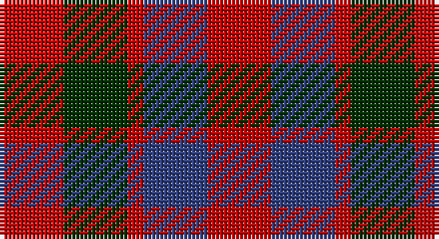

This page is one **sett** — a single exact thread-count. It belongs to the [tartan](/setts/r4dg4r1db4r4/)
(the same proportion at any scale), whose colour order is pattern [RBRGR](/stripes/rbrgr/).

Sourced from weddslist.  It is a [5 stripe tartan](/stripes/stripes5/).

Original link http://www.weddslist.com/cgi-bin/tartans/pg.pl?source=sts

## Provenance

Earliest known date: c.1815 This tartan can be seen in a portrait of Neil Gow, by Sir Henry Raeburn. Possibly the basis for the design of later tartans. The Gows or MacGowans were associated with the MacDonalds and the Clan Chattan. Gow is Gaelic for Smith meaning blacksmith.

## Also known as

This cloth is also recorded under:

- Gow

2 attestations — the source records this cloth was collapsed from (oldest owns this page)

<ul>
<li>undated — Gow (weddslist, <a href="http://www.weddslist.com/cgi-bin/tartans/pg.pl?source=sts">record</a>)</li>
<li>undated — Gow Clan Tartan (house-of-tartan, <a href="http://www.house-of-tartan.scotland.net/house/TartanViewjs.asp?colr=Def&tnam=1390">record</a>)</li>
</ul>

## Thread count
R/16 DG16 R4 B16 R/16

One full sett is **104 threads**.

## Palette

Palette: <strong>custom</strong>
<table><thead><tr><th>Colour</th><th>Threads</th><th>Shade</th><th>Base</th><th>OKLCh</th></tr></thead><tbody><tr><td>R/</td><td style="text-align:right;font-variant-numeric:tabular-nums">16</td><td><code style="background-color:#C00000;">#C00000</code> <small style="color:#888">#C00000</small></td><td>R <code style="background-color:#CC0000;">#CC0000</code></td><td><small style="color:#888">oklch(50.7% 0.208 29.2)</small></td></tr><tr><td>DG</td><td style="text-align:right;font-variant-numeric:tabular-nums">16</td><td><code style="background-color:#003000;">#003000</code> <small style="color:#888">#003000</small></td><td>G <code style="background-color:#006100;">#006100</code></td><td><small style="color:#888">oklch(26.8% 0.091 142.5)</small></td></tr><tr><td>R</td><td style="text-align:right;font-variant-numeric:tabular-nums">4</td><td><code style="background-color:#C00000;">#C00000</code> <small style="color:#888">#C00000</small></td><td>R <code style="background-color:#CC0000;">#CC0000</code></td><td><small style="color:#888">oklch(50.7% 0.208 29.2)</small></td></tr><tr><td>B</td><td style="text-align:right;font-variant-numeric:tabular-nums">16</td><td><code style="background-color:#304080;">#304080</code> <small style="color:#888">#304080</small></td><td>B <code style="background-color:#2A418A;">#2A418A</code></td><td><small style="color:#888">oklch(39.4% 0.109 270.2)</small></td></tr><tr><td>R/</td><td style="text-align:right;font-variant-numeric:tabular-nums">16</td><td><code style="background-color:#C00000;">#C00000</code> <small style="color:#888">#C00000</small></td><td>R <code style="background-color:#CC0000;">#CC0000</code></td><td><small style="color:#888">oklch(50.7% 0.208 29.2)</small></td></tr></tbody></table>

# Sample pattern

## Nearest tartans

The nearest existing variants by ΔTartan distance, with this tartan at the top so the swatches line up against it.

ΔTartan

Tartan

Sett

—

<a href="/ttd/edit/#slug=r4dg4r1db4r4~x4">Gow</a> <a class="nn-out" href="/variants/s5/r4dg4r1db4r4~x4/" title="open its dictionary page">↗</a>

0.39

<a href="/ttd/edit/#slug=r4db4r1g4r4~x6&amp;base=r4dg4r1db4r4~x4">MacGowan</a> <a class="nn-out" href="/variants/s5/r4db4r1g4r4~x6/" title="open its dictionary page">↗</a>

0.60

<a href="/ttd/edit/#slug=r4dg4r1db4r4&amp;base=r4dg4r1db4r4~x4">Gow</a> <a class="nn-out" href="/variants/s5/r4dg4r1db4r4/" title="open its dictionary page">↗</a>

0.63

<a href="/ttd/edit/#slug=r3dg3r1db3r3~x12&amp;base=r4dg4r1db4r4~x4">Gow (Portrait)</a> <a class="nn-out" href="/variants/s5/r3dg3r1db3r3~x12/" title="open its dictionary page">↗</a>

0.88

<a href="/ttd/edit/#slug=r4dg4r1db4r4~x2&amp;base=r4dg4r1db4r4~x4">Gow</a> <a class="nn-out" href="/variants/s5/r4dg4r1db4r4~x2/" title="open its dictionary page">↗</a>

1.33

<a href="/ttd/edit/#slug=r5dg5lr1b2r5~x2&amp;base=r4dg4r1db4r4~x4">Menzies</a> <a class="nn-out" href="/variants/s5/r5dg5lr1b2r5~x2/" title="open its dictionary page">↗</a>

1.47

<a href="/ttd/edit/#slug=dg14db8dg14r14k3r14~x2&amp;base=r4dg4r1db4r4~x4">Tulsa, City of</a> <a class="nn-out" href="/variants/s6/dg14db8dg14r14k3r14~x2/" title="open its dictionary page">↗</a>

1.65

<a href="/ttd/edit/#slug=r10db6k8dg10r6dg3r6~x2&amp;base=r4dg4r1db4r4~x4">MacDuff #3</a> <a class="nn-out" href="/variants/s7/r10db6k8dg10r6dg3r6~x2/" title="open its dictionary page">↗</a>

1.70

<a href="/ttd/edit/#slug=r3k10r10g10r3~x4&amp;base=r4dg4r1db4r4~x4">Unidentified (Gow-like)</a> <a class="nn-out" href="/variants/s5/r3k10r10g10r3~x4/" title="open its dictionary page">↗</a>

1.72

<a href="/ttd/edit/#slug=g12r11dp12ri3dp8g8dp8~x2&amp;base=r4dg4r1db4r4~x4">Fiddes (Corrected)</a> <a class="nn-out" href="/variants/s7/g12r11dp12ri3dp8g8dp8~x2/" title="open its dictionary page">↗</a>

1.74

<a href="/variants/s8/r4dg4r1db4r4~x12/">Gow</a>

## Neighbour map

Every grey dot is one of 14360 variants placed by the first two principal components of the ΔTartan feature space (44% of its variance). Red is this tartan; blue dots are its nearest — click one to open its page.

<svg viewBox="0 0 640 380" role="img" style="max-width:100%;height:auto;border:1px solid #e0e0e0;border-radius:4px;display:block" xmlns="http://www.w3.org/2000/svg"><image href="/nn/cloud.v1.png" width="640" height="380"/><a href="/variants/s5/r4db4r1g4r4~x6/"><circle cx="238.5" cy="317.3" r="4" fill="#3465a4"><title>MacGowan</title></circle></a><a href="/variants/s5/r4dg4r1db4r4/"><circle cx="238.7" cy="323.9" r="4" fill="#3465a4"><title>Gow</title></circle></a><a href="/variants/s5/r3dg3r1db3r3~x12/"><circle cx="240.4" cy="344.0" r="4" fill="#3465a4"><title>Gow (Portrait)</title></circle></a><a href="/variants/s5/r4dg4r1db4r4~x2/"><circle cx="220.1" cy="311.1" r="4" fill="#3465a4"><title>Gow</title></circle></a><a href="/variants/s5/r5dg5lr1b2r5~x2/"><circle cx="274.8" cy="285.0" r="4" fill="#3465a4"><title>Menzies</title></circle></a><a href="/variants/s6/dg14db8dg14r14k3r14~x2/"><circle cx="182.0" cy="291.5" r="4" fill="#3465a4"><title>Tulsa, City of</title></circle></a><a href="/variants/s7/r10db6k8dg10r6dg3r6~x2/"><circle cx="135.7" cy="290.9" r="4" fill="#3465a4"><title>MacDuff #3</title></circle></a><a href="/variants/s5/r3k10r10g10r3~x4/"><circle cx="178.3" cy="298.6" r="4" fill="#3465a4"><title>Unidentified (Gow-like)</title></circle></a><a href="/variants/s7/g12r11dp12ri3dp8g8dp8~x2/"><circle cx="149.6" cy="282.5" r="4" fill="#3465a4"><title>Fiddes (Corrected)</title></circle></a><a href="/variants/s8/r4dg4r1db4r4~x12/"><circle cx="170.5" cy="296.8" r="4" fill="#3465a4"><title>Gow</title></circle></a><circle cx="244.9" cy="321.8" r="5" fill="#c00000"/></svg>

ID: /variants/s5/r4dg4r1db4r4~x4/
