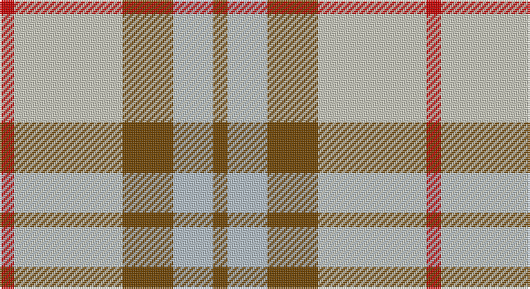

This page is one **sett** — a single exact thread-count. It belongs to the [tartan](/setts/r4lbi30y14lb11y4/)
(the same proportion at any scale), whose colour order is pattern [GWGWR](/stripes/gwgwr/).

Part of the [Trinity Bicycles](/tartans/trinity-bicycles/) tartan — the named design grouping this sett with its other cloths.

Sourced from tartans-authority.  It is a [5 stripe tartan](/stripes/stripes5/).

Original link http://www.tartansauthority.com/tartan-ferret/display/10177/

## Register references

External register numbers recorded for this tartan.

- Scottish Register of Tartans: [10177](https://www.tartanregister.gov.uk/tartanDetails?ref=10177)
- Scottish Tartans Authority (ITI): 10177

## Thread count
R/8 N60 T28 Na22 T/8

One full sett is **236 threads**.

## Palette

Palette: <strong>Tartan Register</strong> <small style="color:#888">(1 of 4 colours)</small>
<table><thead><tr><th>Colour</th><th>Threads</th><th>Shade</th><th>Base</th><th>OKLCh</th></tr></thead><tbody><tr><td>R/</td><td style="text-align:right;font-variant-numeric:tabular-nums">8</td><td><code style="background-color:#C80000;">#C80000</code> <small style="color:#888">#C80000</small></td><td>R <code style="background-color:#CC0000;">#CC0000</code></td><td><small style="color:#888">oklch(52.3% 0.215 29.2)</small></td></tr><tr><td>N</td><td style="text-align:right;font-variant-numeric:tabular-nums">60</td><td><code style="background-color:#C8C8BC;">#C8C8BC</code> <small style="color:#888">#C8C8BC</small></td><td>W <code style="background-color:#F7F7F7;">#F7F7F7</code></td><td><small style="color:#888">oklch(82.9% 0.016 106.8)</small></td></tr><tr><td>T</td><td style="text-align:right;font-variant-numeric:tabular-nums">28</td><td><code style="background-color:#704400;">#704400</code> <small style="color:#888">#704400</small></td><td>G <code style="background-color:#006100;">#006100</code></td><td><small style="color:#888">oklch(42.8% 0.094 68.6)</small></td></tr><tr><td>Na</td><td style="text-align:right;font-variant-numeric:tabular-nums">22</td><td><code style="background-color:#B4C0C8;">#B4C0C8</code> <small style="color:#888">#B4C0C8</small></td><td>W <code style="background-color:#F7F7F7;">#F7F7F7</code></td><td><small style="color:#888">oklch(80.1% 0.017 236.8)</small></td></tr><tr><td>T/</td><td style="text-align:right;font-variant-numeric:tabular-nums">8</td><td><code style="background-color:#704400;">#704400</code> <small style="color:#888">#704400</small></td><td>G <code style="background-color:#006100;">#006100</code></td><td><small style="color:#888">oklch(42.8% 0.094 68.6)</small></td></tr></tbody></table>

# Sample pattern

## Compared to the master

This cloth is one sett of its design; the master sett (the exemplar the design is anchored on) is below for comparison.

<figure style="margin:0"><figcaption style="color:#888;font-size:smaller">this sett</figcaption></figure>
<figure style="margin:0"><figcaption style="color:#888;font-size:smaller"><a href="/setts/dy4lg11dy14o30r4/">master sett →</a></figcaption></figure>

## Nearest tartans

The nearest existing variants by ΔTartan distance, with this tartan at the top so the swatches line up against it.

ΔTartan

Tartan

Sett

—

<a href="/ttd/edit/#slug=r4lbi30y14lb11y4~x2">Trinity Bicycles (Corporate)</a> <a class="nn-out" href="/variants/s5/r4lbi30y14lb11y4~x2/" title="open its dictionary page">↗</a>

1.10

<a href="/ttd/edit/#slug=n2w2ly7o14n2w2~x2&amp;base=r4lbi30y14lb11y4~x2">Cairngorm</a> <a class="nn-out" href="/variants/s6/n2w2ly7o14n2w2~x2/" title="open its dictionary page">↗</a>

1.14

<a href="/ttd/edit/#slug=ly15r9t30w3db4~x2&amp;base=r4lbi30y14lb11y4~x2">S.I.D.E. (Corporate)</a> <a class="nn-out" href="/variants/s5/ly15r9t30w3db4~x2/" title="open its dictionary page">↗</a>

1.23

<a href="/ttd/edit/#slug=r12dt2ly2lb2dt4lb3~x2&amp;base=r4lbi30y14lb11y4~x2">Winnipeg Embroiders' Guild (Corp.)</a> <a class="nn-out" href="/variants/s6/r12dt2ly2lb2dt4lb3~x2/" title="open its dictionary page">↗</a>

1.27

<a href="/ttd/edit/#slug=dy5r5lb11r1dy1~x4&amp;base=r4lbi30y14lb11y4~x2">O'Connor Dress</a> <a class="nn-out" href="/variants/s5/dy5r5lb11r1dy1~x4/" title="open its dictionary page">↗</a>

1.31

<a href="/ttd/edit/#slug=k4t28r6w12r12w3~x2&amp;base=r4lbi30y14lb11y4~x2">Thompson, D.C. (Personal)</a> <a class="nn-out" href="/variants/s6/k4t28r6w12r12w3~x2/" title="open its dictionary page">↗</a>

1.41

<a href="/ttd/edit/#slug=o22ly10w3db8~x2&amp;base=r4lbi30y14lb11y4~x2">Louisburg</a> <a class="nn-out" href="/variants/s4/o22ly10w3db8~x2/" title="open its dictionary page">↗</a>

1.47

<a href="/ttd/edit/#slug=n10w3lr3g1r1~x10&amp;base=r4lbi30y14lb11y4~x2">Bagpipe Shop (Switzerland)</a> <a class="nn-out" href="/variants/s5/n10w3lr3g1r1~x10/" title="open its dictionary page">↗</a>

1.48

<a href="/ttd/edit/#slug=g4lo7r9lo9b20w2b2~x2&amp;base=r4lbi30y14lb11y4~x2">Tombow 140th Anniversary, The</a> <a class="nn-out" href="/variants/s7/g4lo7r9lo9b20w2b2~x2/" title="open its dictionary page">↗</a>

1.51

<a href="/ttd/edit/#slug=o25k4w8r16~x4&amp;base=r4lbi30y14lb11y4~x2">Buckeye</a> <a class="nn-out" href="/variants/s4/o25k4w8r16~x4/" title="open its dictionary page">↗</a>

1.53

<a href="/ttd/edit/#slug=r4lyi1r3ly1lyi8ly2~x4&amp;base=r4lbi30y14lb11y4~x2">Buchele Check (Fashion?)</a> <a class="nn-out" href="/variants/s6/r4lyi1r3ly1lyi8ly2~x4/" title="open its dictionary page">↗</a>

## Neighbour map

Every grey dot is one of 14360 variants placed by the first two principal components of the ΔTartan feature space (44% of its variance). Red is this tartan; blue dots are its nearest — click one to open its page.

<svg viewBox="0 0 640 380" role="img" style="max-width:100%;height:auto;border:1px solid #e0e0e0;border-radius:4px;display:block" xmlns="http://www.w3.org/2000/svg"><image href="/nn/cloud.v1.png" width="640" height="380"/><a href="/variants/s6/n2w2ly7o14n2w2~x2/"><circle cx="250.8" cy="212.3" r="4" fill="#3465a4"><title>Cairngorm</title></circle></a><a href="/variants/s5/ly15r9t30w3db4~x2/"><circle cx="230.0" cy="193.7" r="4" fill="#3465a4"><title>S.I.D.E. (Corporate)</title></circle></a><a href="/variants/s6/r12dt2ly2lb2dt4lb3~x2/"><circle cx="220.6" cy="202.6" r="4" fill="#3465a4"><title>Winnipeg Embroiders' Guild (Corp.)</title></circle></a><a href="/variants/s5/dy5r5lb11r1dy1~x4/"><circle cx="272.2" cy="218.6" r="4" fill="#3465a4"><title>O'Connor Dress</title></circle></a><a href="/variants/s6/k4t28r6w12r12w3~x2/"><circle cx="203.0" cy="196.3" r="4" fill="#3465a4"><title>Thompson, D.C. (Personal)</title></circle></a><a href="/variants/s4/o22ly10w3db8~x2/"><circle cx="218.7" cy="236.7" r="4" fill="#3465a4"><title>Louisburg</title></circle></a><a href="/variants/s5/n10w3lr3g1r1~x10/"><circle cx="277.0" cy="188.8" r="4" fill="#3465a4"><title>Bagpipe Shop (Switzerland)</title></circle></a><a href="/variants/s7/g4lo7r9lo9b20w2b2~x2/"><circle cx="181.7" cy="182.6" r="4" fill="#3465a4"><title>Tombow 140th Anniversary, The</title></circle></a><a href="/variants/s4/o25k4w8r16~x4/"><circle cx="204.4" cy="242.1" r="4" fill="#3465a4"><title>Buckeye</title></circle></a><a href="/variants/s6/r4lyi1r3ly1lyi8ly2~x4/"><circle cx="259.3" cy="217.0" r="4" fill="#3465a4"><title>Buchele Check (Fashion?)</title></circle></a><circle cx="233.7" cy="221.6" r="5" fill="#c00000"/></svg>

ID: /variants/s5/r4lbi30y14lb11y4~x2/
