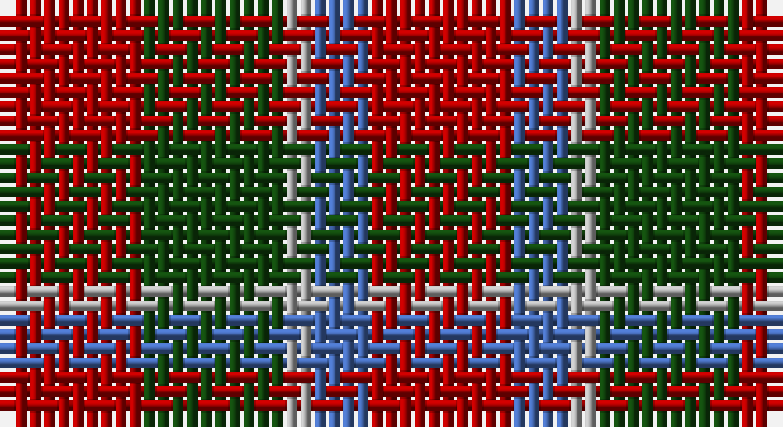

This page is one **sett** — a single exact thread-count. It belongs to the [tartan](/setts/r5dg5lr1b2r5/)
(the same proportion at any scale), whose colour order is pattern [RBYGR](/stripes/rbygr/).

Part of the [Menzies](/tartans/menzies/) tartan — the named design grouping this sett with its other cloths.

Sourced from weddslist.  It is a [5 stripe tartan](/stripes/stripes5/).

Original link http://www.weddslist.com/cgi-bin/tartans/pg.pl?source=tinsel

## Also known as

This cloth is also recorded under:

- Menzies #3
- Menzies 1938
- Menzies B/W
- Menzies Green
- Menzies, Green

2 attestations — the source records this cloth was collapsed from (oldest owns this page)

<ul>
<li>undated — Menzies (weddslist, <a href="http://www.weddslist.com/cgi-bin/tartans/pg.pl?source=tinsel">record</a>)</li>
<li>undated — Menzies (weddslist, <a href="http://www.weddslist.com/cgi-bin/tartans/pg.pl?source=x">record</a>)</li>
</ul>

## Thread count
DR/10 DG10 N2 B4 DR/10

One full sett is **52 threads**.

## Palette

Palette: <strong>custom</strong>
<table><thead><tr><th>Colour</th><th>Threads</th><th>Shade</th><th>Base</th><th>OKLCh</th></tr></thead><tbody><tr><td>DR/</td><td style="text-align:right;font-variant-numeric:tabular-nums">10</td><td><code style="background-color:#AA0000;">#AA0000</code> <small style="color:#888">#AA0000</small></td><td>R <code style="background-color:#CC0000;">#CC0000</code></td><td><small style="color:#888">oklch(46.3% 0.190 29.2)</small></td></tr><tr><td>DG</td><td style="text-align:right;font-variant-numeric:tabular-nums">10</td><td><code style="background-color:#11450D;">#11450D</code> <small style="color:#888">#11450D</small></td><td>G <code style="background-color:#006100;">#006100</code></td><td><small style="color:#888">oklch(34.4% 0.101 142.1)</small></td></tr><tr><td>N</td><td style="text-align:right;font-variant-numeric:tabular-nums">2</td><td><code style="background-color:#AAAAAA;">#AAAAAA</code> <small style="color:#888">#AAAAAA</small></td><td>Y <code style="background-color:#F2BF00;">#F2BF00</code></td><td><small style="color:#888">oklch(73.8% 0.000 89.9)</small></td></tr><tr><td>B</td><td style="text-align:right;font-variant-numeric:tabular-nums">4</td><td><code style="background-color:#4367AE;">#4367AE</code> <small style="color:#888">#4367AE</small></td><td>B <code style="background-color:#2A418A;">#2A418A</code></td><td><small style="color:#888">oklch(52.2% 0.120 262.7)</small></td></tr><tr><td>DR/</td><td style="text-align:right;font-variant-numeric:tabular-nums">10</td><td><code style="background-color:#AA0000;">#AA0000</code> <small style="color:#888">#AA0000</small></td><td>R <code style="background-color:#CC0000;">#CC0000</code></td><td><small style="color:#888">oklch(46.3% 0.190 29.2)</small></td></tr></tbody></table>

# Sample pattern

## Compared to the master

This cloth is one sett of its design; the master sett (the exemplar the design is anchored on) is below for comparison.

<figure style="margin:0"><figcaption style="color:#888;font-size:smaller">this sett</figcaption></figure>
<figure style="margin:0"><figcaption style="color:#888;font-size:smaller"><a href="/setts/k19dg10k6dg10k12dg6k4dg14/">master sett →</a></figcaption></figure>

## Nearest tartans

The nearest existing variants by ΔTartan distance, with this tartan at the top so the swatches line up against it.

ΔTartan

Tartan

Sett

—

<a href="/ttd/edit/#slug=r5dg5lr1b2r5~x2">Menzies</a> <a class="nn-out" href="/variants/s5/r5dg5lr1b2r5~x2/" title="open its dictionary page">↗</a>

1.27

<a href="/ttd/edit/#slug=r6g1r6db1g3k3g3~x4&amp;base=r5dg5lr1b2r5~x2">MacTavish</a> <a class="nn-out" href="/variants/s7/r6g1r6db1g3k3g3~x4/" title="open its dictionary page">↗</a>

1.33

<a href="/ttd/edit/#slug=r4dg4r1db4r4~x4&amp;base=r5dg5lr1b2r5~x2">Gow</a> <a class="nn-out" href="/variants/s5/r4dg4r1db4r4~x4/" title="open its dictionary page">↗</a>

1.35

<a href="/ttd/edit/#slug=r4db4r1g4r4~x6&amp;base=r5dg5lr1b2r5~x2">MacGowan</a> <a class="nn-out" href="/variants/s5/r4db4r1g4r4~x6/" title="open its dictionary page">↗</a>

1.38

<a href="/ttd/edit/#slug=k13r40o13oi8~x2&amp;base=r5dg5lr1b2r5~x2">Maryville College</a> <a class="nn-out" href="/variants/s4/k13r40o13oi8~x2/" title="open its dictionary page">↗</a>

1.41

<a href="/ttd/edit/#slug=r8db3k4g6r4k1r4~x4&amp;base=r5dg5lr1b2r5~x2">MacDuff Clan Tartan</a> <a class="nn-out" href="/variants/s7/r8db3k4g6r4k1r4~x4/" title="open its dictionary page">↗</a>

1.42

<a href="/ttd/edit/#slug=r6dg13k5r20w3~x2&amp;base=r5dg5lr1b2r5~x2">Ryutokukan Junior High School</a> <a class="nn-out" href="/variants/s5/r6dg13k5r20w3~x2/" title="open its dictionary page">↗</a>

1.57

<a href="/ttd/edit/#slug=r4dg4r1db4r4&amp;base=r5dg5lr1b2r5~x2">Gow</a> <a class="nn-out" href="/variants/s5/r4dg4r1db4r4/" title="open its dictionary page">↗</a>

1.58

<a href="/ttd/edit/#slug=dg14db8dg14r14k3r14~x2&amp;base=r5dg5lr1b2r5~x2">Tulsa, City of</a> <a class="nn-out" href="/variants/s6/dg14db8dg14r14k3r14~x2/" title="open its dictionary page">↗</a>

1.60

<a href="/ttd/edit/#slug=r3dg3r1db3r3~x12&amp;base=r5dg5lr1b2r5~x2">Gow (Portrait)</a> <a class="nn-out" href="/variants/s5/r3dg3r1db3r3~x12/" title="open its dictionary page">↗</a>

1.61

<a href="/ttd/edit/#slug=r8t3k4dg6r4k1r4~x2&amp;base=r5dg5lr1b2r5~x2">MacDuff #5</a> <a class="nn-out" href="/variants/s7/r8t3k4dg6r4k1r4~x2/" title="open its dictionary page">↗</a>

## Neighbour map

Every grey dot is one of 14360 variants placed by the first two principal components of the ΔTartan feature space (44% of its variance). Red is this tartan; blue dots are its nearest — click one to open its page.

<svg viewBox="0 0 640 380" role="img" style="max-width:100%;height:auto;border:1px solid #e0e0e0;border-radius:4px;display:block" xmlns="http://www.w3.org/2000/svg"><image href="/nn/cloud.v1.png" width="640" height="380"/><a href="/variants/s7/r6g1r6db1g3k3g3~x4/"><circle cx="246.2" cy="241.3" r="4" fill="#3465a4"><title>MacTavish</title></circle></a><a href="/variants/s5/r4dg4r1db4r4~x4/"><circle cx="244.9" cy="321.8" r="4" fill="#3465a4"><title>Gow</title></circle></a><a href="/variants/s5/r4db4r1g4r4~x6/"><circle cx="238.5" cy="317.3" r="4" fill="#3465a4"><title>MacGowan</title></circle></a><a href="/variants/s4/k13r40o13oi8~x2/"><circle cx="276.1" cy="262.3" r="4" fill="#3465a4"><title>Maryville College</title></circle></a><a href="/variants/s7/r8db3k4g6r4k1r4~x4/"><circle cx="239.1" cy="240.6" r="4" fill="#3465a4"><title>MacDuff Clan Tartan</title></circle></a><a href="/variants/s5/r6dg13k5r20w3~x2/"><circle cx="280.0" cy="247.4" r="4" fill="#3465a4"><title>Ryutokukan Junior High School</title></circle></a><a href="/variants/s5/r4dg4r1db4r4/"><circle cx="238.7" cy="323.9" r="4" fill="#3465a4"><title>Gow</title></circle></a><a href="/variants/s6/dg14db8dg14r14k3r14~x2/"><circle cx="182.0" cy="291.5" r="4" fill="#3465a4"><title>Tulsa, City of</title></circle></a><a href="/variants/s5/r3dg3r1db3r3~x12/"><circle cx="240.4" cy="344.0" r="4" fill="#3465a4"><title>Gow (Portrait)</title></circle></a><a href="/variants/s7/r8t3k4dg6r4k1r4~x2/"><circle cx="230.9" cy="233.9" r="4" fill="#3465a4"><title>MacDuff #5</title></circle></a><circle cx="274.8" cy="285.0" r="5" fill="#c00000"/></svg>

ID: /variants/s5/r5dg5lr1b2r5~x2/
