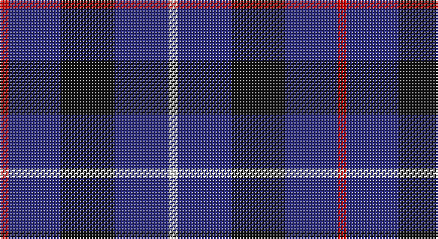

This page is one **sett** — a single exact thread-count. It belongs to the [tartan](/setts/r6db35k36db36w6/)
(the same proportion at any scale), whose colour order is pattern [RBKBW](/stripes/rbkbw/).

Part of the [Davidson of Tulloch](/tartans/davidson-of-tulloch/) tartan — the named design grouping this sett with its other cloths.

Sourced from house-of-tartan.  It is a [5 stripe tartan](/stripes/stripes5/).

Original link http://www.house-of-tartan.scotland.net/house/TartanViewjs.asp?colr=Def&tnam=1360

## Provenance

Earliest known date: 1984 The Davidsons or Clan Dhai maintained a constant battle for precedence within Clan Chattan. The Davidsons of Tulloch in Ross-shire are one of the main branches of the Davidson family.

## Also known as

This cloth is also recorded under:

- Davidson
- Davidson of Tulloch #2

## Thread count
R/6 DB35 K36 DB36 LN/6

One full sett is **226 threads**.

## Palette

Palette: <strong>Tartan Register</strong>
<table><thead><tr><th>Colour</th><th>Threads</th><th>Shade</th><th>Base</th><th>OKLCh</th></tr></thead><tbody><tr><td>R/</td><td style="text-align:right;font-variant-numeric:tabular-nums">6</td><td><code style="background-color:#C80000;">#C80000</code> <small style="color:#888">#C80000</small></td><td>R <code style="background-color:#CC0000;">#CC0000</code></td><td><small style="color:#888">oklch(52.3% 0.215 29.2)</small></td></tr><tr><td>DB</td><td style="text-align:right;font-variant-numeric:tabular-nums">35</td><td><code style="background-color:#2C2C80;">#2C2C80</code> <small style="color:#888">#2C2C80</small></td><td>B <code style="background-color:#2A418A;">#2A418A</code></td><td><small style="color:#888">oklch(35.0% 0.138 276.6)</small></td></tr><tr><td>K</td><td style="text-align:right;font-variant-numeric:tabular-nums">36</td><td><code style="background-color:#101010;">#101010</code> <small style="color:#888">#101010</small></td><td>K <code style="background-color:#000000;">#000000</code></td><td><small style="color:#888">oklch(17.3% 0.000 89.9)</small></td></tr><tr><td>DB</td><td style="text-align:right;font-variant-numeric:tabular-nums">36</td><td><code style="background-color:#2C2C80;">#2C2C80</code> <small style="color:#888">#2C2C80</small></td><td>B <code style="background-color:#2A418A;">#2A418A</code></td><td><small style="color:#888">oklch(35.0% 0.138 276.6)</small></td></tr><tr><td>LN/</td><td style="text-align:right;font-variant-numeric:tabular-nums">6</td><td><code style="background-color:#E0E0E0;">#E0E0E0</code> <small style="color:#888">#E0E0E0</small></td><td>W <code style="background-color:#F7F7F7;">#F7F7F7</code></td><td><small style="color:#888">oklch(90.7% 0.000 89.9)</small></td></tr></tbody></table>

# Sample pattern

## Compared to the master

This cloth is one sett of its design; the master sett (the exemplar the design is anchored on) is below for comparison.

<figure style="margin:0"><figcaption style="color:#888;font-size:smaller">this sett</figcaption></figure>
<figure style="margin:0"><figcaption style="color:#888;font-size:smaller"><a href="/setts/r1db6k3dg6w1/">master sett →</a></figcaption></figure>

## Nearest tartans

The nearest existing variants by ΔTartan distance, with this tartan at the top so the swatches line up against it.

ΔTartan

Tartan

Sett

—

<a href="/ttd/edit/#slug=r6db35k36db36w6">Davidson of Tulloch Clan Tartan</a> <a class="nn-out" href="/variants/s5/r6db35k36db36w6/" title="open its dictionary page">↗</a>

1.12

<a href="/ttd/edit/#slug=lo1db6k5db6lb1~x6&amp;base=r6db35k36db36w6">Bank of Scotland (1995)</a> <a class="nn-out" href="/variants/s5/lo1db6k5db6lb1~x6/" title="open its dictionary page">↗</a>

1.26

<a href="/ttd/edit/#slug=r1db9k4lb1~x4&amp;base=r6db35k36db36w6">Scottish Nuclear (Corporate)</a> <a class="nn-out" href="/variants/s4/r1db9k4lb1~x4/" title="open its dictionary page">↗</a>

1.28

<a href="/ttd/edit/#slug=k15lo2k10db18lb3~x2&amp;base=r6db35k36db36w6">College of Radiographers</a> <a class="nn-out" href="/variants/s5/k15lo2k10db18lb3~x2/" title="open its dictionary page">↗</a>

1.29

<a href="/ttd/edit/#slug=r21db43dt86lb10&amp;base=r6db35k36db36w6">Fong (Personal)</a> <a class="nn-out" href="/variants/s4/r21db43dt86lb10/" title="open its dictionary page">↗</a>

1.29

<a href="/ttd/edit/#slug=db9k4lb1k4db9r1~x4&amp;base=r6db35k36db36w6">Scottish Nuclear</a> <a class="nn-out" href="/variants/s6/db9k4lb1k4db9r1~x4/" title="open its dictionary page">↗</a>

1.33

<a href="/ttd/edit/#slug=k1db7k4lb1k4p1~x4&amp;base=r6db35k36db36w6">Scottish Express International</a> <a class="nn-out" href="/variants/s6/k1db7k4lb1k4p1~x4/" title="open its dictionary page">↗</a>

1.36

<a href="/ttd/edit/#slug=w1db6dy5k1db6ly1~x4&amp;base=r6db35k36db36w6">Ancient Atlantic</a> <a class="nn-out" href="/variants/s6/w1db6dy5k1db6ly1~x4/" title="open its dictionary page">↗</a>

1.38

<a href="/ttd/edit/#slug=k14r4k25db30w4~x2&amp;base=r6db35k36db36w6">Britannia</a> <a class="nn-out" href="/variants/s5/k14r4k25db30w4~x2/" title="open its dictionary page">↗</a>

1.39

<a href="/ttd/edit/#slug=k15ly2k10db18w3~x2&amp;base=r6db35k36db36w6">College of Radiographers Corporate Tartan</a> <a class="nn-out" href="/variants/s5/k15ly2k10db18w3~x2/" title="open its dictionary page">↗</a>

1.40

<a href="/ttd/edit/#slug=lo4db23k4g16db23lb4&amp;base=r6db35k36db36w6">Baptist Union of Scotland</a> <a class="nn-out" href="/variants/s6/lo4db23k4g16db23lb4/" title="open its dictionary page">↗</a>

## Neighbour map

Every grey dot is one of 14360 variants placed by the first two principal components of the ΔTartan feature space (44% of its variance). Red is this tartan; blue dots are its nearest — click one to open its page.

<svg viewBox="0 0 640 380" role="img" style="max-width:100%;height:auto;border:1px solid #e0e0e0;border-radius:4px;display:block" xmlns="http://www.w3.org/2000/svg"><image href="/nn/cloud.v1.png" width="640" height="380"/><a href="/variants/s5/lo1db6k5db6lb1~x6/"><circle cx="295.8" cy="264.2" r="4" fill="#3465a4"><title>Bank of Scotland (1995)</title></circle></a><a href="/variants/s4/r1db9k4lb1~x4/"><circle cx="346.3" cy="244.6" r="4" fill="#3465a4"><title>Scottish Nuclear (Corporate)</title></circle></a><a href="/variants/s5/k15lo2k10db18lb3~x2/"><circle cx="273.6" cy="254.0" r="4" fill="#3465a4"><title>College of Radiographers</title></circle></a><a href="/variants/s4/r21db43dt86lb10/"><circle cx="291.7" cy="258.7" r="4" fill="#3465a4"><title>Fong (Personal)</title></circle></a><a href="/variants/s6/db9k4lb1k4db9r1~x4/"><circle cx="382.0" cy="258.2" r="4" fill="#3465a4"><title>Scottish Nuclear</title></circle></a><a href="/variants/s6/k1db7k4lb1k4p1~x4/"><circle cx="285.6" cy="258.2" r="4" fill="#3465a4"><title>Scottish Express International</title></circle></a><a href="/variants/s6/w1db6dy5k1db6ly1~x4/"><circle cx="271.4" cy="230.4" r="4" fill="#3465a4"><title>Ancient Atlantic</title></circle></a><a href="/variants/s5/k14r4k25db30w4~x2/"><circle cx="285.4" cy="263.8" r="4" fill="#3465a4"><title>Britannia</title></circle></a><a href="/variants/s5/k15ly2k10db18w3~x2/"><circle cx="267.1" cy="245.9" r="4" fill="#3465a4"><title>College of Radiographers Corporate Tartan</title></circle></a><a href="/variants/s6/lo4db23k4g16db23lb4/"><circle cx="274.4" cy="236.1" r="4" fill="#3465a4"><title>Baptist Union of Scotland</title></circle></a><circle cx="305.4" cy="275.2" r="5" fill="#c00000"/></svg>

ID: /variants/s5/r6db35k36db36w6/
