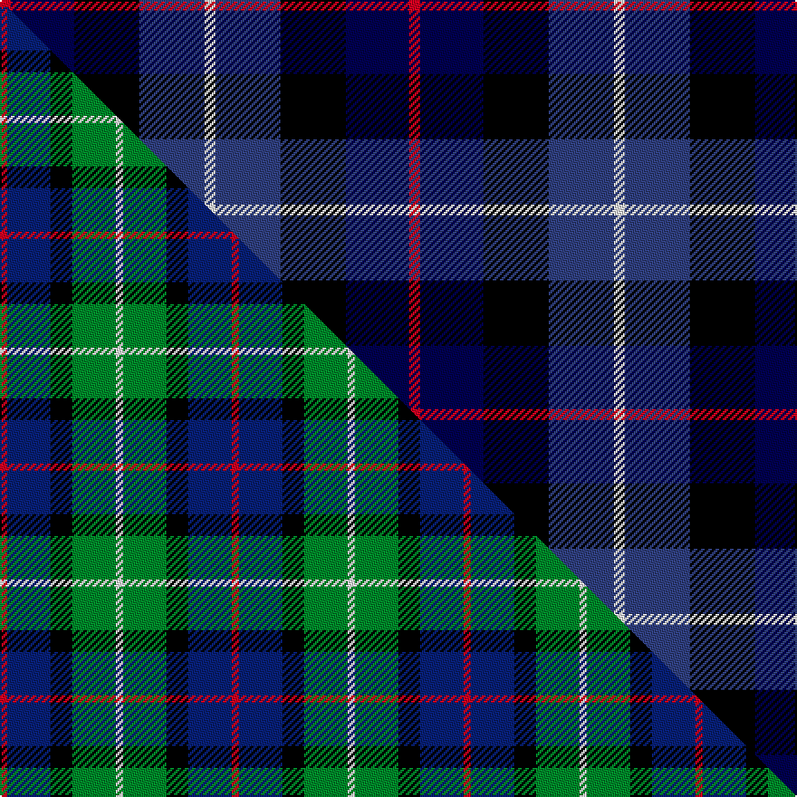

This is one **variant** — a specific cloth: this exact thread count and colourway, with its own
provenance below. It is one weaving of the [sett](/setts/r6db35k36dbi36w6/) (the scale-free proportion — the
same cloth at any scale or shade), whose colour order is pattern [RBKBW](/stripes/rbkbw/).

Part of the [Davidson of Tulloch](/tartans/davidson-of-tulloch/) tartan — the named design grouping this sett with its other cloths.

Sourced from weddslist.  It is a [5 stripe tartan](/stripes/stripes5/).

Original link [http://www.weddslist.com/cgi-bin/tartans/pg.pl?source=sts](http://www.weddslist.com/cgi-bin/tartans/pg.pl?source=sts)

Dataset <small>— provenance for this record, inherited from the source manifest</small>

<dl class="dataset-prov">
<dt>source</dt><dd><a href="/sources/weddslist/">Weddslist</a></dd>
<dt>data captured from</dt><dd><a href="https://github.com/thetartan/tartan-database/blob/master/data/weddslist/data.csv">https://github.com/thetartan/tartan-database/blob/master/data/weddslist/data.csv</a></dd>
<dt>data date</dt><dd>2016-11-17 <small>(dataset default)</small></dd>
<dt>licence</dt><dd><a href="https://creativecommons.org/licenses/by-nc-nd/4.0/">CC BY-NC-ND 4.0</a></dd>
</dl>

Capture chain <small>— the hands this data passed through, oldest first; each capture carries its own licence</small>

<ol class="capture-chain">
<li><a href="https://www.weddslist.com/tartans/">Weddslist</a> <small>the living privately compiled reference</small></li>
<li><a href="https://github.com/thetartan/tartan-database">thetartan/tartan-database</a> <small>2016-2017</small> · <a href="https://creativecommons.org/licenses/by-nc-nd/4.0/">CC BY-NC-ND 4.0</a> <small>Levko Kravets's frozen compilation — the capture we vendored, and where its CC licence text came from</small></li>
<li>this dictionary <small>captured 2026-06-10 · commit 5bf86c7566</small> <small>each re-capture is a git commit to data/sources</small></li>
</ol>

## Thread count
R/6 DB35 K36 DBi36 W/6

One full sett is **226 threads**.

## Palette
<table><thead><tr><th>Colour</th><th>Shade</th><th>OKLCh</th></tr></thead><tbody><tr><td>DB</td><td><code style="background-color:#304080;">#304080</code> <small style="color:#888">#304080</small></td><td><small style="color:#888">oklch(39.4% 0.109 270.2)</small></td></tr><tr><td>DB</td><td><code style="background-color:#000050;">#000050</code> <small style="color:#888">#000050</small></td><td><small style="color:#888">oklch(19.5% 0.135 264.1)</small></td></tr><tr><td>K</td><td><code style="background-color:#000000;">#000000</code> <small style="color:#888">#000000</small></td><td><small style="color:#888">oklch(0.0% 0.000 0.0)</small></td></tr><tr><td>W</td><td><code style="background-color:#F7F7F7;">#F7F7F7</code> <small style="color:#888">#F7F7F7</small></td><td><small style="color:#888">oklch(97.6% 0.000 89.9)</small></td></tr><tr><td>R</td><td><code style="background-color:#D60020;">#D60020</code> <small style="color:#888">#D60020</small></td><td><small style="color:#888">oklch(55.2% 0.224 25.5)</small></td></tr></tbody></table>

# Sample pattern

## Compared to the master

This cloth is one sett of its design; the master sett (the exemplar the design is anchored on) is below for comparison.

Its **ΔTartan distance** from the master is **1.68** — the same measure the nearest-tartans table ranks by (0 is identical; a re-scale of the same cloth is near 0, a recolour or a different proportion further).

<figure class="master-compare" style="margin:0">

this sett
master sett ★

<figcaption style="color:#888;font-size:smaller">One weave of this sett against the <a href="/setts/r1db6k3g6w1/">master sett ★</a>, split on the diagonal: a shared proportion runs seamlessly across it with only the shades shifting; a different proportion breaks on it.</figcaption>
</figure>

## Nearest tartan variants

The nearest existing variants by ΔTartan distance, with this cloth at the top so the swatches line up against it.

ΔTartan

Threads

Variant

Sett

—

226

<a href="/variants/s5/r6db35k36dbi36w6~db0805267-dbi1604274/">Davidson of Tulloch</a>

<a href="/ttd/edit/#slug=r2db16k11b19y2~x2&amp;base=r6db35k36dbi36w6~db0805267-dbi1604274" title="compare in the TTD">0.81</a>

192

<a href="/variants/s5/r2db16k11b19y2~x2/">Sanix Modern</a>

<a href="/ttd/edit/#slug=r1db7k7g7w1~x6&amp;base=r6db35k36dbi36w6~db0805267-dbi1604274" title="compare in the TTD">1.39</a>

264

<a href="/variants/s5/r1db7k7g7w1~x6/">Davidson of Tulloch (Clan)</a>

<a href="/ttd/edit/#slug=k19db18w9r3~x4&amp;base=r6db35k36dbi36w6~db0805267-dbi1604274" title="compare in the TTD">1.73</a>

304

<a href="/variants/s4/k19db18w9r3~x4/">Raven (Fashion)</a>

<a href="/ttd/edit/#slug=r2b3n12k11dg11y2~x2~n2003284-dg1304144&amp;base=r6db35k36dbi36w6~db0805267-dbi1604274" title="compare in the TTD">1.90</a>

156

<a href="/variants/s6/r2b3n12k11dg11y2~x2~n2003284-dg1304144/">Huntly Gordon</a>

<a href="/ttd/edit/#slug=r2db12k7g8lb2~x4&amp;base=r6db35k36dbi36w6~db0805267-dbi1604274" title="compare in the TTD">1.96</a>

232

<a href="/variants/s5/r2db12k7g8lb2~x4/">Forbo Nairn</a>

<a href="/ttd/edit/#slug=lb11dbi19db38r7k7~x2~dbi1208266-db1003265&amp;base=r6db35k36dbi36w6~db0805267-dbi1604274" title="compare in the TTD">2.06</a>

292

<a href="/variants/s5/lb11dbi19db38r7k7~x2~dbi1208266-db1003265/">Rose, Danny and Hanna (Personal)</a>

<a href="/ttd/edit/#slug=r4dg15k15db15lb4~x2&amp;base=r6db35k36dbi36w6~db0805267-dbi1604274" title="compare in the TTD">2.23</a>

196

<a href="/variants/s5/r4dg15k15db15lb4~x2/">Dalmeny #1</a>

<a href="/ttd/edit/#slug=db1r1db6k6g6w1~x2&amp;base=r6db35k36dbi36w6~db0805267-dbi1604274" title="compare in the TTD">2.32</a>

80

<a href="/variants/s6/db1r1db6k6g6w1~x2/">Wellington</a>

<a href="/ttd/edit/#slug=r7db20r4k18g20dp5~x2&amp;base=r6db35k36dbi36w6~db0805267-dbi1604274" title="compare in the TTD">2.35</a>

272

<a href="/variants/s6/r7db20r4k18g20dp5~x2/">Williamson (Personal)</a>

<a href="/ttd/edit/#slug=b4dg25k24w3db24w4~x2&amp;base=r6db35k36dbi36w6~db0805267-dbi1604274" title="compare in the TTD">2.45</a>

320

<a href="/variants/s6/b4dg25k24w3db24w4~x2/">Herd</a>

## Neighbour map

Every grey dot is one of 13621 variants placed by the first two principal components of the ΔTartan feature space (42% of its variance). Red is this tartan; blue dots are its nearest — click one to open its page.

<svg viewBox="0 0 640 380" role="img" style="max-width:100%;height:auto;border:1px solid #e0e0e0;border-radius:4px;display:block" xmlns="http://www.w3.org/2000/svg"><image href="/nn/cloud.v1.png" width="640" height="380"/><a href="/variants/s5/r2db16k11b19y2~x2/"><circle cx="163.0" cy="210.3" r="4" fill="#3465a4"><title>Sanix Modern</title></circle></a><a href="/variants/s5/r1db7k7g7w1~x6/"><circle cx="91.4" cy="223.7" r="4" fill="#3465a4"><title>Davidson of Tulloch (Clan)</title></circle></a><a href="/variants/s4/k19db18w9r3~x4/"><circle cx="126.9" cy="248.4" r="4" fill="#3465a4"><title>Raven (Fashion)</title></circle></a><a href="/variants/s6/r2b3n12k11dg11y2~x2~n2003284-dg1304144/"><circle cx="76.3" cy="211.3" r="4" fill="#3465a4"><title>Huntly Gordon</title></circle></a><a href="/variants/s5/r2db12k7g8lb2~x4/"><circle cx="114.9" cy="231.4" r="4" fill="#3465a4"><title>Forbo Nairn</title></circle></a><a href="/variants/s5/lb11dbi19db38r7k7~x2~dbi1208266-db1003265/"><circle cx="169.2" cy="223.4" r="4" fill="#3465a4"><title>Rose, Danny and Hanna (Personal)</title></circle></a><a href="/variants/s5/r4dg15k15db15lb4~x2/"><circle cx="66.1" cy="265.2" r="4" fill="#3465a4"><title>Dalmeny #1</title></circle></a><a href="/variants/s6/db1r1db6k6g6w1~x2/"><circle cx="96.8" cy="213.7" r="4" fill="#3465a4"><title>Wellington</title></circle></a><a href="/variants/s6/r7db20r4k18g20dp5~x2/"><circle cx="52.1" cy="234.2" r="4" fill="#3465a4"><title>Williamson (Personal)</title></circle></a><a href="/variants/s6/b4dg25k24w3db24w4~x2/"><circle cx="102.3" cy="201.8" r="4" fill="#3465a4"><title>Herd</title></circle></a><circle cx="105.2" cy="235.4" r="5" fill="#c00000"/><text x="320" y="376" text-anchor="middle" font-size="11" fill="#999">ground</text><text x="11" y="190" text-anchor="middle" font-size="11" fill="#999" transform="rotate(-90 11 190)">complexity</text></svg>

ID: /variants/s5/r6db35k36dbi36w6~db0805267-dbi1604274/
