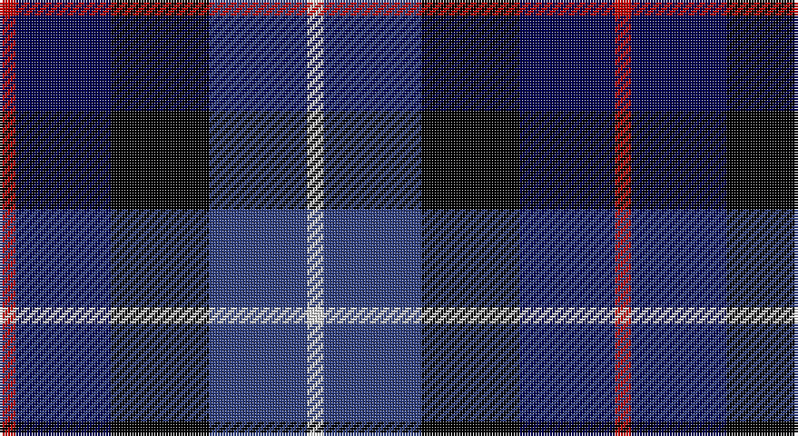

This page is one **sett** — a single exact thread-count. It belongs to the [tartan](/setts/r6dbi35k36db36w6/)
(the same proportion at any scale), whose colour order is pattern [RBKBW](/stripes/rbkbw/).

Part of the [Davidson of Tulloch](/tartans/davidson-of-tulloch/) tartan — the named design grouping this sett with its other cloths.

Sourced from weddslist.  It is a [5 stripe tartan](/stripes/stripes5/).

Original link http://www.weddslist.com/cgi-bin/tartans/pg.pl?source=sts

## Also known as

This cloth is also recorded under:

- Davidson
- Davidson of Tulloch #2

## Thread count
R/6 DB35 K36 B36 LN/6

One full sett is **226 threads**.

## Palette

Palette: <strong>Tartan Register</strong> <small style="color:#888">(2 of 5 colours)</small>
<table><thead><tr><th>Colour</th><th>Threads</th><th>Shade</th><th>Base</th><th>OKLCh</th></tr></thead><tbody><tr><td>R/</td><td style="text-align:right;font-variant-numeric:tabular-nums">6</td><td><code style="background-color:#C00000;">#C00000</code> <small style="color:#888">#C00000</small></td><td>R <code style="background-color:#CC0000;">#CC0000</code></td><td><small style="color:#888">oklch(50.7% 0.208 29.2)</small></td></tr><tr><td>DB</td><td style="text-align:right;font-variant-numeric:tabular-nums">35</td><td><code style="background-color:#000050;">#000050</code> <small style="color:#888">#000050</small></td><td>B <code style="background-color:#2A418A;">#2A418A</code></td><td><small style="color:#888">oklch(19.5% 0.135 264.1)</small></td></tr><tr><td>K</td><td style="text-align:right;font-variant-numeric:tabular-nums">36</td><td><code style="background-color:#000000;">#000000</code> <small style="color:#888">#000000</small></td><td>K <code style="background-color:#000000;">#000000</code></td><td><small style="color:#888">oklch(0.0% 0.000 0.0)</small></td></tr><tr><td>B</td><td style="text-align:right;font-variant-numeric:tabular-nums">36</td><td><code style="background-color:#304080;">#304080</code> <small style="color:#888">#304080</small></td><td>B <code style="background-color:#2A418A;">#2A418A</code></td><td><small style="color:#888">oklch(39.4% 0.109 270.2)</small></td></tr><tr><td>LN/</td><td style="text-align:right;font-variant-numeric:tabular-nums">6</td><td><code style="background-color:#E0E0E0;">#E0E0E0</code> <small style="color:#888">#E0E0E0</small></td><td>W <code style="background-color:#F7F7F7;">#F7F7F7</code></td><td><small style="color:#888">oklch(90.7% 0.000 89.9)</small></td></tr></tbody></table>

# Sample pattern

## Compared to the master

This cloth is one sett of its design; the master sett (the exemplar the design is anchored on) is below for comparison.

<figure style="margin:0"><figcaption style="color:#888;font-size:smaller">this sett</figcaption></figure>
<figure style="margin:0"><figcaption style="color:#888;font-size:smaller"><a href="/setts/r1db6k3dg6w1/">master sett →</a></figcaption></figure>

## Nearest tartans

The nearest existing variants by ΔTartan distance, with this tartan at the top so the swatches line up against it.

ΔTartan

Tartan

Sett

—

<a href="/ttd/edit/#slug=r6dbi35k36db36w6">Davidson of Tulloch</a> <a class="nn-out" href="/variants/s5/r6dbi35k36db36w6/" title="open its dictionary page">↗</a>

1.19

<a href="/ttd/edit/#slug=m3db17dt13m2k20w2~x2&amp;base=r6dbi35k36db36w6">Commonwealth Games</a> <a class="nn-out" href="/variants/s6/m3db17dt13m2k20w2~x2/" title="open its dictionary page">↗</a>

1.33

<a href="/ttd/edit/#slug=r1db6k3dg6lr1~x2&amp;base=r6dbi35k36db36w6">Davidson of Tulloch</a> <a class="nn-out" href="/variants/s5/r1db6k3dg6lr1~x2/" title="open its dictionary page">↗</a>

1.36

<a href="/ttd/edit/#slug=dp4dg25k24w3db24w4~x2&amp;base=r6dbi35k36db36w6">Herd</a> <a class="nn-out" href="/variants/s6/dp4dg25k24w3db24w4~x2/" title="open its dictionary page">↗</a>

1.36

<a href="/ttd/edit/#slug=t3k3db17k20g20dp8p3~x2&amp;base=r6dbi35k36db36w6">Gracey (2013)</a> <a class="nn-out" href="/variants/s7/t3k3db17k20g20dp8p3~x2/" title="open its dictionary page">↗</a>

1.37

<a href="/ttd/edit/#slug=k4b2dg8db8lr1~x2&amp;base=r6dbi35k36db36w6">Dougles Green</a> <a class="nn-out" href="/variants/s5/k4b2dg8db8lr1~x2/" title="open its dictionary page">↗</a>

1.37

<a href="/ttd/edit/#slug=k4b2dg8db8lr1&amp;base=r6dbi35k36db36w6">Dougles Green</a> <a class="nn-out" href="/variants/s5/k4b2dg8db8lr1/" title="open its dictionary page">↗</a>

1.39

<a href="/ttd/edit/#slug=lr3db14k12dg12k2ly3~x2&amp;base=r6dbi35k36db36w6">MacNiel of Barra</a> <a class="nn-out" href="/variants/s6/lr3db14k12dg12k2ly3~x2/" title="open its dictionary page">↗</a>

1.39

<a href="/ttd/edit/#slug=lr3db14k12dg12k2ly3&amp;base=r6dbi35k36db36w6">MacNiel of Barra</a> <a class="nn-out" href="/variants/s6/lr3db14k12dg12k2ly3/" title="open its dictionary page">↗</a>

1.39

<a href="/ttd/edit/#slug=ly5dbi24k8db18ly6o3&amp;base=r6dbi35k36db36w6">CALA Homes</a> <a class="nn-out" href="/variants/s6/ly5dbi24k8db18ly6o3/" title="open its dictionary page">↗</a>

1.40

<a href="/ttd/edit/#slug=r2db8k8lb1dg8k1&amp;base=r6dbi35k36db36w6">Leslie Hunting</a> <a class="nn-out" href="/variants/s6/r2db8k8lb1dg8k1/" title="open its dictionary page">↗</a>

## Neighbour map

Every grey dot is one of 14360 variants placed by the first two principal components of the ΔTartan feature space (44% of its variance). Red is this tartan; blue dots are its nearest — click one to open its page.

<svg viewBox="0 0 640 380" role="img" style="max-width:100%;height:auto;border:1px solid #e0e0e0;border-radius:4px;display:block" xmlns="http://www.w3.org/2000/svg"><image href="/nn/cloud.v1.png" width="640" height="380"/><a href="/variants/s6/m3db17dt13m2k20w2~x2/"><circle cx="143.2" cy="201.6" r="4" fill="#3465a4"><title>Commonwealth Games</title></circle></a><a href="/variants/s5/r1db6k3dg6lr1~x2/"><circle cx="140.3" cy="250.6" r="4" fill="#3465a4"><title>Davidson of Tulloch</title></circle></a><a href="/variants/s6/dp4dg25k24w3db24w4~x2/"><circle cx="116.0" cy="218.7" r="4" fill="#3465a4"><title>Herd</title></circle></a><a href="/variants/s7/t3k3db17k20g20dp8p3~x2/"><circle cx="84.5" cy="206.1" r="4" fill="#3465a4"><title>Gracey (2013)</title></circle></a><a href="/variants/s5/k4b2dg8db8lr1~x2/"><circle cx="147.2" cy="246.3" r="4" fill="#3465a4"><title>Dougles Green</title></circle></a><a href="/variants/s5/k4b2dg8db8lr1/"><circle cx="147.2" cy="246.3" r="4" fill="#3465a4"><title>Dougles Green</title></circle></a><a href="/variants/s6/lr3db14k12dg12k2ly3~x2/"><circle cx="100.5" cy="229.9" r="4" fill="#3465a4"><title>MacNiel of Barra</title></circle></a><a href="/variants/s6/lr3db14k12dg12k2ly3/"><circle cx="100.5" cy="229.9" r="4" fill="#3465a4"><title>MacNiel of Barra</title></circle></a><a href="/variants/s6/ly5dbi24k8db18ly6o3/"><circle cx="123.0" cy="206.0" r="4" fill="#3465a4"><title>CALA Homes</title></circle></a><a href="/variants/s6/r2db8k8lb1dg8k1/"><circle cx="125.0" cy="220.4" r="4" fill="#3465a4"><title>Leslie Hunting</title></circle></a><circle cx="103.7" cy="247.8" r="5" fill="#c00000"/></svg>

ID: /variants/s5/r6dbi35k36db36w6/
