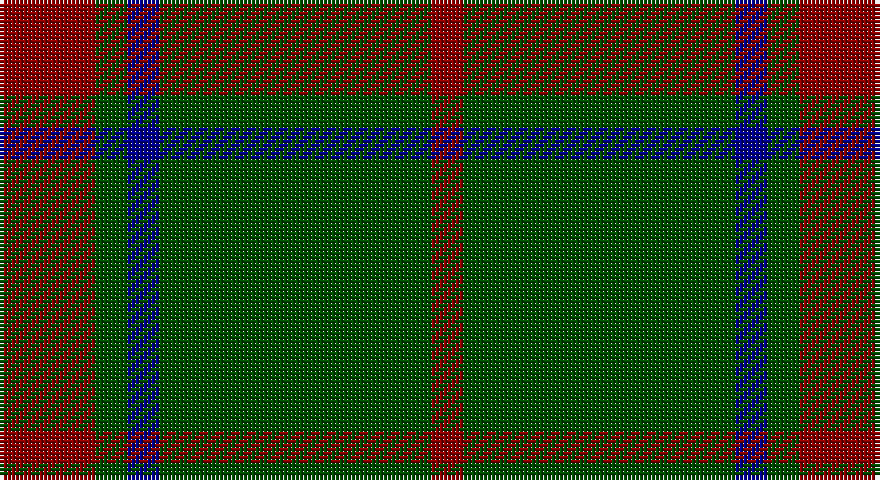

This page is one **sett** — a single exact thread-count. It belongs to the [tartan](/setts/r6dg2db2dg17r2/)
(the same proportion at any scale), whose colour order is pattern [RGBGR](/stripes/rgbgr/).

Sourced from register-of-tartans.  It is a [5 stripe tartan](/stripes/stripes5/).

Original link https://www.tartanregister.gov.uk/tartanDetails.aspx?ref=2226

2 attestations — the source records this cloth was collapsed from (oldest owns this page)

<ul>
<li>01/01/2002 — Loton (Personal) (register-of-tartans, <a href="https://www.tartanregister.gov.uk/tartanDetails.aspx?ref=2226">record</a>)</li>
<li>pre 2002 — Loton (Personal) (tartans-authority, <a href="http://www.tartansauthority.com/tartan-ferret/display/5498/">record</a>)</li>
</ul>

## Register references

External register numbers recorded for this tartan.

- Scottish Register of Tartans: [2226](https://www.tartanregister.gov.uk/tartanDetails.aspx?ref=2226)
- Scottish Tartans Authority (ITI): 5498

## Thread count
DR/24 G8 DB8 G68 DR/8

One full sett is **200 threads**.

## Palette

Palette: <strong>Tartan Register</strong>
<table><thead><tr><th>Colour</th><th>Threads</th><th>Shade</th><th>Base</th><th>OKLCh</th></tr></thead><tbody><tr><td>DR/</td><td style="text-align:right;font-variant-numeric:tabular-nums">24</td><td><code style="background-color:#880000;">#880000</code> <small style="color:#888">#880000</small></td><td>R <code style="background-color:#CC0000;">#CC0000</code></td><td><small style="color:#888">oklch(39.4% 0.162 29.2)</small></td></tr><tr><td>G</td><td style="text-align:right;font-variant-numeric:tabular-nums">8</td><td><code style="background-color:#004C00;">#004C00</code> <small style="color:#888">#004C00</small></td><td>G <code style="background-color:#006100;">#006100</code></td><td><small style="color:#888">oklch(36.1% 0.123 142.5)</small></td></tr><tr><td>DB</td><td style="text-align:right;font-variant-numeric:tabular-nums">8</td><td><code style="background-color:#00008C;">#00008C</code> <small style="color:#888">#00008C</small></td><td>B <code style="background-color:#2A418A;">#2A418A</code></td><td><small style="color:#888">oklch(28.9% 0.200 264.1)</small></td></tr><tr><td>G</td><td style="text-align:right;font-variant-numeric:tabular-nums">68</td><td><code style="background-color:#004C00;">#004C00</code> <small style="color:#888">#004C00</small></td><td>G <code style="background-color:#006100;">#006100</code></td><td><small style="color:#888">oklch(36.1% 0.123 142.5)</small></td></tr><tr><td>DR/</td><td style="text-align:right;font-variant-numeric:tabular-nums">8</td><td><code style="background-color:#880000;">#880000</code> <small style="color:#888">#880000</small></td><td>R <code style="background-color:#CC0000;">#CC0000</code></td><td><small style="color:#888">oklch(39.4% 0.162 29.2)</small></td></tr></tbody></table>

# Sample pattern

## Nearest tartans

The nearest existing variants by ΔTartan distance, with this tartan at the top so the swatches line up against it.

ΔTartan

Tartan

Sett

—

<a href="/ttd/edit/#slug=r6dg2db2dg17r2~x4">Loton (Personal)</a> <a class="nn-out" href="/variants/s5/r6dg2db2dg17r2~x4/" title="open its dictionary page">↗</a>

0.90

<a href="/ttd/edit/#slug=dg42o10dg3r10o3~x2&amp;base=r6dg2db2dg17r2~x4">Glen Trool (Fashion)</a> <a class="nn-out" href="/variants/s5/dg42o10dg3r10o3~x2/" title="open its dictionary page">↗</a>

0.97

<a href="/ttd/edit/#slug=dg37dy9dg3r9dy3~x2&amp;base=r6dg2db2dg17r2~x4">Glen Trool District Tartan</a> <a class="nn-out" href="/variants/s5/dg37dy9dg3r9dy3~x2/" title="open its dictionary page">↗</a>

1.03

<a href="/ttd/edit/#slug=dg37o9dg3r9o3~x2&amp;base=r6dg2db2dg17r2~x4">Glen Trool</a> <a class="nn-out" href="/variants/s5/dg37o9dg3r9o3~x2/" title="open its dictionary page">↗</a>

1.18

<a href="/ttd/edit/#slug=dg16ly3dg14r16dg2r2dg3~x2&amp;base=r6dg2db2dg17r2~x4">Scott Autumn (Fashion)</a> <a class="nn-out" href="/variants/s7/dg16ly3dg14r16dg2r2dg3~x2/" title="open its dictionary page">↗</a>

1.33

<a href="/ttd/edit/#slug=g3r16g4k6g28r2g3~x2&amp;base=r6dg2db2dg17r2~x4">Maxwell Htg (Clan)</a> <a class="nn-out" href="/variants/s7/g3r16g4k6g28r2g3~x2/" title="open its dictionary page">↗</a>

1.52

<a href="/ttd/edit/#slug=k8g3k4g20r4~x2&amp;base=r6dg2db2dg17r2~x4">MacArthur-Fox (Personal)</a> <a class="nn-out" href="/variants/s5/k8g3k4g20r4~x2/" title="open its dictionary page">↗</a>

1.56

<a href="/ttd/edit/#slug=lo1dg11k6dg3lo1dg1lo1~x4&amp;base=r6dg2db2dg17r2~x4">Angle, Green (Fashion)</a> <a class="nn-out" href="/variants/s7/lo1dg11k6dg3lo1dg1lo1~x4/" title="open its dictionary page">↗</a>

1.60

<a href="/ttd/edit/#slug=g9o20g46lg5~x2&amp;base=r6dg2db2dg17r2~x4">O'Neill, Red (Corporate?)</a> <a class="nn-out" href="/variants/s4/g9o20g46lg5~x2/" title="open its dictionary page">↗</a>

1.63

<a href="/ttd/edit/#slug=n6k16n6k16n45k4~x2&amp;base=r6dg2db2dg17r2~x4">Grey Spirit Fashion Tartan</a> <a class="nn-out" href="/variants/s6/n6k16n6k16n45k4~x2/" title="open its dictionary page">↗</a>

1.63

<a href="/ttd/edit/#slug=r2g2r1g12r3k1~x4&amp;base=r6dg2db2dg17r2~x4">Connell (Personal?)</a> <a class="nn-out" href="/variants/s6/r2g2r1g12r3k1~x4/" title="open its dictionary page">↗</a>

## Neighbour map

Every grey dot is one of 14360 variants placed by the first two principal components of the ΔTartan feature space (44% of its variance). Red is this tartan; blue dots are its nearest — click one to open its page.

<svg viewBox="0 0 640 380" role="img" style="max-width:100%;height:auto;border:1px solid #e0e0e0;border-radius:4px;display:block" xmlns="http://www.w3.org/2000/svg"><image href="/nn/cloud.v1.png" width="640" height="380"/><a href="/variants/s5/dg42o10dg3r10o3~x2/"><circle cx="466.7" cy="241.0" r="4" fill="#3465a4"><title>Glen Trool (Fashion)</title></circle></a><a href="/variants/s5/dg37dy9dg3r9dy3~x2/"><circle cx="476.5" cy="258.8" r="4" fill="#3465a4"><title>Glen Trool District Tartan</title></circle></a><a href="/variants/s5/dg37o9dg3r9o3~x2/"><circle cx="441.0" cy="239.0" r="4" fill="#3465a4"><title>Glen Trool</title></circle></a><a href="/variants/s7/dg16ly3dg14r16dg2r2dg3~x2/"><circle cx="405.9" cy="263.0" r="4" fill="#3465a4"><title>Scott Autumn (Fashion)</title></circle></a><a href="/variants/s7/g3r16g4k6g28r2g3~x2/"><circle cx="419.5" cy="223.7" r="4" fill="#3465a4"><title>Maxwell Htg (Clan)</title></circle></a><a href="/variants/s5/k8g3k4g20r4~x2/"><circle cx="355.6" cy="278.7" r="4" fill="#3465a4"><title>MacArthur-Fox (Personal)</title></circle></a><a href="/variants/s7/lo1dg11k6dg3lo1dg1lo1~x4/"><circle cx="396.3" cy="226.6" r="4" fill="#3465a4"><title>Angle, Green (Fashion)</title></circle></a><a href="/variants/s4/g9o20g46lg5~x2/"><circle cx="463.0" cy="289.0" r="4" fill="#3465a4"><title>O'Neill, Red (Corporate?)</title></circle></a><a href="/variants/s6/n6k16n6k16n45k4~x2/"><circle cx="460.0" cy="269.0" r="4" fill="#3465a4"><title>Grey Spirit Fashion Tartan</title></circle></a><a href="/variants/s6/r2g2r1g12r3k1~x4/"><circle cx="444.9" cy="218.2" r="4" fill="#3465a4"><title>Connell (Personal?)</title></circle></a><circle cx="452.6" cy="267.9" r="5" fill="#c00000"/></svg>

ID: /variants/s5/r6dg2db2dg17r2~x4/
