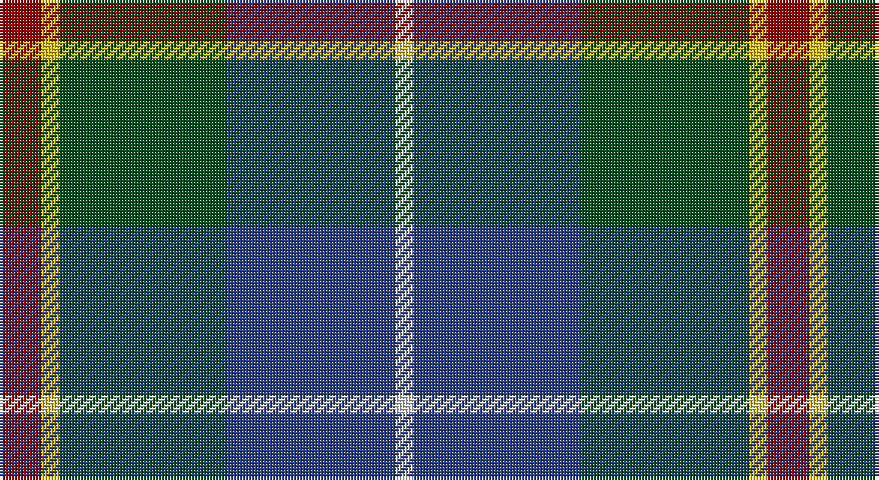

This page is one **sett** — a single exact thread-count. It belongs to the [tartan](/setts/r7ly3dg28db28w3/)
(the same proportion at any scale), whose colour order is pattern [RYGBW](/stripes/rygbw/).

Part of the [Turnbull Hunting](/tartans/turnbull-hunting/) tartan — the named design grouping this sett with its other cloths.

Sourced from register-of-tartans.  It is a [5 stripe tartan](/stripes/stripes5/).

Original link https://www.tartanregister.gov.uk/tartanDetails.aspx?ref=4162

## Also known as

This cloth is also recorded under:

- Turnbull Hunting #2
- Turnbull, hunting

## Register references

External register numbers recorded for this tartan.

- Scottish Register of Tartans: [4162](https://www.tartanregister.gov.uk/tartanDetails.aspx?ref=4162)
- Scottish Tartans World Register: 1714

## Thread count
DR/14 Y6 G56 B56 LN/6

One full sett is **256 threads**.

## Palette

Palette: <strong>Tartan Register</strong>
<table><thead><tr><th>Colour</th><th>Threads</th><th>Shade</th><th>Base</th><th>OKLCh</th></tr></thead><tbody><tr><td>DR/</td><td style="text-align:right;font-variant-numeric:tabular-nums">14</td><td><code style="background-color:#960000;">#960000</code> <small style="color:#888">#960000</small></td><td>R <code style="background-color:#CC0000;">#CC0000</code></td><td><small style="color:#888">oklch(42.3% 0.173 29.2)</small></td></tr><tr><td>Y</td><td style="text-align:right;font-variant-numeric:tabular-nums">6</td><td><code style="background-color:#E8C000;">#E8C000</code> <small style="color:#888">#E8C000</small></td><td>Y <code style="background-color:#F2BF00;">#F2BF00</code></td><td><small style="color:#888">oklch(81.9% 0.168 93.7)</small></td></tr><tr><td>G</td><td style="text-align:right;font-variant-numeric:tabular-nums">56</td><td><code style="background-color:#005020;">#005020</code> <small style="color:#888">#005020</small></td><td>G <code style="background-color:#006100;">#006100</code></td><td><small style="color:#888">oklch(37.7% 0.105 149.6)</small></td></tr><tr><td>B</td><td style="text-align:right;font-variant-numeric:tabular-nums">56</td><td><code style="background-color:#2C4084;">#2C4084</code> <small style="color:#888">#2C4084</small></td><td>B <code style="background-color:#2A418A;">#2A418A</code></td><td><small style="color:#888">oklch(39.4% 0.117 268.3)</small></td></tr><tr><td>LN/</td><td style="text-align:right;font-variant-numeric:tabular-nums">6</td><td><code style="background-color:#E0E0E0;">#E0E0E0</code> <small style="color:#888">#E0E0E0</small></td><td>W <code style="background-color:#F7F7F7;">#F7F7F7</code></td><td><small style="color:#888">oklch(90.7% 0.000 89.9)</small></td></tr></tbody></table>

# Sample pattern

## Nearest tartans

The nearest existing variants by ΔTartan distance, with this tartan at the top so the swatches line up against it.

ΔTartan

Tartan

Sett

—

<a href="/ttd/edit/#slug=r7ly3dg28db28w3~x2">Turnbull Hunting</a> <a class="nn-out" href="/variants/s5/r7ly3dg28db28w3~x2/" title="open its dictionary page">↗</a>

0.74

<a href="/ttd/edit/#slug=r2ly1g10db10w1~x6&amp;base=r7ly3dg28db28w3~x2">Turnbull Hunting (Name)</a> <a class="nn-out" href="/variants/s5/r2ly1g10db10w1~x6/" title="open its dictionary page">↗</a>

0.75

<a href="/ttd/edit/#slug=r5t3g24db24r4ly2~x2&amp;base=r7ly3dg28db28w3~x2">Canine All Dogs</a> <a class="nn-out" href="/variants/s6/r5t3g24db24r4ly2~x2/" title="open its dictionary page">↗</a>

0.76

<a href="/ttd/edit/#slug=db20k6lo4db3g20w2~x2&amp;base=r7ly3dg28db28w3~x2">DeLoughery (Personal)</a> <a class="nn-out" href="/variants/s6/db20k6lo4db3g20w2~x2/" title="open its dictionary page">↗</a>

0.81

<a href="/ttd/edit/#slug=k3db3g23db21w2~x2&amp;base=r7ly3dg28db28w3~x2">Douglas Clan Tartan</a> <a class="nn-out" href="/variants/s5/k3db3g23db21w2~x2/" title="open its dictionary page">↗</a>

0.87

<a href="/ttd/edit/#slug=k1dbi1g8db8w1~x4&amp;base=r7ly3dg28db28w3~x2">Douglas, Green (Wilsons)</a> <a class="nn-out" href="/variants/s5/k1dbi1g8db8w1~x4/" title="open its dictionary page">↗</a>

0.92

<a href="/ttd/edit/#slug=db9w4g36t36r4~x2&amp;base=r7ly3dg28db28w3~x2">Alvis of Lee (Personal)</a> <a class="nn-out" href="/variants/s5/db9w4g36t36r4~x2/" title="open its dictionary page">↗</a>

0.92

<a href="/ttd/edit/#slug=k7r3g30db28lb3~x2&amp;base=r7ly3dg28db28w3~x2">Highlander Highland Laddie</a> <a class="nn-out" href="/variants/s5/k7r3g30db28lb3~x2/" title="open its dictionary page">↗</a>

0.93

<a href="/ttd/edit/#slug=b32do16dg3o4k28~x2&amp;base=r7ly3dg28db28w3~x2">Corey in Balachuirn</a> <a class="nn-out" href="/variants/s5/b32do16dg3o4k28~x2/" title="open its dictionary page">↗</a>

0.93

<a href="/ttd/edit/#slug=k2ly1g10db10w1~x6&amp;base=r7ly3dg28db28w3~x2">Turnbull Hunting (1983) #2</a> <a class="nn-out" href="/variants/s5/k2ly1g10db10w1~x6/" title="open its dictionary page">↗</a>

0.96

<a href="/ttd/edit/#slug=r3db22k11g32ly3~x2&amp;base=r7ly3dg28db28w3~x2">Cultoquhey Hotel</a> <a class="nn-out" href="/variants/s5/r3db22k11g32ly3~x2/" title="open its dictionary page">↗</a>

## Neighbour map

Every grey dot is one of 14360 variants placed by the first two principal components of the ΔTartan feature space (44% of its variance). Red is this tartan; blue dots are its nearest — click one to open its page.

<svg viewBox="0 0 640 380" role="img" style="max-width:100%;height:auto;border:1px solid #e0e0e0;border-radius:4px;display:block" xmlns="http://www.w3.org/2000/svg"><image href="/nn/cloud.v1.png" width="640" height="380"/><a href="/variants/s5/r2ly1g10db10w1~x6/"><circle cx="220.5" cy="203.4" r="4" fill="#3465a4"><title>Turnbull Hunting (Name)</title></circle></a><a href="/variants/s6/r5t3g24db24r4ly2~x2/"><circle cx="218.5" cy="189.0" r="4" fill="#3465a4"><title>Canine All Dogs</title></circle></a><a href="/variants/s6/db20k6lo4db3g20w2~x2/"><circle cx="206.5" cy="204.1" r="4" fill="#3465a4"><title>DeLoughery (Personal)</title></circle></a><a href="/variants/s5/k3db3g23db21w2~x2/"><circle cx="258.5" cy="213.5" r="4" fill="#3465a4"><title>Douglas Clan Tartan</title></circle></a><a href="/variants/s5/k1dbi1g8db8w1~x4/"><circle cx="219.0" cy="218.1" r="4" fill="#3465a4"><title>Douglas, Green (Wilsons)</title></circle></a><a href="/variants/s5/db9w4g36t36r4~x2/"><circle cx="221.1" cy="221.0" r="4" fill="#3465a4"><title>Alvis of Lee (Personal)</title></circle></a><a href="/variants/s5/k7r3g30db28lb3~x2/"><circle cx="222.2" cy="214.8" r="4" fill="#3465a4"><title>Highlander Highland Laddie</title></circle></a><a href="/variants/s5/b32do16dg3o4k28~x2/"><circle cx="199.3" cy="230.5" r="4" fill="#3465a4"><title>Corey in Balachuirn</title></circle></a><a href="/variants/s5/k2ly1g10db10w1~x6/"><circle cx="215.3" cy="205.5" r="4" fill="#3465a4"><title>Turnbull Hunting (1983) #2</title></circle></a><a href="/variants/s5/r3db22k11g32ly3~x2/"><circle cx="226.3" cy="218.7" r="4" fill="#3465a4"><title>Cultoquhey Hotel</title></circle></a><circle cx="224.5" cy="219.3" r="5" fill="#c00000"/></svg>

ID: /variants/s5/r7ly3dg28db28w3~x2/
