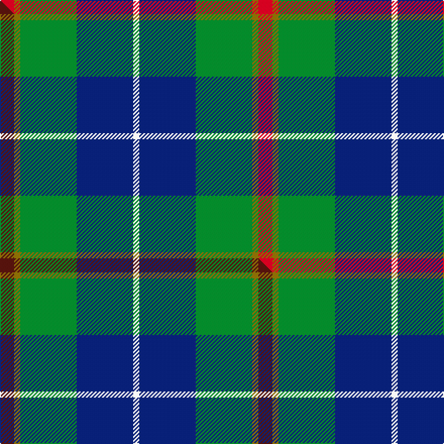

This is one **variant** — a specific cloth: this exact thread count and colourway, with its own
provenance below. It is one weaving of the [sett](/setts/r7y3g28db28w3/) (the scale-free proportion — the
same cloth at any scale or shade), whose colour order is pattern [RGGBW](/stripes/rggbw/).

Part of the [Turnbull Hunting](/tartans/turnbull-hunting/) tartan — the named design grouping this sett with its other cloths.

Sourced from weddslist.  It is a [5 stripe tartan](/stripes/stripes5/).

Original link [http://www.weddslist.com/cgi-bin/tartans/pg.pl?source=sts](http://www.weddslist.com/cgi-bin/tartans/pg.pl?source=sts)

Dataset <small>— provenance for this record, inherited from the source manifest</small>

<dl class="dataset-prov">
<dt>source</dt><dd><a href="/sources/weddslist/">Weddslist</a></dd>
<dt>data captured from</dt><dd><a href="https://github.com/thetartan/tartan-database/blob/master/data/weddslist/data.csv">https://github.com/thetartan/tartan-database/blob/master/data/weddslist/data.csv</a></dd>
<dt>data date</dt><dd>2016-11-17 <small>(dataset default)</small></dd>
<dt>licence</dt><dd><a href="https://creativecommons.org/licenses/by-nc-nd/4.0/">CC BY-NC-ND 4.0</a></dd>
</dl>

Capture chain <small>— the hands this data passed through, oldest first; each capture carries its own licence</small>

<ol class="capture-chain">
<li><a href="https://www.weddslist.com/tartans/">Weddslist</a> <small>the living privately compiled reference</small></li>
<li><a href="https://github.com/thetartan/tartan-database">thetartan/tartan-database</a> <small>2016-2017</small> · <a href="https://creativecommons.org/licenses/by-nc-nd/4.0/">CC BY-NC-ND 4.0</a> <small>Levko Kravets's frozen compilation — the capture we vendored, and where its CC licence text came from</small></li>
<li>this dictionary <small>captured 2026-06-10 · commit 5bf86c7566</small> <small>each re-capture is a git commit to data/sources</small></li>
</ol>

## Thread count
R/14 Y6 G56 DB56 W/6

One full sett is **256 threads**.

## Palette
<table><thead><tr><th>Colour</th><th>Shade</th><th>OKLCh</th></tr></thead><tbody><tr><td>DB</td><td><code style="background-color:#082077;">#082077</code> <small style="color:#888">#082077</small></td><td><small style="color:#888">oklch(30.0% 0.149 265.1)</small></td></tr><tr><td>R</td><td><code style="background-color:#D60020;">#D60020</code> <small style="color:#888">#D60020</small></td><td><small style="color:#888">oklch(55.2% 0.224 25.5)</small></td></tr><tr><td>G</td><td><code style="background-color:#008B2A;">#008B2A</code> <small style="color:#888">#008B2A</small></td><td><small style="color:#888">oklch(55.4% 0.170 145.9)</small></td></tr><tr><td>W</td><td><code style="background-color:#F7F7F7;">#F7F7F7</code> <small style="color:#888">#F7F7F7</small></td><td><small style="color:#888">oklch(97.6% 0.000 89.9)</small></td></tr><tr><td>Y</td><td><code style="background-color:#8B6E00;">#8B6E00</code> <small style="color:#888">#8B6E00</small></td><td><small style="color:#888">oklch(55.1% 0.113 90.4)</small></td></tr></tbody></table>

# Sample pattern

## Compared to the master

This cloth is one sett of its design; the master sett (the exemplar the design is anchored on) is below for comparison.

Its **ΔTartan distance** from the master is **0.06** — the same measure the nearest-tartans table ranks by (0 is identical; a re-scale of the same cloth is near 0, a recolour or a different proportion further).

<figure class="master-compare" style="margin:0">

this sett
master sett ★

<figcaption style="color:#888;font-size:smaller">One weave of this sett against the <a href="/setts/dr7y3g28db28w3/">master sett ★</a>, split on the diagonal: a shared proportion runs seamlessly across it with only the shades shifting; a different proportion breaks on it.</figcaption>
</figure>

## Nearest tartan variants

The nearest existing variants by ΔTartan distance, with this cloth at the top so the swatches line up against it.

ΔTartan

Threads

Variant

Sett

—

256

<a href="/variants/s5/r7y3g28db28w3~x2/">Turnbull, hunting</a>

<a href="/ttd/edit/#slug=dr7y3g28db28w3~x2&amp;base=r7y3g28db28w3~x2" title="compare in the TTD">0.06</a>

256

<a href="/variants/s5/dr7y3g28db28w3~x2/">Turnbull Hunting</a>

<a href="/ttd/edit/#slug=r2y1g10db10w1~x6&amp;base=r7y3g28db28w3~x2" title="compare in the TTD">0.10</a>

270

<a href="/variants/s5/r2y1g10db10w1~x6/">Turnbull Hunting (Name)</a>

<a href="/ttd/edit/#slug=db10g10r5w1~x2&amp;base=r7y3g28db28w3~x2" title="compare in the TTD">0.51</a>

82

<a href="/variants/s4/db10g10r5w1~x2/">Thorntons Law Corporate Tartan</a>

<a href="/ttd/edit/#slug=r2w7db30g36y2~x2&amp;base=r7y3g28db28w3~x2" title="compare in the TTD">0.56</a>

300

<a href="/variants/s5/r2w7db30g36y2~x2/">Centennial-King George Lodge No.171</a>

<a href="/ttd/edit/#slug=k7y3g28db28w3~x2&amp;base=r7y3g28db28w3~x2" title="compare in the TTD">0.60</a>

256

<a href="/variants/s5/k7y3g28db28w3~x2/">Turnbull Hunting Clan Tartan</a>

<a href="/ttd/edit/#slug=k2dy1g10db10w1~x6&amp;base=r7y3g28db28w3~x2" title="compare in the TTD">0.70</a>

270

<a href="/variants/s5/k2dy1g10db10w1~x6/">Turnbull Hunting (1983) #2</a>

<a href="/ttd/edit/#slug=r1g6db6w1~x4&amp;base=r7y3g28db28w3~x2" title="compare in the TTD">0.71</a>

104

<a href="/variants/s4/r1g6db6w1~x4/">Salt Spring Island</a>

<a href="/ttd/edit/#slug=k7dr3g29db29w3~x2&amp;base=r7y3g28db28w3~x2" title="compare in the TTD">0.83</a>

264

<a href="/variants/s5/k7dr3g29db29w3~x2/">Highlander, Highland Laddie Kilts</a>

<a href="/ttd/edit/#slug=k7dr3g30db28lb3~x2&amp;base=r7y3g28db28w3~x2" title="compare in the TTD">0.85</a>

264

<a href="/variants/s5/k7dr3g30db28lb3~x2/">Highlander Highland Laddie</a>

<a href="/ttd/edit/#slug=k7lb3g18db18w2~x2&amp;base=r7y3g28db28w3~x2" title="compare in the TTD">0.95</a>

174

<a href="/variants/s5/k7lb3g18db18w2~x2/">Bhatti (Name)</a>

## Neighbour map

Every grey dot is one of 13621 variants placed by the first two principal components of the ΔTartan feature space (42% of its variance). Red is this tartan; blue dots are its nearest — click one to open its page.

<svg viewBox="0 0 640 380" role="img" style="max-width:100%;height:auto;border:1px solid #e0e0e0;border-radius:4px;display:block" xmlns="http://www.w3.org/2000/svg"><image href="/nn/cloud.v1.png" width="640" height="380"/><a href="/variants/s5/dr7y3g28db28w3~x2/"><circle cx="238.4" cy="230.4" r="4" fill="#3465a4"><title>Turnbull Hunting</title></circle></a><a href="/variants/s5/r2y1g10db10w1~x6/"><circle cx="225.7" cy="208.1" r="4" fill="#3465a4"><title>Turnbull Hunting (Name)</title></circle></a><a href="/variants/s4/db10g10r5w1~x2/"><circle cx="204.5" cy="257.4" r="4" fill="#3465a4"><title>Thorntons Law Corporate Tartan</title></circle></a><a href="/variants/s5/r2w7db30g36y2~x2/"><circle cx="259.7" cy="179.5" r="4" fill="#3465a4"><title>Centennial-King George Lodge No.171</title></circle></a><a href="/variants/s5/k7y3g28db28w3~x2/"><circle cx="178.4" cy="197.6" r="4" fill="#3465a4"><title>Turnbull Hunting Clan Tartan</title></circle></a><a href="/variants/s5/k2dy1g10db10w1~x6/"><circle cx="194.6" cy="192.6" r="4" fill="#3465a4"><title>Turnbull Hunting (1983) #2</title></circle></a><a href="/variants/s4/r1g6db6w1~x4/"><circle cx="221.5" cy="262.4" r="4" fill="#3465a4"><title>Salt Spring Island</title></circle></a><a href="/variants/s5/k7dr3g29db29w3~x2/"><circle cx="186.5" cy="197.4" r="4" fill="#3465a4"><title>Highlander, Highland Laddie Kilts</title></circle></a><a href="/variants/s5/k7dr3g30db28lb3~x2/"><circle cx="198.8" cy="198.1" r="4" fill="#3465a4"><title>Highlander Highland Laddie</title></circle></a><a href="/variants/s5/k7lb3g18db18w2~x2/"><circle cx="149.0" cy="212.9" r="4" fill="#3465a4"><title>Bhatti (Name)</title></circle></a><circle cx="212.1" cy="213.5" r="5" fill="#c00000"/><text x="320" y="376" text-anchor="middle" font-size="11" fill="#999">ground</text><text x="11" y="190" text-anchor="middle" font-size="11" fill="#999" transform="rotate(-90 11 190)">complexity</text></svg>

ID: /variants/s5/r7y3g28db28w3~x2/
