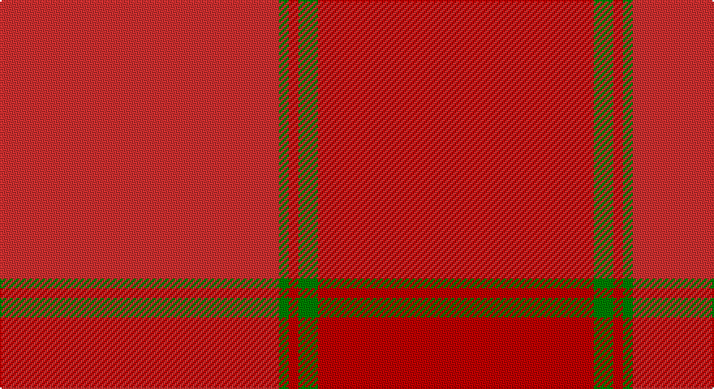

This page is one **sett** — a single exact thread-count. It belongs to the [tartan](/setts/r86g3ri3g6ri85/)
(the same proportion at any scale), whose colour order is pattern [RGRGR](/stripes/rgrgr/).

Sourced from weddslist.  It is a [5 stripe tartan](/stripes/stripes5/).

Original link http://www.weddslist.com/cgi-bin/tartans/pg.pl?source=sts

## Also known as

This cloth is also recorded under:

- MacNab #4

## Thread count
R/172 G6 Ra6 G12 Ra/170

One full sett is **390 threads**.

## Palette

Palette: <strong>custom</strong>
<table><thead><tr><th>Colour</th><th>Threads</th><th>Shade</th><th>Base</th><th>OKLCh</th></tr></thead><tbody><tr><td>R/</td><td style="text-align:right;font-variant-numeric:tabular-nums">172</td><td><code style="background-color:#D03030;">#D03030</code> <small style="color:#888">#D03030</small></td><td>R <code style="background-color:#CC0000;">#CC0000</code></td><td><small style="color:#888">oklch(56.4% 0.196 26.2)</small></td></tr><tr><td>G</td><td style="text-align:right;font-variant-numeric:tabular-nums">6</td><td><code style="background-color:#008000;">#008000</code> <small style="color:#888">#008000</small></td><td>G <code style="background-color:#006100;">#006100</code></td><td><small style="color:#888">oklch(52.0% 0.177 142.5)</small></td></tr><tr><td>Ra</td><td style="text-align:right;font-variant-numeric:tabular-nums">6</td><td><code style="background-color:#C00000;">#C00000</code> <small style="color:#888">#C00000</small></td><td>R <code style="background-color:#CC0000;">#CC0000</code></td><td><small style="color:#888">oklch(50.7% 0.208 29.2)</small></td></tr><tr><td>G</td><td style="text-align:right;font-variant-numeric:tabular-nums">12</td><td><code style="background-color:#008000;">#008000</code> <small style="color:#888">#008000</small></td><td>G <code style="background-color:#006100;">#006100</code></td><td><small style="color:#888">oklch(52.0% 0.177 142.5)</small></td></tr><tr><td>Ra/</td><td style="text-align:right;font-variant-numeric:tabular-nums">170</td><td><code style="background-color:#C00000;">#C00000</code> <small style="color:#888">#C00000</small></td><td>R <code style="background-color:#CC0000;">#CC0000</code></td><td><small style="color:#888">oklch(50.7% 0.208 29.2)</small></td></tr></tbody></table>

# Sample pattern

## Nearest tartans

The nearest existing variants by ΔTartan distance, with this tartan at the top so the swatches line up against it.

ΔTartan

Tartan

Sett

—

<a href="/ttd/edit/#slug=r86g3ri3g6ri85~x2">MacNab 2</a> <a class="nn-out" href="/variants/s5/r86g3ri3g6ri85~x2/" title="open its dictionary page">↗</a>

1.10

<a href="/ttd/edit/#slug=ri86dg3r3dg6r85~x2&amp;base=r86g3ri3g6ri85~x2">MacNab #4</a> <a class="nn-out" href="/variants/s5/ri86dg3r3dg6r85~x2/" title="open its dictionary page">↗</a>

3.41

<a href="/ttd/edit/#slug=ri32r3ri3r2ri3r23~x2&amp;base=r86g3ri3g6ri85~x2">Samye Sangha #2</a> <a class="nn-out" href="/variants/s6/ri32r3ri3r2ri3r23~x2/" title="open its dictionary page">↗</a>

3.51

<a href="/ttd/edit/#slug=r5n35r46o5~x2&amp;base=r86g3ri3g6ri85~x2">Bryce</a> <a class="nn-out" href="/variants/s4/r5n35r46o5~x2/" title="open its dictionary page">↗</a>

3.63

<a href="/ttd/edit/#slug=r8ri22rii2ri8rii4ri6rii6ri3rii48ri6o48riii8&amp;base=r86g3ri3g6ri85~x2">Ferguson Red, George (Architect)</a> <a class="nn-out" href="/variants/s12/r8ri22rii2ri8rii4ri6rii6ri3rii48ri6o48riii8/" title="open its dictionary page">↗</a>

3.72

<a href="/ttd/edit/#slug=oi12o6oi2ly1~x4&amp;base=r86g3ri3g6ri85~x2">Loch Garth</a> <a class="nn-out" href="/variants/s4/oi12o6oi2ly1~x4/" title="open its dictionary page">↗</a>

3.94

<a href="/ttd/edit/#slug=r23o4r23o32r4~x2&amp;base=r86g3ri3g6ri85~x2">Hamilton, Red (Fashion?)</a> <a class="nn-out" href="/variants/s5/r23o4r23o32r4~x2/" title="open its dictionary page">↗</a>

3.98

<a href="/ttd/edit/#slug=r24g2t1g1m24~x4&amp;base=r86g3ri3g6ri85~x2">MacNab (Smith)</a> <a class="nn-out" href="/variants/s5/r24g2t1g1m24~x4/" title="open its dictionary page">↗</a>

4.03

<a href="/ttd/edit/#slug=r24g2t1g1ri24~x2&amp;base=r86g3ri3g6ri85~x2">MacNab 4</a> <a class="nn-out" href="/variants/s5/r24g2t1g1ri24~x2/" title="open its dictionary page">↗</a>

4.06

<a href="/ttd/edit/#slug=o32w2o9ly2o12lo21r1~x2&amp;base=r86g3ri3g6ri85~x2">Weathered Cyclist (Corporate)</a> <a class="nn-out" href="/variants/s7/o32w2o9ly2o12lo21r1~x2/" title="open its dictionary page">↗</a>

4.15

<a href="/ttd/edit/#slug=oii39oi4oii6o2oii2w2oii2oi12oii6oii2oii6o2~x2&amp;base=r86g3ri3g6ri85~x2">Glen Clova</a> <a class="nn-out" href="/variants/s12/oii39oi4oii6o2oii2w2oii2oi12oii6oii2oii6o2~x2/" title="open its dictionary page">↗</a>

## Neighbour map

Every grey dot is one of 14360 variants placed by the first two principal components of the ΔTartan feature space (44% of its variance). Red is this tartan; blue dots are its nearest — click one to open its page.

<svg viewBox="0 0 640 380" role="img" style="max-width:100%;height:auto;border:1px solid #e0e0e0;border-radius:4px;display:block" xmlns="http://www.w3.org/2000/svg"><image href="/nn/cloud.v1.png" width="640" height="380"/><a href="/variants/s5/ri86dg3r3dg6r85~x2/"><circle cx="609.2" cy="280.9" r="4" fill="#3465a4"><title>MacNab #4</title></circle></a><a href="/variants/s6/ri32r3ri3r2ri3r23~x2/"><circle cx="600.6" cy="274.6" r="4" fill="#3465a4"><title>Samye Sangha #2</title></circle></a><a href="/variants/s4/r5n35r46o5~x2/"><circle cx="529.2" cy="338.0" r="4" fill="#3465a4"><title>Bryce</title></circle></a><a href="/variants/s12/r8ri22rii2ri8rii4ri6rii6ri3rii48ri6o48riii8/"><circle cx="467.6" cy="233.0" r="4" fill="#3465a4"><title>Ferguson Red, George (Architect)</title></circle></a><a href="/variants/s4/oi12o6oi2ly1~x4/"><circle cx="620.0" cy="354.7" r="4" fill="#3465a4"><title>Loch Garth</title></circle></a><a href="/variants/s5/r23o4r23o32r4~x2/"><circle cx="482.9" cy="328.9" r="4" fill="#3465a4"><title>Hamilton, Red (Fashion?)</title></circle></a><a href="/variants/s5/r24g2t1g1m24~x4/"><circle cx="474.0" cy="218.4" r="4" fill="#3465a4"><title>MacNab (Smith)</title></circle></a><a href="/variants/s5/r24g2t1g1ri24~x2/"><circle cx="472.0" cy="220.0" r="4" fill="#3465a4"><title>MacNab 4</title></circle></a><a href="/variants/s7/o32w2o9ly2o12lo21r1~x2/"><circle cx="609.4" cy="248.6" r="4" fill="#3465a4"><title>Weathered Cyclist (Corporate)</title></circle></a><a href="/variants/s12/oii39oi4oii6o2oii2w2oii2oi12oii6oii2oii6o2~x2/"><circle cx="511.4" cy="192.2" r="4" fill="#3465a4"><title>Glen Clova</title></circle></a><circle cx="593.3" cy="272.0" r="5" fill="#c00000"/></svg>

ID: /variants/s5/r86g3ri3g6ri85~x2/
