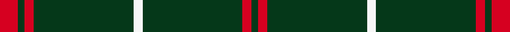

This page is one **sett** — a single exact thread-count. It belongs to the [tartan](/setts/r8dg3r4dg44w4/)
(the same proportion at any scale), whose colour order is pattern [GRGWGRGR](/stripes/grgwgrgr/).

Part of the [Welsh National](/tartans/welsh-national/) tartan — the named design grouping this sett with its other cloths.

Sourced from register-of-tartans.  It is a [8 stripe tartan](/stripes/stripes8/).

Original link [https://www.tartanregister.gov.uk/tartanDetails.aspx?ref=4597](https://www.tartanregister.gov.uk/tartanDetails.aspx?ref=4597)

2 attestations — the source records this cloth was collapsed from (oldest owns this page)

<ul>
<li>01/01/1967 — Welsh National (register-of-tartans, <a href="https://www.tartanregister.gov.uk/tartanDetails.aspx?ref=4597">record</a>)  <em>According to 'World Tartans' the decision to adopt a tartan was taken by a Welsh society formed in Cardiff in 1967. Its aim was to emphasise the Welsh bonds with other Celtic countries, most of whom appeared to already have their own tartan. Colours represent the Welsh flag - red dragon on a green and white background. Nomindex notes 'Made for Frasers of Perth. Specimen from D.M. Richards 1967. D.C. Dalgliesh specimen 1968. Colours named as crimson and sage green.' Lochcarron swatch.</em></li>
<li>1967 — Welsh National (District) (tartans-authority, <a href="https://www.tartanregister.gov.uk/tartanDetails.aspx?ref=1523">record</a>)  <em>According to 'World Tartans' the decision to adopt a tartan was taken by a Welsh society formed in Cardiff in 1967. Its aim was to emphasise the Welsh bonds with other Celtic countries, most of whom appeared to already have their own tartan. Colours represent the Welsh flag - red dragon on a green and white background. Nomindex notes "Made for Frasers of Perth. Specimen from D.M.Richards 1967. D.C.Dalgliesh specimen 1968. Colours named as crimson and sage green." Lochcarron swatch.</em></li>
</ul>

Dataset <small>— provenance for this record, inherited from the source manifest</small>

<dl class="dataset-prov">
<dt>source</dt><dd><a href="/sources/register-of-tartans/">Scottish Register of Tartans</a></dd>
<dt>data captured from</dt><dd><a href="https://github.com/thetartan/tartan-database/blob/master/data/register-of-tartans/data.csv">https://github.com/thetartan/tartan-database/blob/master/data/register-of-tartans/data.csv</a></dd>
<dt>data date</dt><dd>1967 <small>(this record)</small></dd>
<dt>licence</dt><dd><a href="https://www.tartanregister.gov.uk/copyright">Crown copyright</a></dd>
</dl>

Capture chain <small>— the hands this data passed through, oldest first; each capture carries its own licence</small>

<ol class="capture-chain">
<li><a href="https://www.tartanregister.gov.uk/">Scottish Register of Tartans</a> · <a href="https://www.tartanregister.gov.uk/copyright">Crown copyright</a> <small>the living register — still published by National Records of Scotland</small></li>
<li><a href="https://github.com/thetartan/tartan-database">thetartan/tartan-database</a> <small>2016-2017</small> · <a href="https://creativecommons.org/licenses/by-nc-nd/4.0/">CC BY-NC-ND 4.0</a> <small>Levko Kravets's frozen compilation — the capture we vendored, and where its CC licence text came from</small></li>
<li>this dictionary <small>captured 2026-06-10 · commit 5bf86c7566</small> <small>each re-capture is a git commit to data/sources</small></li>
</ol>

## Register references

External register numbers recorded for this tartan.

- Scottish Register of Tartans: [4597](https://www.tartanregister.gov.uk/tartanDetails.aspx?ref=4597)
- Scottish Tartans Authority (ITI): 1523
- Scottish Tartans World Register: 1523

## Thread count
R/16 DG6 R8 DG88 W8 DG88 R8 DG/6

One full sett is **434 threads**.

## Palette
<table><thead><tr><th>Colour</th><th>Shade</th><th>OKLCh</th></tr></thead><tbody><tr><td>DG</td><td><code style="background-color:#053819;">#053819</code> <small style="color:#888">#053819</small></td><td><small style="color:#888">oklch(30.0% 0.075 151.3)</small></td></tr><tr><td>W</td><td><code style="background-color:#F7F7F7;">#F7F7F7</code> <small style="color:#888">#F7F7F7</small></td><td><small style="color:#888">oklch(97.6% 0.000 89.9)</small></td></tr><tr><td>R</td><td><code style="background-color:#D60020;">#D60020</code> <small style="color:#888">#D60020</small></td><td><small style="color:#888">oklch(55.2% 0.224 25.5)</small></td></tr></tbody></table>

# Sample pattern

## Nearest tartan variants

The nearest existing variants by ΔTartan distance, with this cloth at the top so the swatches line up against it.

ΔTartan

Threads

Variant

Sett

—

434

<a href="/variants/s5/r8dg3r4dg44w4~x2/">Welsh National</a>

<a href="/ttd/edit/#slug=r2dg1r1dg10w1~x4&amp;base=r8dg3r4dg44w4~x2" title="compare in the TTD">0.37</a>

108

<a href="/variants/s5/r2dg1r1dg10w1~x4/">Welsh National District Tartan</a>

<a href="/ttd/edit/#slug=r2g1r1g11w1~x8&amp;base=r8dg3r4dg44w4~x2" title="compare in the TTD">0.46</a>

232

<a href="/variants/s5/r2g1r1g11w1~x8/">Welsh, National</a>

<a href="/ttd/edit/#slug=r19g6r7g101k7g7&amp;base=r8dg3r4dg44w4~x2" title="compare in the TTD">1.23</a>

268

<a href="/variants/s6/r19g6r7g101k7g7/">Loch Laggan</a>

<a href="/ttd/edit/#slug=r4g2r1g19k1g2~x4&amp;base=r8dg3r4dg44w4~x2" title="compare in the TTD">1.40</a>

208

<a href="/variants/s6/r4g2r1g19k1g2~x4/">Loch Laggan</a>

<a href="/ttd/edit/#slug=r4g2r1g20k1g1~x4&amp;base=r8dg3r4dg44w4~x2" title="compare in the TTD">1.43</a>

212

<a href="/variants/s6/r4g2r1g20k1g1~x4/">Loch Laggan (District)</a>

<a href="/ttd/edit/#slug=dg30dr2dg8dr1dg5w2&amp;base=r8dg3r4dg44w4~x2" title="compare in the TTD">1.76</a>

64

<a href="/variants/s6/dg30dr2dg8dr1dg5w2/">Dewi Sant</a>

<a href="/ttd/edit/#slug=dr27w3dr6w2g3~x4&amp;base=r8dg3r4dg44w4~x2" title="compare in the TTD">1.79</a>

208

<a href="/variants/s5/dr27w3dr6w2g3~x4/">Martin Family, Robert N (Personal)</a>

<a href="/ttd/edit/#slug=dt32dr3dt4k2lo3~x2&amp;base=r8dg3r4dg44w4~x2" title="compare in the TTD">1.80</a>

106

<a href="/variants/s5/dt32dr3dt4k2lo3~x2/">MacLaine of Lochbuie Hunting</a>

<a href="/ttd/edit/#slug=dt40dy10dt8r20dt100w5&amp;base=r8dg3r4dg44w4~x2" title="compare in the TTD">1.84</a>

321

<a href="/variants/s6/dt40dy10dt8r20dt100w5/">East of Scotland Tartan Army</a>

<a href="/ttd/edit/#slug=dr8g2dr2k1dr1g2~x10&amp;base=r8dg3r4dg44w4~x2" title="compare in the TTD">1.99</a>

220

<a href="/variants/s6/dr8g2dr2k1dr1g2~x10/">Waverley Care Aids Trust (Corporate)</a>

## Neighbour map

Every grey dot is one of 13621 variants placed by the first two principal components of the ΔTartan feature space (42% of its variance). Red is this tartan; blue dots are its nearest — click one to open its page.

<svg viewBox="0 0 640 380" role="img" style="max-width:100%;height:auto;border:1px solid #e0e0e0;border-radius:4px;display:block" xmlns="http://www.w3.org/2000/svg"><image href="/nn/cloud.v1.png" width="640" height="380"/><a href="/variants/s5/r2dg1r1dg10w1~x4/"><circle cx="448.7" cy="201.6" r="4" fill="#3465a4"><title>Welsh National District Tartan</title></circle></a><a href="/variants/s5/r2g1r1g11w1~x8/"><circle cx="492.3" cy="211.9" r="4" fill="#3465a4"><title>Welsh, National</title></circle></a><a href="/variants/s6/r19g6r7g101k7g7/"><circle cx="499.6" cy="162.7" r="4" fill="#3465a4"><title>Loch Laggan</title></circle></a><a href="/variants/s6/r4g2r1g19k1g2~x4/"><circle cx="557.5" cy="147.2" r="4" fill="#3465a4"><title>Loch Laggan</title></circle></a><a href="/variants/s6/r4g2r1g20k1g1~x4/"><circle cx="529.2" cy="158.8" r="4" fill="#3465a4"><title>Loch Laggan (District)</title></circle></a><a href="/variants/s6/dg30dr2dg8dr1dg5w2/"><circle cx="626.0" cy="183.3" r="4" fill="#3465a4"><title>Dewi Sant</title></circle></a><a href="/variants/s5/dr27w3dr6w2g3~x4/"><circle cx="529.0" cy="197.5" r="4" fill="#3465a4"><title>Martin Family, Robert N (Personal)</title></circle></a><a href="/variants/s5/dt32dr3dt4k2lo3~x2/"><circle cx="549.2" cy="168.7" r="4" fill="#3465a4"><title>MacLaine of Lochbuie Hunting</title></circle></a><a href="/variants/s6/dt40dy10dt8r20dt100w5/"><circle cx="550.3" cy="178.6" r="4" fill="#3465a4"><title>East of Scotland Tartan Army</title></circle></a><a href="/variants/s6/dr8g2dr2k1dr1g2~x10/"><circle cx="414.6" cy="218.8" r="4" fill="#3465a4"><title>Waverley Care Aids Trust (Corporate)</title></circle></a><circle cx="542.5" cy="173.7" r="5" fill="#c00000"/><text x="320" y="376" text-anchor="middle" font-size="11" fill="#999">ground</text><text x="11" y="190" text-anchor="middle" font-size="11" fill="#999" transform="rotate(-90 11 190)">complexity</text></svg>

ID: /variants/s5/r8dg3r4dg44w4~x2/
