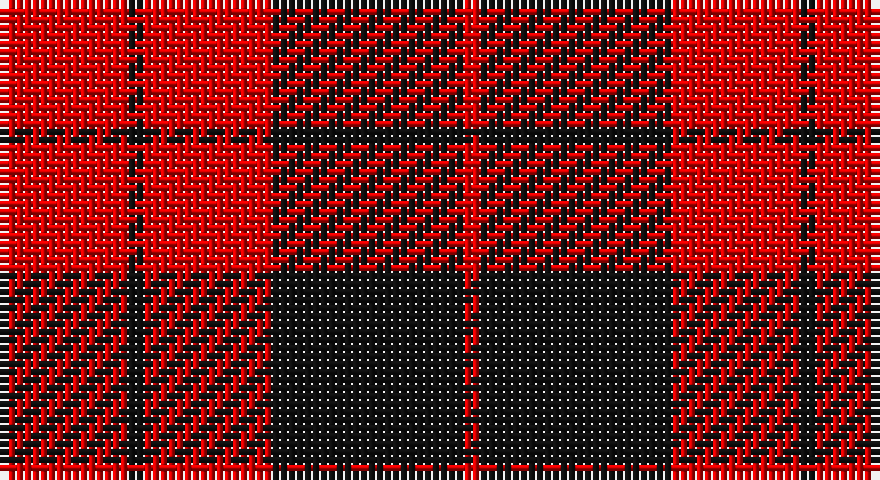

This page is one **sett** — a single exact thread-count. It belongs to the [tartan](/setts/r8k1r8k12r1/)
(the same proportion at any scale), whose colour order is pattern [RKRKR](/stripes/rkrkr/).

Part of the [MacLeod Black &](/tartans/macleod-black/) tartan — the named design grouping this sett with its other cloths.

Sourced from register-of-tartans.  It is a [5 stripe tartan](/stripes/stripes5/).

Original link https://www.tartanregister.gov.uk/tartanDetails.aspx?ref=2633

## Also known as

This cloth is also recorded under:

- MacLeod Black & Red
- MacLeod Black & White
- MacLeod, Black & Red
- MacLeod, Black & White

2 attestations — the source records this cloth was collapsed from (oldest owns this page)

<ul>
<li>undated — MacLeod Black & Red (register-of-tartans, <a href="https://www.tartanregister.gov.uk/tartanDetails.aspx?ref=2633">record</a>)</li>
<li>undated — MacLeod, Black & Red (weddslist, <a href="http://www.weddslist.com/cgi-bin/tartans/pg.pl?source=sts">record</a>)</li>
</ul>

## Register references

External register numbers recorded for this tartan.

- Scottish Register of Tartans: [2633](https://www.tartanregister.gov.uk/tartanDetails.aspx?ref=2633)
- Scottish Tartans World Register: 1591

## Thread count
R/16 K2 R16 K24 R/2

One full sett is **102 threads**.

## Palette

Palette: <strong>Logan (The Scottish Gael, 1831)</strong>
<table><thead><tr><th>Colour</th><th>Threads</th><th>Shade</th><th>Base</th><th>OKLCh</th></tr></thead><tbody><tr><td>R/</td><td style="text-align:right;font-variant-numeric:tabular-nums">16</td><td><code style="background-color:#DC0000;">#DC0000</code> <small style="color:#888">#DC0000</small></td><td>R <code style="background-color:#CC0000;">#CC0000</code></td><td><small style="color:#888">oklch(56.2% 0.230 29.2)</small></td></tr><tr><td>K</td><td style="text-align:right;font-variant-numeric:tabular-nums">2</td><td><code style="background-color:#101010;">#101010</code> <small style="color:#888">#101010</small></td><td>K <code style="background-color:#000000;">#000000</code></td><td><small style="color:#888">oklch(17.3% 0.000 89.9)</small></td></tr><tr><td>R</td><td style="text-align:right;font-variant-numeric:tabular-nums">16</td><td><code style="background-color:#DC0000;">#DC0000</code> <small style="color:#888">#DC0000</small></td><td>R <code style="background-color:#CC0000;">#CC0000</code></td><td><small style="color:#888">oklch(56.2% 0.230 29.2)</small></td></tr><tr><td>K</td><td style="text-align:right;font-variant-numeric:tabular-nums">24</td><td><code style="background-color:#101010;">#101010</code> <small style="color:#888">#101010</small></td><td>K <code style="background-color:#000000;">#000000</code></td><td><small style="color:#888">oklch(17.3% 0.000 89.9)</small></td></tr><tr><td>R/</td><td style="text-align:right;font-variant-numeric:tabular-nums">2</td><td><code style="background-color:#DC0000;">#DC0000</code> <small style="color:#888">#DC0000</small></td><td>R <code style="background-color:#CC0000;">#CC0000</code></td><td><small style="color:#888">oklch(56.2% 0.230 29.2)</small></td></tr></tbody></table>

# Sample pattern

## Nearest tartans

The nearest existing variants by ΔTartan distance, with this tartan at the top so the swatches line up against it.

ΔTartan

Tartan

Sett

—

<a href="/ttd/edit/#slug=r8k1r8k12r1~x2">MacLeod Black &amp; Red</a> <a class="nn-out" href="/variants/s5/r8k1r8k12r1~x2/" title="open its dictionary page">↗</a>

0.81

<a href="/ttd/edit/#slug=k31r4k47r47k4r31~x2&amp;base=r8k1r8k12r1~x2">Erskine (Paton)</a> <a class="nn-out" href="/variants/s6/k31r4k47r47k4r31~x2/" title="open its dictionary page">↗</a>

0.99

<a href="/ttd/edit/#slug=r4k1r12k12r2~x2&amp;base=r8k1r8k12r1~x2">Campbell of Armaddie</a> <a class="nn-out" href="/variants/s5/r4k1r12k12r2~x2/" title="open its dictionary page">↗</a>

1.04

<a href="/ttd/edit/#slug=r4k8r12k1ly1~x2&amp;base=r8k1r8k12r1~x2">MacKeane</a> <a class="nn-out" href="/variants/s5/r4k8r12k1ly1~x2/" title="open its dictionary page">↗</a>

1.08

<a href="/ttd/edit/#slug=r41k19r7k9w3~x2&amp;base=r8k1r8k12r1~x2">MacGregor, Black (Personal)</a> <a class="nn-out" href="/variants/s5/r41k19r7k9w3~x2/" title="open its dictionary page">↗</a>

1.13

<a href="/ttd/edit/#slug=k13r2k13r19k2~x2&amp;base=r8k1r8k12r1~x2">MacLeod of Raasay (Highland Society of London)</a> <a class="nn-out" href="/variants/s5/k13r2k13r19k2~x2/" title="open its dictionary page">↗</a>

1.15

<a href="/ttd/edit/#slug=k12r3k2r16k8r12k2r3~x2&amp;base=r8k1r8k12r1~x2">MacLeod #2</a> <a class="nn-out" href="/variants/s8/k12r3k2r16k8r12k2r3~x2/" title="open its dictionary page">↗</a>

1.16

<a href="/variants/s4/k30r17k3~x4/">MacFarlane Red &amp; Black (Artefact)</a>

1.20

<a href="/ttd/edit/#slug=k6r3k28r28k3r6~x2&amp;base=r8k1r8k12r1~x2">Erskine, Black &amp; Red (Clan)</a> <a class="nn-out" href="/variants/s6/k6r3k28r28k3r6~x2/" title="open its dictionary page">↗</a>

1.24

<a href="/ttd/edit/#slug=r4k8r4k8r12k1ly1~x2&amp;base=r8k1r8k12r1~x2">MacKeane (Clan?)</a> <a class="nn-out" href="/variants/s7/r4k8r4k8r12k1ly1~x2/" title="open its dictionary page">↗</a>

1.31

<a href="/ttd/edit/#slug=r36k18r4k7w2~x2&amp;base=r8k1r8k12r1~x2">Hopkins (Name)</a> <a class="nn-out" href="/variants/s5/r36k18r4k7w2~x2/" title="open its dictionary page">↗</a>

## Neighbour map

Every grey dot is one of 14360 variants placed by the first two principal components of the ΔTartan feature space (44% of its variance). Red is this tartan; blue dots are its nearest — click one to open its page.

<svg viewBox="0 0 640 380" role="img" style="max-width:100%;height:auto;border:1px solid #e0e0e0;border-radius:4px;display:block" xmlns="http://www.w3.org/2000/svg"><image href="/nn/cloud.v1.png" width="640" height="380"/><a href="/variants/s6/k31r4k47r47k4r31~x2/"><circle cx="337.6" cy="240.8" r="4" fill="#3465a4"><title>Erskine (Paton)</title></circle></a><a href="/variants/s5/r4k1r12k12r2~x2/"><circle cx="372.7" cy="231.0" r="4" fill="#3465a4"><title>Campbell of Armaddie</title></circle></a><a href="/variants/s5/r4k8r12k1ly1~x2/"><circle cx="383.5" cy="213.8" r="4" fill="#3465a4"><title>MacKeane</title></circle></a><a href="/variants/s5/r41k19r7k9w3~x2/"><circle cx="381.4" cy="202.6" r="4" fill="#3465a4"><title>MacGregor, Black (Personal)</title></circle></a><a href="/variants/s5/k13r2k13r19k2~x2/"><circle cx="372.9" cy="262.9" r="4" fill="#3465a4"><title>MacLeod of Raasay (Highland Society of London)</title></circle></a><a href="/variants/s8/k12r3k2r16k8r12k2r3~x2/"><circle cx="358.8" cy="232.2" r="4" fill="#3465a4"><title>MacLeod #2</title></circle></a><a href="/variants/s4/k30r17k3~x4/"><circle cx="343.2" cy="278.4" r="4" fill="#3465a4"><title>MacFarlane Red &amp; Black (Artefact)</title></circle></a><a href="/variants/s6/k6r3k28r28k3r6~x2/"><circle cx="360.7" cy="232.7" r="4" fill="#3465a4"><title>Erskine, Black &amp; Red (Clan)</title></circle></a><a href="/variants/s7/r4k8r4k8r12k1ly1~x2/"><circle cx="326.8" cy="214.9" r="4" fill="#3465a4"><title>MacKeane (Clan?)</title></circle></a><a href="/variants/s5/r36k18r4k7w2~x2/"><circle cx="398.3" cy="190.2" r="4" fill="#3465a4"><title>Hopkins (Name)</title></circle></a><circle cx="375.0" cy="237.2" r="5" fill="#c00000"/></svg>

ID: /variants/s5/r8k1r8k12r1~x2/
