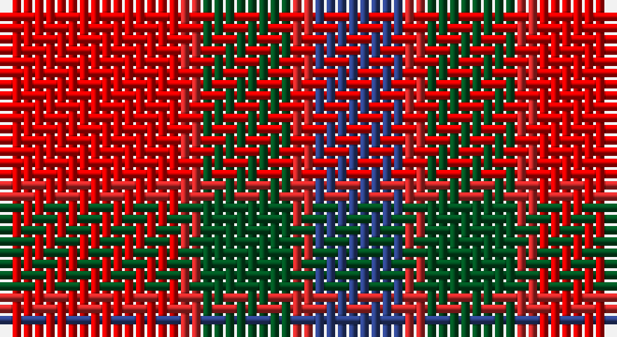

This page is one **sett** — a single exact thread-count. It belongs to the [tartan](/setts/r8ri1dg4ri1db4/)
(the same proportion at any scale), whose colour order is pattern [BRGRR](/stripes/brgrr/).

Part of the [Moray of Abercairney](/tartans/moray-of-abercairney/) tartan — the named design grouping this sett with its other cloths.

Sourced from register-of-tartans.  It is a [5 stripe tartan](/stripes/stripes5/).

Original link https://www.tartanregister.gov.uk/tartanDetails.aspx?ref=3009

## Also known as

This cloth is also recorded under:

- Moray of Abercairney #2

## Register references

External register numbers recorded for this tartan.

- Scottish Register of Tartans: [3009](https://www.tartanregister.gov.uk/tartanDetails.aspx?ref=3009)
- Scottish Tartans World Register: 536

## Thread count
Ra/16 R2 G8 R2 B/8

One full sett is **48 threads**.

## Palette

Palette: <strong>Tartan Register</strong>
<table><thead><tr><th>Colour</th><th>Threads</th><th>Shade</th><th>Base</th><th>OKLCh</th></tr></thead><tbody><tr><td>Ra/</td><td style="text-align:right;font-variant-numeric:tabular-nums">16</td><td><code style="background-color:#DC0000;">#DC0000</code> <small style="color:#888">#DC0000</small></td><td>R <code style="background-color:#CC0000;">#CC0000</code></td><td><small style="color:#888">oklch(56.2% 0.230 29.2)</small></td></tr><tr><td>R</td><td style="text-align:right;font-variant-numeric:tabular-nums">2</td><td><code style="background-color:#C82828;">#C82828</code> <small style="color:#888">#C82828</small></td><td>R <code style="background-color:#CC0000;">#CC0000</code></td><td><small style="color:#888">oklch(54.2% 0.196 26.8)</small></td></tr><tr><td>G</td><td style="text-align:right;font-variant-numeric:tabular-nums">8</td><td><code style="background-color:#005020;">#005020</code> <small style="color:#888">#005020</small></td><td>G <code style="background-color:#006100;">#006100</code></td><td><small style="color:#888">oklch(37.7% 0.105 149.6)</small></td></tr><tr><td>R</td><td style="text-align:right;font-variant-numeric:tabular-nums">2</td><td><code style="background-color:#C82828;">#C82828</code> <small style="color:#888">#C82828</small></td><td>R <code style="background-color:#CC0000;">#CC0000</code></td><td><small style="color:#888">oklch(54.2% 0.196 26.8)</small></td></tr><tr><td>B/</td><td style="text-align:right;font-variant-numeric:tabular-nums">8</td><td><code style="background-color:#2C4084;">#2C4084</code> <small style="color:#888">#2C4084</small></td><td>B <code style="background-color:#2A418A;">#2A418A</code></td><td><small style="color:#888">oklch(39.4% 0.117 268.3)</small></td></tr></tbody></table>

# Sample pattern

## Nearest tartans

The nearest existing variants by ΔTartan distance, with this tartan at the top so the swatches line up against it.

ΔTartan

Tartan

Sett

—

<a href="/ttd/edit/#slug=r8ri1dg4ri1db4~x2">Moray of Abercairney #2</a> <a class="nn-out" href="/variants/s5/r8ri1dg4ri1db4~x2/" title="open its dictionary page">↗</a>

0.49

<a href="/ttd/edit/#slug=ri8r1g4r1db4~x2&amp;base=r8ri1dg4ri1db4~x2">Moray of Abercairney</a> <a class="nn-out" href="/variants/s5/ri8r1g4r1db4~x2/" title="open its dictionary page">↗</a>

0.97

<a href="/ttd/edit/#slug=r8ri1dg4ri1dg1t2~x2&amp;base=r8ri1dg4ri1db4~x2">Moray of Abercairney</a> <a class="nn-out" href="/variants/s6/r8ri1dg4ri1dg1t2~x2/" title="open its dictionary page">↗</a>

1.03

<a href="/ttd/edit/#slug=r24n5o9n2o9lb9~x4&amp;base=r8ri1dg4ri1db4~x2">Plaid Wine</a> <a class="nn-out" href="/variants/s6/r24n5o9n2o9lb9~x4/" title="open its dictionary page">↗</a>

1.09

<a href="/ttd/edit/#slug=do16k13do13r30lo4~x2&amp;base=r8ri1dg4ri1db4~x2">Highland Pub Company</a> <a class="nn-out" href="/variants/s5/do16k13do13r30lo4~x2/" title="open its dictionary page">↗</a>

1.16

<a href="/ttd/edit/#slug=dp2r4g12r3dp6r10w2~x2&amp;base=r8ri1dg4ri1db4~x2">MacKintosh-Geddes (Personal?)</a> <a class="nn-out" href="/variants/s7/dp2r4g12r3dp6r10w2~x2/" title="open its dictionary page">↗</a>

1.20

<a href="/ttd/edit/#slug=m10dy60dt13lo24dt24dy8&amp;base=r8ri1dg4ri1db4~x2">Bronte House Check</a> <a class="nn-out" href="/variants/s6/m10dy60dt13lo24dt24dy8/" title="open its dictionary page">↗</a>

1.20

<a href="/ttd/edit/#slug=r4g26r26p26r3p4~x2&amp;base=r8ri1dg4ri1db4~x2">Unidentified 16</a> <a class="nn-out" href="/variants/s6/r4g26r26p26r3p4~x2/" title="open its dictionary page">↗</a>

1.21

<a href="/ttd/edit/#slug=dp4r3dp26r26g26r4~x2&amp;base=r8ri1dg4ri1db4~x2">Unidentified Artifact Tartan</a> <a class="nn-out" href="/variants/s6/dp4r3dp26r26g26r4~x2/" title="open its dictionary page">↗</a>

1.21

<a href="/ttd/edit/#slug=g12ri11p12r3ri32p8g8p8~x2&amp;base=r8ri1dg4ri1db4~x2">Fiddes</a> <a class="nn-out" href="/variants/s8/g12ri11p12r3ri32p8g8p8~x2/" title="open its dictionary page">↗</a>

1.23

<a href="/ttd/edit/#slug=r3db15r3g8r20k2~x2&amp;base=r8ri1dg4ri1db4~x2">Finnigan (Estimated threadcount)</a> <a class="nn-out" href="/variants/s6/r3db15r3g8r20k2~x2/" title="open its dictionary page">↗</a>

## Neighbour map

Every grey dot is one of 14360 variants placed by the first two principal components of the ΔTartan feature space (44% of its variance). Red is this tartan; blue dots are its nearest — click one to open its page.

<svg viewBox="0 0 640 380" role="img" style="max-width:100%;height:auto;border:1px solid #e0e0e0;border-radius:4px;display:block" xmlns="http://www.w3.org/2000/svg"><image href="/nn/cloud.v1.png" width="640" height="380"/><a href="/variants/s5/ri8r1g4r1db4~x2/"><circle cx="241.6" cy="236.1" r="4" fill="#3465a4"><title>Moray of Abercairney</title></circle></a><a href="/variants/s6/r8ri1dg4ri1dg1t2~x2/"><circle cx="270.7" cy="209.0" r="4" fill="#3465a4"><title>Moray of Abercairney</title></circle></a><a href="/variants/s6/r24n5o9n2o9lb9~x4/"><circle cx="233.5" cy="207.3" r="4" fill="#3465a4"><title>Plaid Wine</title></circle></a><a href="/variants/s5/do16k13do13r30lo4~x2/"><circle cx="217.6" cy="257.2" r="4" fill="#3465a4"><title>Highland Pub Company</title></circle></a><a href="/variants/s7/dp2r4g12r3dp6r10w2~x2/"><circle cx="200.6" cy="223.5" r="4" fill="#3465a4"><title>MacKintosh-Geddes (Personal?)</title></circle></a><a href="/variants/s6/m10dy60dt13lo24dt24dy8/"><circle cx="248.2" cy="223.4" r="4" fill="#3465a4"><title>Bronte House Check</title></circle></a><a href="/variants/s6/r4g26r26p26r3p4~x2/"><circle cx="239.6" cy="232.4" r="4" fill="#3465a4"><title>Unidentified 16</title></circle></a><a href="/variants/s6/dp4r3dp26r26g26r4~x2/"><circle cx="249.0" cy="237.0" r="4" fill="#3465a4"><title>Unidentified Artifact Tartan</title></circle></a><a href="/variants/s8/g12ri11p12r3ri32p8g8p8~x2/"><circle cx="264.1" cy="206.3" r="4" fill="#3465a4"><title>Fiddes</title></circle></a><a href="/variants/s6/r3db15r3g8r20k2~x2/"><circle cx="285.7" cy="208.5" r="4" fill="#3465a4"><title>Finnigan (Estimated threadcount)</title></circle></a><circle cx="239.1" cy="232.3" r="5" fill="#c00000"/></svg>

ID: /variants/s5/r8ri1dg4ri1db4~x2/
