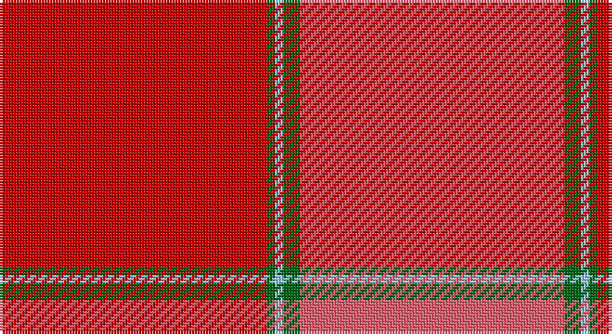

This page is one **sett** — a single exact thread-count. It belongs to the [tartan](/setts/r96g3lb3g6ri95/)
(the same proportion at any scale), whose colour order is pattern [RGWGR](/stripes/rgwgr/).

Part of the [MacNab](/tartans/macnab/) tartan — the named design grouping this sett with its other cloths.

Sourced from tartans-authority.  It is a [5 stripe tartan](/stripes/stripes5/).

Original link http://www.tartansauthority.com/tartan-ferret/display/1451/

## Also known as

This cloth is also recorded under:

- MacNab 3
- MacNab, Ancient

## Register references

External register numbers recorded for this tartan.

- Scottish Tartans Authority (ITI): 1451

## Thread count
R/96 G3 LB3 G6 LR/95

One full sett is **215 threads**.

## Palette

Palette: <strong>Tartan Register</strong> <small style="color:#888">(3 of 4 colours)</small>
<table><thead><tr><th>Colour</th><th>Threads</th><th>Shade</th><th>Base</th><th>OKLCh</th></tr></thead><tbody><tr><td>R/</td><td style="text-align:right;font-variant-numeric:tabular-nums">96</td><td><code style="background-color:#C80000;">#C80000</code> <small style="color:#888">#C80000</small></td><td>R <code style="background-color:#CC0000;">#CC0000</code></td><td><small style="color:#888">oklch(52.3% 0.215 29.2)</small></td></tr><tr><td>G</td><td style="text-align:right;font-variant-numeric:tabular-nums">3</td><td><code style="background-color:#006818;">#006818</code> <small style="color:#888">#006818</small></td><td>G <code style="background-color:#006100;">#006100</code></td><td><small style="color:#888">oklch(45.0% 0.142 145.0)</small></td></tr><tr><td>LB</td><td style="text-align:right;font-variant-numeric:tabular-nums">3</td><td><code style="background-color:#98C8E8;">#98C8E8</code> <small style="color:#888">#98C8E8</small></td><td>W <code style="background-color:#F7F7F7;">#F7F7F7</code></td><td><small style="color:#888">oklch(81.0% 0.068 237.9)</small></td></tr><tr><td>G</td><td style="text-align:right;font-variant-numeric:tabular-nums">6</td><td><code style="background-color:#006818;">#006818</code> <small style="color:#888">#006818</small></td><td>G <code style="background-color:#006100;">#006100</code></td><td><small style="color:#888">oklch(45.0% 0.142 145.0)</small></td></tr><tr><td>LR/</td><td style="text-align:right;font-variant-numeric:tabular-nums">95</td><td><code style="background-color:#E86070;">#E86070</code> <small style="color:#888">#E86070</small></td><td>R <code style="background-color:#CC0000;">#CC0000</code></td><td><small style="color:#888">oklch(66.5% 0.169 15.8)</small></td></tr></tbody></table>

# Sample pattern

## Compared to the master

This cloth is one sett of its design; the master sett (the exemplar the design is anchored on) is below for comparison.

<figure style="margin:0"><figcaption style="color:#888;font-size:smaller">this sett</figcaption></figure>
<figure style="margin:0"><figcaption style="color:#888;font-size:smaller"><a href="/setts/dg8dr1dg1dr1dg1dr6r8dr1r8dr6dg7dr1dg1/">master sett →</a></figcaption></figure>

## Nearest tartans

The nearest existing variants by ΔTartan distance, with this tartan at the top so the swatches line up against it.

ΔTartan

Tartan

Sett

—

<a href="/ttd/edit/#slug=r96g3lb3g6ri95">MacNab - 1800 (Portrait)</a> <a class="nn-out" href="/variants/s5/r96g3lb3g6ri95/" title="open its dictionary page">↗</a>

1.59

<a href="/ttd/edit/#slug=r24g2t1g1m24~x4&amp;base=r96g3lb3g6ri95">MacNab (Smith)</a> <a class="nn-out" href="/variants/s5/r24g2t1g1m24~x4/" title="open its dictionary page">↗</a>

1.64

<a href="/ttd/edit/#slug=r24g2t1g1ri24~x2&amp;base=r96g3lb3g6ri95">MacNab 4</a> <a class="nn-out" href="/variants/s5/r24g2t1g1ri24~x2/" title="open its dictionary page">↗</a>

2.05

<a href="/ttd/edit/#slug=dr24dg1b1dg2r24~x2&amp;base=r96g3lb3g6ri95">MacNab WI 1</a> <a class="nn-out" href="/variants/s5/dr24dg1b1dg2r24~x2/" title="open its dictionary page">↗</a>

2.21

<a href="/variants/s8/r24dg2lb1dg1ri24/">MacNab WI1</a>

2.58

<a href="/ttd/edit/#slug=r2k1r12ri12t1m2~x4&amp;base=r96g3lb3g6ri95">Grelloch (Fashion)</a> <a class="nn-out" href="/variants/s6/r2k1r12ri12t1m2~x4/" title="open its dictionary page">↗</a>

2.58

<a href="/ttd/edit/#slug=w2k1r28k3ri28k1w2~x2&amp;base=r96g3lb3g6ri95">Aberdeen F.C. Corporate Tartan</a> <a class="nn-out" href="/variants/s7/w2k1r28k3ri28k1w2~x2/" title="open its dictionary page">↗</a>

2.63

<a href="/ttd/edit/#slug=r29g2r2g2r6lo21~x4&amp;base=r96g3lb3g6ri95">Maguire, Black (Name)</a> <a class="nn-out" href="/variants/s6/r29g2r2g2r6lo21~x4/" title="open its dictionary page">↗</a>

2.65

<a href="/ttd/edit/#slug=r3ri18rii6r15ri4r3ri4r7w2~x2&amp;base=r96g3lb3g6ri95">Tune Hotels</a> <a class="nn-out" href="/variants/s9/r3ri18rii6r15ri4r3ri4r7w2~x2/" title="open its dictionary page">↗</a>

2.68

<a href="/ttd/edit/#slug=r58n12r5y28r7lo5~x2&amp;base=r96g3lb3g6ri95">Cairn O'Mount (Personal)</a> <a class="nn-out" href="/variants/s6/r58n12r5y28r7lo5~x2/" title="open its dictionary page">↗</a>

2.74

<a href="/ttd/edit/#slug=r3ly2r18db8w1ri18r2~x2&amp;base=r96g3lb3g6ri95">Barbour - Cardinal Red</a> <a class="nn-out" href="/variants/s7/r3ly2r18db8w1ri18r2~x2/" title="open its dictionary page">↗</a>

## Neighbour map

Every grey dot is one of 14360 variants placed by the first two principal components of the ΔTartan feature space (44% of its variance). Red is this tartan; blue dots are its nearest — click one to open its page.

<svg viewBox="0 0 640 380" role="img" style="max-width:100%;height:auto;border:1px solid #e0e0e0;border-radius:4px;display:block" xmlns="http://www.w3.org/2000/svg"><image href="/nn/cloud.v1.png" width="640" height="380"/><a href="/variants/s5/r24g2t1g1m24~x4/"><circle cx="474.0" cy="218.4" r="4" fill="#3465a4"><title>MacNab (Smith)</title></circle></a><a href="/variants/s5/r24g2t1g1ri24~x2/"><circle cx="472.0" cy="220.0" r="4" fill="#3465a4"><title>MacNab 4</title></circle></a><a href="/variants/s5/dr24dg1b1dg2r24~x2/"><circle cx="447.5" cy="214.8" r="4" fill="#3465a4"><title>MacNab WI 1</title></circle></a><a href="/variants/s8/r24dg2lb1dg1ri24/"><circle cx="381.5" cy="132.0" r="4" fill="#3465a4"><title>MacNab WI1</title></circle></a><a href="/variants/s6/r2k1r12ri12t1m2~x4/"><circle cx="409.2" cy="226.9" r="4" fill="#3465a4"><title>Grelloch (Fashion)</title></circle></a><a href="/variants/s7/w2k1r28k3ri28k1w2~x2/"><circle cx="367.0" cy="139.7" r="4" fill="#3465a4"><title>Aberdeen F.C. Corporate Tartan</title></circle></a><a href="/variants/s6/r29g2r2g2r6lo21~x4/"><circle cx="452.8" cy="206.5" r="4" fill="#3465a4"><title>Maguire, Black (Name)</title></circle></a><a href="/variants/s9/r3ri18rii6r15ri4r3ri4r7w2~x2/"><circle cx="347.9" cy="222.7" r="4" fill="#3465a4"><title>Tune Hotels</title></circle></a><a href="/variants/s6/r58n12r5y28r7lo5~x2/"><circle cx="426.8" cy="215.9" r="4" fill="#3465a4"><title>Cairn O'Mount (Personal)</title></circle></a><a href="/variants/s7/r3ly2r18db8w1ri18r2~x2/"><circle cx="304.0" cy="162.6" r="4" fill="#3465a4"><title>Barbour - Cardinal Red</title></circle></a><circle cx="465.2" cy="183.6" r="5" fill="#c00000"/></svg>

ID: /variants/s5/r96g3lb3g6ri95/
