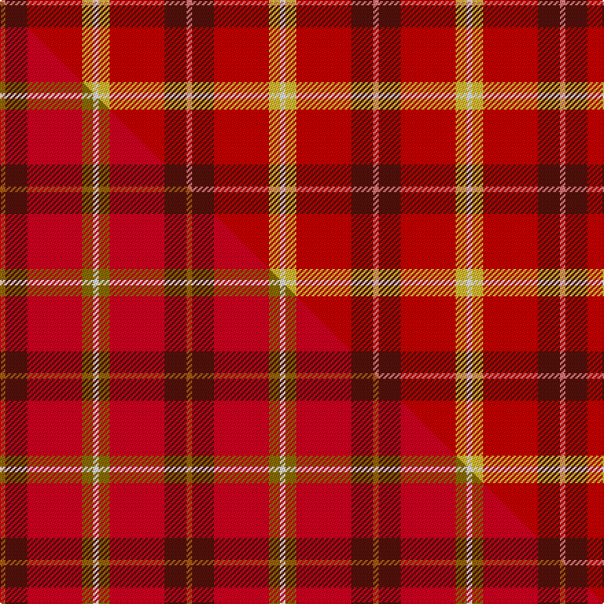

This is one **variant** — a specific cloth: this exact thread count and colourway, with its own
provenance below. It is one weaving of the [sett](/setts/ri1dr4r10ly2w1/) (the scale-free proportion — the
same cloth at any scale or shade), whose colour order is pattern [RBRYW](/stripes/rbryw/).

Part of the [Love](/tartans/l/lo/love/) tartan — the named design grouping this sett with its other cloths.

Sourced from tartans-authority.  It is a [5 stripe tartan](/stripes/stripes5/).

Original link [https://www.tartanregister.gov.uk/tartanDetails.aspx?ref=10521](https://www.tartanregister.gov.uk/tartanDetails.aspx?ref=10521)

Dataset <small>— provenance for this record, inherited from the source manifest</small>

<dl class="dataset-prov">
<dt>source</dt><dd><a href="/sources/tartans-authority/">Scottish Tartans Authority</a></dd>
<dt>data captured from</dt><dd><a href="https://github.com/thetartan/tartan-database/blob/master/data/tartans-authority/data.csv">https://github.com/thetartan/tartan-database/blob/master/data/tartans-authority/data.csv</a></dd>
<dt>data date</dt><dd>1st Dec. 2011 <small>(this record)</small></dd>
<dt>licence</dt><dd><a href="https://creativecommons.org/licenses/by-nc-nd/4.0/">CC BY-NC-ND 4.0</a></dd>
</dl>

Capture chain <small>— the hands this data passed through, oldest first; each capture carries its own licence</small>

<ol class="capture-chain">
<li><a href="https://www.tartansauthority.com/">Scottish Tartans Authority</a> <small>the heritage body's archive — its tartan-ferret record browser is retired (links repaired to the SRT, above)</small></li>
<li><a href="https://github.com/thetartan/tartan-database">thetartan/tartan-database</a> <small>2016-2017</small> · <a href="https://creativecommons.org/licenses/by-nc-nd/4.0/">CC BY-NC-ND 4.0</a> <small>Levko Kravets's frozen compilation — the capture we vendored, and where its CC licence text came from</small></li>
<li>this dictionary <small>captured 2026-06-10 · commit 5bf86c7566</small> <small>each re-capture is a git commit to data/sources</small></li>
</ol>

## Register references

External register numbers recorded for this tartan.

- Scottish Register of Tartans: [10521](https://www.tartanregister.gov.uk/tartanDetails?ref=10521)
- Scottish Tartans Authority (ITI): 10521

## Thread count
Ri/4 DR16 R40 LY8 W/4

One full sett is **136 threads**.

## Palette
<table><thead><tr><th>Colour</th><th>Shade</th><th>OKLCh</th></tr></thead><tbody><tr><td>DR</td><td><code style="background-color:#55120C;">#55120C</code> <small style="color:#888">#55120C</small></td><td><small style="color:#888">oklch(30.0% 0.099 29.3)</small></td></tr><tr><td>LY</td><td><code style="background-color:#DCBC32;">#DCBC32</code> <small style="color:#888">#DCBC32</small></td><td><small style="color:#888">oklch(80.0% 0.150 95.2)</small></td></tr><tr><td>W</td><td><code style="background-color:#F7F7F7;">#F7F7F7</code> <small style="color:#888">#F7F7F7</small></td><td><small style="color:#888">oklch(97.6% 0.000 89.9)</small></td></tr><tr><td>R</td><td><code style="background-color:#E87878;">#E87878</code> <small style="color:#888">#E87878</small></td><td><small style="color:#888">oklch(70.0% 0.139 21.2)</small></td></tr><tr><td>R</td><td><code style="background-color:#C80000;">#C80000</code> <small style="color:#888">#C80000</small></td><td><small style="color:#888">oklch(52.3% 0.215 29.2)</small></td></tr></tbody></table>

# Sample pattern

## Compared to the master

This cloth is one sett of its design; the master sett (the exemplar the design is anchored on) is below for comparison.

Its **ΔTartan distance** from the master is **0.37** — the same measure the nearest-tartans table ranks by (0 is identical; a re-scale of the same cloth is near 0, a recolour or a different proportion further).

<figure class="master-compare" style="margin:0">

this sett
master sett ★

<figcaption style="color:#888;font-size:smaller">One weave of this sett against the <a href="/setts/o1dr4r10y2w1/">master sett ★</a>, split on the diagonal: a shared proportion runs seamlessly across it with only the shades shifting; a different proportion breaks on it.</figcaption>
</figure>

## Nearest tartan variants

The nearest existing variants by ΔTartan distance, with this cloth at the top so the swatches line up against it.

ΔTartan

Threads

Variant

Sett

—

136

<a href="/variants/s5/ri1dr4r10ly2w1~x4~ri2806019-r2109032/">Love (Fashion)</a>

<a href="/ttd/edit/#slug=o1dr4r10y2w1~x4&amp;base=ri1dr4r10ly2w1~x4~ri2806019-r2109032" title="compare in the TTD">0.37</a>

136

<a href="/variants/s5/o1dr4r10y2w1~x4/">Love</a>

<a href="/ttd/edit/#slug=r10dg4dr1w1lb1~x2&amp;base=ri1dr4r10ly2w1~x4~ri2806019-r2109032" title="compare in the TTD">2.00</a>

46

<a href="/variants/s5/r10dg4dr1w1lb1~x2/">Staves (Personal)</a>

<a href="/ttd/edit/#slug=r10dg4dr1w1lb1~x6&amp;base=ri1dr4r10ly2w1~x4~ri2806019-r2109032" title="compare in the TTD">2.00</a>

138

<a href="/variants/s5/r10dg4dr1w1lb1~x6/">Staves (Personal)</a>

<a href="/ttd/edit/#slug=r32w4db7y2lb2~x5&amp;base=ri1dr4r10ly2w1~x4~ri2806019-r2109032" title="compare in the TTD">2.57</a>

300

<a href="/variants/s5/r32w4db7y2lb2~x5/">Sildesalaten</a>

<a href="/ttd/edit/#slug=r32w4db7ly2lb2~x5&amp;base=ri1dr4r10ly2w1~x4~ri2806019-r2109032" title="compare in the TTD">2.58</a>

300

<a href="/variants/s5/r32w4db7ly2lb2~x5/">Sildesalaten</a>

<a href="/ttd/edit/#slug=y1dy5r5w1~x4&amp;base=ri1dr4r10ly2w1~x4~ri2806019-r2109032" title="compare in the TTD">2.67</a>

88

<a href="/variants/s4/y1dy5r5w1~x4/">Manx Mannin Plaid</a>

<a href="/ttd/edit/#slug=ly9r31g12dy2lb9~x2&amp;base=ri1dr4r10ly2w1~x4~ri2806019-r2109032" title="compare in the TTD">2.79</a>

216

<a href="/variants/s5/ly9r31g12dy2lb9~x2/">Buncle (Name)</a>

<a href="/ttd/edit/#slug=y9r31g12dy2lb9~x2&amp;base=ri1dr4r10ly2w1~x4~ri2806019-r2109032" title="compare in the TTD">2.81</a>

216

<a href="/variants/s5/y9r31g12dy2lb9~x2/">Buncle (Duns)</a>

<a href="/ttd/edit/#slug=dg4lb4k2r15ly4~x4&amp;base=ri1dr4r10ly2w1~x4~ri2806019-r2109032" title="compare in the TTD">2.87</a>

200

<a href="/variants/s5/dg4lb4k2r15ly4~x4/">Benedict (Personal)</a>

<a href="/ttd/edit/#slug=r80lb40k5lo6&amp;base=ri1dr4r10ly2w1~x4~ri2806019-r2109032" title="compare in the TTD">2.94</a>

176

<a href="/variants/s4/r80lb40k5lo6/">Broberg (Scania) (Personal)</a>

## Neighbour map

Every grey dot is one of 13621 variants placed by the first two principal components of the ΔTartan feature space (42% of its variance). Red is this tartan; blue dots are its nearest — click one to open its page.

<svg viewBox="0 0 640 380" role="img" style="max-width:100%;height:auto;border:1px solid #e0e0e0;border-radius:4px;display:block" xmlns="http://www.w3.org/2000/svg"><image href="/nn/cloud.v1.png" width="640" height="380"/><a href="/variants/s5/o1dr4r10y2w1~x4/"><circle cx="339.8" cy="200.8" r="4" fill="#3465a4"><title>Love</title></circle></a><a href="/variants/s5/r10dg4dr1w1lb1~x2/"><circle cx="320.7" cy="180.2" r="4" fill="#3465a4"><title>Staves (Personal)</title></circle></a><a href="/variants/s5/r10dg4dr1w1lb1~x6/"><circle cx="320.7" cy="180.2" r="4" fill="#3465a4"><title>Staves (Personal)</title></circle></a><a href="/variants/s5/r32w4db7y2lb2~x5/"><circle cx="414.5" cy="152.9" r="4" fill="#3465a4"><title>Sildesalaten</title></circle></a><a href="/variants/s5/r32w4db7ly2lb2~x5/"><circle cx="410.7" cy="152.1" r="4" fill="#3465a4"><title>Sildesalaten</title></circle></a><a href="/variants/s4/y1dy5r5w1~x4/"><circle cx="228.9" cy="265.7" r="4" fill="#3465a4"><title>Manx Mannin Plaid</title></circle></a><a href="/variants/s5/ly9r31g12dy2lb9~x2/"><circle cx="273.1" cy="197.4" r="4" fill="#3465a4"><title>Buncle (Name)</title></circle></a><a href="/variants/s5/y9r31g12dy2lb9~x2/"><circle cx="292.7" cy="203.8" r="4" fill="#3465a4"><title>Buncle (Duns)</title></circle></a><a href="/variants/s5/dg4lb4k2r15ly4~x4/"><circle cx="206.8" cy="191.1" r="4" fill="#3465a4"><title>Benedict (Personal)</title></circle></a><a href="/variants/s4/r80lb40k5lo6/"><circle cx="372.9" cy="183.4" r="4" fill="#3465a4"><title>Broberg (Scania) (Personal)</title></circle></a><circle cx="314.1" cy="193.1" r="5" fill="#c00000"/><text x="320" y="376" text-anchor="middle" font-size="11" fill="#999">ground</text><text x="11" y="190" text-anchor="middle" font-size="11" fill="#999" transform="rotate(-90 11 190)">complexity</text></svg>

ID: /variants/s5/ri1dr4r10ly2w1~x4~ri2806019-r2109032/
