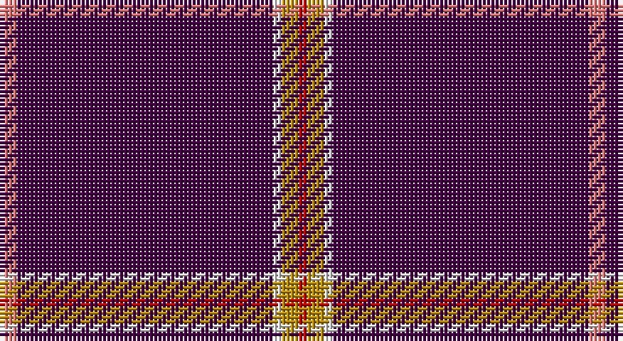

This page is one **sett** — a single exact thread-count. It belongs to the [tartan](/setts/ri2dp30w1lo2r1/)
(the same proportion at any scale), whose colour order is pattern [RBWYR](/stripes/rbwyr/).

Part of the [Wedding](/tartans/wedding/) tartan — the named design grouping this sett with its other cloths.

Sourced from tartans-authority.  It is a [5 stripe tartan](/stripes/stripes5/).

Original link http://www.tartansauthority.com/tartan-ferret/display/10522/

## Register references

External register numbers recorded for this tartan.

- Scottish Register of Tartans: [10522](https://www.tartanregister.gov.uk/tartanDetails?ref=10522)
- Scottish Tartans Authority (ITI): 10522

## Thread count
LR/4 DP60 LN2 DY4 R/2

One full sett is **138 threads**.

## Palette

Palette: <strong>Tartan Register</strong>
<table><thead><tr><th>Colour</th><th>Threads</th><th>Shade</th><th>Base</th><th>OKLCh</th></tr></thead><tbody><tr><td>LR/</td><td style="text-align:right;font-variant-numeric:tabular-nums">4</td><td><code style="background-color:#E87878;">#E87878</code> <small style="color:#888">#E87878</small></td><td>R <code style="background-color:#CC0000;">#CC0000</code></td><td><small style="color:#888">oklch(70.0% 0.139 21.2)</small></td></tr><tr><td>DP</td><td style="text-align:right;font-variant-numeric:tabular-nums">60</td><td><code style="background-color:#440044;">#440044</code> <small style="color:#888">#440044</small></td><td>B <code style="background-color:#2A418A;">#2A418A</code></td><td><small style="color:#888">oklch(27.1% 0.125 328.4)</small></td></tr><tr><td>LN</td><td style="text-align:right;font-variant-numeric:tabular-nums">2</td><td><code style="background-color:#E0E0E0;">#E0E0E0</code> <small style="color:#888">#E0E0E0</small></td><td>W <code style="background-color:#F7F7F7;">#F7F7F7</code></td><td><small style="color:#888">oklch(90.7% 0.000 89.9)</small></td></tr><tr><td>DY</td><td style="text-align:right;font-variant-numeric:tabular-nums">4</td><td><code style="background-color:#BC8C00;">#BC8C00</code> <small style="color:#888">#BC8C00</small></td><td>Y <code style="background-color:#F2BF00;">#F2BF00</code></td><td><small style="color:#888">oklch(66.8% 0.137 84.1)</small></td></tr><tr><td>R/</td><td style="text-align:right;font-variant-numeric:tabular-nums">2</td><td><code style="background-color:#C80000;">#C80000</code> <small style="color:#888">#C80000</small></td><td>R <code style="background-color:#CC0000;">#CC0000</code></td><td><small style="color:#888">oklch(52.3% 0.215 29.2)</small></td></tr></tbody></table>

# Sample pattern

## Compared to the master

This cloth is one sett of its design; the master sett (the exemplar the design is anchored on) is below for comparison.

<figure style="margin:0"><figcaption style="color:#888;font-size:smaller">this sett</figcaption></figure>
<figure style="margin:0"><figcaption style="color:#888;font-size:smaller"><a href="/setts/o2w1dp30dr1oi2/">master sett →</a></figcaption></figure>

## Nearest tartans

The nearest existing variants by ΔTartan distance, with this tartan at the top so the swatches line up against it.

ΔTartan

Tartan

Sett

—

<a href="/ttd/edit/#slug=ri2dp30w1lo2r1~x2">Wedding (Fashion)</a> <a class="nn-out" href="/variants/s5/ri2dp30w1lo2r1~x2/" title="open its dictionary page">↗</a>

1.20

<a href="/ttd/edit/#slug=o2w1dp30dr1oi2~x2&amp;base=ri2dp30w1lo2r1~x2">Wedding</a> <a class="nn-out" href="/variants/s5/o2w1dp30dr1oi2~x2/" title="open its dictionary page">↗</a>

1.70

<a href="/ttd/edit/#slug=dg1k2dp27k2ly1~x2&amp;base=ri2dp30w1lo2r1~x2">Carolina University, Western</a> <a class="nn-out" href="/variants/s5/dg1k2dp27k2ly1~x2/" title="open its dictionary page">↗</a>

1.72

<a href="/ttd/edit/#slug=dp57m5dp2m8lb2dp3ly2dp14~x2&amp;base=ri2dp30w1lo2r1~x2">Cairngorms National Park</a> <a class="nn-out" href="/variants/s8/dp57m5dp2m8lb2dp3ly2dp14~x2/" title="open its dictionary page">↗</a>

1.74

<a href="/ttd/edit/#slug=dp13w2dp8k5lo10dp75lo3~x2&amp;base=ri2dp30w1lo2r1~x2">East Carolina University (Corp.)</a> <a class="nn-out" href="/variants/s7/dp13w2dp8k5lo10dp75lo3~x2/" title="open its dictionary page">↗</a>

2.26

<a href="/ttd/edit/#slug=dg2dp19dg2dp46t2dp10dg3lp2r2~x2&amp;base=ri2dp30w1lo2r1~x2">Spirit of Hoxa (District)</a> <a class="nn-out" href="/variants/s9/dg2dp19dg2dp46t2dp10dg3lp2r2~x2/" title="open its dictionary page">↗</a>

2.28

<a href="/ttd/edit/#slug=w2db49r5ly2r5ly2~x2&amp;base=ri2dp30w1lo2r1~x2">Balmer (Personal)</a> <a class="nn-out" href="/variants/s6/w2db49r5ly2r5ly2~x2/" title="open its dictionary page">↗</a>

2.37

<a href="/ttd/edit/#slug=db32r3db4k1ly3~x2&amp;base=ri2dp30w1lo2r1~x2">MacLaine of Lochbuie, hunting</a> <a class="nn-out" href="/variants/s5/db32r3db4k1ly3~x2/" title="open its dictionary page">↗</a>

2.40

<a href="/ttd/edit/#slug=k4m40k1m3k1w3k4~x2&amp;base=ri2dp30w1lo2r1~x2">Salt Lake County</a> <a class="nn-out" href="/variants/s7/k4m40k1m3k1w3k4~x2/" title="open its dictionary page">↗</a>

2.40

<a href="/ttd/edit/#slug=lo4w1dp48r2ri3r2dp3w1lo4~x2&amp;base=ri2dp30w1lo2r1~x2">Wedding Day (Fashion)</a> <a class="nn-out" href="/variants/s9/lo4w1dp48r2ri3r2dp3w1lo4~x2/" title="open its dictionary page">↗</a>

2.42

<a href="/ttd/edit/#slug=db122r11w4r15ly4db6ly4db30&amp;base=ri2dp30w1lo2r1~x2">Inverness, Duke of York</a> <a class="nn-out" href="/variants/s8/db122r11w4r15ly4db6ly4db30/" title="open its dictionary page">↗</a>

## Neighbour map

Every grey dot is one of 14360 variants placed by the first two principal components of the ΔTartan feature space (44% of its variance). Red is this tartan; blue dots are its nearest — click one to open its page.

<svg viewBox="0 0 640 380" role="img" style="max-width:100%;height:auto;border:1px solid #e0e0e0;border-radius:4px;display:block" xmlns="http://www.w3.org/2000/svg"><image href="/nn/cloud.v1.png" width="640" height="380"/><a href="/variants/s5/o2w1dp30dr1oi2~x2/"><circle cx="592.7" cy="143.1" r="4" fill="#3465a4"><title>Wedding</title></circle></a><a href="/variants/s5/dg1k2dp27k2ly1~x2/"><circle cx="622.1" cy="161.1" r="4" fill="#3465a4"><title>Carolina University, Western</title></circle></a><a href="/variants/s8/dp57m5dp2m8lb2dp3ly2dp14~x2/"><circle cx="613.7" cy="146.2" r="4" fill="#3465a4"><title>Cairngorms National Park</title></circle></a><a href="/variants/s7/dp13w2dp8k5lo10dp75lo3~x2/"><circle cx="617.4" cy="129.4" r="4" fill="#3465a4"><title>East Carolina University (Corp.)</title></circle></a><a href="/variants/s9/dg2dp19dg2dp46t2dp10dg3lp2r2~x2/"><circle cx="626.0" cy="152.5" r="4" fill="#3465a4"><title>Spirit of Hoxa (District)</title></circle></a><a href="/variants/s6/w2db49r5ly2r5ly2~x2/"><circle cx="507.6" cy="140.8" r="4" fill="#3465a4"><title>Balmer (Personal)</title></circle></a><a href="/variants/s5/db32r3db4k1ly3~x2/"><circle cx="596.1" cy="164.5" r="4" fill="#3465a4"><title>MacLaine of Lochbuie, hunting</title></circle></a><a href="/variants/s7/k4m40k1m3k1w3k4~x2/"><circle cx="561.5" cy="120.3" r="4" fill="#3465a4"><title>Salt Lake County</title></circle></a><a href="/variants/s9/lo4w1dp48r2ri3r2dp3w1lo4~x2/"><circle cx="540.3" cy="64.9" r="4" fill="#3465a4"><title>Wedding Day (Fashion)</title></circle></a><a href="/variants/s8/db122r11w4r15ly4db6ly4db30/"><circle cx="575.0" cy="137.8" r="4" fill="#3465a4"><title>Inverness, Duke of York</title></circle></a><circle cx="588.2" cy="129.6" r="5" fill="#c00000"/></svg>

ID: /variants/s5/ri2dp30w1lo2r1~x2/
