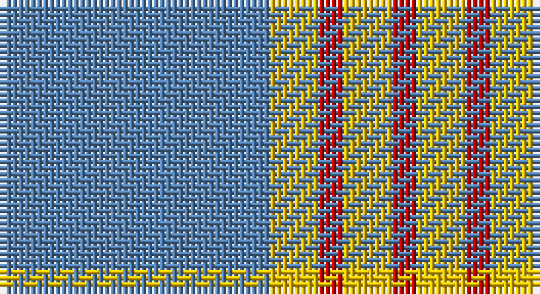

This page is one **sett** — a single exact thread-count. It belongs to the [tartan](/setts/t11ly2r1ly2r1/)
(the same proportion at any scale), whose colour order is pattern [BYRYR](/stripes/byryr/).

Sourced from weddslist.  It is a [5 stripe tartan](/stripes/stripes5/).

Original link http://www.weddslist.com/cgi-bin/tartans/pg.pl?source=sts

## Thread count
B/44 Y8 R4 Y8 R/4

One full sett is **88 threads**.

## Palette

Palette: <strong>custom</strong>
<table><thead><tr><th>Colour</th><th>Threads</th><th>Shade</th><th>Base</th><th>OKLCh</th></tr></thead><tbody><tr><td>B/</td><td style="text-align:right;font-variant-numeric:tabular-nums">44</td><td><code style="background-color:#5480B0;">#5480B0</code> <small style="color:#888">#5480B0</small></td><td>B <code style="background-color:#2A418A;">#2A418A</code></td><td><small style="color:#888">oklch(58.8% 0.089 251.5)</small></td></tr><tr><td>Y</td><td style="text-align:right;font-variant-numeric:tabular-nums">8</td><td><code style="background-color:#F0C000;">#F0C000</code> <small style="color:#888">#F0C000</small></td><td>Y <code style="background-color:#F2BF00;">#F2BF00</code></td><td><small style="color:#888">oklch(82.7% 0.169 90.5)</small></td></tr><tr><td>R</td><td style="text-align:right;font-variant-numeric:tabular-nums">4</td><td><code style="background-color:#C00000;">#C00000</code> <small style="color:#888">#C00000</small></td><td>R <code style="background-color:#CC0000;">#CC0000</code></td><td><small style="color:#888">oklch(50.7% 0.208 29.2)</small></td></tr><tr><td>Y</td><td style="text-align:right;font-variant-numeric:tabular-nums">8</td><td><code style="background-color:#F0C000;">#F0C000</code> <small style="color:#888">#F0C000</small></td><td>Y <code style="background-color:#F2BF00;">#F2BF00</code></td><td><small style="color:#888">oklch(82.7% 0.169 90.5)</small></td></tr><tr><td>R/</td><td style="text-align:right;font-variant-numeric:tabular-nums">4</td><td><code style="background-color:#C00000;">#C00000</code> <small style="color:#888">#C00000</small></td><td>R <code style="background-color:#CC0000;">#CC0000</code></td><td><small style="color:#888">oklch(50.7% 0.208 29.2)</small></td></tr></tbody></table>

# Sample pattern

## Nearest tartans

The nearest existing variants by ΔTartan distance, with this tartan at the top so the swatches line up against it.

ΔTartan

Tartan

Sett

—

<a href="/ttd/edit/#slug=t11ly2r1ly2r1~x4">Carlisle, Ancient</a> <a class="nn-out" href="/variants/s5/t11ly2r1ly2r1~x4/" title="open its dictionary page">↗</a>

0.81

<a href="/ttd/edit/#slug=ly5n1ly1n12r1~x8&amp;base=t11ly2r1ly2r1~x4">Ceredigion (Personal)</a> <a class="nn-out" href="/variants/s5/ly5n1ly1n12r1~x8/" title="open its dictionary page">↗</a>

1.26

<a href="/ttd/edit/#slug=lo72dt16w9dt4w5dt16~x2&amp;base=t11ly2r1ly2r1~x4">Machair</a> <a class="nn-out" href="/variants/s6/lo72dt16w9dt4w5dt16~x2/" title="open its dictionary page">↗</a>

1.29

<a href="/ttd/edit/#slug=lo38w9lo3do9w3~x2&amp;base=t11ly2r1ly2r1~x4">Loch Tummel Trade Tartan</a> <a class="nn-out" href="/variants/s5/lo38w9lo3do9w3~x2/" title="open its dictionary page">↗</a>

1.45

<a href="/ttd/edit/#slug=n62w11k4lg17~x2&amp;base=t11ly2r1ly2r1~x4">Thunderlord (Corporate)</a> <a class="nn-out" href="/variants/s4/n62w11k4lg17~x2/" title="open its dictionary page">↗</a>

1.50

<a href="/ttd/edit/#slug=t11ly5k1ly2r1ly2t11~x12&amp;base=t11ly2r1ly2r1~x4">Carlisle</a> <a class="nn-out" href="/variants/s7/t11ly5k1ly2r1ly2t11~x12/" title="open its dictionary page">↗</a>

1.54

<a href="/ttd/edit/#slug=t50dr4t12dr23ly4dr4~x2&amp;base=t11ly2r1ly2r1~x4">Sligo</a> <a class="nn-out" href="/variants/s6/t50dr4t12dr23ly4dr4~x2/" title="open its dictionary page">↗</a>

1.60

<a href="/ttd/edit/#slug=lg50r4lg12ly23r4g4~x2&amp;base=t11ly2r1ly2r1~x4">Ingenico</a> <a class="nn-out" href="/variants/s6/lg50r4lg12ly23r4g4~x2/" title="open its dictionary page">↗</a>

1.65

<a href="/ttd/edit/#slug=b11lo2r1lo2r1~x4&amp;base=t11ly2r1ly2r1~x4">Carlisle Ancient</a> <a class="nn-out" href="/variants/s5/b11lo2r1lo2r1~x4/" title="open its dictionary page">↗</a>

1.67

<a href="/ttd/edit/#slug=k10t30g3t3g3t3r6~x2&amp;base=t11ly2r1ly2r1~x4">Kinding (Personal)</a> <a class="nn-out" href="/variants/s7/k10t30g3t3g3t3r6~x2/" title="open its dictionary page">↗</a>

1.67

<a href="/ttd/edit/#slug=n6lb2n25lb25n2lb6~x2&amp;base=t11ly2r1ly2r1~x4">Erskine, Grey</a> <a class="nn-out" href="/variants/s6/n6lb2n25lb25n2lb6~x2/" title="open its dictionary page">↗</a>

## Neighbour map

Every grey dot is one of 14360 variants placed by the first two principal components of the ΔTartan feature space (44% of its variance). Red is this tartan; blue dots are its nearest — click one to open its page.

<svg viewBox="0 0 640 380" role="img" style="max-width:100%;height:auto;border:1px solid #e0e0e0;border-radius:4px;display:block" xmlns="http://www.w3.org/2000/svg"><image href="/nn/cloud.v1.png" width="640" height="380"/><a href="/variants/s5/ly5n1ly1n12r1~x8/"><circle cx="432.6" cy="219.4" r="4" fill="#3465a4"><title>Ceredigion (Personal)</title></circle></a><a href="/variants/s6/lo72dt16w9dt4w5dt16~x2/"><circle cx="381.1" cy="179.0" r="4" fill="#3465a4"><title>Machair</title></circle></a><a href="/variants/s5/lo38w9lo3do9w3~x2/"><circle cx="407.9" cy="200.5" r="4" fill="#3465a4"><title>Loch Tummel Trade Tartan</title></circle></a><a href="/variants/s4/n62w11k4lg17~x2/"><circle cx="403.0" cy="211.4" r="4" fill="#3465a4"><title>Thunderlord (Corporate)</title></circle></a><a href="/variants/s7/t11ly5k1ly2r1ly2t11~x12/"><circle cx="365.9" cy="191.7" r="4" fill="#3465a4"><title>Carlisle</title></circle></a><a href="/variants/s6/t50dr4t12dr23ly4dr4~x2/"><circle cx="399.6" cy="207.5" r="4" fill="#3465a4"><title>Sligo</title></circle></a><a href="/variants/s6/lg50r4lg12ly23r4g4~x2/"><circle cx="387.1" cy="197.8" r="4" fill="#3465a4"><title>Ingenico</title></circle></a><a href="/variants/s5/b11lo2r1lo2r1~x4/"><circle cx="395.7" cy="210.1" r="4" fill="#3465a4"><title>Carlisle Ancient</title></circle></a><a href="/variants/s7/k10t30g3t3g3t3r6~x2/"><circle cx="339.2" cy="186.0" r="4" fill="#3465a4"><title>Kinding (Personal)</title></circle></a><a href="/variants/s6/n6lb2n25lb25n2lb6~x2/"><circle cx="355.8" cy="222.2" r="4" fill="#3465a4"><title>Erskine, Grey</title></circle></a><circle cx="407.1" cy="208.9" r="5" fill="#c00000"/></svg>

ID: /variants/s5/t11ly2r1ly2r1~x4/
