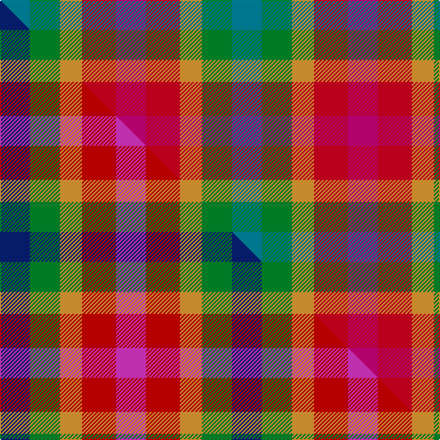

This page is one **sett** — a single exact thread-count. It belongs to the [tartan](/setts/t15g15lo11r17m15/)
(the same proportion at any scale), whose colour order is pattern [BGYRR](/stripes/bgyrr/).

Part of the [Highland Princess, The](/tartans/highland-princess-the/) tartan — the named design grouping this sett with its other cloths.

Sourced from tartans-authority.  It is a [5 stripe tartan](/stripes/stripes5/).

Original link http://www.tartansauthority.com/tartan-ferret/display/11009/

## Register references

External register numbers recorded for this tartan.

- Scottish Register of Tartans: [11009](https://www.tartanregister.gov.uk/tartanDetails?ref=11009)
- Scottish Tartans Authority (ITI): 11009

## Thread count
T/30 G30 LO22 R34 M/30

One full sett is **232 threads**.

## Palette
<table><thead><tr><th>Colour</th><th>Shade</th><th>OKLCh</th></tr></thead><tbody><tr><td>T</td><td><code style="background-color:#00879F;">#00879F</code> <small style="color:#888">#00879F</small></td><td><small style="color:#888">oklch(57.4% 0.102 216.1)</small></td></tr><tr><td>G</td><td><code style="background-color:#008B2A;">#008B2A</code> <small style="color:#888">#008B2A</small></td><td><small style="color:#888">oklch(55.4% 0.170 145.9)</small></td></tr><tr><td>LO</td><td><code style="background-color:#FF9C34;">#FF9C34</code> <small style="color:#888">#FF9C34</small></td><td><small style="color:#888">oklch(77.9% 0.161 61.8)</small></td></tr><tr><td>M</td><td><code style="background-color:#CA047B;">#CA047B</code> <small style="color:#888">#CA047B</small></td><td><small style="color:#888">oklch(55.0% 0.225 353.8)</small></td></tr><tr><td>R</td><td><code style="background-color:#D60020;">#D60020</code> <small style="color:#888">#D60020</small></td><td><small style="color:#888">oklch(55.2% 0.224 25.5)</small></td></tr></tbody></table>

# Sample pattern

## Compared to the master

This cloth is one sett of its design; the master sett (the exemplar the design is anchored on) is below for comparison.

Its **ΔTartan distance** from the master is **2.26** — the same measure the nearest-tartans table ranks by (0 is identical; a re-scale of the same cloth is near 0, a recolour or a different proportion further).

<figure class="master-compare" style="margin:0">

this sett
master sett ★

<figcaption style="color:#888;font-size:smaller">One weave of this sett against the <a href="/setts/db15g15lo11r17m15/">master sett ★</a>, split on the diagonal: a shared proportion runs seamlessly across it with only the shades shifting; a different proportion breaks on it.</figcaption>
</figure>

## Nearest tartan variants

The nearest existing variants by ΔTartan distance, with this cloth at the top so the swatches line up against it.

ΔTartan

Threads

Variant

Sett

—

232

<a href="/variants/s5/t15g15lo11r17m15~x2/">Highland Princess, The</a>

<a href="/ttd/edit/#slug=g2y1lo1r1dp1db1~x36&amp;base=t15g15lo11r17m15~x2" title="compare in the TTD">2.12</a>

396

<a href="/variants/s6/g2y1lo1r1dp1db1~x36/">Rainbow (Fashion)</a>

<a href="/ttd/edit/#slug=db15g15lo11r17m15~x2~r2109032-m2610337&amp;base=t15g15lo11r17m15~x2" title="compare in the TTD">2.26</a>

232

<a href="/variants/s5/db15g15lo11r17m15~x2~r2109032-m2610337/">Highland Princess, The</a>

<a href="/ttd/edit/#slug=r13lo13g13db22w4~x2&amp;base=t15g15lo11r17m15~x2" title="compare in the TTD">2.34</a>

226

<a href="/variants/s5/r13lo13g13db22w4~x2/">Clan Haggis World (Corporate)</a>

<a href="/ttd/edit/#slug=r2db2g3y2~x5&amp;base=t15g15lo11r17m15~x2" title="compare in the TTD">2.92</a>

70

<a href="/variants/s4/r2db2g3y2~x5/">Sturch (Corporate)</a>

<a href="/ttd/edit/#slug=r8lo4y3g6lb6dp1~x5&amp;base=t15g15lo11r17m15~x2" title="compare in the TTD">3.18</a>

235

<a href="/variants/s6/r8lo4y3g6lb6dp1~x5/">Pride, The Tartan of</a>

<a href="/ttd/edit/#slug=r2g2lb1~x4&amp;base=t15g15lo11r17m15~x2" title="compare in the TTD">3.38</a>

28

<a href="/variants/s3/r2g2lb1~x4/">Wilson's, No 207</a>

<a href="/ttd/edit/#slug=dg35g25r15lb23~x2~dg1804173-g2003114&amp;base=t15g15lo11r17m15~x2" title="compare in the TTD">3.57</a>

276

<a href="/variants/s4/dg35g25r15lb23~x2~dg1804173-g2003114/">Dunans Rising</a>

<a href="/ttd/edit/#slug=r4g7lb4~x2&amp;base=t15g15lo11r17m15~x2" title="compare in the TTD">3.90</a>

44

<a href="/variants/s3/r4g7lb4~x2/">Wilson's, No 61</a>

<a href="/ttd/edit/#slug=dg2y1b1r1dp1db1~x36&amp;base=t15g15lo11r17m15~x2" title="compare in the TTD">3.93</a>

396

<a href="/variants/s6/dg2y1b1r1dp1db1~x36/">Rainbow</a>

<a href="/ttd/edit/#slug=dr1ri3r1g1dp1~x4~dr1004029-ri1506019&amp;base=t15g15lo11r17m15~x2" title="compare in the TTD">3.94</a>

48

<a href="/variants/s5/dr1ri3r1g1dp1~x4~dr1004029-ri1506019/">Blairgowrie Berries and Cherries</a>

## Neighbour map

Every grey dot is one of 13620 variants placed by the first two principal components of the ΔTartan feature space (42% of its variance). Red is this tartan; blue dots are its nearest — click one to open its page.

<svg viewBox="0 0 640 380" role="img" style="max-width:100%;height:auto;border:1px solid #e0e0e0;border-radius:4px;display:block" xmlns="http://www.w3.org/2000/svg"><image href="/nn/cloud.v1.png" width="640" height="380"/><a href="/variants/s6/g2y1lo1r1dp1db1~x36/"><circle cx="22.5" cy="316.4" r="4" fill="#3465a4"><title>Rainbow (Fashion)</title></circle></a><a href="/variants/s5/db15g15lo11r17m15~x2~r2109032-m2610337/"><circle cx="14.0" cy="366.0" r="4" fill="#3465a4"><title>Highland Princess, The</title></circle></a><a href="/variants/s5/r13lo13g13db22w4~x2/"><circle cx="98.9" cy="272.0" r="4" fill="#3465a4"><title>Clan Haggis World (Corporate)</title></circle></a><a href="/variants/s4/r2db2g3y2~x5/"><circle cx="91.1" cy="366.0" r="4" fill="#3465a4"><title>Sturch (Corporate)</title></circle></a><a href="/variants/s6/r8lo4y3g6lb6dp1~x5/"><circle cx="116.7" cy="246.4" r="4" fill="#3465a4"><title>Pride, The Tartan of</title></circle></a><a href="/variants/s3/r2g2lb1~x4/"><circle cx="189.6" cy="366.0" r="4" fill="#3465a4"><title>Wilson's, No 207</title></circle></a><a href="/variants/s4/dg35g25r15lb23~x2~dg1804173-g2003114/"><circle cx="155.2" cy="366.0" r="4" fill="#3465a4"><title>Dunans Rising</title></circle></a><a href="/variants/s3/r4g7lb4~x2/"><circle cx="203.4" cy="366.0" r="4" fill="#3465a4"><title>Wilson's, No 61</title></circle></a><a href="/variants/s6/dg2y1b1r1dp1db1~x36/"><circle cx="53.5" cy="325.1" r="4" fill="#3465a4"><title>Rainbow</title></circle></a><a href="/variants/s5/dr1ri3r1g1dp1~x4~dr1004029-ri1506019/"><circle cx="222.9" cy="293.5" r="4" fill="#3465a4"><title>Blairgowrie Berries and Cherries</title></circle></a><circle cx="22.8" cy="366.0" r="5" fill="#c00000"/><text x="320" y="376" text-anchor="middle" font-size="11" fill="#999">ground</text><text x="11" y="190" text-anchor="middle" font-size="11" fill="#999" transform="rotate(-90 11 190)">complexity</text></svg>

ID: /variants/s5/t15g15lo11r17m15~x2/
