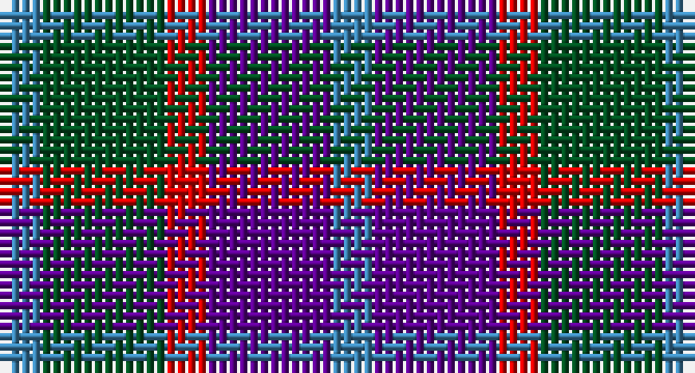

This page is one **sett** — a single exact thread-count. It belongs to the [tartan](/setts/t1dg3r1dp3t1/)
(the same proportion at any scale), whose colour order is pattern [BBRGB](/stripes/bbrgb/).

Sourced from register-of-tartans.  It is a [5 stripe tartan](/stripes/stripes5/).

Original link https://www.tartanregister.gov.uk/tartanDetails.aspx?ref=4762

## Also known as

This cloth is also recorded under:

- Wilson's, No 95

## Register references

External register numbers recorded for this tartan.

- Scottish Register of Tartans: [4762](https://www.tartanregister.gov.uk/tartanDetails.aspx?ref=4762)
- Scottish Tartans World Register: 67

## Thread count
B/4 G12 R4 P12 B/4

One full sett is **64 threads**.

## Palette

Palette: <strong>Tartan Register</strong>
<table><thead><tr><th>Colour</th><th>Threads</th><th>Shade</th><th>Base</th><th>OKLCh</th></tr></thead><tbody><tr><td>B/</td><td style="text-align:right;font-variant-numeric:tabular-nums">4</td><td><code style="background-color:#3C82AF;">#3C82AF</code> <small style="color:#888">#3C82AF</small></td><td>B <code style="background-color:#2A418A;">#2A418A</code></td><td><small style="color:#888">oklch(58.1% 0.099 239.8)</small></td></tr><tr><td>G</td><td style="text-align:right;font-variant-numeric:tabular-nums">12</td><td><code style="background-color:#005020;">#005020</code> <small style="color:#888">#005020</small></td><td>G <code style="background-color:#006100;">#006100</code></td><td><small style="color:#888">oklch(37.7% 0.105 149.6)</small></td></tr><tr><td>R</td><td style="text-align:right;font-variant-numeric:tabular-nums">4</td><td><code style="background-color:#DC0000;">#DC0000</code> <small style="color:#888">#DC0000</small></td><td>R <code style="background-color:#CC0000;">#CC0000</code></td><td><small style="color:#888">oklch(56.2% 0.230 29.2)</small></td></tr><tr><td>P</td><td style="text-align:right;font-variant-numeric:tabular-nums">12</td><td><code style="background-color:#5A008C;">#5A008C</code> <small style="color:#888">#5A008C</small></td><td>B <code style="background-color:#2A418A;">#2A418A</code></td><td><small style="color:#888">oklch(37.0% 0.191 306.3)</small></td></tr><tr><td>B/</td><td style="text-align:right;font-variant-numeric:tabular-nums">4</td><td><code style="background-color:#3C82AF;">#3C82AF</code> <small style="color:#888">#3C82AF</small></td><td>B <code style="background-color:#2A418A;">#2A418A</code></td><td><small style="color:#888">oklch(58.1% 0.099 239.8)</small></td></tr></tbody></table>

# Sample pattern

## Nearest tartans

The nearest existing variants by ΔTartan distance, with this tartan at the top so the swatches line up against it.

ΔTartan

Tartan

Sett

—

<a href="/ttd/edit/#slug=t1dg3r1dp3t1~x4">Wilson's No.95</a> <a class="nn-out" href="/variants/s5/t1dg3r1dp3t1~x4/" title="open its dictionary page">↗</a>

0.89

<a href="/ttd/edit/#slug=t1g3r1p3t1~x4&amp;base=t1dg3r1dp3t1~x4">Wilson's, No 95</a> <a class="nn-out" href="/variants/s5/t1g3r1p3t1~x4/" title="open its dictionary page">↗</a>

1.15

<a href="/ttd/edit/#slug=dp3k3dp3dg6r2~x2&amp;base=t1dg3r1dp3t1~x4">Austin (Wilson's No 137)</a> <a class="nn-out" href="/variants/s5/dp3k3dp3dg6r2~x2/" title="open its dictionary page">↗</a>

1.29

<a href="/ttd/edit/#slug=r4b3t11db8b2r4&amp;base=t1dg3r1dp3t1~x4">St. Edmunds (School)</a> <a class="nn-out" href="/variants/s6/r4b3t11db8b2r4/" title="open its dictionary page">↗</a>

1.40

<a href="/ttd/edit/#slug=db4lr3db4lr3m3o11m3~x2&amp;base=t1dg3r1dp3t1~x4">Stevens #2</a> <a class="nn-out" href="/variants/s7/db4lr3db4lr3m3o11m3~x2/" title="open its dictionary page">↗</a>

1.41

<a href="/ttd/edit/#slug=r9dt6db13dt21y18w4~x2&amp;base=t1dg3r1dp3t1~x4">Fox-Eves Wedding</a> <a class="nn-out" href="/variants/s6/r9dt6db13dt21y18w4~x2/" title="open its dictionary page">↗</a>

1.43

<a href="/ttd/edit/#slug=dp3k3dp3dg6ly2~x2&amp;base=t1dg3r1dp3t1~x4">Austin (Wilson's No 173)</a> <a class="nn-out" href="/variants/s5/dp3k3dp3dg6ly2~x2/" title="open its dictionary page">↗</a>

1.45

<a href="/ttd/edit/#slug=k1g3k3db3r1~x4&amp;base=t1dg3r1dp3t1~x4">Durham District Tartan</a> <a class="nn-out" href="/variants/s5/k1g3k3db3r1~x4/" title="open its dictionary page">↗</a>

1.59

<a href="/variants/s4/dp3o1g2~x10/">Coleman, Sarah-Louise (Personal)</a>

1.61

<a href="/ttd/edit/#slug=dp6k5dg5r1~x2&amp;base=t1dg3r1dp3t1~x4">Unidentified No 60</a> <a class="nn-out" href="/variants/s4/dp6k5dg5r1~x2/" title="open its dictionary page">↗</a>

1.61

<a href="/ttd/edit/#slug=t3dg12k14t11r3t3~x2&amp;base=t1dg3r1dp3t1~x4">Wellington or Waterloo</a> <a class="nn-out" href="/variants/s6/t3dg12k14t11r3t3~x2/" title="open its dictionary page">↗</a>

## Neighbour map

Every grey dot is one of 14360 variants placed by the first two principal components of the ΔTartan feature space (44% of its variance). Red is this tartan; blue dots are its nearest — click one to open its page.

<svg viewBox="0 0 640 380" role="img" style="max-width:100%;height:auto;border:1px solid #e0e0e0;border-radius:4px;display:block" xmlns="http://www.w3.org/2000/svg"><image href="/nn/cloud.v1.png" width="640" height="380"/><a href="/variants/s5/t1g3r1p3t1~x4/"><circle cx="123.8" cy="289.4" r="4" fill="#3465a4"><title>Wilson's, No 95</title></circle></a><a href="/variants/s5/dp3k3dp3dg6r2~x2/"><circle cx="122.6" cy="317.4" r="4" fill="#3465a4"><title>Austin (Wilson's No 137)</title></circle></a><a href="/variants/s6/r4b3t11db8b2r4/"><circle cx="157.5" cy="262.0" r="4" fill="#3465a4"><title>St. Edmunds (School)</title></circle></a><a href="/variants/s7/db4lr3db4lr3m3o11m3~x2/"><circle cx="122.9" cy="253.8" r="4" fill="#3465a4"><title>Stevens #2</title></circle></a><a href="/variants/s6/r9dt6db13dt21y18w4~x2/"><circle cx="123.0" cy="255.8" r="4" fill="#3465a4"><title>Fox-Eves Wedding</title></circle></a><a href="/variants/s5/dp3k3dp3dg6ly2~x2/"><circle cx="93.5" cy="305.8" r="4" fill="#3465a4"><title>Austin (Wilson's No 173)</title></circle></a><a href="/variants/s5/k1g3k3db3r1~x4/"><circle cx="130.3" cy="319.2" r="4" fill="#3465a4"><title>Durham District Tartan</title></circle></a><a href="/variants/s4/dp3o1g2~x10/"><circle cx="195.2" cy="326.2" r="4" fill="#3465a4"><title>Coleman, Sarah-Louise (Personal)</title></circle></a><a href="/variants/s4/dp6k5dg5r1~x2/"><circle cx="170.6" cy="302.8" r="4" fill="#3465a4"><title>Unidentified No 60</title></circle></a><a href="/variants/s6/t3dg12k14t11r3t3~x2/"><circle cx="149.5" cy="265.5" r="4" fill="#3465a4"><title>Wellington or Waterloo</title></circle></a><circle cx="128.8" cy="296.7" r="5" fill="#c00000"/></svg>

ID: /variants/s5/t1dg3r1dp3t1~x4/
