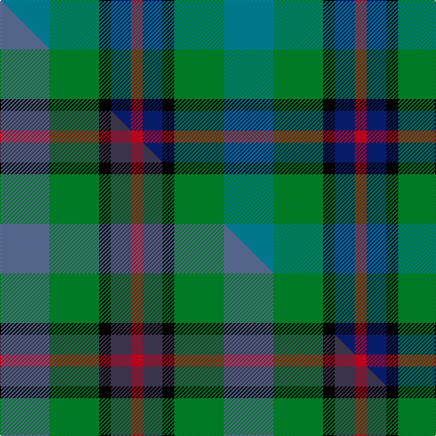

This page is one **sett** — a single exact thread-count. It belongs to the [tartan](/setts/t25g25k6db10r6/)
(the same proportion at any scale), whose colour order is pattern [BGKBR](/stripes/bgkbr/).

Part of the [Breon](/tartans/breon/) tartan — the named design grouping this sett with its other cloths.

Sourced from tartans-authority.  It is a [5 stripe tartan](/stripes/stripes5/).

Original link http://www.tartansauthority.com/tartan-ferret/display/10488/

## Register references

External register numbers recorded for this tartan.

- Scottish Register of Tartans: [10488](https://www.tartanregister.gov.uk/tartanDetails?ref=10488)
- Scottish Tartans Authority (ITI): 10488

## Thread count
T/50 G50 K12 DB20 R/12

One full sett is **226 threads**.

## Palette
<table><thead><tr><th>Colour</th><th>Shade</th><th>OKLCh</th></tr></thead><tbody><tr><td>T</td><td><code style="background-color:#00879F;">#00879F</code> <small style="color:#888">#00879F</small></td><td><small style="color:#888">oklch(57.4% 0.102 216.1)</small></td></tr><tr><td>DB</td><td><code style="background-color:#082077;">#082077</code> <small style="color:#888">#082077</small></td><td><small style="color:#888">oklch(30.0% 0.149 265.1)</small></td></tr><tr><td>G</td><td><code style="background-color:#008B2A;">#008B2A</code> <small style="color:#888">#008B2A</small></td><td><small style="color:#888">oklch(55.4% 0.170 145.9)</small></td></tr><tr><td>K</td><td><code style="background-color:#000000;">#000000</code> <small style="color:#888">#000000</small></td><td><small style="color:#888">oklch(0.0% 0.000 0.0)</small></td></tr><tr><td>R</td><td><code style="background-color:#D60020;">#D60020</code> <small style="color:#888">#D60020</small></td><td><small style="color:#888">oklch(55.2% 0.224 25.5)</small></td></tr></tbody></table>

# Sample pattern

## Compared to the master

This cloth is one sett of its design; the master sett (the exemplar the design is anchored on) is below for comparison.

Its **ΔTartan distance** from the master is **0.77** — the same measure the nearest-tartans table ranks by (0 is identical; a re-scale of the same cloth is near 0, a recolour or a different proportion further).

<figure class="master-compare" style="margin:0">

this sett
master sett ★

<figcaption style="color:#888;font-size:smaller">One weave of this sett against the <a href="/setts/n25g25k6dp10r6/">master sett ★</a>, split on the diagonal: a shared proportion runs seamlessly across it with only the shades shifting; a different proportion breaks on it.</figcaption>
</figure>

## Nearest tartan variants

The nearest existing variants by ΔTartan distance, with this cloth at the top so the swatches line up against it.

ΔTartan

Threads

Variant

Sett

—

226

<a href="/variants/s5/t25g25k6db10r6~x2/">Breon (Personal)</a>

<a href="/ttd/edit/#slug=r2db12k7g8lb2~x4&amp;base=t25g25k6db10r6~x2" title="compare in the TTD">0.92</a>

232

<a href="/variants/s5/r2db12k7g8lb2~x4/">Forbo Nairn</a>

<a href="/ttd/edit/#slug=n25g25k6dp10r6~x2~n2203265-dp1502305&amp;base=t25g25k6db10r6~x2" title="compare in the TTD">1.70</a>

226

<a href="/variants/s5/n25g25k6dp10r6~x2~n2203265-dp1502305/">Breon (Jersey Shore, Pennsylvania) (Personal)</a>

<a href="/ttd/edit/#slug=k2lb2g8db8w1~x2&amp;base=t25g25k6db10r6~x2" title="compare in the TTD">1.83</a>

78

<a href="/variants/s5/k2lb2g8db8w1~x2/">Douglas</a>

<a href="/ttd/edit/#slug=k2lb2g8db8w1&amp;base=t25g25k6db10r6~x2" title="compare in the TTD">1.83</a>

39

<a href="/variants/s5/k2lb2g8db8w1/">Douglas</a>

<a href="/ttd/edit/#slug=r2db10k5g12w2~x2&amp;base=t25g25k6db10r6~x2" title="compare in the TTD">1.85</a>

116

<a href="/variants/s5/r2db10k5g12w2~x2/">Davidson of Tulloch</a>

<a href="/ttd/edit/#slug=k4t2g13db13w2~x4&amp;base=t25g25k6db10r6~x2" title="compare in the TTD">1.85</a>

248

<a href="/variants/s5/k4t2g13db13w2~x4/">Bath</a>

<a href="/ttd/edit/#slug=r1db6k3g6w1~x4&amp;base=t25g25k6db10r6~x2" title="compare in the TTD">1.87</a>

128

<a href="/variants/s5/r1db6k3g6w1~x4/">Davidson of Tulloch #2</a>

<a href="/ttd/edit/#slug=r1db6k3g6w1&amp;base=t25g25k6db10r6~x2" title="compare in the TTD">1.87</a>

32

<a href="/variants/s5/r1db6k3g6w1/">Davidson of Tulloch</a>

<a href="/ttd/edit/#slug=r1db6k3g6w1~x2&amp;base=t25g25k6db10r6~x2" title="compare in the TTD">1.87</a>

64

<a href="/variants/s5/r1db6k3g6w1~x2/">Davidson of Tulloch</a>

<a href="/ttd/edit/#slug=r2k1db6k2g6b2~x4&amp;base=t25g25k6db10r6~x2" title="compare in the TTD">1.89</a>

136

<a href="/variants/s6/r2k1db6k2g6b2~x4/">MacCaughan, or MacEachain</a>

## Neighbour map

Every grey dot is one of 13620 variants placed by the first two principal components of the ΔTartan feature space (42% of its variance). Red is this tartan; blue dots are its nearest — click one to open its page.

<svg viewBox="0 0 640 380" role="img" style="max-width:100%;height:auto;border:1px solid #e0e0e0;border-radius:4px;display:block" xmlns="http://www.w3.org/2000/svg"><image href="/nn/cloud.v1.png" width="640" height="380"/><a href="/variants/s5/r2db12k7g8lb2~x4/"><circle cx="114.8" cy="230.9" r="4" fill="#3465a4"><title>Forbo Nairn</title></circle></a><a href="/variants/s5/n25g25k6dp10r6~x2~n2203265-dp1502305/"><circle cx="133.3" cy="262.1" r="4" fill="#3465a4"><title>Breon (Jersey Shore, Pennsylvania) (Personal)</title></circle></a><a href="/variants/s5/k2lb2g8db8w1~x2/"><circle cx="150.1" cy="216.8" r="4" fill="#3465a4"><title>Douglas</title></circle></a><a href="/variants/s5/k2lb2g8db8w1/"><circle cx="150.1" cy="216.8" r="4" fill="#3465a4"><title>Douglas</title></circle></a><a href="/variants/s5/r2db10k5g12w2~x2/"><circle cx="116.5" cy="226.1" r="4" fill="#3465a4"><title>Davidson of Tulloch</title></circle></a><a href="/variants/s5/k4t2g13db13w2~x4/"><circle cx="142.0" cy="220.6" r="4" fill="#3465a4"><title>Bath</title></circle></a><a href="/variants/s5/r1db6k3g6w1~x4/"><circle cx="106.6" cy="227.1" r="4" fill="#3465a4"><title>Davidson of Tulloch #2</title></circle></a><a href="/variants/s5/r1db6k3g6w1/"><circle cx="106.6" cy="227.1" r="4" fill="#3465a4"><title>Davidson of Tulloch</title></circle></a><a href="/variants/s5/r1db6k3g6w1~x2/"><circle cx="106.6" cy="227.1" r="4" fill="#3465a4"><title>Davidson of Tulloch</title></circle></a><a href="/variants/s6/r2k1db6k2g6b2~x4/"><circle cx="85.6" cy="223.0" r="4" fill="#3465a4"><title>MacCaughan, or MacEachain</title></circle></a><circle cx="118.9" cy="260.9" r="5" fill="#c00000"/><text x="320" y="376" text-anchor="middle" font-size="11" fill="#999">ground</text><text x="11" y="190" text-anchor="middle" font-size="11" fill="#999" transform="rotate(-90 11 190)">complexity</text></svg>

ID: /variants/s5/t25g25k6db10r6~x2/
