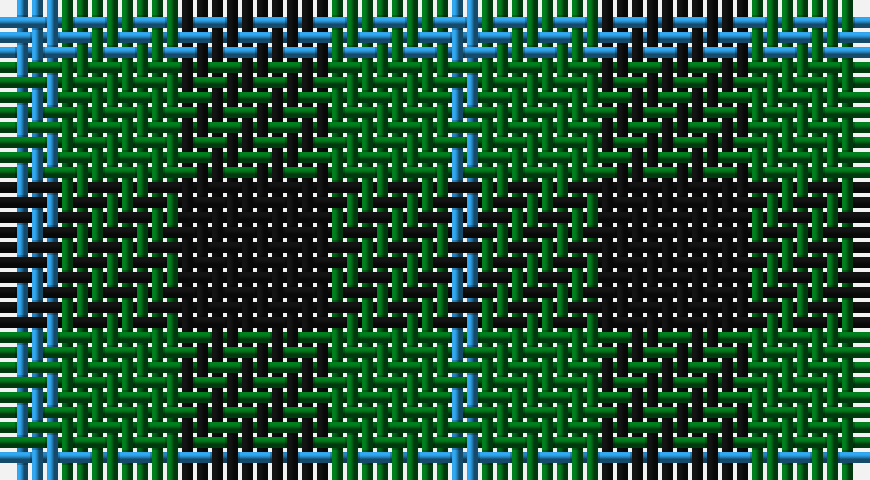

This page is one **sett** — a single exact thread-count. It belongs to the [tartan](/setts/t2g4k5g4t1/)
(the same proportion at any scale), whose colour order is pattern [BGKGB](/stripes/bgkgb/).

Part of the [Glen Lyon](/tartans/glen-lyon-2/) tartan — the named design grouping this sett with its other cloths.

Sourced from register-of-tartans.  It is a [5 stripe tartan](/stripes/stripes5/).

Original link https://www.tartanregister.gov.uk/tartanDetails.aspx?ref=1382

## Also known as

This cloth is also recorded under:

- Glen Lyon #1
- Glen Lyon #2
- Wilson's No.053

2 attestations — the source records this cloth was collapsed from (oldest owns this page)

<ul>
<li>01/01/1819 — Glen Lyon #2 (register-of-tartans, <a href="https://www.tartanregister.gov.uk/tartanDetails.aspx?ref=1382">record</a>)</li>
<li>01/01/1819 — Wilson's No.053 (register-of-tartans, <a href="https://www.tartanregister.gov.uk/tartanDetails.aspx?ref=4657">record</a>)</li>
</ul>

## Register references

External register numbers recorded for this tartan.

- Scottish Register of Tartans: [4657](https://www.tartanregister.gov.uk/tartanDetails.aspx?ref=4657)
- Scottish Tartans Authority (ITI): 5611
- Scottish Tartans World Register: 24

## Thread count
B/4 G8 K10 G8 B/2

One full sett is **58 threads**.

## Palette

Palette: <strong>Tartan Register</strong>
<table><thead><tr><th>Colour</th><th>Threads</th><th>Shade</th><th>Base</th><th>OKLCh</th></tr></thead><tbody><tr><td>B/</td><td style="text-align:right;font-variant-numeric:tabular-nums">4</td><td><code style="background-color:#2888C4;">#2888C4</code> <small style="color:#888">#2888C4</small></td><td>B <code style="background-color:#2A418A;">#2A418A</code></td><td><small style="color:#888">oklch(60.1% 0.125 241.5)</small></td></tr><tr><td>G</td><td style="text-align:right;font-variant-numeric:tabular-nums">8</td><td><code style="background-color:#006818;">#006818</code> <small style="color:#888">#006818</small></td><td>G <code style="background-color:#006100;">#006100</code></td><td><small style="color:#888">oklch(45.0% 0.142 145.0)</small></td></tr><tr><td>K</td><td style="text-align:right;font-variant-numeric:tabular-nums">10</td><td><code style="background-color:#101010;">#101010</code> <small style="color:#888">#101010</small></td><td>K <code style="background-color:#000000;">#000000</code></td><td><small style="color:#888">oklch(17.3% 0.000 89.9)</small></td></tr><tr><td>G</td><td style="text-align:right;font-variant-numeric:tabular-nums">8</td><td><code style="background-color:#006818;">#006818</code> <small style="color:#888">#006818</small></td><td>G <code style="background-color:#006100;">#006100</code></td><td><small style="color:#888">oklch(45.0% 0.142 145.0)</small></td></tr><tr><td>B/</td><td style="text-align:right;font-variant-numeric:tabular-nums">2</td><td><code style="background-color:#2888C4;">#2888C4</code> <small style="color:#888">#2888C4</small></td><td>B <code style="background-color:#2A418A;">#2A418A</code></td><td><small style="color:#888">oklch(60.1% 0.125 241.5)</small></td></tr></tbody></table>

# Sample pattern

## Compared to the master

This cloth is one sett of its design; the master sett (the exemplar the design is anchored on) is below for comparison.

<figure style="margin:0"><figcaption style="color:#888;font-size:smaller">this sett</figcaption></figure>
<figure style="margin:0"><figcaption style="color:#888;font-size:smaller"><a href="/setts/k6g5r2/">master sett →</a></figcaption></figure>

## Nearest tartans

The nearest existing variants by ΔTartan distance, with this tartan at the top so the swatches line up against it.

ΔTartan

Tartan

Sett

—

<a href="/ttd/edit/#slug=t2g4k5g4t1~x2">Glen Lyon #2</a> <a class="nn-out" href="/variants/s5/t2g4k5g4t1~x2/" title="open its dictionary page">↗</a>

1.31

<a href="/ttd/edit/#slug=k5g14db12g4~x4&amp;base=t2g4k5g4t1~x2">MacCurdie (Clan?)</a> <a class="nn-out" href="/variants/s4/k5g14db12g4~x4/" title="open its dictionary page">↗</a>

1.32

<a href="/ttd/edit/#slug=g4k5g4ly1~x2&amp;base=t2g4k5g4t1~x2">Wilson's No.053 #2</a> <a class="nn-out" href="/variants/s4/g4k5g4ly1~x2/" title="open its dictionary page">↗</a>

1.35

<a href="/ttd/edit/#slug=k5g6t1~x4&amp;base=t2g4k5g4t1~x2">Wilson's No.050</a> <a class="nn-out" href="/variants/s3/k5g6t1~x4/" title="open its dictionary page">↗</a>

1.43

<a href="/ttd/edit/#slug=b6k6b18k18g22k5~x2&amp;base=t2g4k5g4t1~x2">Campbell, The 42nd</a> <a class="nn-out" href="/variants/s6/b6k6b18k18g22k5~x2/" title="open its dictionary page">↗</a>

1.48

<a href="/ttd/edit/#slug=db5g2db5g8w1~x8&amp;base=t2g4k5g4t1~x2">Hamilton, hunting</a> <a class="nn-out" href="/variants/s5/db5g2db5g8w1~x8/" title="open its dictionary page">↗</a>

1.48

<a href="/ttd/edit/#slug=g7k6b7k1b2~x2&amp;base=t2g4k5g4t1~x2">Campbell of Glenlyon</a> <a class="nn-out" href="/variants/s5/g7k6b7k1b2~x2/" title="open its dictionary page">↗</a>

1.48

<a href="/ttd/edit/#slug=g7k6b7k1b2~x4&amp;base=t2g4k5g4t1~x2">Campbell of Glenlyon Check (Clan)</a> <a class="nn-out" href="/variants/s5/g7k6b7k1b2~x4/" title="open its dictionary page">↗</a>

1.51

<a href="/ttd/edit/#slug=k9g3k3g12ly2~x4&amp;base=t2g4k5g4t1~x2">MacArthur</a> <a class="nn-out" href="/variants/s5/k9g3k3g12ly2~x4/" title="open its dictionary page">↗</a>

1.54

<a href="/ttd/edit/#slug=db5g6r1~x4&amp;base=t2g4k5g4t1~x2">Wilson's No 84, Ferguson</a> <a class="nn-out" href="/variants/s3/db5g6r1~x4/" title="open its dictionary page">↗</a>

1.60

<a href="/ttd/edit/#slug=k30lb7g36k5~x2&amp;base=t2g4k5g4t1~x2">Innes Hunting</a> <a class="nn-out" href="/variants/s4/k30lb7g36k5~x2/" title="open its dictionary page">↗</a>

## Neighbour map

Every grey dot is one of 14360 variants placed by the first two principal components of the ΔTartan feature space (44% of its variance). Red is this tartan; blue dots are its nearest — click one to open its page.

<svg viewBox="0 0 640 380" role="img" style="max-width:100%;height:auto;border:1px solid #e0e0e0;border-radius:4px;display:block" xmlns="http://www.w3.org/2000/svg"><image href="/nn/cloud.v1.png" width="640" height="380"/><a href="/variants/s4/k5g14db12g4~x4/"><circle cx="265.3" cy="347.3" r="4" fill="#3465a4"><title>MacCurdie (Clan?)</title></circle></a><a href="/variants/s4/g4k5g4ly1~x2/"><circle cx="279.2" cy="328.9" r="4" fill="#3465a4"><title>Wilson's No.053 #2</title></circle></a><a href="/variants/s3/k5g6t1~x4/"><circle cx="284.5" cy="326.7" r="4" fill="#3465a4"><title>Wilson's No.050</title></circle></a><a href="/variants/s6/b6k6b18k18g22k5~x2/"><circle cx="181.0" cy="298.8" r="4" fill="#3465a4"><title>Campbell, The 42nd</title></circle></a><a href="/variants/s5/db5g2db5g8w1~x8/"><circle cx="285.1" cy="283.9" r="4" fill="#3465a4"><title>Hamilton, hunting</title></circle></a><a href="/variants/s5/g7k6b7k1b2~x2/"><circle cx="204.4" cy="290.4" r="4" fill="#3465a4"><title>Campbell of Glenlyon</title></circle></a><a href="/variants/s5/g7k6b7k1b2~x4/"><circle cx="204.4" cy="290.4" r="4" fill="#3465a4"><title>Campbell of Glenlyon Check (Clan)</title></circle></a><a href="/variants/s5/k9g3k3g12ly2~x4/"><circle cx="282.1" cy="279.6" r="4" fill="#3465a4"><title>MacArthur</title></circle></a><a href="/variants/s3/db5g6r1~x4/"><circle cx="291.3" cy="324.9" r="4" fill="#3465a4"><title>Wilson's No 84, Ferguson</title></circle></a><a href="/variants/s4/k30lb7g36k5~x2/"><circle cx="264.4" cy="278.1" r="4" fill="#3465a4"><title>Innes Hunting</title></circle></a><circle cx="230.4" cy="316.3" r="5" fill="#c00000"/></svg>

ID: /variants/s5/t2g4k5g4t1~x2/
