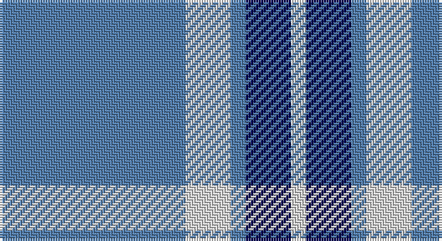

This page is one **sett** — a single exact thread-count. It belongs to the [tartan](/setts/t37w9t3db9w3/)
(the same proportion at any scale), whose colour order is pattern [BWBBW](/stripes/bwbbw/).

Part of the [Loch Lomond](/tartans/loch-lomond/) tartan — the named design grouping this sett with its other cloths.

Sourced from weddslist.  It is a [5 stripe tartan](/stripes/stripes5/).

Original link http://www.weddslist.com/cgi-bin/tartans/pg.pl?source=sts

## Also known as

This cloth is also recorded under:

- Loch Lomond #2
- Loch Lomond #3

## Thread count
B/74 LN18 B6 DB18 LN/6

One full sett is **164 threads**.

## Palette

Palette: <strong>Tartan Dictionary</strong> <small style="color:#888">(1 of 3 colours)</small>
<table><thead><tr><th>Colour</th><th>Threads</th><th>Shade</th><th>Base</th><th>OKLCh</th></tr></thead><tbody><tr><td>B/</td><td style="text-align:right;font-variant-numeric:tabular-nums">74</td><td><code style="background-color:#5480B0;">#5480B0</code> <small style="color:#888">#5480B0</small></td><td>B <code style="background-color:#2A418A;">#2A418A</code></td><td><small style="color:#888">oklch(58.8% 0.089 251.5)</small></td></tr><tr><td>LN</td><td style="text-align:right;font-variant-numeric:tabular-nums">18</td><td><code style="background-color:#E0E0E0;">#E0E0E0</code> <small style="color:#888">#E0E0E0</small></td><td>W <code style="background-color:#F7F7F7;">#F7F7F7</code></td><td><small style="color:#888">oklch(90.7% 0.000 89.9)</small></td></tr><tr><td>B</td><td style="text-align:right;font-variant-numeric:tabular-nums">6</td><td><code style="background-color:#5480B0;">#5480B0</code> <small style="color:#888">#5480B0</small></td><td>B <code style="background-color:#2A418A;">#2A418A</code></td><td><small style="color:#888">oklch(58.8% 0.089 251.5)</small></td></tr><tr><td>DB</td><td style="text-align:right;font-variant-numeric:tabular-nums">18</td><td><code style="background-color:#000050;">#000050</code> <small style="color:#888">#000050</small></td><td>B <code style="background-color:#2A418A;">#2A418A</code></td><td><small style="color:#888">oklch(19.5% 0.135 264.1)</small></td></tr><tr><td>LN/</td><td style="text-align:right;font-variant-numeric:tabular-nums">6</td><td><code style="background-color:#E0E0E0;">#E0E0E0</code> <small style="color:#888">#E0E0E0</small></td><td>W <code style="background-color:#F7F7F7;">#F7F7F7</code></td><td><small style="color:#888">oklch(90.7% 0.000 89.9)</small></td></tr></tbody></table>

# Sample pattern

## Compared to the master

This cloth is one sett of its design; the master sett (the exemplar the design is anchored on) is below for comparison.

<figure style="margin:0"><figcaption style="color:#888;font-size:smaller">this sett</figcaption></figure>
<figure style="margin:0"><figcaption style="color:#888;font-size:smaller"><a href="/setts/r28ly3r3db3r4dp8g10dpi15dp4/">master sett →</a></figcaption></figure>

## Nearest tartans

The nearest existing variants by ΔTartan distance, with this tartan at the top so the swatches line up against it.

ΔTartan

Tartan

Sett

—

<a href="/ttd/edit/#slug=t37w9t3db9w3~x2">Loch Lomond</a> <a class="nn-out" href="/variants/s5/t37w9t3db9w3~x2/" title="open its dictionary page">↗</a>

0.68

<a href="/ttd/edit/#slug=b11lo2r1lo2r1~x4&amp;base=t37w9t3db9w3~x2">Carlisle Ancient</a> <a class="nn-out" href="/variants/s5/b11lo2r1lo2r1~x4/" title="open its dictionary page">↗</a>

1.14

<a href="/ttd/edit/#slug=b1w5b1w5b15ly1~x4&amp;base=t37w9t3db9w3~x2">Whitley (Personal)</a> <a class="nn-out" href="/variants/s6/b1w5b1w5b15ly1~x4/" title="open its dictionary page">↗</a>

1.19

<a href="/ttd/edit/#slug=t12ly2t1k5t4k2~x4&amp;base=t37w9t3db9w3~x2">Rea</a> <a class="nn-out" href="/variants/s6/t12ly2t1k5t4k2~x4/" title="open its dictionary page">↗</a>

1.19

<a href="/ttd/edit/#slug=b13w3b1k3w1~x6&amp;base=t37w9t3db9w3~x2">Loch Lomond #2</a> <a class="nn-out" href="/variants/s5/b13w3b1k3w1~x6/" title="open its dictionary page">↗</a>

1.32

<a href="/ttd/edit/#slug=lb1lg11k6lg3lb1lg1lb1~x4&amp;base=t37w9t3db9w3~x2">Angle, Blue (Fashion)</a> <a class="nn-out" href="/variants/s7/lb1lg11k6lg3lb1lg1lb1~x4/" title="open its dictionary page">↗</a>

1.38

<a href="/ttd/edit/#slug=b33lo6r3lo6k3lo15b32~x4&amp;base=t37w9t3db9w3~x2">Carlisle Family (Name)</a> <a class="nn-out" href="/variants/s7/b33lo6r3lo6k3lo15b32~x4/" title="open its dictionary page">↗</a>

1.39

<a href="/ttd/edit/#slug=ly5db15lb5db5lb40ly3~x2&amp;base=t37w9t3db9w3~x2">Legary</a> <a class="nn-out" href="/variants/s6/ly5db15lb5db5lb40ly3~x2/" title="open its dictionary page">↗</a>

1.45

<a href="/ttd/edit/#slug=n3b2w10b2n6b26k2~x2&amp;base=t37w9t3db9w3~x2">MacLintock #2</a> <a class="nn-out" href="/variants/s7/n3b2w10b2n6b26k2~x2/" title="open its dictionary page">↗</a>

1.46

<a href="/ttd/edit/#slug=t50dr4t12dr23ly4dr4~x2&amp;base=t37w9t3db9w3~x2">Sligo</a> <a class="nn-out" href="/variants/s6/t50dr4t12dr23ly4dr4~x2/" title="open its dictionary page">↗</a>

1.49

<a href="/ttd/edit/#slug=db26lp11db3lp4k2~x4&amp;base=t37w9t3db9w3~x2">Debbie Munro Memorial (Corporate)</a> <a class="nn-out" href="/variants/s5/db26lp11db3lp4k2~x4/" title="open its dictionary page">↗</a>

## Neighbour map

Every grey dot is one of 14360 variants placed by the first two principal components of the ΔTartan feature space (44% of its variance). Red is this tartan; blue dots are its nearest — click one to open its page.

<svg viewBox="0 0 640 380" role="img" style="max-width:100%;height:auto;border:1px solid #e0e0e0;border-radius:4px;display:block" xmlns="http://www.w3.org/2000/svg"><image href="/nn/cloud.v1.png" width="640" height="380"/><a href="/variants/s5/b11lo2r1lo2r1~x4/"><circle cx="395.7" cy="210.1" r="4" fill="#3465a4"><title>Carlisle Ancient</title></circle></a><a href="/variants/s6/b1w5b1w5b15ly1~x4/"><circle cx="365.6" cy="182.6" r="4" fill="#3465a4"><title>Whitley (Personal)</title></circle></a><a href="/variants/s6/t12ly2t1k5t4k2~x4/"><circle cx="363.3" cy="219.2" r="4" fill="#3465a4"><title>Rea</title></circle></a><a href="/variants/s5/b13w3b1k3w1~x6/"><circle cx="374.5" cy="197.5" r="4" fill="#3465a4"><title>Loch Lomond #2</title></circle></a><a href="/variants/s7/lb1lg11k6lg3lb1lg1lb1~x4/"><circle cx="337.9" cy="192.6" r="4" fill="#3465a4"><title>Angle, Blue (Fashion)</title></circle></a><a href="/variants/s7/b33lo6r3lo6k3lo15b32~x4/"><circle cx="359.9" cy="195.2" r="4" fill="#3465a4"><title>Carlisle Family (Name)</title></circle></a><a href="/variants/s6/ly5db15lb5db5lb40ly3~x2/"><circle cx="332.9" cy="176.2" r="4" fill="#3465a4"><title>Legary</title></circle></a><a href="/variants/s7/n3b2w10b2n6b26k2~x2/"><circle cx="315.1" cy="170.1" r="4" fill="#3465a4"><title>MacLintock #2</title></circle></a><a href="/variants/s6/t50dr4t12dr23ly4dr4~x2/"><circle cx="399.6" cy="207.5" r="4" fill="#3465a4"><title>Sligo</title></circle></a><a href="/variants/s5/db26lp11db3lp4k2~x4/"><circle cx="377.4" cy="207.0" r="4" fill="#3465a4"><title>Debbie Munro Memorial (Corporate)</title></circle></a><circle cx="381.7" cy="206.8" r="5" fill="#c00000"/></svg>

ID: /variants/s5/t37w9t3db9w3~x2/
