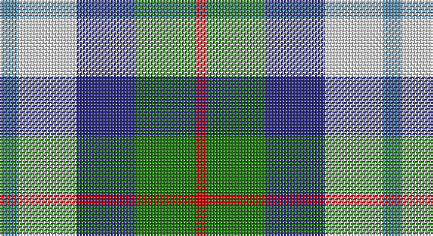

This page is one **sett** — a single exact thread-count. It belongs to the [tartan](/setts/t3w10db10g10r2/)
(the same proportion at any scale), whose colour order is pattern [BWBGR](/stripes/bwbgr/).

Part of the [MacTeddy](/tartans/macteddy/) tartan — the named design grouping this sett with its other cloths.

Sourced from tartans-authority.  It is a [5 stripe tartan](/stripes/stripes5/).

Original link http://www.tartansauthority.com/tartan-ferret/display/3985/

## Register references

External register numbers recorded for this tartan.

- Scottish Tartans Authority (ITI): 3985

## Thread count
B/12 LN40 DB40 G40 R/8

One full sett is **260 threads**.

## Palette

Palette: <strong>Tartan Register</strong> <small style="color:#888">(4 of 5 colours)</small>
<table><thead><tr><th>Colour</th><th>Threads</th><th>Shade</th><th>Base</th><th>OKLCh</th></tr></thead><tbody><tr><td>B/</td><td style="text-align:right;font-variant-numeric:tabular-nums">12</td><td><code style="background-color:#5C8CA8;">#5C8CA8</code> <small style="color:#888">#5C8CA8</small></td><td>B <code style="background-color:#2A418A;">#2A418A</code></td><td><small style="color:#888">oklch(61.7% 0.067 235.0)</small></td></tr><tr><td>LN</td><td style="text-align:right;font-variant-numeric:tabular-nums">40</td><td><code style="background-color:#E0E0E0;">#E0E0E0</code> <small style="color:#888">#E0E0E0</small></td><td>W <code style="background-color:#F7F7F7;">#F7F7F7</code></td><td><small style="color:#888">oklch(90.7% 0.000 89.9)</small></td></tr><tr><td>DB</td><td style="text-align:right;font-variant-numeric:tabular-nums">40</td><td><code style="background-color:#2C2C80;">#2C2C80</code> <small style="color:#888">#2C2C80</small></td><td>B <code style="background-color:#2A418A;">#2A418A</code></td><td><small style="color:#888">oklch(35.0% 0.138 276.6)</small></td></tr><tr><td>G</td><td style="text-align:right;font-variant-numeric:tabular-nums">40</td><td><code style="background-color:#207810;">#207810</code> <small style="color:#888">#207810</small></td><td>G <code style="background-color:#006100;">#006100</code></td><td><small style="color:#888">oklch(50.2% 0.157 141.2)</small></td></tr><tr><td>R/</td><td style="text-align:right;font-variant-numeric:tabular-nums">8</td><td><code style="background-color:#C80000;">#C80000</code> <small style="color:#888">#C80000</small></td><td>R <code style="background-color:#CC0000;">#CC0000</code></td><td><small style="color:#888">oklch(52.3% 0.215 29.2)</small></td></tr></tbody></table>

# Sample pattern

## Compared to the master

This cloth is one sett of its design; the master sett (the exemplar the design is anchored on) is below for comparison.

<figure style="margin:0"><figcaption style="color:#888;font-size:smaller">this sett</figcaption></figure>
<figure style="margin:0"><figcaption style="color:#888;font-size:smaller"><a href="/setts/lt3w10db10g10k2/">master sett →</a></figcaption></figure>

## Nearest tartans

The nearest existing variants by ΔTartan distance, with this tartan at the top so the swatches line up against it.

ΔTartan

Tartan

Sett

—

<a href="/ttd/edit/#slug=t3w10db10g10r2~x4">MacTeddy</a> <a class="nn-out" href="/variants/s5/t3w10db10g10r2~x4/" title="open its dictionary page">↗</a>

0.98

<a href="/ttd/edit/#slug=r13ly13g13b22w4~x2&amp;base=t3w10db10g10r2~x4">Clan Haggis World (Corporate)</a> <a class="nn-out" href="/variants/s5/r13ly13g13b22w4~x2/" title="open its dictionary page">↗</a>

1.19

<a href="/ttd/edit/#slug=lt3w10db10g10k2~x4&amp;base=t3w10db10g10r2~x4">MacTeddy</a> <a class="nn-out" href="/variants/s5/lt3w10db10g10k2~x4/" title="open its dictionary page">↗</a>

1.30

<a href="/ttd/edit/#slug=db13w13db4ly2g8r3~x2&amp;base=t3w10db10g10r2~x4">Unidentified (Winterbottom)</a> <a class="nn-out" href="/variants/s6/db13w13db4ly2g8r3~x2/" title="open its dictionary page">↗</a>

1.36

<a href="/ttd/edit/#slug=r5t12ly11dt21lo5~x2&amp;base=t3w10db10g10r2~x4">Inspiration</a> <a class="nn-out" href="/variants/s5/r5t12ly11dt21lo5~x2/" title="open its dictionary page">↗</a>

1.39

<a href="/ttd/edit/#slug=db2m3g3o6ly2~x2&amp;base=t3w10db10g10r2~x4">Dunoon Burgh Hall Trust</a> <a class="nn-out" href="/variants/s5/db2m3g3o6ly2~x2/" title="open its dictionary page">↗</a>

1.44

<a href="/ttd/edit/#slug=r4db18ri4g19w25r10w4~x2&amp;base=t3w10db10g10r2~x4">Fraser, Red dress</a> <a class="nn-out" href="/variants/s7/r4db18ri4g19w25r10w4~x2/" title="open its dictionary page">↗</a>

1.50

<a href="/ttd/edit/#slug=db2g13db11t4w9db2~x2&amp;base=t3w10db10g10r2~x4">Loch Leven Check Trade Tartan</a> <a class="nn-out" href="/variants/s6/db2g13db11t4w9db2~x2/" title="open its dictionary page">↗</a>

1.50

<a href="/ttd/edit/#slug=r4db18ri4dg19w25r10w4~x2&amp;base=t3w10db10g10r2~x4">Fraser Red Dress</a> <a class="nn-out" href="/variants/s7/r4db18ri4dg19w25r10w4~x2/" title="open its dictionary page">↗</a>

1.51

<a href="/ttd/edit/#slug=r1dy6db2lb4k4lb1~x6&amp;base=t3w10db10g10r2~x4">Thompson's Fancy (Fashion)</a> <a class="nn-out" href="/variants/s6/r1dy6db2lb4k4lb1~x6/" title="open its dictionary page">↗</a>

1.53

<a href="/ttd/edit/#slug=w3b14k12g12k2ly3~x4&amp;base=t3w10db10g10r2~x4">MacNeil of Barra (Clan)</a> <a class="nn-out" href="/variants/s6/w3b14k12g12k2ly3~x4/" title="open its dictionary page">↗</a>

## Neighbour map

Every grey dot is one of 14360 variants placed by the first two principal components of the ΔTartan feature space (44% of its variance). Red is this tartan; blue dots are its nearest — click one to open its page.

<svg viewBox="0 0 640 380" role="img" style="max-width:100%;height:auto;border:1px solid #e0e0e0;border-radius:4px;display:block" xmlns="http://www.w3.org/2000/svg"><image href="/nn/cloud.v1.png" width="640" height="380"/><a href="/variants/s5/r13ly13g13b22w4~x2/"><circle cx="51.1" cy="238.0" r="4" fill="#3465a4"><title>Clan Haggis World (Corporate)</title></circle></a><a href="/variants/s5/lt3w10db10g10k2~x4/"><circle cx="32.7" cy="237.1" r="4" fill="#3465a4"><title>MacTeddy</title></circle></a><a href="/variants/s6/db13w13db4ly2g8r3~x2/"><circle cx="113.0" cy="207.2" r="4" fill="#3465a4"><title>Unidentified (Winterbottom)</title></circle></a><a href="/variants/s5/r5t12ly11dt21lo5~x2/"><circle cx="97.7" cy="247.8" r="4" fill="#3465a4"><title>Inspiration</title></circle></a><a href="/variants/s5/db2m3g3o6ly2~x2/"><circle cx="63.3" cy="268.2" r="4" fill="#3465a4"><title>Dunoon Burgh Hall Trust</title></circle></a><a href="/variants/s7/r4db18ri4g19w25r10w4~x2/"><circle cx="86.0" cy="193.7" r="4" fill="#3465a4"><title>Fraser, Red dress</title></circle></a><a href="/variants/s6/db2g13db11t4w9db2~x2/"><circle cx="131.0" cy="233.8" r="4" fill="#3465a4"><title>Loch Leven Check Trade Tartan</title></circle></a><a href="/variants/s7/r4db18ri4dg19w25r10w4~x2/"><circle cx="85.3" cy="192.2" r="4" fill="#3465a4"><title>Fraser Red Dress</title></circle></a><a href="/variants/s6/r1dy6db2lb4k4lb1~x6/"><circle cx="87.4" cy="220.3" r="4" fill="#3465a4"><title>Thompson's Fancy (Fashion)</title></circle></a><a href="/variants/s6/w3b14k12g12k2ly3~x4/"><circle cx="86.3" cy="216.7" r="4" fill="#3465a4"><title>MacNeil of Barra (Clan)</title></circle></a><circle cx="52.4" cy="239.3" r="5" fill="#c00000"/></svg>

ID: /variants/s5/t3w10db10g10r2~x4/
