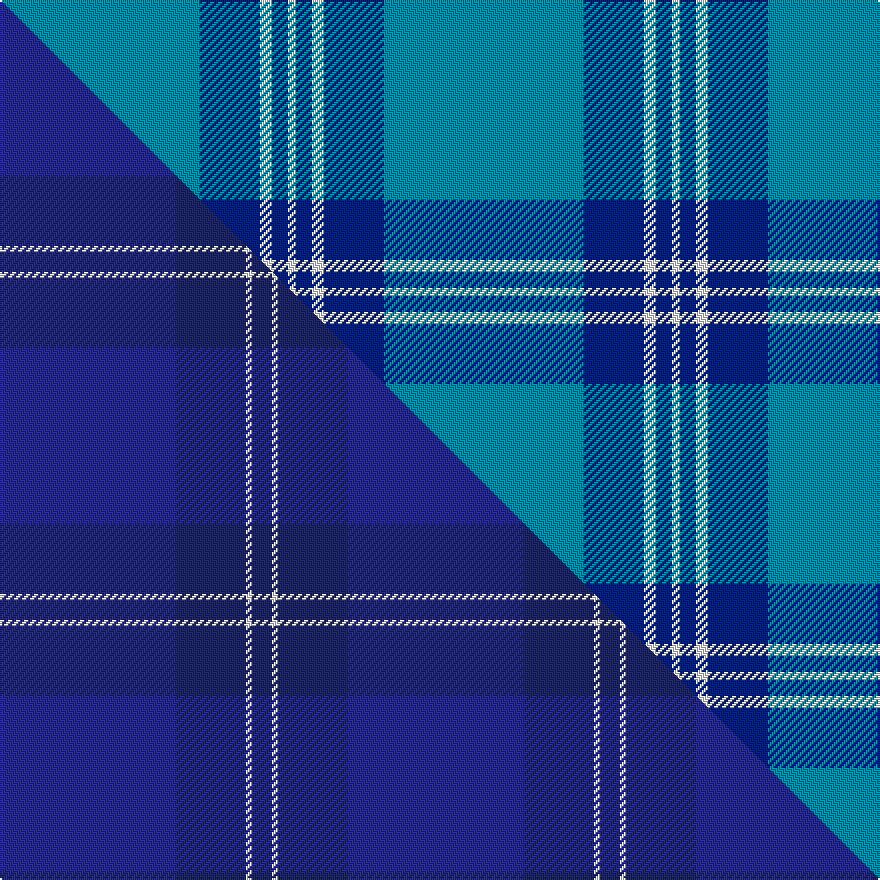

This is one **variant** — a specific cloth: this exact thread count and colourway, with its own
provenance below. It is one weaving of the [sett](/setts/t50db15w3db4w2/) (the scale-free proportion — the
same cloth at any scale or shade), whose colour order is pattern [BBWBW](/stripes/bbwbw/).

Part of the [Scottish Tourist Board](/tartans/scottish-tourist-board-2/) tartan — the named design grouping this sett with its other cloths.

Sourced from tartans-authority.  It is a [5 stripe tartan](/stripes/stripes5/).

Original link [https://www.tartanregister.gov.uk/tartanDetails.aspx?ref=2099](https://www.tartanregister.gov.uk/tartanDetails.aspx?ref=2099)

Dataset <small>— provenance for this record, inherited from the source manifest</small>

<dl class="dataset-prov">
<dt>source</dt><dd><a href="/sources/tartans-authority/">Scottish Tartans Authority</a></dd>
<dt>data captured from</dt><dd><a href="https://github.com/thetartan/tartan-database/blob/master/data/tartans-authority/data.csv">https://github.com/thetartan/tartan-database/blob/master/data/tartans-authority/data.csv</a></dd>
<dt>data date</dt><dd>1990 <small>(this record)</small></dd>
<dt>licence</dt><dd><a href="https://creativecommons.org/licenses/by-nc-nd/4.0/">CC BY-NC-ND 4.0</a></dd>
</dl>

Capture chain <small>— the hands this data passed through, oldest first; each capture carries its own licence</small>

<ol class="capture-chain">
<li><a href="https://www.tartansauthority.com/">Scottish Tartans Authority</a> <small>the heritage body's archive — its tartan-ferret record browser is retired (links repaired to the SRT, above)</small></li>
<li><a href="https://github.com/thetartan/tartan-database">thetartan/tartan-database</a> <small>2016-2017</small> · <a href="https://creativecommons.org/licenses/by-nc-nd/4.0/">CC BY-NC-ND 4.0</a> <small>Levko Kravets's frozen compilation — the capture we vendored, and where its CC licence text came from</small></li>
<li>this dictionary <small>captured 2026-06-10 · commit 5bf86c7566</small> <small>each re-capture is a git commit to data/sources</small></li>
</ol>

## Register references

External register numbers recorded for this tartan.

- Scottish Tartans Authority (ITI): 2099

## Thread count
T/100 DB30 W6 DB8 W/4

One full sett is **192 threads**.

## Palette
<table><thead><tr><th>Colour</th><th>Shade</th><th>OKLCh</th></tr></thead><tbody><tr><td>T</td><td><code style="background-color:#00879F;">#00879F</code> <small style="color:#888">#00879F</small></td><td><small style="color:#888">oklch(57.4% 0.102 216.1)</small></td></tr><tr><td>DB</td><td><code style="background-color:#082077;">#082077</code> <small style="color:#888">#082077</small></td><td><small style="color:#888">oklch(30.0% 0.149 265.1)</small></td></tr><tr><td>W</td><td><code style="background-color:#F7F7F7;">#F7F7F7</code> <small style="color:#888">#F7F7F7</small></td><td><small style="color:#888">oklch(97.6% 0.000 89.9)</small></td></tr></tbody></table>

# Sample pattern

## Compared to the master

This cloth is one sett of its design; the master sett (the exemplar the design is anchored on) is below for comparison.

Its **ΔTartan distance** from the master is **3.08** — the same measure the nearest-tartans table ranks by (0 is identical; a re-scale of the same cloth is near 0, a recolour or a different proportion further).

<figure class="master-compare" style="margin:0">

this sett
master sett ★

<figcaption style="color:#888;font-size:smaller">One weave of this sett against the <a href="/setts/dbi88db35w3db10/">master sett ★</a>, split on the diagonal: a shared proportion runs seamlessly across it with only the shades shifting; a different proportion breaks on it.</figcaption>
</figure>

## Nearest tartan variants

The nearest existing variants by ΔTartan distance, with this cloth at the top so the swatches line up against it.

ΔTartan

Threads

Variant

Sett

—

192

<a href="/variants/s5/t50db15w3db4w2~x2/">Scottish Tourist Board (1990) (Corp)</a>

<a href="/ttd/edit/#slug=t52db28w3db2w2db10~x2&amp;base=t50db15w3db4w2~x2" title="compare in the TTD">1.60</a>

264

<a href="/variants/s6/t52db28w3db2w2db10~x2/">St Andrews Earl of Royal family Tartan</a>

<a href="/ttd/edit/#slug=t52db28w5db3w2db10~x2&amp;base=t50db15w3db4w2~x2" title="compare in the TTD">1.62</a>

276

<a href="/variants/s6/t52db28w5db3w2db10~x2/">St. Andrews, Earl of</a>

<a href="/ttd/edit/#slug=t136db45w7db4r4db16&amp;base=t50db15w3db4w2~x2" title="compare in the TTD">1.76</a>

272

<a href="/variants/s6/t136db45w7db4r4db16/">S.C.O.T.S</a>

<a href="/ttd/edit/#slug=db67w10y14db10w2&amp;base=t50db15w3db4w2~x2" title="compare in the TTD">1.77</a>

137

<a href="/variants/s5/db67w10y14db10w2/">St. John (Corporate?)</a>

<a href="/ttd/edit/#slug=lb37w9lb3db9w3~x2&amp;base=t50db15w3db4w2~x2" title="compare in the TTD">1.92</a>

164

<a href="/variants/s5/lb37w9lb3db9w3~x2/">Loch Lomond</a>

<a href="/ttd/edit/#slug=db72lb6db12lb17w6~x2&amp;base=t50db15w3db4w2~x2" title="compare in the TTD">1.99</a>

296

<a href="/variants/s5/db72lb6db12lb17w6~x2/">GulfMark</a>

<a href="/ttd/edit/#slug=db24t13db4t4w2~x2&amp;base=t50db15w3db4w2~x2" title="compare in the TTD">1.99</a>

136

<a href="/variants/s5/db24t13db4t4w2~x2/">Gallaecia - Galicia National</a>

<a href="/ttd/edit/#slug=db24lb13db4lb4w2~x2&amp;base=t50db15w3db4w2~x2" title="compare in the TTD">1.99</a>

136

<a href="/variants/s5/db24lb13db4lb4w2~x2/">Gallaecia (Unofficial) (District)</a>

<a href="/ttd/edit/#slug=dt3db2lb31dt34w2~x2~dt1204274-db1406275&amp;base=t50db15w3db4w2~x2" title="compare in the TTD">2.00</a>

278

<a href="/variants/s5/db3dbi2lb31db34w2~x2~db1204274-dbi1406275/">Gilt Edge (Corporate)</a>

<a href="/ttd/edit/#slug=lb20dp3db7dy1~x4&amp;base=t50db15w3db4w2~x2" title="compare in the TTD">2.01</a>

164

<a href="/variants/s4/lb20dp3db7dy1~x4/">Peacock (Samantha)</a>

## Neighbour map

Every grey dot is one of 13621 variants placed by the first two principal components of the ΔTartan feature space (42% of its variance). Red is this tartan; blue dots are its nearest — click one to open its page.

<svg viewBox="0 0 640 380" role="img" style="max-width:100%;height:auto;border:1px solid #e0e0e0;border-radius:4px;display:block" xmlns="http://www.w3.org/2000/svg"><image href="/nn/cloud.v1.png" width="640" height="380"/><a href="/variants/s6/t52db28w3db2w2db10~x2/"><circle cx="440.8" cy="211.3" r="4" fill="#3465a4"><title>St Andrews Earl of Royal family Tartan</title></circle></a><a href="/variants/s6/t52db28w5db3w2db10~x2/"><circle cx="388.0" cy="181.2" r="4" fill="#3465a4"><title>St. Andrews, Earl of</title></circle></a><a href="/variants/s6/t136db45w7db4r4db16/"><circle cx="462.3" cy="152.0" r="4" fill="#3465a4"><title>S.C.O.T.S</title></circle></a><a href="/variants/s5/db67w10y14db10w2/"><circle cx="504.8" cy="173.2" r="4" fill="#3465a4"><title>St. John (Corporate?)</title></circle></a><a href="/variants/s5/lb37w9lb3db9w3~x2/"><circle cx="457.5" cy="247.1" r="4" fill="#3465a4"><title>Loch Lomond</title></circle></a><a href="/variants/s5/db72lb6db12lb17w6~x2/"><circle cx="498.2" cy="230.5" r="4" fill="#3465a4"><title>GulfMark</title></circle></a><a href="/variants/s5/db24t13db4t4w2~x2/"><circle cx="435.5" cy="262.9" r="4" fill="#3465a4"><title>Gallaecia - Galicia National</title></circle></a><a href="/variants/s5/db24lb13db4lb4w2~x2/"><circle cx="396.6" cy="249.5" r="4" fill="#3465a4"><title>Gallaecia (Unofficial) (District)</title></circle></a><a href="/variants/s5/db3dbi2lb31db34w2~x2~db1204274-dbi1406275/"><circle cx="359.1" cy="208.6" r="4" fill="#3465a4"><title>Gilt Edge (Corporate)</title></circle></a><a href="/variants/s4/lb20dp3db7dy1~x4/"><circle cx="397.7" cy="202.0" r="4" fill="#3465a4"><title>Peacock (Samantha)</title></circle></a><circle cx="516.8" cy="213.8" r="5" fill="#c00000"/><text x="320" y="376" text-anchor="middle" font-size="11" fill="#999">ground</text><text x="11" y="190" text-anchor="middle" font-size="11" fill="#999" transform="rotate(-90 11 190)">complexity</text></svg>

ID: /variants/s5/t50db15w3db4w2~x2/
