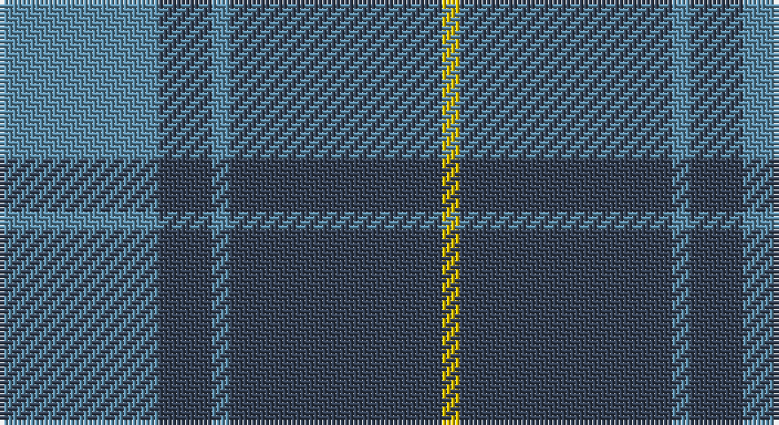

This page is one **sett** — a single exact thread-count. It belongs to the [tartan](/setts/t9dt3t1dt12ly1/)
(the same proportion at any scale), whose colour order is pattern [BBBBY](/stripes/bbbby/).

Sourced from register-of-tartans.  It is a [5 stripe tartan](/stripes/stripes5/).

Original link https://www.tartanregister.gov.uk/tartanDetails.aspx?ref=3154

2 attestations — the source records this cloth was collapsed from (oldest owns this page)

<ul>
<li>01/06/2006 — North Sea Commission (register-of-tartans, <a href="https://www.tartanregister.gov.uk/tartanDetails.aspx?ref=3154">record</a>)</li>
<li>2006 June — North Sea Commission (Corporate) (tartans-authority, <a href="http://www.tartansauthority.com/tartan-ferret/display/6938/">record</a>)</li>
</ul>

## Register references

External register numbers recorded for this tartan.

- Scottish Register of Tartans: [3154](https://www.tartanregister.gov.uk/tartanDetails.aspx?ref=3154)
- Scottish Tartans Authority (ITI): 6938

## Thread count
B/36 N12 B4 N48 Y/4

One full sett is **168 threads**.

## Palette

Palette: <strong>Tartan Register</strong> <small style="color:#888">(2 of 3 colours)</small>
<table><thead><tr><th>Colour</th><th>Threads</th><th>Shade</th><th>Base</th><th>OKLCh</th></tr></thead><tbody><tr><td>B/</td><td style="text-align:right;font-variant-numeric:tabular-nums">36</td><td><code style="background-color:#5C8CA8;">#5C8CA8</code> <small style="color:#888">#5C8CA8</small></td><td>B <code style="background-color:#2A418A;">#2A418A</code></td><td><small style="color:#888">oklch(61.7% 0.067 235.0)</small></td></tr><tr><td>N</td><td style="text-align:right;font-variant-numeric:tabular-nums">12</td><td><code style="background-color:#344054;">#344054</code> <small style="color:#888">#344054</small></td><td>B <code style="background-color:#2A418A;">#2A418A</code></td><td><small style="color:#888">oklch(36.9% 0.038 260.5)</small></td></tr><tr><td>B</td><td style="text-align:right;font-variant-numeric:tabular-nums">4</td><td><code style="background-color:#5C8CA8;">#5C8CA8</code> <small style="color:#888">#5C8CA8</small></td><td>B <code style="background-color:#2A418A;">#2A418A</code></td><td><small style="color:#888">oklch(61.7% 0.067 235.0)</small></td></tr><tr><td>N</td><td style="text-align:right;font-variant-numeric:tabular-nums">48</td><td><code style="background-color:#344054;">#344054</code> <small style="color:#888">#344054</small></td><td>B <code style="background-color:#2A418A;">#2A418A</code></td><td><small style="color:#888">oklch(36.9% 0.038 260.5)</small></td></tr><tr><td>Y/</td><td style="text-align:right;font-variant-numeric:tabular-nums">4</td><td><code style="background-color:#E8C000;">#E8C000</code> <small style="color:#888">#E8C000</small></td><td>Y <code style="background-color:#F2BF00;">#F2BF00</code></td><td><small style="color:#888">oklch(81.9% 0.168 93.7)</small></td></tr></tbody></table>

# Sample pattern

## Nearest tartans

The nearest existing variants by ΔTartan distance, with this tartan at the top so the swatches line up against it.

ΔTartan

Tartan

Sett

—

<a href="/ttd/edit/#slug=t9dt3t1dt12ly1~x4">North Sea Commission</a> <a class="nn-out" href="/variants/s5/t9dt3t1dt12ly1~x4/" title="open its dictionary page">↗</a>

1.18

<a href="/ttd/edit/#slug=r2g5db27g11o2~x2&amp;base=t9dt3t1dt12ly1~x4">Hector James</a> <a class="nn-out" href="/variants/s5/r2g5db27g11o2~x2/" title="open its dictionary page">↗</a>

1.26

<a href="/ttd/edit/#slug=db11dg2db15dg18w2~x2&amp;base=t9dt3t1dt12ly1~x4">Hamilton Hunting</a> <a class="nn-out" href="/variants/s5/db11dg2db15dg18w2~x2/" title="open its dictionary page">↗</a>

1.27

<a href="/ttd/edit/#slug=r1g16db16g1~x2&amp;base=t9dt3t1dt12ly1~x4">Barclay</a> <a class="nn-out" href="/variants/s4/r1g16db16g1~x2/" title="open its dictionary page">↗</a>

1.27

<a href="/ttd/edit/#slug=r1g16db16g1~x4&amp;base=t9dt3t1dt12ly1~x4">Barclay Htg (Clan)</a> <a class="nn-out" href="/variants/s4/r1g16db16g1~x4/" title="open its dictionary page">↗</a>

1.32

<a href="/ttd/edit/#slug=do15r5do30b32do4lo3~x2&amp;base=t9dt3t1dt12ly1~x4">Cameron Hunting</a> <a class="nn-out" href="/variants/s6/do15r5do30b32do4lo3~x2/" title="open its dictionary page">↗</a>

1.34

<a href="/ttd/edit/#slug=g4db36lg6g16db16g3~x2&amp;base=t9dt3t1dt12ly1~x4">City of Kincardine</a> <a class="nn-out" href="/variants/s6/g4db36lg6g16db16g3~x2/" title="open its dictionary page">↗</a>

1.39

<a href="/ttd/edit/#slug=dt3t14dt3o16dt34r3~x2&amp;base=t9dt3t1dt12ly1~x4">Thorburn (Lochcarron)</a> <a class="nn-out" href="/variants/s6/dt3t14dt3o16dt34r3~x2/" title="open its dictionary page">↗</a>

1.39

<a href="/ttd/edit/#slug=db24n13db4n4w2~x2&amp;base=t9dt3t1dt12ly1~x4">Gallaecia - Galicia National</a> <a class="nn-out" href="/variants/s5/db24n13db4n4w2~x2/" title="open its dictionary page">↗</a>

1.43

<a href="/ttd/edit/#slug=db26r6g16db8g3r2~x2&amp;base=t9dt3t1dt12ly1~x4">Perthshire (New) District Tartan</a> <a class="nn-out" href="/variants/s6/db26r6g16db8g3r2~x2/" title="open its dictionary page">↗</a>

1.45

<a href="/variants/s4/t8dg1r2~x20/">Gyle</a>

## Neighbour map

Every grey dot is one of 14360 variants placed by the first two principal components of the ΔTartan feature space (44% of its variance). Red is this tartan; blue dots are its nearest — click one to open its page.

<svg viewBox="0 0 640 380" role="img" style="max-width:100%;height:auto;border:1px solid #e0e0e0;border-radius:4px;display:block" xmlns="http://www.w3.org/2000/svg"><image href="/nn/cloud.v1.png" width="640" height="380"/><a href="/variants/s5/r2g5db27g11o2~x2/"><circle cx="378.7" cy="224.5" r="4" fill="#3465a4"><title>Hector James</title></circle></a><a href="/variants/s5/db11dg2db15dg18w2~x2/"><circle cx="365.8" cy="292.4" r="4" fill="#3465a4"><title>Hamilton Hunting</title></circle></a><a href="/variants/s4/r1g16db16g1~x2/"><circle cx="385.3" cy="256.9" r="4" fill="#3465a4"><title>Barclay</title></circle></a><a href="/variants/s4/r1g16db16g1~x4/"><circle cx="385.3" cy="256.9" r="4" fill="#3465a4"><title>Barclay Htg (Clan)</title></circle></a><a href="/variants/s6/do15r5do30b32do4lo3~x2/"><circle cx="348.5" cy="235.0" r="4" fill="#3465a4"><title>Cameron Hunting</title></circle></a><a href="/variants/s6/g4db36lg6g16db16g3~x2/"><circle cx="410.3" cy="250.4" r="4" fill="#3465a4"><title>City of Kincardine</title></circle></a><a href="/variants/s6/dt3t14dt3o16dt34r3~x2/"><circle cx="332.7" cy="226.1" r="4" fill="#3465a4"><title>Thorburn (Lochcarron)</title></circle></a><a href="/variants/s5/db24n13db4n4w2~x2/"><circle cx="397.1" cy="254.9" r="4" fill="#3465a4"><title>Gallaecia - Galicia National</title></circle></a><a href="/variants/s6/db26r6g16db8g3r2~x2/"><circle cx="352.7" cy="237.5" r="4" fill="#3465a4"><title>Perthshire (New) District Tartan</title></circle></a><a href="/variants/s4/t8dg1r2~x20/"><circle cx="405.4" cy="256.0" r="4" fill="#3465a4"><title>Gyle</title></circle></a><circle cx="397.6" cy="252.6" r="5" fill="#c00000"/></svg>

ID: /variants/s5/t9dt3t1dt12ly1~x4/
