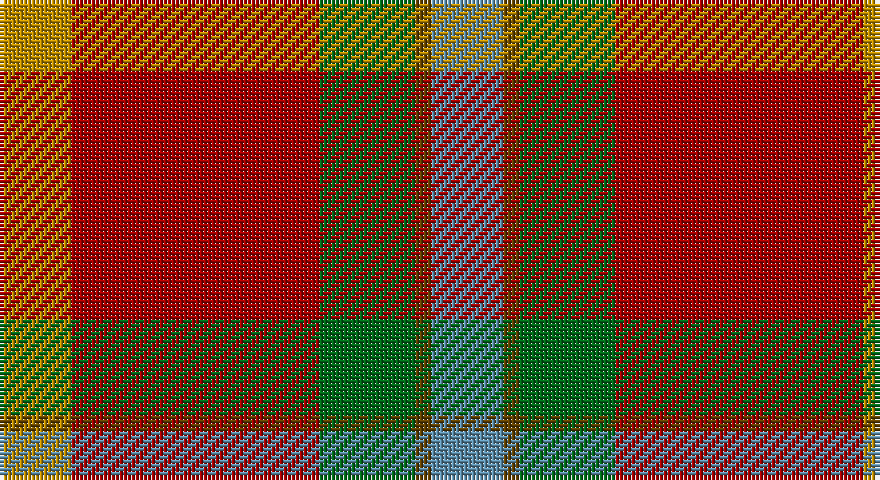

This page is one **sett** — a single exact thread-count. It belongs to the [tartan](/setts/t9dy2g12r31lo9/)
(the same proportion at any scale), whose colour order is pattern [BGGRY](/stripes/bggry/).

Part of the [Buncle](/tartans/buncle/) tartan — the named design grouping this sett with its other cloths.

Sourced from tartans-authority.  It is a [5 stripe tartan](/stripes/stripes5/).

Original link http://www.tartansauthority.com/tartan-ferret/display/10300/

## Register references

External register numbers recorded for this tartan.

- Scottish Register of Tartans: [10300](https://www.tartanregister.gov.uk/tartanDetails?ref=10300)
- Scottish Tartans Authority (ITI): 10300

## Thread count
DY/18 DR62 G24 T4 B/18

One full sett is **216 threads**.

## Palette

Palette: <strong>Tartan Register</strong>
<table><thead><tr><th>Colour</th><th>Threads</th><th>Shade</th><th>Base</th><th>OKLCh</th></tr></thead><tbody><tr><td>DY/</td><td style="text-align:right;font-variant-numeric:tabular-nums">18</td><td><code style="background-color:#BC8C00;">#BC8C00</code> <small style="color:#888">#BC8C00</small></td><td>Y <code style="background-color:#F2BF00;">#F2BF00</code></td><td><small style="color:#888">oklch(66.8% 0.137 84.1)</small></td></tr><tr><td>DR</td><td style="text-align:right;font-variant-numeric:tabular-nums">62</td><td><code style="background-color:#A00000;">#A00000</code> <small style="color:#888">#A00000</small></td><td>R <code style="background-color:#CC0000;">#CC0000</code></td><td><small style="color:#888">oklch(44.3% 0.182 29.2)</small></td></tr><tr><td>G</td><td style="text-align:right;font-variant-numeric:tabular-nums">24</td><td><code style="background-color:#006818;">#006818</code> <small style="color:#888">#006818</small></td><td>G <code style="background-color:#006100;">#006100</code></td><td><small style="color:#888">oklch(45.0% 0.142 145.0)</small></td></tr><tr><td>T</td><td style="text-align:right;font-variant-numeric:tabular-nums">4</td><td><code style="background-color:#604000;">#604000</code> <small style="color:#888">#604000</small></td><td>G <code style="background-color:#006100;">#006100</code></td><td><small style="color:#888">oklch(39.8% 0.083 76.8)</small></td></tr><tr><td>B/</td><td style="text-align:right;font-variant-numeric:tabular-nums">18</td><td><code style="background-color:#5C8CA8;">#5C8CA8</code> <small style="color:#888">#5C8CA8</small></td><td>B <code style="background-color:#2A418A;">#2A418A</code></td><td><small style="color:#888">oklch(61.7% 0.067 235.0)</small></td></tr></tbody></table>

# Sample pattern

## Compared to the master

This cloth is one sett of its design; the master sett (the exemplar the design is anchored on) is below for comparison.

<figure style="margin:0"><figcaption style="color:#888;font-size:smaller">this sett</figcaption></figure>
<figure style="margin:0"><figcaption style="color:#888;font-size:smaller"><a href="/setts/n9do2dg12o31lo9/">master sett →</a></figcaption></figure>

## Nearest tartans

The nearest existing variants by ΔTartan distance, with this tartan at the top so the swatches line up against it.

ΔTartan

Tartan

Sett

—

<a href="/ttd/edit/#slug=t9dy2g12r31lo9~x2">Buncle (Name)</a> <a class="nn-out" href="/variants/s5/t9dy2g12r31lo9~x2/" title="open its dictionary page">↗</a>

0.32

<a href="/ttd/edit/#slug=n9do2dg12o31lo9~x2&amp;base=t9dy2g12r31lo9~x2">Buncle (Duns)</a> <a class="nn-out" href="/variants/s5/n9do2dg12o31lo9~x2/" title="open its dictionary page">↗</a>

1.08

<a href="/ttd/edit/#slug=dr18o9y9r1t1~x4&amp;base=t9dy2g12r31lo9~x2">Jardine</a> <a class="nn-out" href="/variants/s5/dr18o9y9r1t1~x4/" title="open its dictionary page">↗</a>

1.26

<a href="/ttd/edit/#slug=g24b2r25ly2k3~x2&amp;base=t9dy2g12r31lo9~x2">Bronte</a> <a class="nn-out" href="/variants/s5/g24b2r25ly2k3~x2/" title="open its dictionary page">↗</a>

1.26

<a href="/ttd/edit/#slug=k8lo2n30r30lb3~x2&amp;base=t9dy2g12r31lo9~x2">Douglas Ancient Red</a> <a class="nn-out" href="/variants/s5/k8lo2n30r30lb3~x2/" title="open its dictionary page">↗</a>

1.37

<a href="/ttd/edit/#slug=lr6o5k2y18r28w2~x2&amp;base=t9dy2g12r31lo9~x2">Dundhuin</a> <a class="nn-out" href="/variants/s6/lr6o5k2y18r28w2~x2/" title="open its dictionary page">↗</a>

1.43

<a href="/ttd/edit/#slug=y47w6r24w3dp5lo3~x2&amp;base=t9dy2g12r31lo9~x2">Duminiak (Trevose, Pennsylvania)</a> <a class="nn-out" href="/variants/s6/y47w6r24w3dp5lo3~x2/" title="open its dictionary page">↗</a>

1.43

<a href="/ttd/edit/#slug=r6g16r4db12r16t1r2~x2&amp;base=t9dy2g12r31lo9~x2">MacQuarrie 2</a> <a class="nn-out" href="/variants/s7/r6g16r4db12r16t1r2~x2/" title="open its dictionary page">↗</a>

1.44

<a href="/ttd/edit/#slug=r3db1r12o3dg12lb1dg2~x4&amp;base=t9dy2g12r31lo9~x2">Leckie (Personal)</a> <a class="nn-out" href="/variants/s7/r3db1r12o3dg12lb1dg2~x4/" title="open its dictionary page">↗</a>

1.47

<a href="/ttd/edit/#slug=dt8y4r30g30lo3g4~x2&amp;base=t9dy2g12r31lo9~x2">Hutcheson (Name)</a> <a class="nn-out" href="/variants/s6/dt8y4r30g30lo3g4~x2/" title="open its dictionary page">↗</a>

1.47

<a href="/ttd/edit/#slug=r40t11w2k12g36r32~x2&amp;base=t9dy2g12r31lo9~x2">Caithness (1848) (District?)</a> <a class="nn-out" href="/variants/s6/r40t11w2k12g36r32~x2/" title="open its dictionary page">↗</a>

## Neighbour map

Every grey dot is one of 14360 variants placed by the first two principal components of the ΔTartan feature space (44% of its variance). Red is this tartan; blue dots are its nearest — click one to open its page.

<svg viewBox="0 0 640 380" role="img" style="max-width:100%;height:auto;border:1px solid #e0e0e0;border-radius:4px;display:block" xmlns="http://www.w3.org/2000/svg"><image href="/nn/cloud.v1.png" width="640" height="380"/><a href="/variants/s5/n9do2dg12o31lo9~x2/"><circle cx="281.7" cy="198.5" r="4" fill="#3465a4"><title>Buncle (Duns)</title></circle></a><a href="/variants/s5/dr18o9y9r1t1~x4/"><circle cx="286.6" cy="192.7" r="4" fill="#3465a4"><title>Jardine</title></circle></a><a href="/variants/s5/g24b2r25ly2k3~x2/"><circle cx="283.1" cy="183.3" r="4" fill="#3465a4"><title>Bronte</title></circle></a><a href="/variants/s5/k8lo2n30r30lb3~x2/"><circle cx="283.4" cy="200.9" r="4" fill="#3465a4"><title>Douglas Ancient Red</title></circle></a><a href="/variants/s6/lr6o5k2y18r28w2~x2/"><circle cx="257.2" cy="163.5" r="4" fill="#3465a4"><title>Dundhuin</title></circle></a><a href="/variants/s6/y47w6r24w3dp5lo3~x2/"><circle cx="334.6" cy="167.2" r="4" fill="#3465a4"><title>Duminiak (Trevose, Pennsylvania)</title></circle></a><a href="/variants/s7/r6g16r4db12r16t1r2~x2/"><circle cx="287.9" cy="195.9" r="4" fill="#3465a4"><title>MacQuarrie 2</title></circle></a><a href="/variants/s7/r3db1r12o3dg12lb1dg2~x4/"><circle cx="274.4" cy="181.5" r="4" fill="#3465a4"><title>Leckie (Personal)</title></circle></a><a href="/variants/s6/dt8y4r30g30lo3g4~x2/"><circle cx="255.5" cy="200.5" r="4" fill="#3465a4"><title>Hutcheson (Name)</title></circle></a><a href="/variants/s6/r40t11w2k12g36r32~x2/"><circle cx="293.5" cy="180.3" r="4" fill="#3465a4"><title>Caithness (1848) (District?)</title></circle></a><circle cx="283.0" cy="198.6" r="5" fill="#c00000"/></svg>

ID: /variants/s5/t9dy2g12r31lo9~x2/
