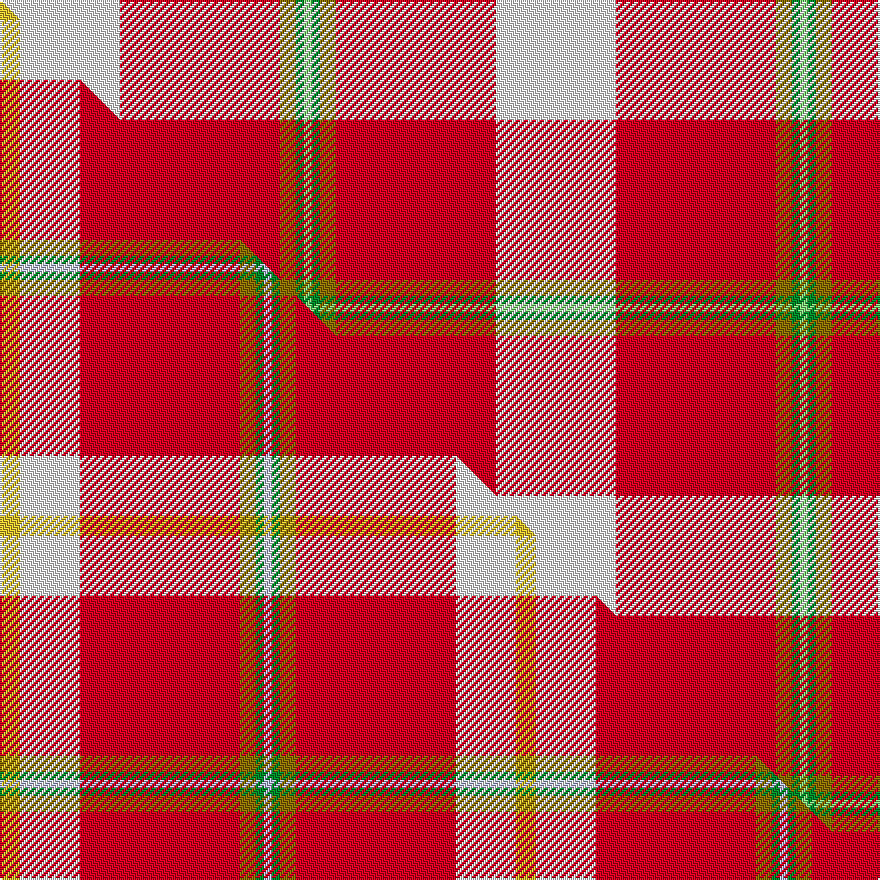

This is one **variant** — a specific cloth: this exact thread count and colourway, with its own
provenance below. It is one weaving of the [sett](/setts/w15r20y2g1lg1/) (the scale-free proportion — the
same cloth at any scale or shade), whose colour order is pattern [WRGGY](/stripes/wrggy/).

Part of the [Tomomi](/tartans/tomomi/) tartan — the named design grouping this sett with its other cloths.

Sourced from tartans-authority.  It is a [5 stripe tartan](/stripes/stripes5/).

Original link [https://www.tartanregister.gov.uk/tartanDetails.aspx?ref=11001](https://www.tartanregister.gov.uk/tartanDetails.aspx?ref=11001)

Dataset <small>— provenance for this record, inherited from the source manifest</small>

<dl class="dataset-prov">
<dt>source</dt><dd><a href="/sources/tartans-authority/">Scottish Tartans Authority</a></dd>
<dt>data captured from</dt><dd><a href="https://github.com/thetartan/tartan-database/blob/master/data/tartans-authority/data.csv">https://github.com/thetartan/tartan-database/blob/master/data/tartans-authority/data.csv</a></dd>
<dt>data date</dt><dd>2014 <small>(this record)</small></dd>
<dt>licence</dt><dd><a href="https://creativecommons.org/licenses/by-nc-nd/4.0/">CC BY-NC-ND 4.0</a></dd>
</dl>

Capture chain <small>— the hands this data passed through, oldest first; each capture carries its own licence</small>

<ol class="capture-chain">
<li><a href="https://www.tartansauthority.com/">Scottish Tartans Authority</a> <small>the heritage body's archive — its tartan-ferret record browser is retired (links repaired to the SRT, above)</small></li>
<li><a href="https://github.com/thetartan/tartan-database">thetartan/tartan-database</a> <small>2016-2017</small> · <a href="https://creativecommons.org/licenses/by-nc-nd/4.0/">CC BY-NC-ND 4.0</a> <small>Levko Kravets's frozen compilation — the capture we vendored, and where its CC licence text came from</small></li>
<li>this dictionary <small>captured 2026-06-10 · commit 5bf86c7566</small> <small>each re-capture is a git commit to data/sources</small></li>
</ol>

## Register references

External register numbers recorded for this tartan.

- Scottish Register of Tartans: [11001](https://www.tartanregister.gov.uk/tartanDetails?ref=11001)
- Scottish Tartans Authority (ITI): 11001

## Thread count
W/60 R80 Y8 G4 LG/4

One full sett is **248 threads**.

## Palette
<table><thead><tr><th>Colour</th><th>Shade</th><th>OKLCh</th></tr></thead><tbody><tr><td>LG</td><td><code style="background-color:#82D67A;">#82D67A</code> <small style="color:#888">#82D67A</small></td><td><small style="color:#888">oklch(80.1% 0.150 142.2)</small></td></tr><tr><td>G</td><td><code style="background-color:#008B2A;">#008B2A</code> <small style="color:#888">#008B2A</small></td><td><small style="color:#888">oklch(55.4% 0.170 145.9)</small></td></tr><tr><td>R</td><td><code style="background-color:#D60020;">#D60020</code> <small style="color:#888">#D60020</small></td><td><small style="color:#888">oklch(55.2% 0.224 25.5)</small></td></tr><tr><td>W</td><td><code style="background-color:#F7F7F7;">#F7F7F7</code> <small style="color:#888">#F7F7F7</small></td><td><small style="color:#888">oklch(97.6% 0.000 89.9)</small></td></tr><tr><td>Y</td><td><code style="background-color:#8B6E00;">#8B6E00</code> <small style="color:#888">#8B6E00</small></td><td><small style="color:#888">oklch(55.1% 0.113 90.4)</small></td></tr></tbody></table>

# Sample pattern

## Compared to the master

This cloth is one sett of its design; the master sett (the exemplar the design is anchored on) is below for comparison.

Its **ΔTartan distance** from the master is **1.20** — the same measure the nearest-tartans table ranks by (0 is identical; a re-scale of the same cloth is near 0, a recolour or a different proportion further).

<figure class="master-compare" style="margin:0">

this sett
master sett ★

<figcaption style="color:#888;font-size:smaller">One weave of this sett against the <a href="/setts/ly5w15r40y4g2lb2/">master sett ★</a>, split on the diagonal: a shared proportion runs seamlessly across it with only the shades shifting; a different proportion breaks on it.</figcaption>
</figure>

## Nearest tartan variants

The nearest existing variants by ΔTartan distance, with this cloth at the top so the swatches line up against it.

ΔTartan

Threads

Variant

Sett

—

248

<a href="/variants/s5/w15r20y2g1lg1~x4/">Tomomi</a>

<a href="/ttd/edit/#slug=ly5w15r40y4g2lb2~x2&amp;base=w15r20y2g1lg1~x4" title="compare in the TTD">1.20</a>

258

<a href="/variants/s6/ly5w15r40y4g2lb2~x2/">Tomomi</a>

<a href="/ttd/edit/#slug=r60w28y2lb3~x2&amp;base=w15r20y2g1lg1~x4" title="compare in the TTD">1.44</a>

246

<a href="/variants/s4/r60w28y2lb3~x2/">Willis, H Graham</a>

<a href="/ttd/edit/#slug=r60w28ly2lb3~x2&amp;base=w15r20y2g1lg1~x4" title="compare in the TTD">1.44</a>

246

<a href="/variants/s4/r60w28ly2lb3~x2/">Willis, H Graham</a>

<a href="/ttd/edit/#slug=r32w4db7ly2lb2~x5&amp;base=w15r20y2g1lg1~x4" title="compare in the TTD">1.57</a>

300

<a href="/variants/s5/r32w4db7ly2lb2~x5/">Sildesalaten</a>

<a href="/ttd/edit/#slug=r32w4db7y2lb2~x5&amp;base=w15r20y2g1lg1~x4" title="compare in the TTD">1.57</a>

300

<a href="/variants/s5/r32w4db7y2lb2~x5/">Sildesalaten</a>

<a href="/ttd/edit/#slug=db4r50g25w2~x2&amp;base=w15r20y2g1lg1~x4" title="compare in the TTD">1.87</a>

312

<a href="/variants/s4/db4r50g25w2~x2/">Unidentified Locket</a>

<a href="/ttd/edit/#slug=n47w6r24w3db5ly3~x2&amp;base=w15r20y2g1lg1~x4" title="compare in the TTD">1.99</a>

252

<a href="/variants/s6/n47w6r24w3db5ly3~x2/">Duminiak (Personal)</a>

<a href="/ttd/edit/#slug=n47w6r24w3db5y3~x2&amp;base=w15r20y2g1lg1~x4" title="compare in the TTD">1.99</a>

252

<a href="/variants/s6/n47w6r24w3db5y3~x2/">Duminiak (Trevose, Pennsylvania)</a>

<a href="/ttd/edit/#slug=r48t16ly5g17w8dy3~x2&amp;base=w15r20y2g1lg1~x4" title="compare in the TTD">2.59</a>

286

<a href="/variants/s6/r48t16ly5g17w8dy3~x2/">Scottish American Soc. of Michigan</a>

<a href="/ttd/edit/#slug=r10dg4dr1w1lb1~x2&amp;base=w15r20y2g1lg1~x4" title="compare in the TTD">2.71</a>

46

<a href="/variants/s5/r10dg4dr1w1lb1~x2/">Staves (Personal)</a>

## Neighbour map

Every grey dot is one of 13621 variants placed by the first two principal components of the ΔTartan feature space (42% of its variance). Red is this tartan; blue dots are its nearest — click one to open its page.

<svg viewBox="0 0 640 380" role="img" style="max-width:100%;height:auto;border:1px solid #e0e0e0;border-radius:4px;display:block" xmlns="http://www.w3.org/2000/svg"><image href="/nn/cloud.v1.png" width="640" height="380"/><a href="/variants/s6/ly5w15r40y4g2lb2~x2/"><circle cx="328.9" cy="124.5" r="4" fill="#3465a4"><title>Tomomi</title></circle></a><a href="/variants/s4/r60w28y2lb3~x2/"><circle cx="430.6" cy="165.4" r="4" fill="#3465a4"><title>Willis, H Graham</title></circle></a><a href="/variants/s4/r60w28ly2lb3~x2/"><circle cx="431.6" cy="166.1" r="4" fill="#3465a4"><title>Willis, H Graham</title></circle></a><a href="/variants/s5/r32w4db7ly2lb2~x5/"><circle cx="410.7" cy="152.1" r="4" fill="#3465a4"><title>Sildesalaten</title></circle></a><a href="/variants/s5/r32w4db7y2lb2~x5/"><circle cx="414.5" cy="152.9" r="4" fill="#3465a4"><title>Sildesalaten</title></circle></a><a href="/variants/s4/db4r50g25w2~x2/"><circle cx="415.1" cy="182.4" r="4" fill="#3465a4"><title>Unidentified Locket</title></circle></a><a href="/variants/s6/n47w6r24w3db5ly3~x2/"><circle cx="330.9" cy="172.4" r="4" fill="#3465a4"><title>Duminiak (Personal)</title></circle></a><a href="/variants/s6/n47w6r24w3db5y3~x2/"><circle cx="337.7" cy="174.6" r="4" fill="#3465a4"><title>Duminiak (Trevose, Pennsylvania)</title></circle></a><a href="/variants/s6/r48t16ly5g17w8dy3~x2/"><circle cx="252.8" cy="160.4" r="4" fill="#3465a4"><title>Scottish American Soc. of Michigan</title></circle></a><a href="/variants/s5/r10dg4dr1w1lb1~x2/"><circle cx="320.7" cy="180.2" r="4" fill="#3465a4"><title>Staves (Personal)</title></circle></a><circle cx="306.3" cy="154.7" r="5" fill="#c00000"/><text x="320" y="376" text-anchor="middle" font-size="11" fill="#999">ground</text><text x="11" y="190" text-anchor="middle" font-size="11" fill="#999" transform="rotate(-90 11 190)">complexity</text></svg>

ID: /variants/s5/w15r20y2g1lg1~x4/
