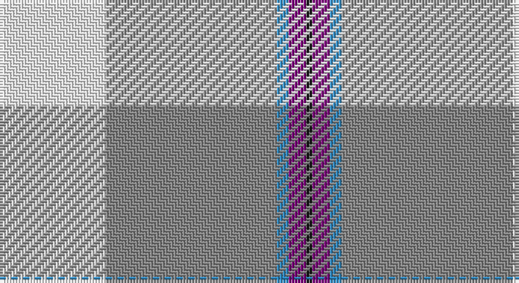

This page is one **sett** — a single exact thread-count. It belongs to the [tartan](/setts/w18o29t2dp3k1/)
(the same proportion at any scale), whose colour order is pattern [KBBRW](/stripes/kbbrw/).

Sourced from register-of-tartans.  It is a [5 stripe tartan](/stripes/stripes5/).

Original link https://www.tartanregister.gov.uk/tartanDetails.aspx?ref=5340

## Also known as

This cloth is also recorded under:

- Kinloch of Loch Awe

2 attestations — the source records this cloth was collapsed from (oldest owns this page)

<ul>
<li>01/09/2004 — Kinloch of Loch Awe (Personal) (register-of-tartans, <a href="https://www.tartanregister.gov.uk/tartanDetails.aspx?ref=5340">record</a>)</li>
<li>pre 2005 — Kinloch at Loch Awe (Personal) (tartans-authority, <a href="http://www.tartansauthority.com/tartan-ferret/display/6731/">record</a>)</li>
</ul>

## Register references

External register numbers recorded for this tartan.

- Scottish Register of Tartans: [5340](https://www.tartanregister.gov.uk/tartanDetails.aspx?ref=5340)
- Scottish Tartans Authority (ITI): 6731
- Scottish Tartans World Register: 3027

## Thread count
W/36 N58 B4 P6 K/2

One full sett is **174 threads**.

## Palette

Palette: <strong>Tartan Register</strong>
<table><thead><tr><th>Colour</th><th>Threads</th><th>Shade</th><th>Base</th><th>OKLCh</th></tr></thead><tbody><tr><td>W/</td><td style="text-align:right;font-variant-numeric:tabular-nums">36</td><td><code style="background-color:#F8F8F8;">#F8F8F8</code> <small style="color:#888">#F8F8F8</small></td><td>W <code style="background-color:#F7F7F7;">#F7F7F7</code></td><td><small style="color:#888">oklch(97.9% 0.000 89.9)</small></td></tr><tr><td>N</td><td style="text-align:right;font-variant-numeric:tabular-nums">58</td><td><code style="background-color:#888888;">#888888</code> <small style="color:#888">#888888</small></td><td>R <code style="background-color:#CC0000;">#CC0000</code></td><td><small style="color:#888">oklch(62.7% 0.000 89.9)</small></td></tr><tr><td>B</td><td style="text-align:right;font-variant-numeric:tabular-nums">4</td><td><code style="background-color:#2888C4;">#2888C4</code> <small style="color:#888">#2888C4</small></td><td>B <code style="background-color:#2A418A;">#2A418A</code></td><td><small style="color:#888">oklch(60.1% 0.125 241.5)</small></td></tr><tr><td>P</td><td style="text-align:right;font-variant-numeric:tabular-nums">6</td><td><code style="background-color:#780078;">#780078</code> <small style="color:#888">#780078</small></td><td>B <code style="background-color:#2A418A;">#2A418A</code></td><td><small style="color:#888">oklch(40.2% 0.185 328.4)</small></td></tr><tr><td>K/</td><td style="text-align:right;font-variant-numeric:tabular-nums">2</td><td><code style="background-color:#101010;">#101010</code> <small style="color:#888">#101010</small></td><td>K <code style="background-color:#000000;">#000000</code></td><td><small style="color:#888">oklch(17.3% 0.000 89.9)</small></td></tr></tbody></table>

# Sample pattern

## Nearest tartans

The nearest existing variants by ΔTartan distance, with this tartan at the top so the swatches line up against it.

ΔTartan

Tartan

Sett

—

<a href="/ttd/edit/#slug=w18o29t2dp3k1~x2">Kinloch of Loch Awe (Personal)</a> <a class="nn-out" href="/variants/s5/w18o29t2dp3k1~x2/" title="open its dictionary page">↗</a>

0.91

<a href="/ttd/edit/#slug=k5w2ly36b47r3~x2&amp;base=w18o29t2dp3k1~x2">Cornish, National Day</a> <a class="nn-out" href="/variants/s5/k5w2ly36b47r3~x2/" title="open its dictionary page">↗</a>

1.13

<a href="/ttd/edit/#slug=k5w2ly36t47r3~x2&amp;base=w18o29t2dp3k1~x2">Oliver Dress Pink</a> <a class="nn-out" href="/variants/s5/k5w2ly36t47r3~x2/" title="open its dictionary page">↗</a>

1.20

<a href="/ttd/edit/#slug=t53k2w53k2r4ly7~x2&amp;base=w18o29t2dp3k1~x2">Galicia</a> <a class="nn-out" href="/variants/s6/t53k2w53k2r4ly7~x2/" title="open its dictionary page">↗</a>

1.32

<a href="/ttd/edit/#slug=lb25db11r5w1k1~x4&amp;base=w18o29t2dp3k1~x2">Mount Vernon Primary School (Corp)</a> <a class="nn-out" href="/variants/s5/lb25db11r5w1k1~x4/" title="open its dictionary page">↗</a>

1.50

<a href="/ttd/edit/#slug=w40t40r1k4~x2&amp;base=w18o29t2dp3k1~x2">Kimon Andreou Family (Personal)</a> <a class="nn-out" href="/variants/s4/w40t40r1k4~x2/" title="open its dictionary page">↗</a>

1.54

<a href="/variants/s8/k5w2ly36t47r3~x2/">Cornish National Day</a>

1.56

<a href="/ttd/edit/#slug=w15ly2dt5lr3t40dt10&amp;base=w18o29t2dp3k1~x2">Herriot (New Zealand) (Name)</a> <a class="nn-out" href="/variants/s6/w15ly2dt5lr3t40dt10/" title="open its dictionary page">↗</a>

1.57

<a href="/ttd/edit/#slug=w3b23lr44b26g4ly2~x2&amp;base=w18o29t2dp3k1~x2">Tartan Lassie (Fashion)</a> <a class="nn-out" href="/variants/s6/w3b23lr44b26g4ly2~x2/" title="open its dictionary page">↗</a>

1.58

<a href="/ttd/edit/#slug=w2r12lg5lb35b4r4ly2~x2&amp;base=w18o29t2dp3k1~x2">Nicolson of the Isles (Personal)</a> <a class="nn-out" href="/variants/s7/w2r12lg5lb35b4r4ly2~x2/" title="open its dictionary page">↗</a>

1.58

<a href="/ttd/edit/#slug=w40ly4o10w8db4o4db4o4g1~x2&amp;base=w18o29t2dp3k1~x2">Boucherville Formal District Tartan</a> <a class="nn-out" href="/variants/s9/w40ly4o10w8db4o4db4o4g1~x2/" title="open its dictionary page">↗</a>

## Neighbour map

Every grey dot is one of 14360 variants placed by the first two principal components of the ΔTartan feature space (44% of its variance). Red is this tartan; blue dots are its nearest — click one to open its page.

<svg viewBox="0 0 640 380" role="img" style="max-width:100%;height:auto;border:1px solid #e0e0e0;border-radius:4px;display:block" xmlns="http://www.w3.org/2000/svg"><image href="/nn/cloud.v1.png" width="640" height="380"/><a href="/variants/s5/k5w2ly36b47r3~x2/"><circle cx="287.1" cy="134.7" r="4" fill="#3465a4"><title>Cornish, National Day</title></circle></a><a href="/variants/s5/k5w2ly36t47r3~x2/"><circle cx="289.0" cy="144.4" r="4" fill="#3465a4"><title>Oliver Dress Pink</title></circle></a><a href="/variants/s6/t53k2w53k2r4ly7~x2/"><circle cx="260.0" cy="110.7" r="4" fill="#3465a4"><title>Galicia</title></circle></a><a href="/variants/s5/lb25db11r5w1k1~x4/"><circle cx="314.1" cy="136.4" r="4" fill="#3465a4"><title>Mount Vernon Primary School (Corp)</title></circle></a><a href="/variants/s4/w40t40r1k4~x2/"><circle cx="312.4" cy="150.9" r="4" fill="#3465a4"><title>Kimon Andreou Family (Personal)</title></circle></a><a href="/variants/s8/k5w2ly36t47r3~x2/"><circle cx="295.4" cy="139.4" r="4" fill="#3465a4"><title>Cornish National Day</title></circle></a><a href="/variants/s6/w15ly2dt5lr3t40dt10/"><circle cx="294.2" cy="153.3" r="4" fill="#3465a4"><title>Herriot (New Zealand) (Name)</title></circle></a><a href="/variants/s6/w3b23lr44b26g4ly2~x2/"><circle cx="289.6" cy="149.4" r="4" fill="#3465a4"><title>Tartan Lassie (Fashion)</title></circle></a><a href="/variants/s7/w2r12lg5lb35b4r4ly2~x2/"><circle cx="289.3" cy="114.8" r="4" fill="#3465a4"><title>Nicolson of the Isles (Personal)</title></circle></a><a href="/variants/s9/w40ly4o10w8db4o4db4o4g1~x2/"><circle cx="363.2" cy="81.6" r="4" fill="#3465a4"><title>Boucherville Formal District Tartan</title></circle></a><circle cx="323.1" cy="131.8" r="5" fill="#c00000"/></svg>

ID: /variants/s5/w18o29t2dp3k1~x2/
