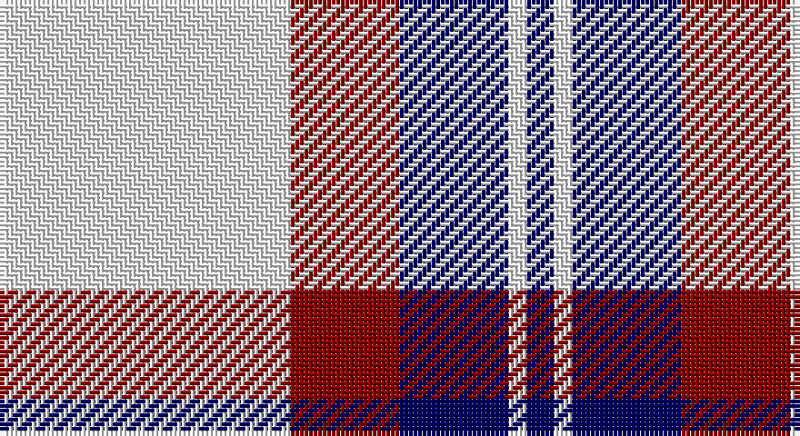

This page is one **sett** — a single exact thread-count. It belongs to the [tartan](/setts/w32r12db12w2db3/)
(the same proportion at any scale), whose colour order is pattern [BWBRW](/stripes/bwbrw/).

Part of the [Fraser Arisaid](/tartans/fraser-arisaid/) tartan — the named design grouping this sett with its other cloths.

Sourced from register-of-tartans.  It is a [5 stripe tartan](/stripes/stripes5/).

Original link https://www.tartanregister.gov.uk/tartanDetails.aspx?ref=1252

## Also known as

This cloth is also recorded under:

- Fraser Arisaid #2
- Fraser Arisaid Red
- Fraser, Arisaid

## Register references

External register numbers recorded for this tartan.

- Scottish Register of Tartans: [1252](https://www.tartanregister.gov.uk/tartanDetails.aspx?ref=1252)
- Scottish Tartans Authority (ITI): 4927

## Thread count
W/64 DR24 DB24 W4 DB/6

One full sett is **174 threads**.

## Palette

Palette: <strong>Tartan Register</strong> <small style="color:#888">(2 of 3 colours)</small>
<table><thead><tr><th>Colour</th><th>Threads</th><th>Shade</th><th>Base</th><th>OKLCh</th></tr></thead><tbody><tr><td>W/</td><td style="text-align:right;font-variant-numeric:tabular-nums">64</td><td><code style="background-color:#F8F8F8;">#F8F8F8</code> <small style="color:#888">#F8F8F8</small></td><td>W <code style="background-color:#F7F7F7;">#F7F7F7</code></td><td><small style="color:#888">oklch(97.9% 0.000 89.9)</small></td></tr><tr><td>DR</td><td style="text-align:right;font-variant-numeric:tabular-nums">24</td><td><code style="background-color:#880000;">#880000</code> <small style="color:#888">#880000</small></td><td>R <code style="background-color:#CC0000;">#CC0000</code></td><td><small style="color:#888">oklch(39.4% 0.162 29.2)</small></td></tr><tr><td>DB</td><td style="text-align:right;font-variant-numeric:tabular-nums">24</td><td><code style="background-color:#000060;">#000060</code> <small style="color:#888">#000060</small></td><td>B <code style="background-color:#2A418A;">#2A418A</code></td><td><small style="color:#888">oklch(22.1% 0.153 264.1)</small></td></tr><tr><td>W</td><td style="text-align:right;font-variant-numeric:tabular-nums">4</td><td><code style="background-color:#F8F8F8;">#F8F8F8</code> <small style="color:#888">#F8F8F8</small></td><td>W <code style="background-color:#F7F7F7;">#F7F7F7</code></td><td><small style="color:#888">oklch(97.9% 0.000 89.9)</small></td></tr><tr><td>DB/</td><td style="text-align:right;font-variant-numeric:tabular-nums">6</td><td><code style="background-color:#000060;">#000060</code> <small style="color:#888">#000060</small></td><td>B <code style="background-color:#2A418A;">#2A418A</code></td><td><small style="color:#888">oklch(22.1% 0.153 264.1)</small></td></tr></tbody></table>

# Sample pattern

## Compared to the master

This cloth is one sett of its design; the master sett (the exemplar the design is anchored on) is below for comparison.

<figure style="margin:0"><figcaption style="color:#888;font-size:smaller">this sett</figcaption></figure>
<figure style="margin:0"><figcaption style="color:#888;font-size:smaller"><a href="/setts/db14w2db3w2g10w32g10db10w2db3/">master sett →</a></figcaption></figure>

## Nearest tartans

The nearest existing variants by ΔTartan distance, with this tartan at the top so the swatches line up against it.

ΔTartan

Tartan

Sett

—

<a href="/ttd/edit/#slug=w32r12db12w2db3~x2">Fraser Arisaid Red (Dance)</a> <a class="nn-out" href="/variants/s5/w32r12db12w2db3~x2/" title="open its dictionary page">↗</a>

1.29

<a href="/ttd/edit/#slug=w5db16w5db16w33r3~x2&amp;base=w32r12db12w2db3~x2">Buchanan Dress Blue (Dance)</a> <a class="nn-out" href="/variants/s6/w5db16w5db16w33r3~x2/" title="open its dictionary page">↗</a>

1.31

<a href="/ttd/edit/#slug=w5r3w35k28w4k11w2~x2&amp;base=w32r12db12w2db3~x2">MacPherson of Cluny (Black and White)</a> <a class="nn-out" href="/variants/s7/w5r3w35k28w4k11w2~x2/" title="open its dictionary page">↗</a>

1.33

<a href="/ttd/edit/#slug=w6b3w20k2w3k25w3~x2&amp;base=w32r12db12w2db3~x2">Forbes Dress (Clans Originaux)</a> <a class="nn-out" href="/variants/s7/w6b3w20k2w3k25w3~x2/" title="open its dictionary page">↗</a>

1.38

<a href="/ttd/edit/#slug=k27w29k5w14r2~x2&amp;base=w32r12db12w2db3~x2">McPartlin (Personal)</a> <a class="nn-out" href="/variants/s5/k27w29k5w14r2~x2/" title="open its dictionary page">↗</a>

1.46

<a href="/ttd/edit/#slug=r1w14k6w1k3ly1~x4&amp;base=w32r12db12w2db3~x2">MacPherson #10</a> <a class="nn-out" href="/variants/s6/r1w14k6w1k3ly1~x4/" title="open its dictionary page">↗</a>

1.48

<a href="/ttd/edit/#slug=db8w3db28w32k3w4~x2&amp;base=w32r12db12w2db3~x2">Ailsa, Navy (Dance)</a> <a class="nn-out" href="/variants/s6/db8w3db28w32k3w4~x2/" title="open its dictionary page">↗</a>

1.50

<a href="/ttd/edit/#slug=w5k20w2r5w20r2~x2&amp;base=w32r12db12w2db3~x2">Gangs of New York Fashion Check Tartan</a> <a class="nn-out" href="/variants/s6/w5k20w2r5w20r2~x2/" title="open its dictionary page">↗</a>

1.54

<a href="/ttd/edit/#slug=k4ly18n44k3ly10k4&amp;base=w32r12db12w2db3~x2">Stutterheim</a> <a class="nn-out" href="/variants/s6/k4ly18n44k3ly10k4/" title="open its dictionary page">↗</a>

1.55

<a href="/ttd/edit/#slug=r1lb12k1w2k5r1~x4&amp;base=w32r12db12w2db3~x2">Rui (Personal)</a> <a class="nn-out" href="/variants/s6/r1lb12k1w2k5r1~x4/" title="open its dictionary page">↗</a>

1.59

<a href="/ttd/edit/#slug=w1m2w17k11w2k4ly1~x4&amp;base=w32r12db12w2db3~x2">MacPherson - 1842 (VS) Dress</a> <a class="nn-out" href="/variants/s7/w1m2w17k11w2k4ly1~x4/" title="open its dictionary page">↗</a>

## Neighbour map

Every grey dot is one of 14360 variants placed by the first two principal components of the ΔTartan feature space (44% of its variance). Red is this tartan; blue dots are its nearest — click one to open its page.

<svg viewBox="0 0 640 380" role="img" style="max-width:100%;height:auto;border:1px solid #e0e0e0;border-radius:4px;display:block" xmlns="http://www.w3.org/2000/svg"><image href="/nn/cloud.v1.png" width="640" height="380"/><a href="/variants/s6/w5db16w5db16w33r3~x2/"><circle cx="282.6" cy="195.7" r="4" fill="#3465a4"><title>Buchanan Dress Blue (Dance)</title></circle></a><a href="/variants/s7/w5r3w35k28w4k11w2~x2/"><circle cx="300.9" cy="158.2" r="4" fill="#3465a4"><title>MacPherson of Cluny (Black and White)</title></circle></a><a href="/variants/s7/w6b3w20k2w3k25w3~x2/"><circle cx="281.1" cy="170.5" r="4" fill="#3465a4"><title>Forbes Dress (Clans Originaux)</title></circle></a><a href="/variants/s5/k27w29k5w14r2~x2/"><circle cx="298.6" cy="201.7" r="4" fill="#3465a4"><title>McPartlin (Personal)</title></circle></a><a href="/variants/s6/r1w14k6w1k3ly1~x4/"><circle cx="300.1" cy="150.2" r="4" fill="#3465a4"><title>MacPherson #10</title></circle></a><a href="/variants/s6/db8w3db28w32k3w4~x2/"><circle cx="278.4" cy="190.9" r="4" fill="#3465a4"><title>Ailsa, Navy (Dance)</title></circle></a><a href="/variants/s6/w5k20w2r5w20r2~x2/"><circle cx="249.8" cy="188.6" r="4" fill="#3465a4"><title>Gangs of New York Fashion Check Tartan</title></circle></a><a href="/variants/s6/k4ly18n44k3ly10k4/"><circle cx="305.0" cy="178.3" r="4" fill="#3465a4"><title>Stutterheim</title></circle></a><a href="/variants/s6/r1lb12k1w2k5r1~x4/"><circle cx="259.6" cy="153.0" r="4" fill="#3465a4"><title>Rui (Personal)</title></circle></a><a href="/variants/s7/w1m2w17k11w2k4ly1~x4/"><circle cx="280.8" cy="140.6" r="4" fill="#3465a4"><title>MacPherson - 1842 (VS) Dress</title></circle></a><circle cx="286.7" cy="176.8" r="5" fill="#c00000"/></svg>

ID: /variants/s5/w32r12db12w2db3~x2/
