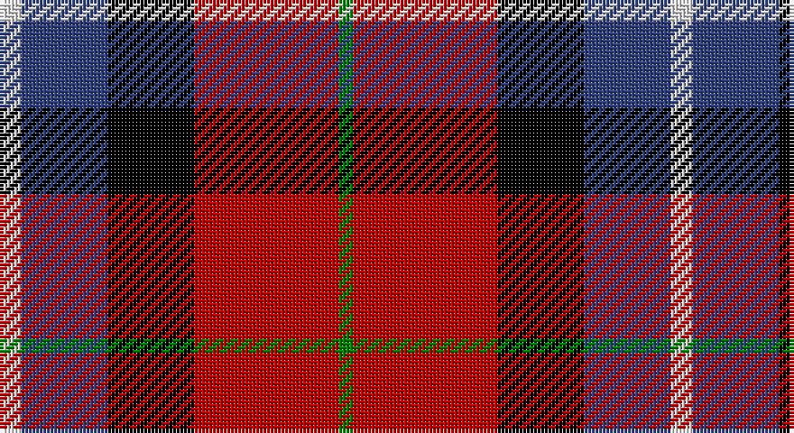

This page is one **sett** — a single exact thread-count. It belongs to the [tartan](/setts/w3db12k12r20g2/)
(the same proportion at any scale), whose colour order is pattern [GRKBW](/stripes/grkbw/).

Part of the [Baillie of Polkemett](/tartans/baillie-of-polkemett/) tartan — the named design grouping this sett with its other cloths.

Sourced from weddslist.  It is a [5 stripe tartan](/stripes/stripes5/).

Original link http://www.weddslist.com/cgi-bin/tartans/pg.pl?source=sts

## Also known as

This cloth is also recorded under:

- Baillie of Polkemett, Green
- Baillie of Polkemmet

## Thread count
LN/6 B24 K24 R40 G/4

One full sett is **186 threads**.

## Palette

Palette: <strong>Tartan Register</strong> <small style="color:#888">(2 of 5 colours)</small>
<table><thead><tr><th>Colour</th><th>Threads</th><th>Shade</th><th>Base</th><th>OKLCh</th></tr></thead><tbody><tr><td>LN/</td><td style="text-align:right;font-variant-numeric:tabular-nums">6</td><td><code style="background-color:#E0E0E0;">#E0E0E0</code> <small style="color:#888">#E0E0E0</small></td><td>W <code style="background-color:#F7F7F7;">#F7F7F7</code></td><td><small style="color:#888">oklch(90.7% 0.000 89.9)</small></td></tr><tr><td>B</td><td style="text-align:right;font-variant-numeric:tabular-nums">24</td><td><code style="background-color:#304080;">#304080</code> <small style="color:#888">#304080</small></td><td>B <code style="background-color:#2A418A;">#2A418A</code></td><td><small style="color:#888">oklch(39.4% 0.109 270.2)</small></td></tr><tr><td>K</td><td style="text-align:right;font-variant-numeric:tabular-nums">24</td><td><code style="background-color:#000000;">#000000</code> <small style="color:#888">#000000</small></td><td>K <code style="background-color:#000000;">#000000</code></td><td><small style="color:#888">oklch(0.0% 0.000 0.0)</small></td></tr><tr><td>R</td><td style="text-align:right;font-variant-numeric:tabular-nums">40</td><td><code style="background-color:#C00000;">#C00000</code> <small style="color:#888">#C00000</small></td><td>R <code style="background-color:#CC0000;">#CC0000</code></td><td><small style="color:#888">oklch(50.7% 0.208 29.2)</small></td></tr><tr><td>G/</td><td style="text-align:right;font-variant-numeric:tabular-nums">4</td><td><code style="background-color:#008000;">#008000</code> <small style="color:#888">#008000</small></td><td>G <code style="background-color:#006100;">#006100</code></td><td><small style="color:#888">oklch(52.0% 0.177 142.5)</small></td></tr></tbody></table>

# Sample pattern

## Compared to the master

This cloth is one sett of its design; the master sett (the exemplar the design is anchored on) is below for comparison.

<figure style="margin:0"><figcaption style="color:#888;font-size:smaller">this sett</figcaption></figure>
<figure style="margin:0"><figcaption style="color:#888;font-size:smaller"><a href="/setts/db11k1db1k1db1k9g9w1g1w1g1w1g9k9db8k1db1/">master sett →</a></figcaption></figure>

## Nearest tartans

The nearest existing variants by ΔTartan distance, with this tartan at the top so the swatches line up against it.

ΔTartan

Tartan

Sett

—

<a href="/ttd/edit/#slug=w3db12k12r20g2~x2">Baillie of Polkemett</a> <a class="nn-out" href="/variants/s5/w3db12k12r20g2~x2/" title="open its dictionary page">↗</a>

0.85

<a href="/ttd/edit/#slug=w3b12k12r20g2~x2&amp;base=w3db12k12r20g2~x2">Baillie of Polkemmet Red</a> <a class="nn-out" href="/variants/s5/w3b12k12r20g2~x2/" title="open its dictionary page">↗</a>

1.14

<a href="/ttd/edit/#slug=ly2r15k7db8ly2~x4&amp;base=w3db12k12r20g2~x2">Aberdeen University</a> <a class="nn-out" href="/variants/s5/ly2r15k7db8ly2~x4/" title="open its dictionary page">↗</a>

1.15

<a href="/ttd/edit/#slug=r26t3r4k16db16k4~x2&amp;base=w3db12k12r20g2~x2">Graham of Menteith, (Red)</a> <a class="nn-out" href="/variants/s6/r26t3r4k16db16k4~x2/" title="open its dictionary page">↗</a>

1.18

<a href="/ttd/edit/#slug=lb5r34k22r4o24r4~x2&amp;base=w3db12k12r20g2~x2">Wcwm 759-2</a> <a class="nn-out" href="/variants/s6/lb5r34k22r4o24r4~x2/" title="open its dictionary page">↗</a>

1.22

<a href="/ttd/edit/#slug=w3r24db12dg8lo3~x2&amp;base=w3db12k12r20g2~x2">McGill University (Corporate)</a> <a class="nn-out" href="/variants/s5/w3r24db12dg8lo3~x2/" title="open its dictionary page">↗</a>

1.26

<a href="/ttd/edit/#slug=b2r12db2b6k6b1~x2&amp;base=w3db12k12r20g2~x2">MacTavish</a> <a class="nn-out" href="/variants/s6/b2r12db2b6k6b1~x2/" title="open its dictionary page">↗</a>

1.26

<a href="/ttd/edit/#slug=b2r12db2b6k6b1&amp;base=w3db12k12r20g2~x2">MacTavish</a> <a class="nn-out" href="/variants/s6/b2r12db2b6k6b1/" title="open its dictionary page">↗</a>

1.28

<a href="/ttd/edit/#slug=k4o19k19o2dp22w4~x2&amp;base=w3db12k12r20g2~x2">Dutch</a> <a class="nn-out" href="/variants/s6/k4o19k19o2dp22w4~x2/" title="open its dictionary page">↗</a>

1.28

<a href="/ttd/edit/#slug=k15db2r15b6bi1~x2&amp;base=w3db12k12r20g2~x2">O2 (Corporate)</a> <a class="nn-out" href="/variants/s5/k15db2r15b6bi1~x2/" title="open its dictionary page">↗</a>

1.31

<a href="/variants/s5/ki3r11k26dy11ri3~x2/">Novotel, The</a>

## Neighbour map

Every grey dot is one of 14360 variants placed by the first two principal components of the ΔTartan feature space (44% of its variance). Red is this tartan; blue dots are its nearest — click one to open its page.

<svg viewBox="0 0 640 380" role="img" style="max-width:100%;height:auto;border:1px solid #e0e0e0;border-radius:4px;display:block" xmlns="http://www.w3.org/2000/svg"><image href="/nn/cloud.v1.png" width="640" height="380"/><a href="/variants/s5/w3b12k12r20g2~x2/"><circle cx="169.9" cy="199.4" r="4" fill="#3465a4"><title>Baillie of Polkemmet Red</title></circle></a><a href="/variants/s5/ly2r15k7db8ly2~x4/"><circle cx="185.1" cy="214.9" r="4" fill="#3465a4"><title>Aberdeen University</title></circle></a><a href="/variants/s6/r26t3r4k16db16k4~x2/"><circle cx="205.3" cy="208.7" r="4" fill="#3465a4"><title>Graham of Menteith, (Red)</title></circle></a><a href="/variants/s6/lb5r34k22r4o24r4~x2/"><circle cx="205.7" cy="203.8" r="4" fill="#3465a4"><title>Wcwm 759-2</title></circle></a><a href="/variants/s5/w3r24db12dg8lo3~x2/"><circle cx="209.2" cy="196.0" r="4" fill="#3465a4"><title>McGill University (Corporate)</title></circle></a><a href="/variants/s6/b2r12db2b6k6b1~x2/"><circle cx="209.9" cy="196.7" r="4" fill="#3465a4"><title>MacTavish</title></circle></a><a href="/variants/s6/b2r12db2b6k6b1/"><circle cx="209.9" cy="196.7" r="4" fill="#3465a4"><title>MacTavish</title></circle></a><a href="/variants/s6/k4o19k19o2dp22w4~x2/"><circle cx="152.2" cy="198.5" r="4" fill="#3465a4"><title>Dutch</title></circle></a><a href="/variants/s5/k15db2r15b6bi1~x2/"><circle cx="198.2" cy="182.0" r="4" fill="#3465a4"><title>O2 (Corporate)</title></circle></a><a href="/variants/s5/ki3r11k26dy11ri3~x2/"><circle cx="214.8" cy="209.6" r="4" fill="#3465a4"><title>Novotel, The</title></circle></a><circle cx="160.0" cy="196.2" r="5" fill="#c00000"/></svg>

ID: /variants/s5/w3db12k12r20g2~x2/
